# Common Mistakes and Errors When Hosting ASP.NET Core Apps

Your application runs perfectly on your machine. You publish it to the server, open the browser, and get a blank page with `HTTP Error 500.30`. Nothing in the logs. No stack trace. Just a generic IIS error page that tells you almost nothing.

Every .NET developer has been here. The frustrating part is that hosting problems are rarely caused by your code — they are caused by the environment around it. A missing runtime, a connection string that was never updated, an IIS module that silently blocks half of your HTTP verbs. In this post we will go through the 20 problems we see most often when hosting ASP.NET Core applications, what causes each one, and how to fix it.

We will start with how to actually read the error, because that single skill will save you more time than everything else in this article.

## Table of Contents

- [First: How to Actually Read the Error](#first-how-to-actually-read-the-error)
- [Runtime and IIS Setup](#runtime-and-iis-setup)
- [Database and Configuration](#database-and-configuration)
- [The IIS Request Pipeline](#the-iis-request-pipeline)
- [HTTPS, Proxies and Cookies](#https-proxies-and-cookies)
- [SPA Frontends and Multi-Instance Deployments](#spa-frontends-and-multi-instance-deployments)
- [Pre-Deployment Checklist](#pre-deployment-checklist)
- [Conclusion](#conclusion)

## First: How to Actually Read the Error

Errors like `500.30`, `500.31` and `502.5` are not real error messages. They are IIS telling you "the process did not start and I do not know why". The real exception is somewhere else. Here is the three-step routine that finds it almost every time.

### Step 1: Open Event Viewer

Open **Event Viewer** and go to **Windows Logs > Application**. Look for the most recent entry with the source `IIS AspNetCore Module V2`. This is where the ASP.NET Core Module writes the actual exception it caught while starting your app.

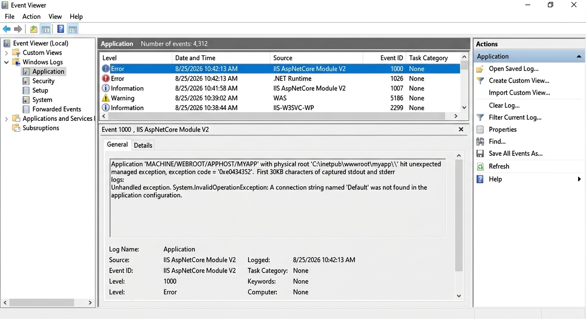

Nine times out of ten, the answer is right there — a missing configuration key, a `SqlException`, or a `FileNotFoundException` for an assembly.

### Step 2: Enable the stdout Log

If Event Viewer is not enough, enable the stdout log. Open the `web.config` in your publish folder and set `stdoutLogEnabled` to `true`:

```xml
<aspNetCore processPath="dotnet"
            arguments=".\MyApp.Web.dll"
            stdoutLogEnabled="true"
            stdoutLogFile=".\logs\stdout"
            hostingModel="inprocess" />
```

**Note:** The `logs` folder must already exist and the application pool identity must have write permission on it. If the folder is missing, no log file is created and you are left with the same empty error page. This is the single most common reason developers say "I enabled logging and nothing happened".

Restart the site, reproduce the error, and read the file under `logs\stdout_*.log`.

### Step 3: Run the App Without IIS

The fastest test of all. Open a command prompt in your publish folder and run the application directly:

```bash
cd C:\inetpub\wwwroot\myapp
dotnet MyApp.Web.dll
```

This bypasses IIS completely. If the app starts and listens on a port, your code is fine and the problem is in IIS, the module, or permissions. If it crashes, you get the full exception with a stack trace in the console.

Once you have the real error, most of the problems below become obvious. Let's go through them.

## Runtime and IIS Setup

### 1. The ASP.NET Core Runtime or Hosting Bundle Is Missing

**Symptoms:** `HTTP Error 500.19 - Internal Server Error`, `HTTP Error 500.31 - ANCM Failed to Find Native Dependencies`, or `HTTP Error 502.5`.

This is the number one hosting problem, and it has a subtle trap. Installing the .NET SDK or the standalone .NET Runtime on the server is **not enough**. IIS needs the **ASP.NET Core Module (ANCM)**, and the only way to get it is the **Hosting Bundle**.

A `500.19` on an ASP.NET Core app is especially misleading. IIS reports it as a `web.config` problem, but your `web.config` is usually fine — IIS simply cannot resolve the `AspNetCoreModuleV2` handler that the file references, so it reports the file as invalid.

**Solution:**

1. Download the **ASP.NET Core Hosting Bundle** for your target version from the [.NET download page](https://dotnet.microsoft.com/download/dotnet).
2. Install it **after** IIS is installed. The bundle only registers the module if IIS is already present. If you installed IIS later, run the bundle installer again or repair it.
3. Run `iisreset` afterwards.
4. Verify the installed runtimes on the server:

```bash
dotnet --list-runtimes
```

You should see both `Microsoft.NETCore.App` and `Microsoft.AspNetCore.App` at a version equal to or newer than your target framework.

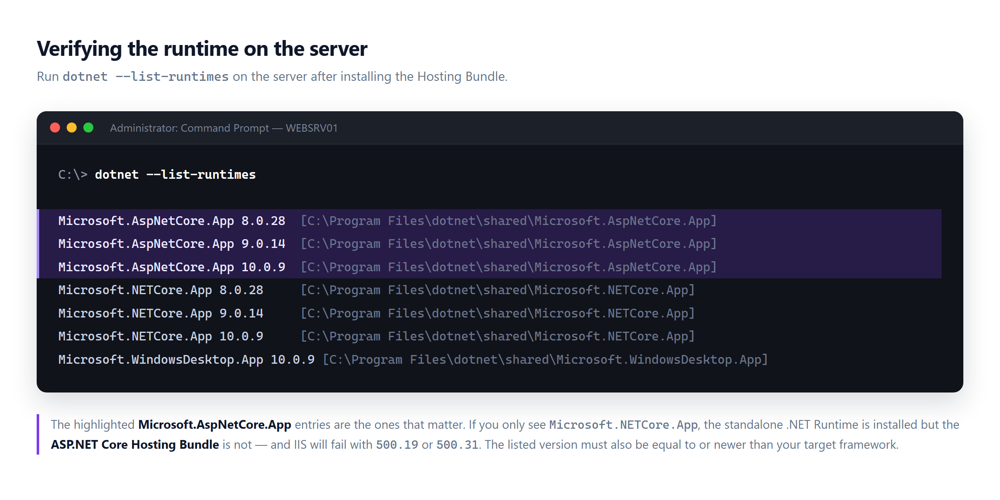

You can also confirm the module in IIS Manager. Select the server node, open **Modules**, and look for `AspNetCoreModuleV2`.

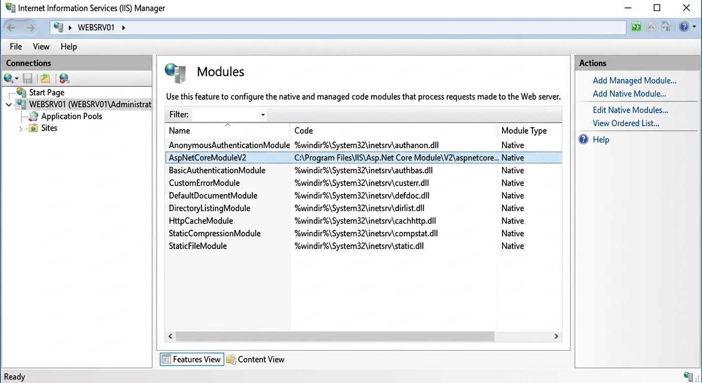

**Note:** A common variation of this problem is installing the correct bundle but targeting a newer framework. If your app targets .NET 10 and the server only has the .NET 8 runtime, you get `500.31`. Either install the matching runtime or publish self-contained.

### 2. HTTP Error 500.30 — ANCM In-Process Start Failure

**Symptom:** `HTTP Error 500.30 - ASP.NET Core app failed to start`.

This one means the module found your app, launched it, and your app threw an unhandled exception before the middleware pipeline was ready. It is a symptom, not a cause. The actual reasons are usually:

- A configuration value that exists in `appsettings.Development.json` but not in production.
- A database connection that is opened during startup and fails.
- A missing assembly or a dependency that was not copied to the publish folder.
- An exception in a hosted service or a startup filter.

**Solution:** Use the three-step routine from the beginning of this article. Do not guess. Also make sure you are publishing correctly — `dotnet publish -c Release` rather than copying the `bin\Debug` folder, which is a surprisingly frequent cause of missing dependencies.

### 3. Bitness Mismatch Between the App Pool and the Published App

**Symptoms:** `502.5`, `500.30`, or `500.0` with a `BadImageFormatException` in the log.

If your application pool runs in 32-bit mode but your app was published for x64 (or the other way around), the process cannot load. This also happens on Azure App Service when the platform setting does not match the publish target.

**Solution:** In IIS Manager, select your application pool, open **Advanced Settings**, and check **Enable 32-Bit Applications**. For a normal 64-bit publish this must be `False`.

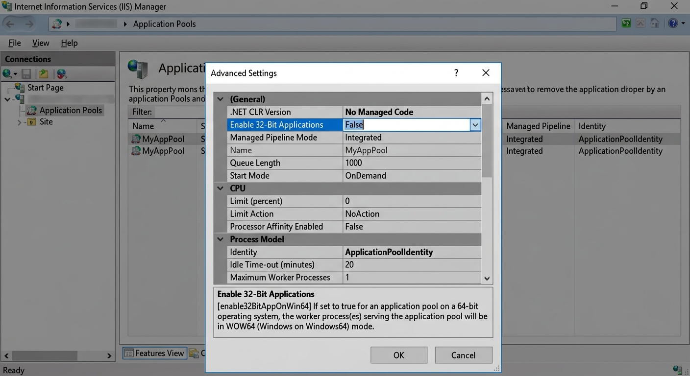

On Azure App Service, go to **Configuration > General settings** and confirm that **Platform** matches the bitness of your build.

### 4. Folder Permissions for the Application Pool Identity

**Symptoms:** The stdout log is never created. File uploads fail. The app throws `UnauthorizedAccessException` when writing logs, temp files, or generated reports.

By default an application pool runs under the `IIS AppPool\<AppPoolName>` virtual identity, which has very limited rights. Anything your app writes to disk needs an explicit permission.

**Solution:** Grant **Modify** permission to `IIS AppPool\<YourAppPoolName>` on the folders your application writes to — typically `logs`, `App_Data`, and any upload directory.

```powershell
icacls "C:\inetpub\wwwroot\myapp\logs" /grant "IIS AppPool\MyAppPool:(OI)(CI)M"
```

Create the folders first. IIS will not create them for you.

### 5. In-Process vs Out-of-Process Hosting Confusion

**Symptoms:** `502.5 - ANCM Out-Of-Process Startup Failure`, or the app works locally but fails on the server after switching publish settings.

ASP.NET Core supports two hosting models on IIS. **In-process** (the default) runs your app inside the IIS worker process — faster, but with some restrictions. **Out-of-process** runs Kestrel as a separate `dotnet` process behind IIS.

Two things bite people here:

- **Single-file publish does not work with the in-process model.** The module needs to load your app into the existing IIS process, and it cannot do that with a single-file executable. Use out-of-process, or turn off single-file publish.
- **A corrupted module installation.** If `aspnetcorev2_outofprocess.dll` is not next to `aspnetcorev2.dll`, out-of-process hosting fails. Repair the Hosting Bundle installation.

You control the model in your project file:

```xml
<PropertyGroup>
  <AspNetCoreHostingModel>InProcess</AspNetCoreHostingModel>
</PropertyGroup>
```

**Note:** The hosting model also changes how request limits behave. We will come back to this in problem 11.

## Database and Configuration

### 6. The Connection String Is Not Configured Correctly

This is the second most common hosting problem, and it hides several different mistakes behind one symptom. Let's separate them.

#### The production settings file was never updated

You published, but `appsettings.Production.json` on the server still contains `Server=(localdb)\\MSSQLLocalDB`. The application starts, then every request that touches the database fails.

Always verify the file **in the publish folder on the server**, not the one in your solution.

#### Two projects, two connection strings

Many solutions have more than one project that talks to the database — a web host and a separate console migrator or worker. Each has its own `appsettings.json`. Developers update one, forget the other, and then wonder why migrations ran against the wrong database.

Search your publish output for every connection string before you deploy:

```powershell
Get-ChildItem -Recurse -Filter appsettings*.json | Select-String "ConnectionString" -Context 0,3
```

#### Login failed for user 'IIS APPPOOL\...'

**Symptom:** `SqlException: Login failed for user 'IIS APPPOOL\MyAppPool'` or `Login failed for user 'DOMAIN\MACHINENAME$'`.

You are using `Integrated Security=true`, so SQL Server sees the application pool identity — not your Windows account. That identity has no login on the server.

**Solution:** Either create a SQL Server login for the app pool identity, or switch to SQL authentication with a dedicated user.

```sql
CREATE LOGIN [IIS APPPOOL\MyAppPool] FROM WINDOWS;
CREATE USER [IIS APPPOOL\MyAppPool] FOR LOGIN [IIS APPPOOL\MyAppPool];
ALTER ROLE db_owner ADD MEMBER [IIS APPPOOL\MyAppPool];
```

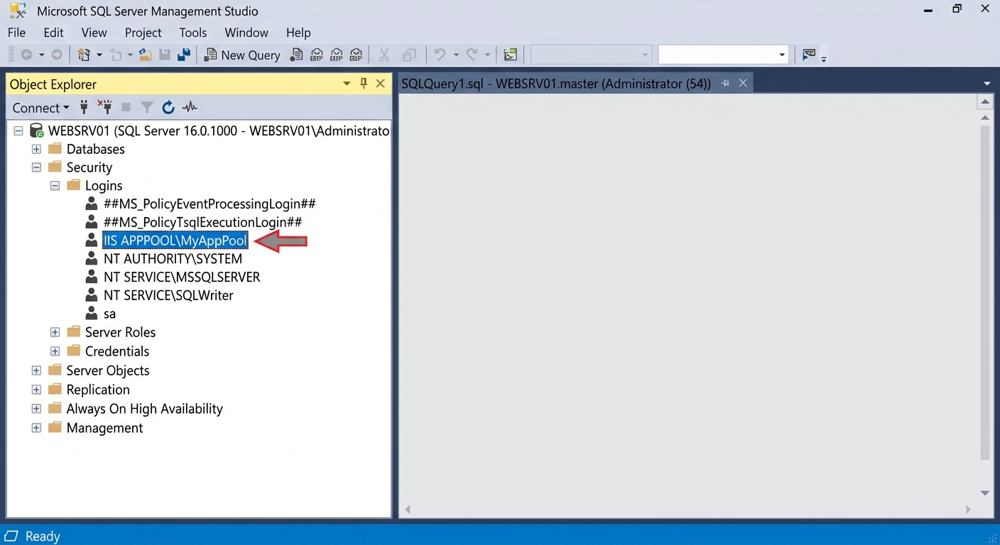

Do not grant `sysadmin` just to make it work. Give the login access to the one database it needs.

#### A certificate error you did not have before

**Symptom:** `A connection was successfully established with the server, but then an error occurred during the login process` or `The certificate chain was issued by an authority that is not trusted`.

Modern versions of `Microsoft.Data.SqlClient` default to `Encrypt=True`. If your SQL Server uses a self-signed certificate, the connection is rejected.

**Solution:** Install a trusted certificate on SQL Server, or — for internal servers where you accept the trade-off — add `TrustServerCertificate=True`:

```json
{
  "ConnectionStrings": {
    "Default": "Server=DBSERVER;Database=MyApp;User Id=myapp;Password=***;TrustServerCertificate=True;MultipleActiveResultSets=True"
  }
}
```

#### The server simply cannot be reached

If the error is a timeout or `network-related or instance-specific error`, the connection string may be correct but the network is not. Check that TCP/IP is enabled in SQL Server Configuration Manager, that the SQL Browser service is running for named instances, and that port 1433 is open on the firewall.

### 7. Database Migrations Were Never Run in Production

**Symptom:** The app starts fine, then every page returns a 500 with `Invalid object name 'Users'` or a similar "table does not exist" error.

Your local database has the schema because you have been running migrations for months. The production database is empty.

**Solution:** Run migrations against production explicitly, either with a migrator project or with the EF Core CLI:

```bash
dotnet ef database update --project src/MyApp.EntityFrameworkCore --connection "Server=DBSERVER;Database=MyApp;..."
```

Or generate an idempotent SQL script and hand it to your DBA — the safer option for production:

```bash
dotnet ef migrations script --idempotent --output migrate.sql
```

**Note:** Avoid calling `Database.Migrate()` on application startup in a multi-instance deployment. Several instances starting at once will race each other and can deadlock the migration history table.

### 8. ASPNETCORE_ENVIRONMENT Is Not Set

**Symptom:** Production is using development settings. The developer exception page shows up for end users. Your carefully prepared `appsettings.Production.json` is ignored.

ASP.NET Core loads `appsettings.json` first, then `appsettings.{Environment}.json`. If `ASPNETCORE_ENVIRONMENT` is not set, the environment defaults to `Production` in most hosts — but if someone set it to `Development` on the server, or set it with the wrong casing, your overrides never load.

**Solution:** Set it explicitly. In `web.config`:

```xml
<aspNetCore processPath="dotnet" arguments=".\MyApp.Web.dll" hostingModel="inprocess">
  <environmentVariables>
    <environmentVariable name="ASPNETCORE_ENVIRONMENT" value="Production" />
  </environmentVariables>
</aspNetCore>
```

On Linux or in a container:

```bash
export ASPNETCORE_ENVIRONMENT=Production
```

**Note:** Casing matters on Linux. `production` is not `Production`, and `appsettings.production.json` will not be loaded when the environment is `Production`. This is a classic "works on Windows, breaks in Docker" bug.

### 9. Configuration Precedence Surprises

**Symptom:** You edited `appsettings.Production.json` on the server, restarted the site, and nothing changed.

Configuration sources are layered, and later sources win. The typical order is:

1. `appsettings.json`
2. `appsettings.{Environment}.json`
3. User secrets (Development only)
4. Environment variables
5. Command-line arguments

So an environment variable will silently override your JSON file. On Windows, `web.config` can inject those variables. On Azure App Service, everything in **Configuration > Application settings** and **Connection strings** becomes an environment variable that beats your file.

**Solution:** When a setting refuses to change, dump the effective configuration at startup in a temporary diagnostic endpoint:

```csharp
app.MapGet("/debug/config", (IConfiguration config) =>
    ((IConfigurationRoot)config).GetDebugView());
```

This shows every key, its value, and which provider supplied it. Remove the endpoint — or protect it properly — before going live.

**Note:** In Azure App Service, connection strings from the portal are exposed with a prefix such as `SQLAZURECONNSTR_`. Use the portal value or the file value, but do not maintain both.

## The IIS Request Pipeline

### 10. WebDAV Blocks PUT and DELETE Requests

**Symptom:** `405 Method Not Allowed` on `PUT` and `DELETE` requests. `GET` and `POST` work perfectly. Everything worked on your development machine.

This is one of the most confusing hosting problems, because it only appears in production. IIS Express installs WebDAV but leaves it commented out, so you never see it locally. On a real IIS server, the WebDAV module is registered and it claims the `PUT` and `DELETE` verbs before your application ever sees the request.

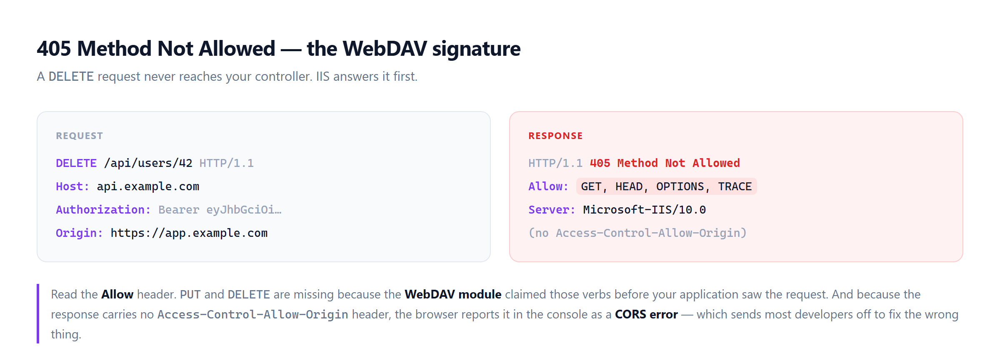

It also produces a false CORS error. Because the WebDAV module rejects the request before your CORS middleware runs, the response has no `Access-Control-Allow-Origin` header, and the browser reports it as a CORS failure. Developers then spend hours on CORS configuration for a problem that has nothing to do with CORS. The giveaway is that only `DELETE` or `PUT` fails while every other verb is fine.

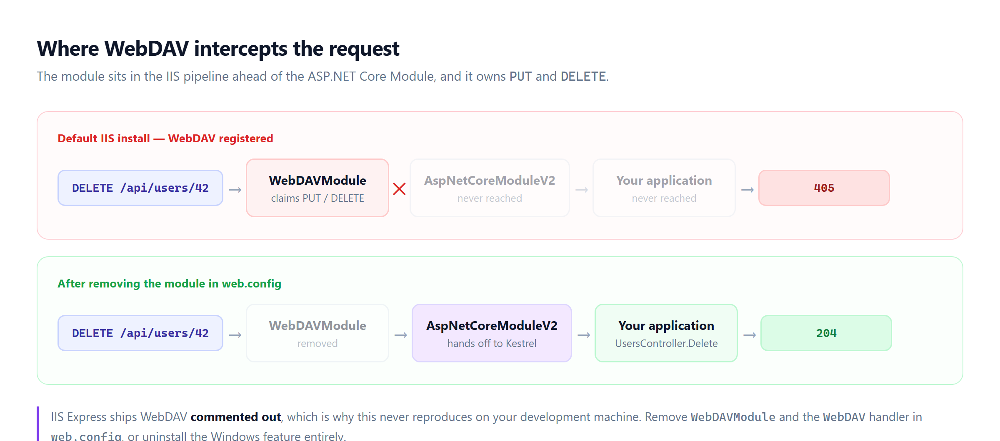

**Solution:** Remove the module and the handler in your `web.config`:

```xml
<system.webServer>
  <modules runAllManagedModulesForAllRequests="false">
    <remove name="WebDAVModule" />
  </modules>
  <handlers>
    <remove name="WebDAV" />
  </handlers>
</system.webServer>
```

If nothing on the server needs WebDAV, the cleaner fix is to uninstall the feature entirely. Open **Turn Windows features on or off** and uncheck **WebDAV Publishing** under **Internet Information Services > World Wide Web Services > Common HTTP Features**.

### 11. HTTP 413 — Request Entity Too Large on File Uploads

**Symptom:** Small files upload fine. Anything over roughly 30 MB fails with `413 Request Entity Too Large` or `413.1`.

There are **three independent limits** in play, and raising only one of them does nothing. Behind IIS, the request is rejected by IIS request filtering before it ever reaches your code, so changing the Kestrel limit alone has no effect.

| Layer | Setting | Default |
| --- | --- | --- |
| IIS request filtering | `maxAllowedContentLength` | 30,000,000 bytes |
| Kestrel / ANCM | `MaxRequestBodySize` | 30,000,000 bytes |
| Multipart form parsing | `FormOptions.MultipartBodyLengthLimit` | 134,217,728 bytes |

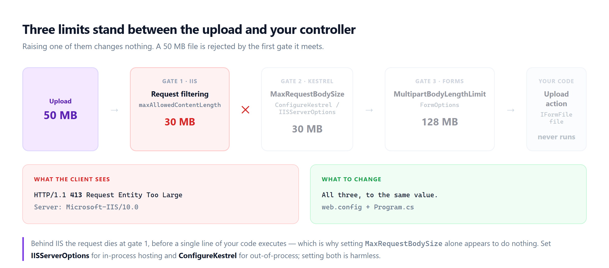

**Solution:** Raise all of them consistently. In `web.config`:

```xml
<system.webServer>
  <security>
    <requestFiltering>
      <!-- 200 MB -->
      <requestLimits maxAllowedContentLength="209715200" />
    </requestFiltering>
  </security>
</system.webServer>
```

In `Program.cs`:

```csharp
builder.WebHost.ConfigureKestrel(options =>
{
    options.Limits.MaxRequestBodySize = 209715200;
});

builder.Services.Configure<IISServerOptions>(options =>
{
    options.MaxRequestBodySize = 209715200;
});

builder.Services.Configure<FormOptions>(options =>
{
    options.MultipartBodyLengthLimit = 209715200;
});
```

Or per endpoint, which is the better practice:

```csharp
[RequestSizeLimit(209715200)]
public async Task<IActionResult> Upload(IFormFile file) { ... }
```

**Note:** `IISServerOptions` applies to in-process hosting and `ConfigureKestrel` applies to out-of-process. Setting both is harmless and saves you from debugging the difference later.

### 12. WebSockets and SignalR Do Not Work After Deployment

**Symptoms:** SignalR falls back to long polling and feels slow, or you see `Error: Failed to start the transport 'WebSockets'`, or `Invocation canceled due to the underlying connection being closed`.

There are two separate causes here.

**The WebSocket Protocol feature is not installed on IIS.** It is not enabled by default on Windows Server.

```powershell
Enable-WindowsOptionalFeature -Online -FeatureName IIS-WebSockets
```

You will find the same option in **Turn Windows features on or off**, under **Application Development Features**.

**There is no session affinity behind a load balancer.** SignalR requires all requests for a connection to reach the same server. Without sticky sessions, the negotiate request goes to server A and the connection attempt goes to server B, which knows nothing about it.

**Solution:** Enable **ARR Affinity** in Azure App Service, or sticky sessions on your load balancer. Then add a backplane so that messages reach clients on every node:

```csharp
builder.Services.AddSignalR()
    .AddStackExchangeRedis("redis-server:6379", options =>
    {
        options.Configuration.ChannelPrefix = "MyApp";
    });
```

**Note:** Session affinity can be skipped only if every client is configured to use WebSockets exclusively with `skipNegotiation: true`. In practice, keep affinity on.

### 13. Static Files Return 404 in a Virtual Directory

**Symptoms:** The application loads but every CSS and JS file returns 404. Or the app works when deployed as its own site but breaks under `https://example.com/myapp`.

Three different causes produce this.

**Static file middleware is missing.** A project created from the Web API template does not serve static files at all. Add it:

```csharp
app.UseStaticFiles();
```

Remember that only files under `wwwroot` are served, and `UseStaticFiles()` must come before `UseRouting()` in a typical pipeline.

**The path base is wrong.** When the app is a sub-application under `/myapp`, all of your absolute paths (`/css/site.css`) resolve to the wrong location. Use `~/` in Razor so that ASP.NET Core rewrites the path, or set the path base explicitly:

```csharp
app.UsePathBase("/myapp");
```

**A SPA needs a base href.** If you host a SPA in a subfolder, build it with the matching base path — for Angular, `ng build --base-href /myapp/`.

There is one more variation worth knowing: refreshing a SPA deep link like `/users/42` returns 404 because IIS looks for a physical file at that path. Add a fallback route so unmatched requests return `index.html`:

```csharp
app.MapFallbackToFile("index.html");
```

## HTTPS, Proxies and Cookies

### 14. Running Behind a Reverse Proxy Without Forwarded Headers

**Symptoms:** Login redirects go to `http://` instead of `https://`. OpenID Connect fails with an invalid `redirect_uri`. Every request is logged with the same client IP — your proxy's. Infinite redirect loops when HTTPS redirection is on.

When nginx, Apache, ARR, or a cloud load balancer terminates TLS, it talks to Kestrel over plain HTTP. Your app sees `Request.Scheme == "http"` and `RemoteIpAddress` as the proxy address. Anything that builds an absolute URL — authentication callbacks, password reset links, generated emails — produces the wrong scheme.

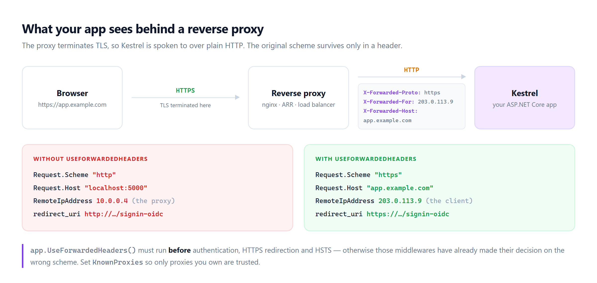

**Solution:** Enable the forwarded headers middleware, and place it **before** authentication, HTTPS redirection and HSTS.

```csharp
builder.Services.Configure<ForwardedHeadersOptions>(options =>
{
    options.ForwardedHeaders =
        ForwardedHeaders.XForwardedFor |
        ForwardedHeaders.XForwardedProto |
        ForwardedHeaders.XForwardedHost;

    // Restrict to proxies you control.
    options.KnownProxies.Add(IPAddress.Parse("10.0.0.4"));
});

var app = builder.Build();

app.UseForwardedHeaders();   // must come first
app.UseHsts();
app.UseHttpsRedirection();
app.UseAuthentication();
```

Configure the proxy to send the headers as well. For nginx:

```nginx
location / {
    proxy_pass         http://localhost:5000;
    proxy_http_version 1.1;
    proxy_set_header   Upgrade $http_upgrade;
    proxy_set_header   Connection keep-alive;
    proxy_set_header   Host $host;
    proxy_set_header   X-Forwarded-For $proxy_add_x_forwarded_for;
    proxy_set_header   X-Forwarded-Proto $scheme;
    proxy_cache_bypass $http_upgrade;
}
```

**Note:** The `ASPNETCORE_FORWARDEDHEADERS_ENABLED=true` environment variable enables `XForwardedFor` and `XForwardedProto` — but **not** `XForwardedHost`. If you need the host too, configure the middleware in code.

**Security note:** Do not clear `KnownProxies` and `KnownNetworks` to "make it work". If the middleware trusts any source, a client can spoof its own IP address with a forged header. Only trust proxies you actually own.

### 15. Data Protection Keys Are Not Persisted

**Symptoms:** Users get logged out randomly. `The antiforgery token could not be decrypted`. `Unprotect ticket failed` in the logs. Everything breaks right after a publish or an application pool recycle. It gets dramatically worse when you scale out.

ASP.NET Core encrypts authentication cookies and antiforgery tokens with the Data Protection key ring. By default, on IIS the key ring is tied to the app and can be lost on recycle; in a container it lives in the filesystem and disappears on restart; and in a scaled-out deployment each instance generates **its own** key ring. A cookie issued by instance A cannot be decrypted by instance B.

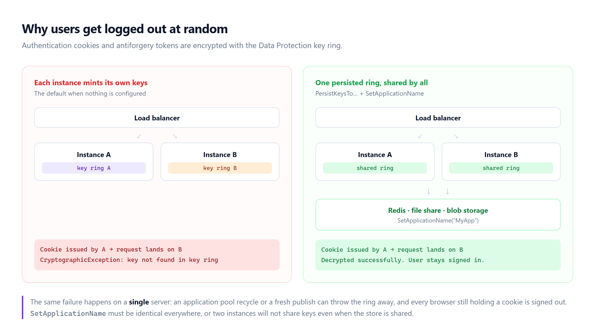

**Solution:** Persist the keys to a shared store and pin the application name so every instance reads the same ring.

```csharp
builder.Services.AddDataProtection()
    .PersistKeysToFileSystem(new DirectoryInfo(@"\\fileshare\keys\myapp"))
    .SetApplicationName("MyApp");
```

Redis is a better fit for containers and cloud deployments:

```csharp
var redis = ConnectionMultiplexer.Connect("redis-server:6379");

builder.Services.AddDataProtection()
    .PersistKeysToStackExchangeRedis(redis, "DataProtection-Keys")
    .SetApplicationName("MyApp");
```

Azure Blob Storage and Entity Framework Core providers are also available. Whichever you choose, make sure the application pool identity or the container user can read and write the store.

**Note:** `SetApplicationName` must be identical on every instance. Without it, the isolation is per application path, and two instances deployed to different folders will not share keys even when the store is shared.

### 16. HTTPS and Certificate Problems on Linux and Docker

**Symptoms:** `Unable to configure HTTPS endpoint. No server certificate was specified`. `The server mode SSL must use a certificate with the associated private key`. The container starts and immediately exits.

Kestrel on Linux does not have a certificate store to fall back on, and it does not accept a `.crt` and `.key` pair the way nginx does.

**Solution:** Export a password-protected `.pfx`, mount it into the container, and point Kestrel at it:

```bash
dotnet dev-certs https -ep ${HOME}/.aspnet/https/myapp.pfx -p MyPassword
dotnet dev-certs https --trust
```

```yaml
services:
  web:
    image: myapp:latest
    ports:
      - "8001:8081"
    environment:
      - ASPNETCORE_ENVIRONMENT=Production
      - ASPNETCORE_HTTPS_PORTS=8081
      - ASPNETCORE_Kestrel__Certificates__Default__Path=/https/myapp.pfx
      - ASPNETCORE_Kestrel__Certificates__Default__Password=MyPassword
    volumes:
      - ~/.aspnet/https:/https:ro
```

In production, terminate TLS at the reverse proxy or ingress instead, and let the container serve plain HTTP internally. That is simpler, and it avoids shipping certificates inside images. If you do, go back and read problem 14 — the two go together.

**Note:** Another Linux-only surprise is globalization. If your base image runs in invariant globalization mode, culture-specific formatting and string comparison behavior change, and some libraries throw at startup. Either install ICU in the image or set `InvariantGlobalization` deliberately, not by accident.

## SPA Frontends and Multi-Instance Deployments

### 17. CORS Errors After Deploying a Separate SPA Frontend

**Symptom:** `Access to XMLHttpRequest at 'https://api.example.com/...' from origin 'https://app.example.com' has been blocked by CORS policy: No 'Access-Control-Allow-Origin' header is present`.

If you host an ASP.NET Core backend and a SPA frontend (Angular, React, Vue) as two separate sites, the browser enforces CORS on every API call. Locally you probably used a dev-server proxy, so the problem never appeared.

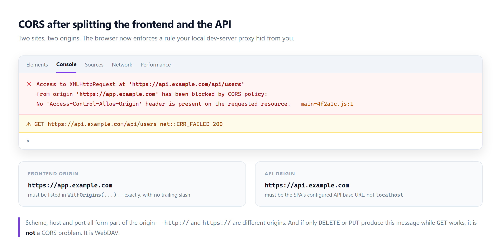

**Solution:** Configure CORS on the backend with the exact production origin of your SPA:

```csharp
builder.Services.AddCors(options =>
{
    options.AddDefaultPolicy(policy =>
    {
        policy.WithOrigins("https://app.example.com")
              .AllowAnyHeader()
              .AllowAnyMethod()
              .AllowCredentials();
    });
});

var app = builder.Build();
app.UseCors();   // before UseAuthentication and MapControllers
```

Three details cause most of the remaining failures:

- **Trailing slashes.** `https://app.example.com/` does not match `https://app.example.com`. Configure the origin without a trailing slash.
- **Scheme and port are part of the origin.** `http://app.example.com` and `https://app.example.com` are different origins.
- **`AllowCredentials` cannot be combined with `AllowAnyOrigin`.** If you send cookies, you must list origins explicitly.

Also update the SPA side. Whatever your frontend uses as the API base URL must point at the production API — a value left as `http://localhost:5000` in a production config file is a very common cause of "it works locally".

**Note:** If only `DELETE` or `PUT` requests fail with a CORS message while `GET` and `POST` work, this is not a CORS problem. Go back to problem 10 — it is WebDAV.

### 18. The SPA Build Output Is Deployed Incorrectly

**Symptoms:** A blank white page. `Failed to load resource: main-XXXX.js 404`. The site root shows a directory listing.

When you build a SPA, the compiled output goes into a folder such as `dist/my-app`. The single most common mistake is copying the **folder** to the server instead of the **contents** of the folder, which produces `https://app.example.com/my-app/index.html` instead of `https://app.example.com/index.html`.

**Solution:** Copy the contents. Verify that `index.html` sits directly in the site's physical root.

```powershell
Copy-Item -Path ".\dist\my-app\*" -Destination "C:\inetpub\wwwroot\myapp" -Recurse -Force
```

Two related mistakes:

- **Building for the wrong environment.** `ng build` without a production configuration ships development settings and an unoptimized bundle. Use the production build for production.
- **No fallback for client-side routes.** Direct navigation to `/users/42` returns 404 because IIS looks for a physical folder. Add a URL Rewrite rule:

```xml
<system.webServer>
  <rewrite>
    <rules>
      <rule name="SPA Routes" stopProcessing="true">
        <match url=".*" />
        <conditions logicalGrouping="MatchAll">
          <add input="{REQUEST_FILENAME}" matchType="IsFile" negate="true" />
          <add input="{REQUEST_FILENAME}" matchType="IsDirectory" negate="true" />
          <add input="{REQUEST_URI}" pattern="^/(api)" negate="true" />
        </conditions>
        <action type="Rewrite" url="/index.html" />
      </rule>
    </rules>
  </rewrite>
</system.webServer>
```

This requires the **URL Rewrite** module, which is not installed with IIS by default.

### 19. Hosting the SPA Inside the ASP.NET Core App

If you would rather serve the SPA from the same site as your API — one Azure Web App, one IIS site, one certificate, no CORS — it is a good choice. It is also easy to get subtly wrong.

**Symptoms:** API routes return `index.html`. The SPA loads but every API call 404s. Refreshing a deep link breaks.

The problem is ordering. Both the API and the SPA fallback want to handle requests, and the fallback is greedy.

**Solution:** Publish the SPA output into `wwwroot` and register middleware in the correct order:

```csharp
var app = builder.Build();

app.UseDefaultFiles();
app.UseStaticFiles();

app.UseRouting();
app.UseAuthentication();
app.UseAuthorization();

app.MapControllers();                  // API routes first
app.MapFallbackToFile("index.html");   // SPA fallback last
```

Add the SPA build to your publish pipeline so it always ships with the backend:

```xml
<Target Name="BuildSpa" BeforeTargets="Build">
  <Exec WorkingDirectory="../ClientApp" Command="npm ci" />
  <Exec WorkingDirectory="../ClientApp" Command="npm run build -- --configuration production" />
</Target>
```

**Note:** Keep your API under a distinct prefix such as `/api`. It makes the fallback rule unambiguous and it keeps the door open for splitting the two sites later.

### 20. Multi-Instance and Load-Balanced Deployments

The moment you go from one server to two, a set of assumptions that were safe on a single machine stop being true. This affects every ASP.NET Core application.

**Symptom:** Everything works with one instance and breaks intermittently with two.

Here is what needs attention.

**In-memory cache is per instance.** `IMemoryCache` on instance A is invisible to instance B, so users see stale data depending on which server answered. Move to a distributed cache:

```csharp
builder.Services.AddStackExchangeRedisCache(options =>
{
    options.Configuration = "redis-server:6379";
    options.InstanceName = "MyApp:";
});
```

**Session state must be shared.** Sessions stored in memory disappear when the request lands on another node. Back sessions with the distributed cache, or avoid server-side session entirely.

**Data Protection keys must be shared.** See problem 15. This is the most common cause of "users randomly logged out" in a scaled-out deployment.

**Background jobs run on every node.** A recurring job registered in your app runs once per instance, so a nightly email job on three servers sends three emails. Use a job scheduler with shared storage and distributed locking, run jobs in a single dedicated worker instance, or guard the job with a distributed lock.

**Uploaded files land on one server.** A file written to local disk on instance A is a 404 on instance B. Use blob storage, a shared file system, or a database.

**Health checks and drain time.** Without a health check endpoint, the load balancer keeps sending traffic to an instance that is still starting up. Add one:

```csharp
builder.Services.AddHealthChecks()
    .AddSqlServer(connectionString)
    .AddRedis(redisConnectionString);

app.MapHealthChecks("/health");
```

**Note:** Also revisit problem 12. SignalR needs both sticky sessions and a backplane before it works correctly across instances.

## Pre-Deployment Checklist

Print this, or paste it into your deployment runbook. Most of the problems above never happen if you verify these before the first request.

**Server**

- [ ] ASP.NET Core Hosting Bundle installed, matching or newer than the target framework
- [ ] Hosting Bundle installed **after** IIS, followed by `iisreset`
- [ ] `dotnet --list-runtimes` shows `Microsoft.AspNetCore.App`
- [ ] App pool bitness matches the publish target
- [ ] WebDAV removed or disabled if the API uses `PUT` and `DELETE`
- [ ] WebSocket Protocol feature installed if the app uses SignalR
- [ ] URL Rewrite module installed if a SPA needs route fallback
- [ ] App pool identity has write permission on `logs`, uploads and temp folders

**Application**

- [ ] `ASPNETCORE_ENVIRONMENT` set explicitly, with correct casing
- [ ] Every connection string in the publish output points at production
- [ ] Database migrations applied
- [ ] Request size limits raised at all three layers if the app accepts large uploads
- [ ] `UseForwardedHeaders` configured if the app sits behind a proxy, with `KnownProxies` set
- [ ] Data Protection keys persisted to a shared store with `SetApplicationName`
- [ ] CORS origins list the exact production origin, without a trailing slash
- [ ] Distributed cache, shared session, shared file storage and a single job runner if there is more than one instance
- [ ] A health check endpoint exists and the load balancer uses it

**Before you call it done**

- [ ] `dotnet MyApp.Web.dll` runs cleanly from the publish folder on the server
- [ ] Every HTTP verb the API uses has been tested against the deployed site, not just `GET`
- [ ] Log in, refresh the page, and recycle the app pool — you should still be logged in

## Conclusion

Hosting problems feel random, but they are not. Almost all of them come from the same handful of gaps between your development machine and your server: a runtime that was never installed, a configuration file that was never updated, an IIS module you did not know existed, or an assumption about a single process that stops holding when there are two.

The single most valuable habit is refusing to guess. When something fails, open Event Viewer, enable the stdout log, and run `dotnet MyApp.Web.dll` on the server. Those three steps turn a meaningless `500.30` into an actual exception, and an actual exception is something you already know how to fix.

If you would rather not solve these problems from scratch on every project, [ASP.NET Zero](https://aspnetzero.com/) ships with production-ready deployment configuration — Docker files, publish profiles, environment-based settings and multi-tenant hosting — along with [step-by-step deployment documentation](https://docs.aspnetzero.com/) for IIS, Azure and Docker.
