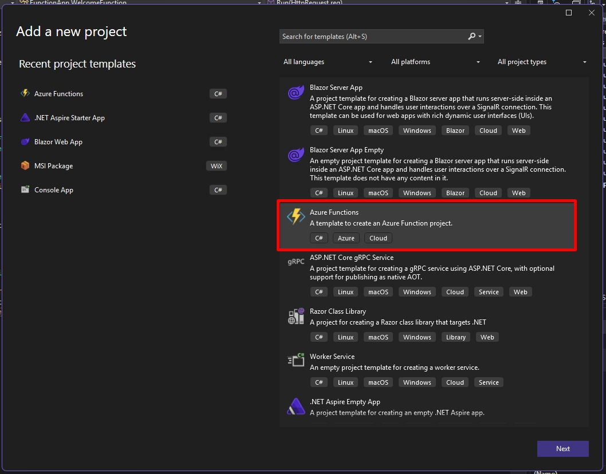
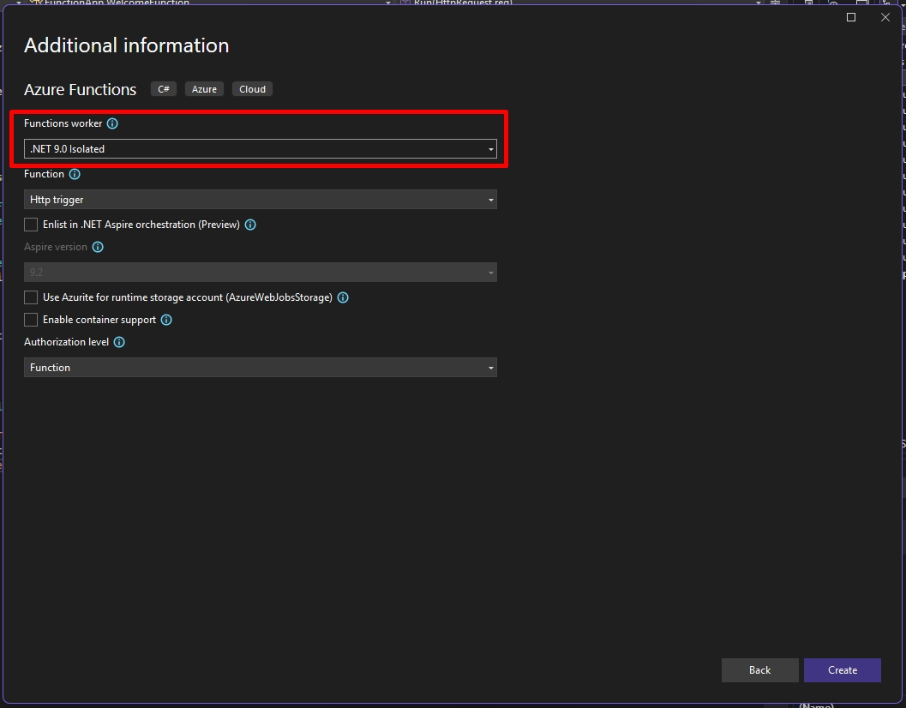

# How to Integrate Azure Functions with ASP.NET Zero

Azure Functions is a serverless computing platform that enables you to build powerful applications with minimal code and infrastructure overhead. Rather than managing servers manually, you can rely on Azure’s cloud infrastructure to automatically handle scaling, updates, and resource provisioning—helping reduce both operational complexity and costs.

ASP.NET Zero also provides a strong infrastructure. In some cases, it might be helpful to use Azure Functions in ASP.NET Zero.

## Add Sample Project

To get started, let's add an Azure Function project to our solution. At the moment, ASP.NET Zero is based on .NET 9, so we should also select .NET 9 while creating our Azure Functions project.





If we run our Azure Function project, it will accept HTTP requests from a specific URL (Like ` http://localhost:7154/api/Function1`) and if we make a request to this URL, it will return a static text.

You can open your browser and visit the URL you are seeing in the command line which appears when you run the project. It will return **Welcome to Azure Functions!** text as the response by default.

## Integrate ASP.NET Zero

To integrate ASP.NET Zero into an Azur eFunction project, we need to;

* Create a Module
* Arrange Module Dependencies
* Configure Dependency Injection

### Create Azure Functions Project Module

ASP.NET Zero provides the infrastructure to build modules and compose them to create an application. Becasue of that, we need to create a module class in our Azure Function project. Create a Module class similar to one below;

```csharp
using Abp.AspNetZeroCore;
using Abp.Domain.Repositories;
using Abp.Modules;
using Abp.Reflection.Extensions;
using AnzAzureFunctionSample.Authorization.Roles;
using AnzAzureFunctionSample.Configuration;
using AnzAzureFunctionSample.EntityFrameworkCore;
using Microsoft.Extensions.Configuration;

namespace FunctionApp
{
    [DependsOn(typeof(AnzAzureFunctionSampleEntityFrameworkCoreModule))]
    public class MyFunctionModule : AbpModule
    {
        private readonly IConfigurationRoot _appConfiguration;

        public MyFunctionModule(AnzAzureFunctionSampleEntityFrameworkCoreModule abpZeroTemplateEntityFrameworkCoreModule)
        {
            abpZeroTemplateEntityFrameworkCoreModule.SkipDbSeed = true;

            _appConfiguration = AppConfigurations.Get(
                typeof(MyFunctionModule).GetAssembly().GetDirectoryPathOrNull()
            );
        }

        public override void PreInitialize()
        {
            Configuration.DefaultNameOrConnectionString = _appConfiguration.GetConnectionString("Default");
            Configuration.Modules.AspNetZero().LicenseCode = _appConfiguration["AbpZeroLicenseCode"];
        }

        public override void Initialize()
        {
            IocManager.RegisterAssemblyByConvention(typeof(MyFunctionModule).GetAssembly());
        }
    }
}
```

Let's check important parts of this module class.

- **Module Depedency**: Our module for the Azure Functionj project depends on `AnzAzureFunctionSampleEntityFrameworkCoreModule` module. This means, when we run the Azure Function project, ASP.NET Zero will automatically load `AnzAzureFunctionSampleEntityFrameworkCoreModule` and its dependants as well. 
- **Connection String**: If we want to access the database of our ASP.NET Zero application, we need to set the connection string configuration.
- **License Code**: Since ASP.NET Zero checks the license code at startup, we also need to set the license code in our Azure Function Module's `PreInitialize` method.

After adding this class, we also need to create an `appsettings.json` file with the content below;

```json
{
  "ConnectionStrings": {
    "Default": "Server=localhost; Database={YOUR_APPS_DATABASE_NAME}; Trusted_Connection=True; TrustServerCertificate=True;"
  },
  "AbpZeroLicenseCode": "YOUR_LICENSE_CODE",
  "Functions": {
    "Worker": {
      "HostEndpoint": "{URL_Of_AZURE_FUNCTION_APP}"
    }
  }
}
```

### Module Dependencies

It is suggested to depend on only the `CoreModule` and `EntityFrameworkCoreModule` of your main application. Because, your Azure Function app should only use your domain logic and your database access layer. 
You shouldn't depend on the `ApplicationModule` or `WebModule`. Becasue, these modules may require authentication and authorization which your Azure Function app is not aware of.

### Configure Dependency Injection

Finally, we need to configure our Azure Function app, so it can integrate with ASP.NET Zero's dependency injection system. This way, when we inject any interface or class into our Functions, they can be resolved correctly. To do this, modify your `Program.cs` file in your Azure Function project as shown below;

```csharp
using Abp;
using Abp.Dependency;
using Castle.Windsor.MsDependencyInjection;
using FunctionApp;
using Microsoft.Azure.Functions.Worker;

using (var bootstrapper = AbpBootstrapper.Create<MyFunctionModule>())
{
    bootstrapper.Initialize();
}

var host = new HostBuilder()
    .ConfigureFunctionsWebApplication()
    .ConfigureServices(services =>
    {
        services.AddApplicationInsightsTelemetryWorkerService();
        services.ConfigureFunctionsApplicationInsights();

        WindsorRegistrationHelper.CreateServiceProvider(
            IocManager.Instance.IocContainer,
            services
        );
    })
    .UseServiceProviderFactory(new MyServiceProviderFactory<MyFunctionModule>())
    .Build();

host.Run();
```

Here, we are first initializing our `MyFunctionModule` using `AbpBootstrapper`. This initializes our module and all its dependant modules.
Then, in `ConfigureServices` method, we are calling `WindsorRegistrationHelper.CreateServiceProvider` which combines Azure Function project's registered classes to its dependency injeciton container with ASP.NET Zero's dependency injection system.

After all, we are calling `UseServiceProviderFactory(new MyServiceProviderFactory<MyFunctionModule>())` which creates a service provider using ASP.NET Zero's dependency injection system. We are doing this becasue we first combined all registered classes (and interfaces) into ASP.NET Zero's DI system and then we are using this combined registrations in our Azure Function project's DI system.

### Sample Function

Now, we can inject for example generic repositories into our Azure Functions and access ASP.NET Zero's database. Here is a sample Function class;

```
using Abp.Dependency;
using Abp.Domain.Repositories;
using AnzAzureFunctionSample.Authorization.Roles;
using Microsoft.AspNetCore.Http;
using Microsoft.AspNetCore.Mvc;
using Microsoft.Azure.Functions.Worker;

namespace FunctionApp;

public class WelcomeFunction : ITransientDependency
{
    private readonly ILogger<WelcomeFunction> _logger;
    private readonly IRepository<Role> _roleRepository;

    public WelcomeFunction(ILogger<WelcomeFunction> logger
        ,IRepository<Role> roleRepository
        )
    {
        _logger = logger;
        _roleRepository = roleRepository;
    }

    [Function("WelcomeFunction")]
    public IActionResult Run([HttpTrigger(AuthorizationLevel.Function, "get", "post")] HttpRequest req)
    {
        _logger.LogInformation("C# HTTP trigger function processed a request.");
        var sampleRole = _roleRepository.FirstOrDefault(e=> e.Id == 1);
        return new OkObjectResult("Welcome to Azure Functions! -> " + sampleRole?.Name);
    }
}
```

This function gets the role with `Id` equals to `1` from database and returns a welcome text with the name of the role. The output for this endpoint will be `Welcome to Azure Functions! -> admin`.
You can send a GET request to `http://localhost:7154/api/WelcomeFunction` and test this function.

**NOTE:** I have used Visual Studio while testing this scenario. Jetbrains Rider didn't work well when running Azure Functions. So, if you face any issues while running the Azure Function project locally, you can try using Visual Studio.