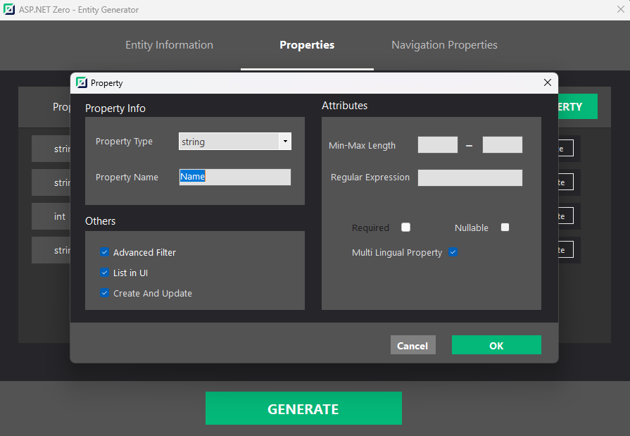
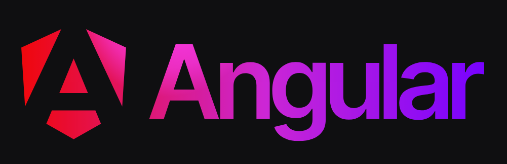

**Title:** Introducing ASP.NET Zero v.13.0
**Description:** ASP.NET Zero v13.0: Get ready to explore the latest enhancements in ASP.NET Zero! Multi-Lingual Entity Support, .NET 8, Angular 17, Metronic 8.2.0, GraphQL 7.x, and ABP 9.0 upgrades.

# Introducing ASP.NET Zero v13.0

Get ready to explore the latest enhancements in ASP.NET Zero! From multi-lingual entity support with power tools to upgraded versions of .NET, Angular, Metronic, GraphQL, and ABP.

## Multi-Lingual Entity Support
Power Tools now supports Multi-Lingual Entity generation. You can add Multi-Lingual properties to your entities and Power Tools generate the code for creating and editing Multi-Lingual entities for you.

### Why Multi-Lingual Entity Support Matters

In some scenarios, other than localizing your application content, you may want to localize the fields of your entities. Multi-lingual entity support provides this functionality if you have a product entity and want to show its name in the user's selected language.

### How to Create Multi-Lingual Entity
* Open power tools.
* Fill the `Entity Informations`. (namespace, entity name, etc.)
* When create a new property, click on the `Multi Lingual Property` option.
* Click on the `Generate` button.
* That's it!

### Multi-Lingual Entity 

When you create a new entity with multi-lingual property, you will see the result as shown below!

## .NET 8

With version 13, ASP.NET Zero is upgraded to .NET 8. With this new version, you can take advantage of all the benefits of .NET 8. Please visit [https://learn.microsoft.com/en-us/dotnet/core/whats-new/dotnet-8](https://learn.microsoft.com/en-us/dotnet/core/whats-new/dotnet-8) to see What's new in .NET 8.

## Angular 17

ASP.NET Zero always stays up-to-date with the technologies it uses. Because of that, we upgraded ASP.NET Zero to Angular 17. To see what's new in Angular 17, please see [https://blog.angular.io/introducing-angular-v17-4d7033312e4b](https://blog.angular.io/introducing-angular-v17-4d7033312e4b)

## Metronic 8.2.0

ASP.NET Zero was using Metronic 8.1.2 adn now upgraded to 8.2.0 with the 13.0 version. This brings many fixes and improvements to ASP.NET Zero. For all the changes, you can take a look at [https://keenthemes.com/metronic/changelog](https://keenthemes.com/metronic/changelog).

## GraphQL 7.x

ASP.NET Zero stayed with GraphQL 4.x for a while since there were many breaking changes in GraphQL's .NET packages after v4.x. We have upgraded ASP.NET Zero to GraphQL 7.x so it is not up to date with the latest GraphQL version.

## ABP 9.0

ASP.NET Zero is upgraded to latest version of ASP.NET Boilerplate v9.0 which supports .NET 8. There were also several enhancements, fixes and Blob Storing feature implemented in ABP. For the full list, please see [https://github.com/aspnetboilerplate/aspnetboilerplate/releases/tag/v9.0](https://github.com/aspnetboilerplate/aspnetboilerplate/releases/tag/v9.0).