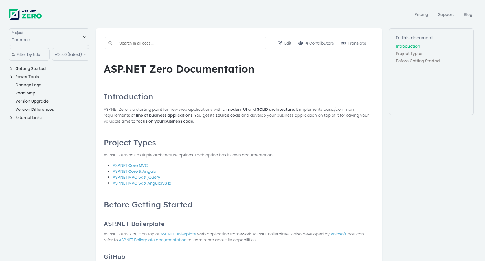

**Title:** Introducing ASP.NET Zero v13.4
**Description:** ASP.NET Zero v13.4: New Design For ASP.NET Zero Websites, MAUI Power Tools Code Generation, Angular Server Not Found Page, Upgrade to ABP 9.4, Update packages and bug fixes.

# Introducing ASP.NET Zero v13.4

We are excited to announce the release of ASP.NET Zero v13.4. This release includes MAUI power tools code generation, a new design for ASP.NET Zero websites, Angular server not found page and many other new features and improvements.

## ✨ New Design For ASP.NET Zero Websites

We have updated the design of our websites to provide a better user experience. The new design is more modern, clean, and user-friendly. We have also improved the navigation and layout of the websites to make it easier for users to find the information they need. The new design is responsive and works well on all devices, including desktops, tablets, and smartphones.

[docs.aspnetzero.com](https://docs.aspnetzero.com/common/latest)

[aspnetzero.com](https://aspnetzero.com/)

## ⚡ Power Tools: Maui Code Generation

We have introduced a new feature in our Power Tools called **MAUI Code Generation**. This feature allows you to generate code for your MAUI applications using the Power Tools. You can generate code for your MAUI applications, including pages, services, and components. This feature makes it easy to create MAUI applications using the Power Tools.

Here is the final result of the application generated with the Power Tools:

[https://docs.aspnetzero.com/en/aspnet-core-mvc/latest/Development-Guide-MAUI](https://docs.aspnetzero.com/en/aspnet-core-mvc/latest/Development-Guide-MAUI)

## 🚫 Angular Server Not Found Page

We’ve introduced a custom **Server Not Found page** in our Angular application to enhance user experience. This feature provides a friendly page to users when the server (Host) is not found. If the server is not found, the user will see a friendly page with a message that the server is not found.

## 🌅 Upgrade to ABP 9.4

ASP.NET Zero v13.4 is based on ABP 9.4. ABP 9.4 is a major release that includes performance improvement and bug fixes. For more information, see the [ABP 9.4 release notes](https://github.com/aspnetboilerplate/aspnetboilerplate/releases/tag/v9.4.0).

## 🐛 Update packages and bug fixes

As we do in every version, we fixed minor padding and margin errors, localization errors, and made improvements for power tools in line with your requests.

* [https://github.com/aspnetzero/aspnet-zero-core/releases/tag/v13.4.0-rc.1](https://github.com/aspnetzero/aspnet-zero-core/releases/tag/v13.4.0-rc.1)
* [https://github.com/aspnetzero/aspnet-zero-core/releases/tag/v13.4.0](https://github.com/aspnetzero/aspnet-zero-core/releases/tag/v13.4.0)

## 🙏 Conclusion

With ASP.NET Zero v13.4, we've raised the bar yet again. We hope you enjoy this release and look forward to hearing your feedback. If you have any questions or comments, please don't hesitate to contact us. 

<a href="mailto:info@aspnetzero.com">info@aspnetzero.com</a>

