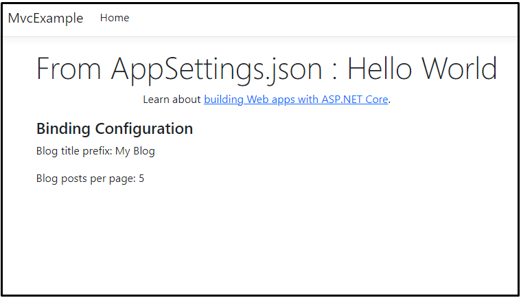

# Configuration in ASP.NET Core

In the dynamic world of web development, configuring applications effectively is crucial for adaptability and maintainability. ASP.NET Core provides a robust and flexible configuration system that empowers developers to manage settings across various environments. This blog post dives into ASP.NET Core configuration.

## ASP.NET Core Configuration Providers

ASP.NET Core provides a variety of configuration providers, each with its own unique set of capabilities. The following table lists the configuration providers available in ASP.NET Core:

| Configuration Provider | Description |
| --- | --- |
| **Azure App Configuration** | Externalizes storage and management of application settings across all environments. |
| **Azure Key Vault** | Safeguards cryptographic keys and secrets used by cloud applications and services. |
| **Command-Line Arguments** | Can use command-line arguments specified during the launch of the application. |
| **Environment Variables** | Can read environment variables, allowing for environment-specific configuration. |
| **User secrets** | Can read configuration data from an encrypted user store. |
| **File Configuration Providers** | Can read configuration information from file formats such as JSON, XML, and INI. |
| **In-Memory .NET Objects** | Can use in-memory .NET objects as a configuration source. |
| **Custom Providers** | Can use custom providers, either installed or created, as a configuration source. |

### Precedence of Configuration Providers

ASP.NET Core's default configuration is located in the Program class, specifically in the `ConfigureWebHostDefaults` method. This method examines settings in a predefined hierarchical structure, with later-defined settings taking precedence over earlier ones. 


The [official document](https://learn.microsoft.com/en-us/aspnet/core/fundamentals/configuration/?view=aspnetcore-8.0#default-application-configuration-sources) says providers are used in this order, from highest to lowest priority: 

* Command line arguments
* Non-prefixed environment variables
* User secrets from the .NET User Secrets Manager 
* Any `appsettings.{ ENVIRONMENT_NAME }.json` files
* The `appsettings.json` file
* Fallback to the host configuration

## How to use Configuration in ASP.NET Core

Here is the my `appsettings.json` I used in this blog post:

*appsettings.json*
```json
{
  "Logging": {
    "LogLevel": {
      "Default": "Information",
      "Microsoft.AspNetCore": "Warning"
    }
  },
  "AllowedHosts": "*",
  "MySetting" : {
    "SpecialWord" : "Hello World"
  }
}
```

### IConfiguration Interface

You can access configuration data anywhere in your application using the `IConfiguration` interface through dependency injection.

```csharp
using Microsoft.AspNetCore.Mvc;

namespace MvcExample.Controllers;

public class HomeController : Controller
{
    private readonly IConfiguration _configuration;

    public HomeController(IConfiguration configuration)
    {
        _configuration = configuration;
    }

    public IActionResult Index()
    {
        // Option 1: Using GetSection method
        // var configuration = _configuration.GetSection("MySetting");
        // configuration.GetValue<string>("SpecialWord");

        // Option 2: Directly accessing the value with key path
        // var configuration = _configuration.GetValue<string>("MySetting:SpecialWord");

        // Option 3: Simplified access with indexer
        var configuration = _configuration["MySetting:SpecialWord"];

        ViewBag.Text = configuration ?? "No value found";
        return View();
    }
}
```

#### `GetSection` Method:
If you intend to retrieve a specific section of the configuration, the `GetSection` method is your go-to. This allows you to narrow down your focus to a particular subset of settings.

#### `GetValue<>` Method:
While direct access using the key path is possible, it's not recommended due to the lack of type safety. Instead, leverage the `GetValue<>` method, providing a more robust and type-safe approach to fetching configuration values.

### Bind Configuration Data to a Class (IOptions Pattern)

ASP.NET Core also supports binding configuration data to .NET objects, which can be particularly useful for grouping related settings together.

```csharp
public class BlogOptions
{
    public const  string SettingName = "BlogSettings";
    
    public string Prefix { get; set; }

    public int PostsPerPage { get; set; }
}
```

```csharp
public IActionResult Index()
{
    // ... other codes

    // Option 1: Bind to a model
    // var blogOptions = new BlogOptions();
    // _configuration.GetSection("BlogSettings").Bind(blogOptions);
    
    // Option 2: Get the section and cast it to the model
    var blogOptions = _configuration.GetSection(BlogOptions.SettingName)
        .Get<BlogOptions>();
    
    return View(blogOptions);
}
```

Here is the view code:

```html
@model BlogOptions

@{
    ViewData["Title"] = "Home Page";
}

<div class="text-center">
    <h1 class="display-4">From AppSettings.json : @ViewBag.Text</h1>
    <p>Learn about <a href="https://learn.microsoft.com/aspnet/core">building Web apps with ASP.NET Core</a>.</p>
</div>

<div class="container">
    <h4>Binding Configuration</h4>
    
    <p>Blog title prefix: @Model.Prefix</p>
    <p>Blog posts per page: @Model.PostsPerPage</p>
</div>
```

*The result*


### Options Pattern

The options pattern is a design pattern in which configuration settings are represented as a class or a set of classes. Developers can configure the application using the `Configure` method in the `Startup` class. This pattern is particularly useful for grouping related settings together.

*Program.cs*
```csharp
// ... other codes

var blogConfig = builder.Configuration.GetSection(BlogOptions.SettingName);
builder.Services.Configure<BlogOptions>(blogConfig);
```

*OptionsPatternController.cs*
```csharp
using Microsoft.AspNetCore.Mvc;
using Microsoft.Extensions.Options;
using MvcExample.Models;

namespace MvcExample.Controllers;

public class OptionsPatternController : Controller
{
    private readonly BlogOptions _blogOptions;

    public OptionsPatternController(IOptions<BlogOptions> blogOptions)
    {
        _blogOptions = blogOptions.Value;
    }
    
    public IActionResult Index()
    {
        return View(_blogOptions);
    }
}
```

## Best Practices for ASP.NET Core Configuration

* **Adhere to Consistent Naming Conventions:** Establish clear naming rules for configuration keys to facilitate access and avoid conflicts.

* **Centralize Configuration Logic:** Keep configuration management code in a dedicated class or service for better organization and re-usability.

* **Validate Configuration Values:** Implement type conversion and validation rules to ensure data integrity and prevent errors.

* **Leverage the Options Pattern:** Bind configuration values to strongly typed classes for improved type safety and code readability.

* **Secure Sensitive Information:** Never store sensitive data directly in configuration files; utilize secrets management solutions instead.

* **Monitor Configuration Changes:** Implement strategies to detect and react to changes in configuration values, especially in production environments.

## ASP.NET Boilerplate Benefits

[ASP.NET Boilerplate (ABP)](https://aspnetboilerplate.com/) is a powerful and comprehensive application framework that goes beyond the basics of ASP.NET Core, offering a variety of features to streamline application development. When it comes to configuration, ABP provides several additional capabilities:

### Setting Management:
ABP includes a robust setting management system that allows developers to configure and manage application settings dynamically. Settings can be organized into hierarchical structures, and changes can be applied at runtime without requiring a restart. See its [documentation](https://aspnetboilerplate.com/Pages/Documents/Setting-Management) for more information. 

#### Multi-Tenancy Configuration:
ABP is designed to support multi-tenancy out of the box. This means you can configure settings at the tenant level, ensuring that each tenant in a multi-tenant application can have its own specific configuration.

### Dynamic Scripting Configuration:
ABP supports dynamic scripting for configuration, allowing developers to write dynamic expressions or scripts to determine configuration values. This provides a flexible way to set up complex configurations based on various conditions.

### Feature Management:
Feature management in ABP enables developers to configure and control features of the application dynamically. This is particularly useful for enabling or disabling certain features for different tenants.

### Integrated User Interface for Configuration:
ASP.NET Zero includes a built-in user interface (UI) for managing settings. This UI allows administrators to view, edit, and manage configuration settings easily, providing a user-friendly way to handle application configuration.

### Configuration Providers:
ABP supports various configuration providers, including database-based providers. This means you can store settings in a database and dynamically change them through the UI or programmatically.

### Security and Permissions:
Configuration changes in ABP can be controlled by the built-in permission system. Administrators can be granted specific permissions to manage configurations, ensuring security and control over sensitive settings.

### Integration with Other ABP Modules:
ABP is modular, and its setting system integrates seamlessly with other ABP modules. For example, each module can define its own settings and main application can use all these defined settings at runtime.

### Predefined Configurations:
ABP provides predefined configurations for common scenarios, reducing the need for manual setup. This includes configurations for database connection strings, caching, and other essential aspects of application development.

### Conclusion

ASP.NET Core's robust configuration system provides developers with a flexible toolkit to manage settings across diverse environments. The IConfiguration interface, alongside dependency injection, simplifies access to configuration data.

Binding configuration to classes using the options pattern enhances code organization and readability. Leveraging this pattern streamlines the retrieval of related settings, promoting best practices in configuration management.

In conclusion, mastering ASP.NET Core configuration empowers developers to create adaptable and maintainable applications, ensuring resilience in the ever-evolving landscape of web development.