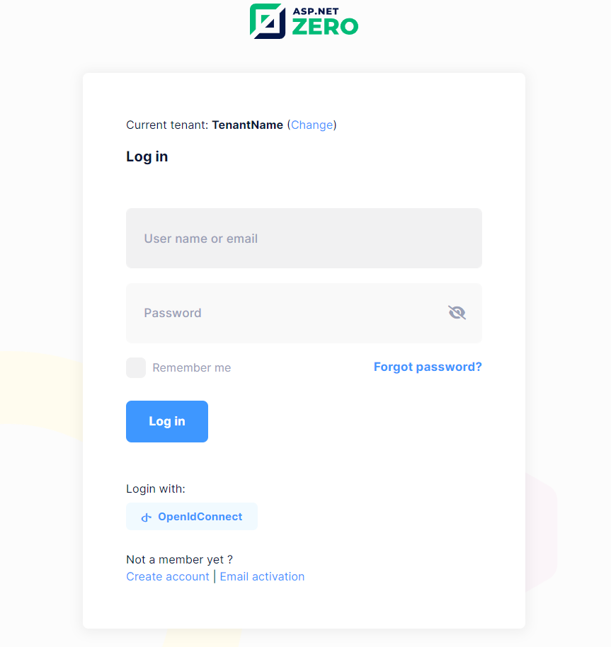
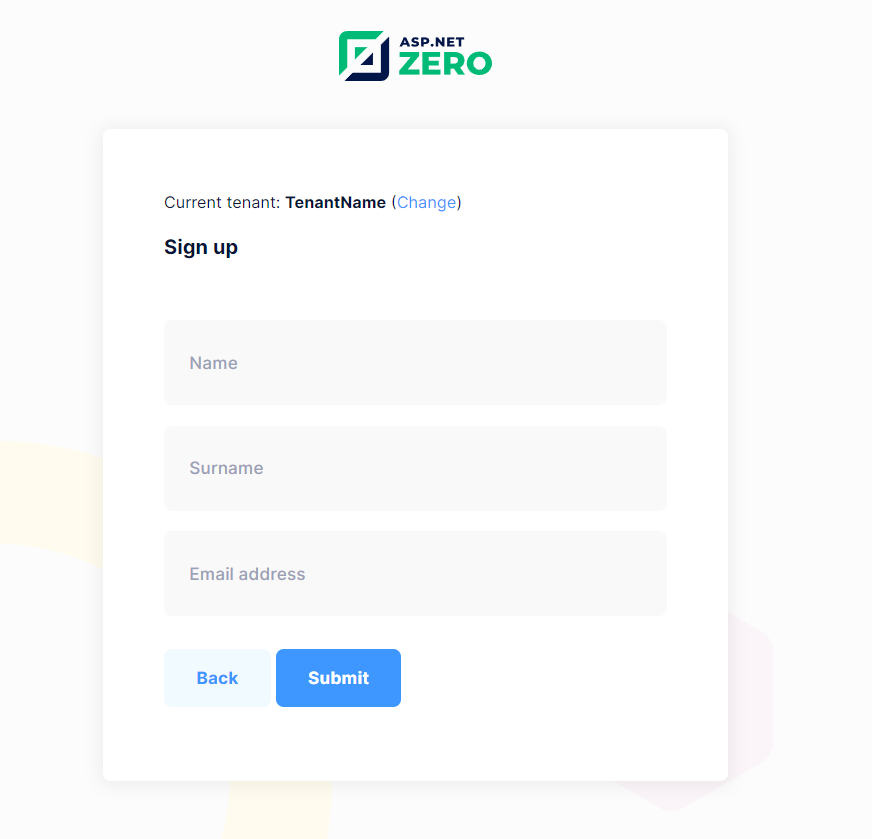

# Integrating Azure Active Directory with ASP.NET Zero

Adding Azure Active Directory to your ASP.NET Zero project is a quick and effective way to ensure a secure authentication process. After the basic App Registration steps in the Azure portal, you will take just a few steps to implement OpenID integration in your ASP.NET Zero project.

## Azure AD Configuration
After completing the **App Registration** process in the **Azure AD**, you can obtain the **Client ID** information. Additionally, to acquire the **Client Secret** information, you need to navigate to the **'Certificates & Secrets'** section and create a new secret here.

## OpenId Connect Login
ASP.NET Zero provides an integrated OpenID Connect Login in addition to social logins. This configuration is modifiable in the `appsettings.json` file.

```json
 "OpenId": {
   "IsEnabled": "true",
   "Authority": "https://login.microsoftonline.com/common/v2.0",
   "ClientId": "your_application(client)_id",
   "ClientSecret": "your_client_secret_value",
   "ValidateIssuer": "false",
   "ResponseType": "code",
   "ClaimsMapping": [
     {
       "claim": "unique_name",
       "key": "http://schemas.xmlsoap.org/ws/2005/05/identity/claims/nameidentifier"
     }
   ]
 }
```

- `IsEnabled`: Setting the value to **true** activates **OpenID Connect**.
- `Authority`: Represents the URL of the authorization server used in the **OpenID Connect** protocol for **Azure AD**. For detailed information, you can refer to the [Microsoft Identity Platform - OpenID Connect](https://learn.microsoft.com/en-us/entra/identity-platform/v2-protocols-oidc) documentation.
- `ClientId`: The **Application (client) ID** assigned for the App Registration created in the **Azure AD**. This value enables the recognition of your application.
- `ClientSecret`: It is a secure encryption key obtained from the **'Certificates & Secrets'** section in the **Azure AD**.
- `ValidateIssuer`: If the value of this setting is **true**, it validates the **issuer** information received from the **OpenID Connect** client. However, if your application is a **multi-tenant** application and you want all users to be able to use **Azure AD**, disable issuer validation. Note that the term **multi-tenant app** in this context refers to the one you have created on your **Azure AD**; it is not related to **AspNet Zero's** multi-tenant feature.
- `ResponseType`: Determines the **OpenID Connect** flow type used for authentication. **code** typically indicates the usage of the **Authorization Code Flow**.
- `ClaimsMapping`: The **claim mapping** settings specified for user requests. These settings may vary based on your **Azure AD** configuration and project.

After configuring the settings in **ASP.NET Zero** and **Azure AD**, when you login as a tenant, the **OpenID Connect** button will become active.



After clicking the **OpenID Connect** button and successfully logging in with a **Microsoft account**, The next screen will get other necessary information from the tenant user.




