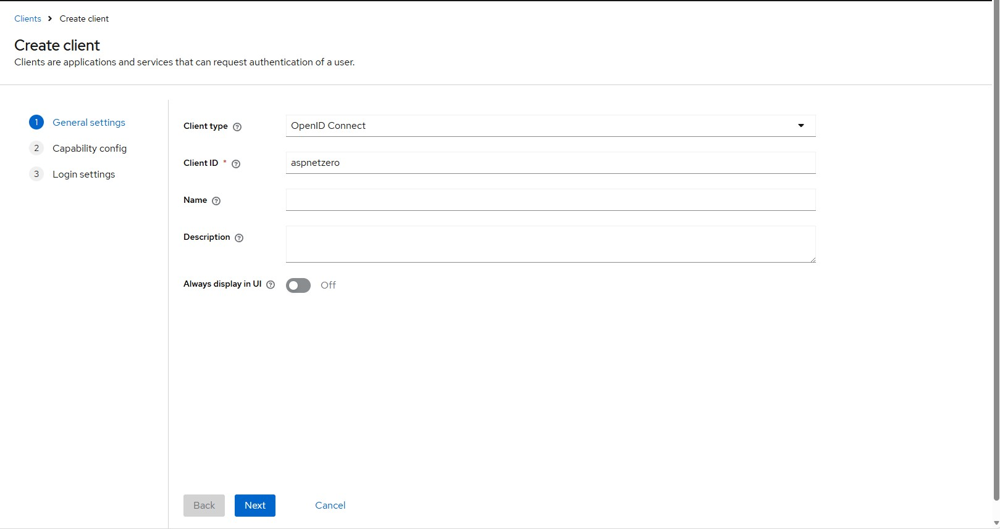
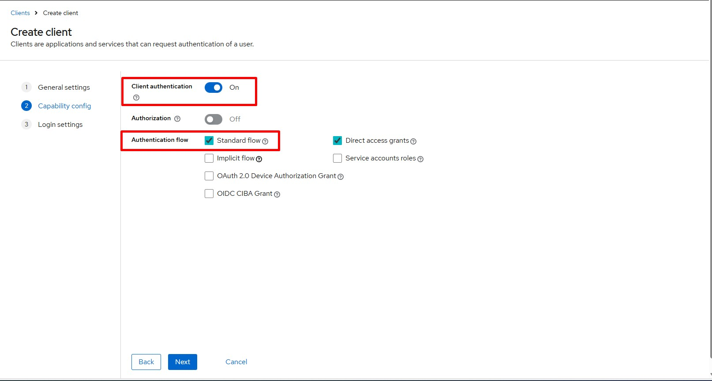
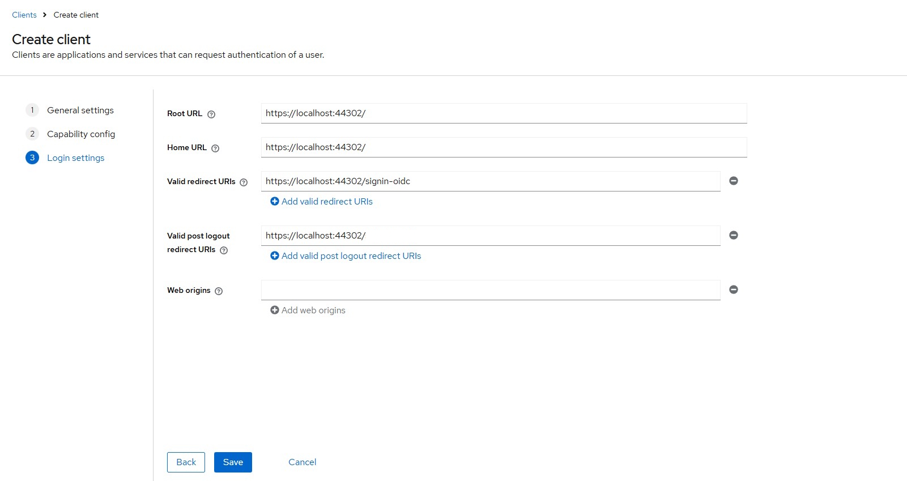

# Integrating Keycloak with ASP.NET Zero

Centralized authentication is a common requirement in enterprise applications.  
**Keycloak** provides a powerful open-source Identity and Access Management system, while  
**ASP.NET Zero** offers a ready-to-run application framework built on ASP.NET Core with multi-tenant, user management and many more [features](https://aspnetzero.com/features).

In this guide, we will:

- Run Keycloak with HTTPS using Docker
- Configure a Keycloak client for ASP.NET Zero
- Enable OpenID Connect login
- Perform login & logout operations (ASP.NET Zero + Keycloak)

Let’s start;

## 1. Download and Run ASP.NET Zero

Follow ASP.NET Zero's [Getting Started](https://docs.aspnetzero.com/aspnet-core-mvc/latest/Getting-Started-Core) document to create and run your project. In this blog post, we will be using ASP.NET Core & MVC version, so please be sure to select this version.

## 2. Running Keycloak with HTTPS

We will run Keycloak in Docker using HTTPS. This requires generating a PKCS12 keystore first. To do this, go to `docker` folder in your project and create a folder named `keycloack`.

### 🔹 Generate `server.keystore`

Run this in PowerShell or CMD in `docker\keycloack` we just created above:

```bash
keytool -genkeypair ^
  -alias keycloak ^
  -keyalg RSA ^
  -keysize 2048 ^
  -storetype PKCS12 ^
  -keystore server.keystore ^
  -storepass password ^
  -validity 3650
```

After this command, a `server.keystore` file is created in your working directory.

### 🔹 Create `docker-compose.yml`

Create a file named `docker-compose.yml` in the same folder:

```yaml
services:
  keycloak:
    image: quay.io/keycloak/keycloak:26.0.8
    container_name: keycloak
    command:
      - start
      - --https-port=8443
      - --http-enabled=false
      - --hostname=localhost
      - --hostname-strict=false
      - --https-key-store-file=/opt/keycloak/conf/server.keystore
      - --https-key-store-password=password
    environment:
      KC_BOOTSTRAP_ADMIN_USERNAME: admin
      KC_BOOTSTRAP_ADMIN_PASSWORD: admin
    volumes:
      - ./server.keystore:/opt/keycloak/conf/server.keystore
    ports:
      - "8443:8443"

```

### 🔹 Start Keycloak

In `docker\keycloack` folder, run the command below;

```bash
docker compose up
```

Then browse:

```
https://localhost:8443
```

Login using:

- **Username:** admin
- **Password:** admin

✅ Keycloak shoulw be running with HTTPS after running this command.

## 3. Configuring Keycloak

Inside the Keycloak admin panel:

1. Go to **Clients**
2. Click **Create client**

Fill the form as shown below:







Save the form after filling all the sections. Then go to **Credentials** and copy the **Client Secret** — we will use it in our ASP.NET Zero project.

## ✅ Configuring ASP.NET Zero

### Configure `appsettings.json`

Add/update the OpenId configuration:

```json
"OpenId": {
  "IsEnabled": "true",
  "Authority": "https://localhost:8443/realms/master",
  "ClientId": "aspnetzero",
  "ClientSecret": "<CLIENT-SECRET>",
  "ValidateIssuer": "false",
  "ResponseType": "code",
  "ClaimsMapping": [
    {
      "claim": "http://schemas.xmlsoap.org/ws/2005/05/identity/claims/emailaddress",
      "key": "email"
    },
    {
      "claim": "unique_name",
      "key": "preferred_username"
    },
    {
      "claim": "http://schemas.xmlsoap.org/ws/2005/05/identity/claims/nameidentifier",
      "key": "sub"
    }
  ]
}
```

Replace `<CLIENT-SECRET>` with the secret copied from Keycloak.

### Enable OpenID Connect login

In `AuthConfigurer.cs`, change OpenIdConnect configuration as shown below:

```csharp
authenticationBuilder.AddOpenIdConnect(options =>
{
	options.ClientId = configuration["Authentication:OpenId:ClientId"];
	options.Authority = configuration["Authentication:OpenId:Authority"];
	options.SignedOutRedirectUri = configuration["App:WebSiteRootAddress"] + "Account/Logout";
	options.ResponseType = configuration["Authentication:OpenId:ResponseType"];
	options.SaveTokens = true;

	options.TokenValidationParameters = new TokenValidationParameters()
	{
		ValidateIssuer = bool.Parse(configuration["Authentication:OpenId:ValidateIssuer"])
	};

	options.Events.OnTokenValidated = context =>
	{
		var jsonClaimMappings = new List<JsonClaimMap>();
		configuration.GetSection("Authentication:OpenId:ClaimsMapping").Bind(jsonClaimMappings);

		context.AddMappedClaims(jsonClaimMappings);

		return Task.FromResult(0);
	};

	options.BackchannelHttpHandler = new HttpClientHandler
	{
		ServerCertificateCustomValidationCallback = (message, cert, chain, errors) => true
	};

	var clientSecret = configuration["Authentication:OpenId:ClientSecret"];
	if (!clientSecret.IsNullOrEmpty())
	{
		options.ClientSecret = clientSecret;
	}

	options.SignedOutCallbackPath = "/signout-callback-oidc";
	options.SignedOutRedirectUri = configuration["App:WebSiteRootAddress"];

	options.Events = new OpenIdConnectEvents
	{
		OnRedirectToIdentityProviderForSignOut = ctx =>
		{
			var logoutUri = $"{options.Authority}/protocol/openid-connect/logout";

			var postLogoutUri = options.SignedOutRedirectUri;
			if (!string.IsNullOrEmpty(postLogoutUri))
			{
				logoutUri +=
					$"?post_logout_redirect_uri={Uri.EscapeDataString(postLogoutUri)}&client_id={configuration["Authentication:OpenId:ClientId"]}";
			}

			ctx.Response.Redirect(logoutUri);
			ctx.HandleResponse();
			return Task.CompletedTask;
		}
	};
});
```

✅ Login via Keycloak now should work

### Remote logout in `AccountController`

If you also want logged-in user to logout from Keycloak when user logs out from ASP.NET Zero app, modify the Logout action on AccountController as shown below:

```csharp
public async Task<ActionResult> Logout(string returnUrl = "")
{
	await _signInManager.SignOutAsync();
	var userIdentifier = AbpSession.ToUserIdentifier();

	if (userIdentifier != null &&
		_settingManager.GetSettingValue<bool>(AppSettings.UserManagement.AllowOneConcurrentLoginPerUser))
	{
		var user = await _userManager.GetUserAsync(userIdentifier);
		await _userManager.UpdateSecurityStampAsync(user);
	}

	if (!string.IsNullOrEmpty(returnUrl))
	{
		returnUrl = NormalizeReturnUrl(returnUrl);
		return Redirect(returnUrl);
	}

	return SignOut(
		new AuthenticationProperties { RedirectUri = returnUrl },
		OpenIdConnectDefaults.AuthenticationScheme
	);
}
```

✅ When a user logs out:
- The ASP.NET Zero cookie is removed
- The user is signed out from Keycloak as well
- They are redirected back to the login screen

# ✅ Result

At this point:

✔ Keycloak runs over HTTPS  
✔ ASP.NET Zero authenticates users with OpenID Connect  
✔ Claims are correctly mapped  
✔ Full logout works (Keycloak + ASP.NET Zero)

This integration is ideal for enterprise projects requiring centralized identity, SSO, or federation with external providers like AD FS, Azure AD, Google, etc.

