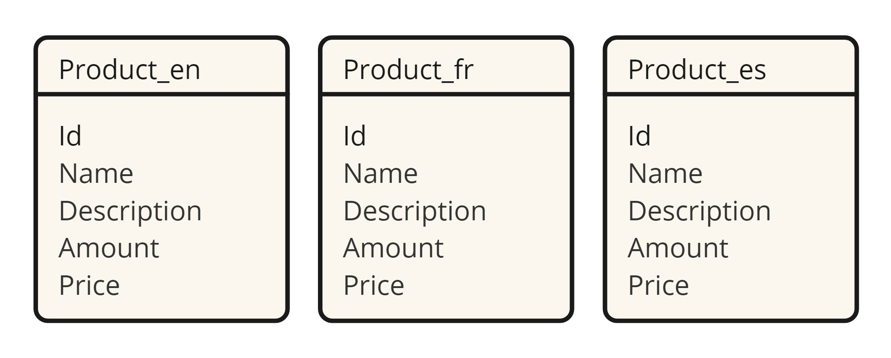
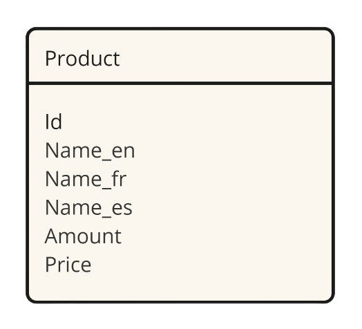
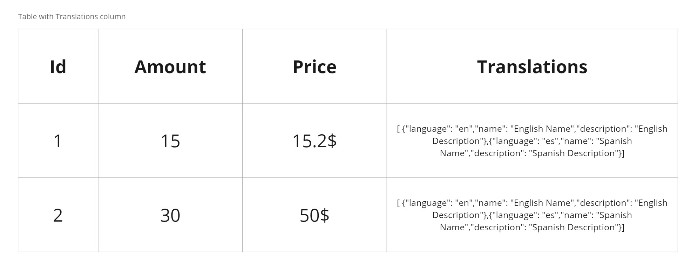
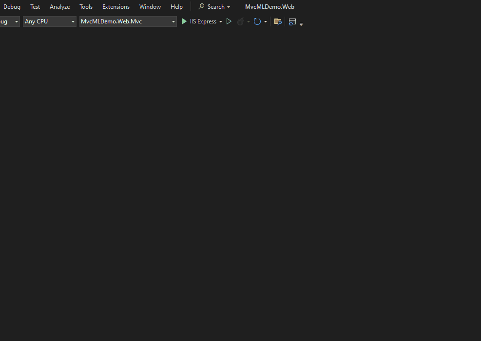

# Mastering Multi-lingual Database Design in ASP.NET Core with EF Core

In today's globalized world, reaching out to diverse audiences is crucial. For web applications, this often translates to supporting multiple languages. Supporting multiple languages can be examined in two topics:

* Localization of static texts in the application
* Localization of data entered by users of the application

We will focus on localization of data in this post. This post explores different approaches, their pros and cons, and dives into implementing them in ASP.NET Core using Entity Framework Core (EF Core) with code examples.

## Approaches to Multi-lingual Database Design

There are several ways to design a multi-lingual database. Here are the most common ones:

### 1. Separate Tables for Each Language

In this approach, you create a separate table for each language. For example, if you have a `Product` table, you would create `Product_en`, `Product_fr`, and `Product_es` tables to store the product information in English, French, and Spanish, respectively.



#### Pros

* Simple and clear structure.
* Efficient querying for specific languages.

#### Cons

* Data redundancy leads to storage inefficiency.
* Managing schema changes for new languages can be cumbersome.

### 2. Single Table with Columns for Each Language

In this approach, you create a single table with columns for each language. For example, you would have `Name_en`, `Name_fr`, and `Name_es` columns to store the product name in English, French, and Spanish, respectively.



#### Pros

* Straightforward queries for specific languages.
* No joins needed for basic multilingual data retrieval.

#### Cons

* Schema becomes unwieldy with many languages.
* Adding new languages requires schema changes.

### 3. Table with Translations Column

In this approach, you store the multi-lingual data in a JSON column. For example, you would have a `Name` and `Description` column that stores a JSON object with keys for each language and their respective values.



#### Pros

* Easy to implement.
* No database schema changes needed for new languages.
* Suitable for simple queries.
* No data redundancy.

#### Cons

* Not suitable for complex queries.
* Hard to maintain (adding new languages, updating translations, etc.).

### 4. Dedicated Translation Table:

In this approach, you create a dedicated table to store the translations. For example, you would have a `Product` table and a `ProductTranslation` table to store the translations.

#### Pros

* Reduces data redundancy, saving storage space.
* Easy to add new languages without schema changes.
* Suitable for complex queries.

#### Cons

* More complex queries due to joins.
* More complex to implement.

## Choosing the Right Approach

The ideal approach depends on your specific needs, such as the number of languages supported, data size, and performance requirements. For most ASP.NET Core projects with EF Core, the Dedicated Translation Table or Separate Columns methods offer a good balance between flexibility and efficiency.

## Implementing Multi-lingual Database Design in ASP.NET Core with EF Core

Let's start how to implement the Dedicated Translation Table approach in ASP.NET Core with EF Core.

A simple example is provided below. For a more in-depth analysis, refer to the example crafted using the ABP Framework. Don't worry if you're unfamiliar with ABP; if you're experienced with ASP.NET Core, it is easy to understand codes.

https://community.abp.io/posts/how-to-design-multilingual-entity-8glnk6vu

### Step 1: Define the Entity and Translation Entity

```csharp
public class Product
{
    public int Id { get; set; }
    public int Amount { get; set; }
    public decimal Price { get; set; }
}

public class ProductTranslation
{
    public int Id { get; set; }
    public int ProductId { get; set; }
    public string LanguageCode { get; set; }
    public string Name { get; set; }
    public string Description { get; set; }

    public Product Product { get; set; } // Navigation property
}
```

### Step 2: Configure the Relationships

```csharp
protected override void OnModelCreating(ModelBuilder modelBuilder)
{
    modelBuilder.Entity<Product>()
        .HasMany(p => p.Translations)
        .WithOne(t => t.Product)
        .HasForeignKey(t => t.ProductId);
}
```

### Step 3: Query the Data

Add a product and its translations to the database:
```csharp
// Create a product
var product = new Product
{
    Amount = 10,
    Price = 29.99
};

// Add translations for the product
product.Translations = new List<ProductTranslation>
{
    new ProductTranslation { LanguageCode = "en", Name = "Product Name", Description = "Product Description" },
    new ProductTranslation { LanguageCode = "fr", Name = "Nom du Produit", Description = "Description du Produit" }
};

// Add the product to the database
context.Products.Add(product);
context.SaveChanges();

// Query the product with translations
var queriedProduct = context.Products
    .Include(p => p.Translations)
    .FirstOrDefault();

foreach (var translation in queriedProduct.Translations)
{
    Console.WriteLine($"Language: {translation.LanguageCode}, Name: {translation.Name}, Description: {translation.Description}");
}
```

After adding a product and its translations to the database, you can query the product with its translations as follows:
```csharp
// Specify the language code for translations
string languageCode = "fr";

// Query products with translations in the specified language
var productsInLanguage = context.Products
    .Where(p => p.Translations.Any(t => t.LanguageCode == languageCode))
    .Include(p => p.Translations)
    .ToList();
```

> Note: Use a mapper library like AutoMapper to simplify the mapping between entities and DTOs.

## Power Tools for Multi-lingual Database Design

ASP.NET Zero Power Tools is a [Visual Studio extension](https://marketplace.visualstudio.com/items?itemName=Volosoft.AspNetZeroPowerTools) designed to boost your development speed when working with ASP.NET Zero framework. It automates the creation of various application layers, saving you time and effort.

With ASP.NET Zero Power Tools, you can easily generate multi-lingual entities just a few click. It also provides a user-friendly interface to manage translations, making it a powerful tool for multi-lingual applications.

Here's a quick look at how to generate multi-lingual entities using ASP.NET Zero Power Tools:


The result is a fully functional multi-lingual entity with translations:


## Conclusion

Unlock global audiences by designing multilingual databases for your web apps! Explore different approaches, then master them in ASP.NET Core with EF Core. Build flexible, efficient databases that adapt to diverse languages, ensuring your app speaks to everyone.