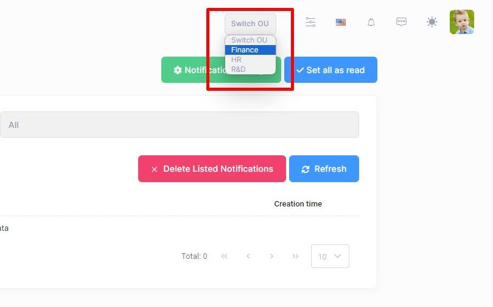

# Switching Between Organization Units

In most companies, a user belongs to more than one organization. Also, in some applications, we need to filter the data shown depending on the logged-in user's organization. For such scenarios, allowing users to select one of the organizations they belong to is a good practice.

For creating a custom data filter, you can check [https://aspnetboilerplate.com/Pages/Documents/Articles%5CHow-To%5Cadd-custom-data-filter-ef-core](https://aspnetboilerplate.com/Pages/Documents/Articles%5CHow-To%5Cadd-custom-data-filter-ef-core).

In order to allow users to change their active organization unit, we can design a UI like the one below;



By using this dropdown, a user can switch between organization units.

## Implementing Organization Unit Switching

In this section, we'll dive into the implementation details of enabling users to switch between different organizational units within an ASP.NET Zero project. 

### Creating Claims Principal for Organization Unit

In this section, we create this functionality by overriding the **CreateAsync** function within the `UserClaimsPrincipalFactory` class. This modification ensures that we can access the organizational unit information for logged-in users.

```csharp
public override async Task<ClaimsPrincipal> CreateAsync(User user)
{
    var userWithOrgUnits = await GetUserWithOrganizationUnitsAsync(user.Id);

    var claim = await base.CreateAsync(userWithOrgUnits);

    string organizationUnitsJson = JsonSerializer.Serialize(userWithOrgUnits.OrganizationUnits.First());

    claim.Identities.First().AddClaim(new Claim("Organization_Unit", organizationUnitsJson));

    return claim;
}
```

We are overwriting the **CreateAsync** method of `UserClaimsPrincipalFactory` to store user's selected organization unit in claims principal.

Within this context, we add the first element of the Organization Unit as a claim during user principal creation.

```csharp
private async Task<User> GetUserWithOrganizationUnitsAsync(long userId)
{
    return await UserManager.Users
        .Include(u => u.OrganizationUnits)
        .Where(x => x.Id == userId)
        .FirstOrDefaultAsync();
}
```

Private `GetUserWithOrganizationUnitsAsync` method retrieves a user with user's associated organization units from the database.

Now, we can use `Organization_Unit` claim as the currently selected organization unit for logged-in user and filter any data using its value.

### Modifying the Organization Unit in Session

Now, we must allow logged-in user to switch selected organization unit. To do that, we first need to add a new field to `AbpSession` by following this [document](https://aspnetboilerplate.com/Pages/Documents/Articles%5CHow-To%5Cadd-custom-session-field-aspnet-core).

```csharp
public class MyAppSession : ClaimsAbpSession, ITransientDependency
{
    private const string OrganizationUnitClaimTypeName = "Organization_Unit";
    private readonly UserManager _userManager;
    public MyAppSession(
        IPrincipalAccessor principalAccessor,
        IMultiTenancyConfig multiTenancy,
        ITenantResolver tenantResolver,
        IAmbientScopeProvider<SessionOverride> sessionOverrideScopeProvider,
        UserManager userManager) :
        base(principalAccessor, multiTenancy, tenantResolver, sessionOverrideScopeProvider)
    {
        _userManager = userManager;
    }

    public string OrganizationUnit => PrincipalAccessor.Principal?.Claims.FirstOrDefault(c => c.Type == OrganizationUnitClaimTypeName)?.Value;

    public async Task SwitchOrganizationUnitAsync(UserOrganizationUnit newUserOrganizationUnit)
    {
        var oldOrganizationUnit = JsonSerializer.Deserialize<UserOrganizationUnit>(OrganizationUnit);

        SetOrganizationUnit(newUserOrganizationUnit);

        await _userManager.RemoveFromOrganizationUnitAsync(oldOrganizationUnit.UserId, oldOrganizationUnit.OrganizationUnitId);
    }

    private void SetOrganizationUnit(string newOrganizationUnit)
    {
        var identity = PrincipalAccessor.Principal?.Identity as ClaimsIdentity;
        if (identity != null)
        {
            var oldOrganizationUnitClaim = identity.FindFirst(OrganizationUnitClaimTypeName);
            if (oldOrganizationUnitClaim != null)
            {
                identity.RemoveClaim(oldOrganizationUnitClaim);
            }

            identity.AddClaim(new Claim(OrganizationUnitClaimTypeName, newOrganizationUnit));
        }
    }
}
```

With these additions, the `MyAppSession` class now includes methods to both retrieve and set the organization unit information in the session. This enables management of organization unit data throughout the user's session.

### Usage Example: Switching Organization Units

In this section, we will demonstrate how to use a method for switching a user's organization unit within a new service class. The following example shows the `OrganizationUnitManager` class, which uses `MyAppSession` to allow a user to change currently selected organization unit.

```csharp
public class OrganizationUnitManager
{
    private readonly MyAppSession _myAppSession;
    private readonly UserManager _userManager;

    public OrganizationUnitManager(MyAppSession myAppSession, UserManager userManager)
    {
        _myAppSession = myAppSession;
        _userManager = userManager;
    }

    public async Task SwitchOrganizationUnitAsync(UserOrganizationUnit newUserOrganizationUnit)
    {
        var oldOrganizationUnit = JsonSerializer.Deserialize<UserOrganizationUnit>(_myAppSession.OrganizationUnit);

        _myAppSession.SetOrganizationUnit(newUserOrganizationUnit);

        if (oldOrganizationUnit != null)
        {
            await _userManager.RemoveFromOrganizationUnitAsync(oldOrganizationUnit.UserId, oldOrganizationUnit.OrganizationUnitId);
        }

        await _userManager.AddToOrganizationUnitAsync(newUserOrganizationUnit.UserId, newUserOrganizationUnit.OrganizationUnitId);
    }
}
```

#### Usage Steps

So, we completed the backend side to switch user's current organization unit in claims principal. So, let's see how we can use it from the client side.

1. **Fill the user's organization units**: As shown in the image above in the introcution section, we need to fill the user's organization units to a dropdown. To do this, you can use `_userManager.GetOrganizationUnitsAsync(user)` and map its result to a DTO class and return it to client and fill the dropdown using returned list.
2. **Retrieve the Current Organization Unit:** The oldOrganizationUnit is deserialized from the current session's OrganizationUnit claim. So, you can use this value to set selected value of the organization unit dropdown.
3. **Set the New Organization Unit:** On the change event of the dropdown, call an API endpoint (This is not explained above but you can use ProfileAppService and create a new method in this application service class) and this endpoint should call;

```csharp
public async Task ChangeOrganizationUnit(UserOrganizationUnit newUserOrganizationUnit){
    await _organizationUnitManager.SwitchOrganizationUnitAsync(newUserOrganizationUnit);
}
```

So, that's all and our app allows users to change their active organization unit on the UI.