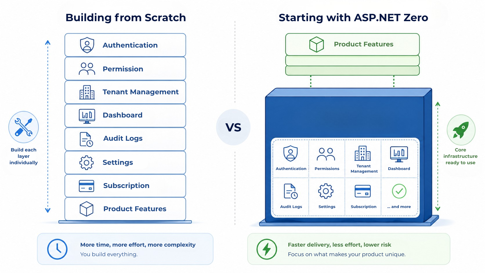
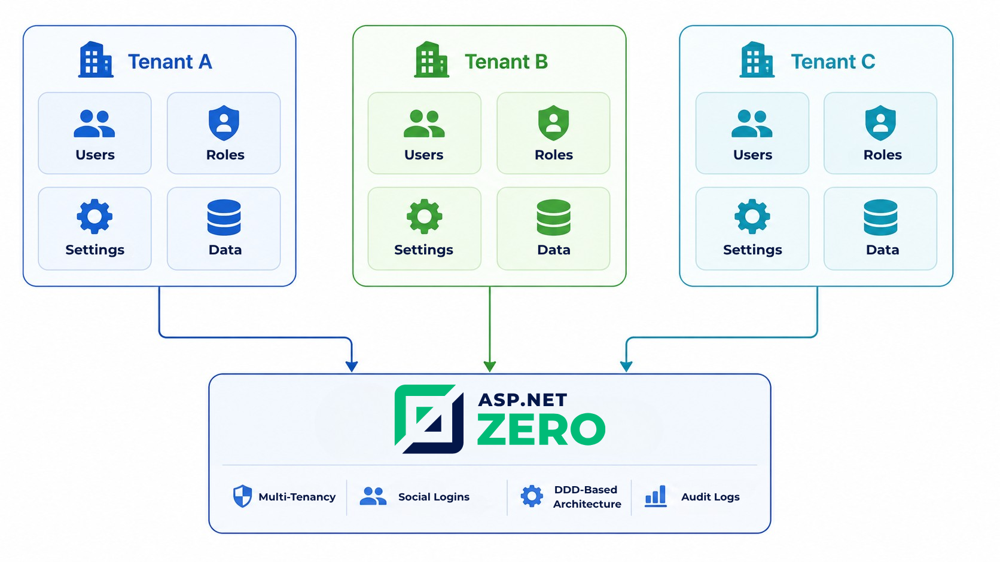
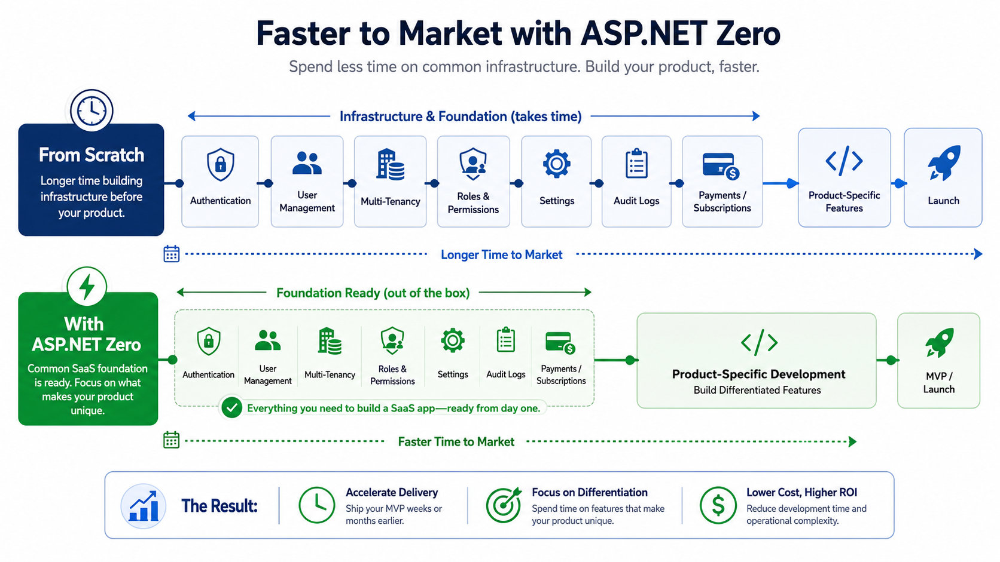
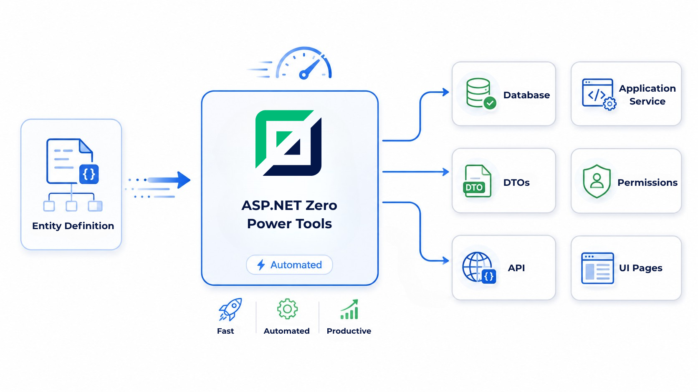
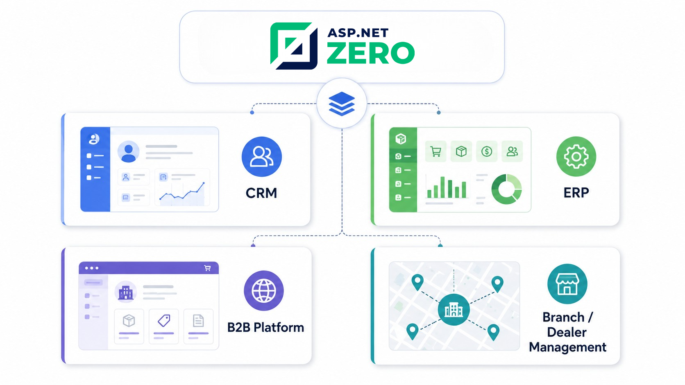

**Title:** Why ASP.NET Zero Is a Strong Starting Point for Building SaaS Products
**Description:** Learn how ASP.NET Zero helps startups and companies build SaaS products faster with built-in multi-tenancy, user management, permissions, audit logs, admin infrastructure, and Power Tools code generation.

# Why ASP.NET Zero Is a Strong Starting Point for Building SaaS Products

Building a SaaS product is rarely just about building the main product features.

At first, most teams focus on the visible parts of the application. If the product is a CRM, they think about lead management, customer profiles, sales pipelines, and reporting. If it is an ERP, they focus on modules such as inventory, purchasing, finance, and operations. If it is a B2B portal, they think about dashboards, workflows, customer access, and integrations.

But once development starts, another reality appears.

Before users can actually use the product, the team needs to build a large amount of foundational infrastructure:

* Login and registration
* User management
* Role and permission management
* Tenant management
* Dashboard
* Settings management
* Audit logs
* Email and notification structure
* API architecture
* Frontend and backend organization
* Data isolation between customers
* Subscription, package, or payment-related flows

These are not always the most exciting parts of a SaaS product. However, they are critical. They directly affect security, scalability, maintainability, and long-term product quality.

This is where ASP.NET Zero can become a strong starting point.

ASP.NET Zero is not a ready-made SaaS product. It does not build your CRM, ERP, customer portal, or marketplace automatically. Instead, it gives development teams a production-oriented application foundation so they can spend less time building generic infrastructure and more time building the features that make the product valuable.

## The Hidden Cost of Building SaaS Infrastructure from Scratch

Many companies underestimate how much time is spent on infrastructure before the first real business feature becomes usable.

For example, a startup planning to build a CRM may initially define features such as:

* Lead tracking
* Customer cards
* Sales activities
* Offer management
* Reports
* Team collaboration

But before these features can work properly, the product also needs a secure and manageable system behind them.

Who can access which customer records?

Can different companies use the same application without seeing each other’s data?

Can admins manage users and permissions?

Can the system keep logs of important actions?

Can different tenants have different settings?

Can emails be managed through templates?

Can the application scale as more customers join?

If all of these are built from zero, the MVP timeline can easily expand. What looks like a simple SaaS product may require months of foundational work before the team reaches the core product logic.

ASP.NET Zero helps reduce this initial infrastructure burden.

## ASP.NET Zero as a SaaS Foundation, Not a Finished Product

It is important to position ASP.NET Zero correctly.

ASP.NET Zero should not be seen as a finished SaaS product that only needs small edits. It is better understood as a strong technical foundation for building custom SaaS applications.

This distinction matters.

Every serious SaaS product has its own business logic. A CRM, an ERP, a B2B ordering platform, or a branch management system will each have different workflows, data models, user journeys, and reporting needs.

ASP.NET Zero does not remove the need for custom development. Instead, it helps the development team start from a more advanced point.

This can be especially useful for companies that want to launch an MVP faster, validate the product idea earlier, and avoid spending the first phase of development only on technical infrastructure.

## Built-in Multi-Tenancy for SaaS Products

Multi-tenancy is one of the most important concepts in SaaS architecture.

In a SaaS model, a single application often serves multiple customers, companies, branches, or organizations. Each customer expects their own data, users, roles, and settings to remain isolated.

For example:

* A CRM may serve multiple companies.
* An ERP system may serve different businesses from the same platform.
* A dealer management system may serve many dealers.
* A branch management system may support different locations under one structure.
* A B2B portal may provide separate access for each client company.

Building this structure from scratch requires careful design. The development team needs to think about data isolation, tenant-specific settings, user access, security rules, and administration flows.

ASP.NET Zero provides a multi-tenancy-ready foundation, making it easier to build applications where multiple customers or organizations can use the same software environment with separated data and management areas.

It allows SaaS teams to design products that are not limited to one company or one internal operation. The same application can be structured to serve many customers, making the product more scalable as a commercial software business.

## Faster MVP Development

One of the biggest advantages of using ASP.NET Zero is the ability to move faster toward an MVP.

An MVP should not mean a weak or poorly structured product. It should mean a focused first version that validates the core business idea with the minimum required scope.

However, many SaaS MVPs fail to launch quickly because teams spend too much time building generic infrastructure.

ASP.NET Zero can help reduce this problem.

With many foundational parts already available, the development team can focus earlier on the modules that directly create customer value.

For example:

In a CRM product, the team can focus on lead management, pipeline workflows, customer history, and reporting.

In an ERP product, the team can focus on inventory, purchasing, finance, and operational workflows.

In a B2B portal, the team can focus on customer-specific dashboards, order flows, document sharing, and approval processes.

In a branch or dealer management system, the team can focus on location-based access, performance tracking, communication, and reporting.

This can shorten the distance between idea and market validation.

## Faster Module Development with ASP.NET Zero Power Tools

ASP.NET Zero Power Tools helps teams speed up repetitive CRUD development by generating code from entity definitions.

In SaaS products, many modules follow similar patterns: customers, leads, products, orders, branches, employees, requests, or records. Building each one manually requires repeating entity setup, database structure, application services, DTOs, permissions, and UI pages.

Power Tools reduces this repetitive work and gives developers a faster starting point for standard data management features.

It does not replace custom business logic, workflows, integrations, or reporting. However, it helps teams spend less time on boilerplate code and more time on the features that create real product value.

## Better Starting Point for Custom Business Applications

ASP.NET Zero can be especially useful for companies building custom B2B software.

Some common use cases include:

### CRM Systems

A CRM needs users, roles, customer records, activity tracking, dashboards, reporting, and often multi-company support.

ASP.NET Zero provides a strong base for the administrative and security side, allowing the team to focus on CRM-specific workflows.

### ERP Systems

ERP products usually require complex permissions, multiple modules, auditability, settings, and structured administration.

Starting from a mature application foundation can reduce the amount of repetitive setup work.

### Customer Portals

Customer portals often need secure login, customer-specific data access, document sharing, notifications, and role-based permissions.

ASP.NET Zero can support the foundation needed to build these portal experiences.

### B2B SaaS Platforms

B2B SaaS platforms need a strong backend structure, tenant management, user control, and scalable application architecture.

ASP.NET Zero can help teams avoid starting from an empty project and instead begin with a more complete technical base.

### Branch and Dealer Management Systems

Branch and dealer systems often require multi-tenant or multi-organization structures, role-based access, reporting, and administrative control.

ASP.NET Zero’s foundation is well aligned with these requirements.

## Time and Cost Impact

Building SaaS infrastructure from scratch does not only increase development time. It also increases cost and project risk.

Every custom-built infrastructure module requires:

* Analysis
* Development
* Testing
* Security review
* Bug fixing
* Maintenance
* Documentation
* Future improvements

When a team builds everything manually, they are not only paying for initial development. They are also taking responsibility for maintaining all of those foundational systems over time.

ASP.NET Zero can reduce this burden by providing many common application components from the start.

This does not eliminate development cost. Custom business logic, UI requirements, integrations, reporting, workflows, and product-specific modules still need to be designed and built.

However, it can help reduce the amount of time spent on repetitive infrastructure work.

## Why This Matters for Non-Technical Founders

For non-technical founders and business owners, the value of ASP.NET Zero may not be immediately obvious.

It is not simply about having ready-made technical modules.

The real value is that the development team can start with a stronger foundation instead of spending the early stages of the project on invisible infrastructure.

This means:

* Faster MVP planning
* Less duplicated development work
* More focus on business features
* Better structure for future growth
* A more professional starting point
* Reduced technical uncertainty in the first phase

For a founder, this can directly affect budget, launch timeline, and product validation speed.

## Conclusion

Building a SaaS product is not only about developing the features users see. A significant part of the work is hidden in the infrastructure: authentication, authorization, tenant management, user roles, admin panels, audit logs, settings, email structure, and scalable architecture.

ASP.NET Zero gives teams a strong foundation for these common requirements, helping them avoid rebuilding the same infrastructure from scratch.

It is not a finished SaaS product, but for SaaS ideas, B2B platforms, CRM systems, ERP systems, customer portals, and branch or dealer management solutions, it can be a strong starting point for building faster and more predictably.

## Let’s Design Your SaaS Architecture

If you are planning to build a SaaS product, CRM, ERP, customer portal, or B2B platform, the first step is choosing the right technical foundation.

Explore ASP.NET Zero pricing and choose the right plan for your SaaS product.

[View Pricing](https://aspnetzero.com/pricing)
