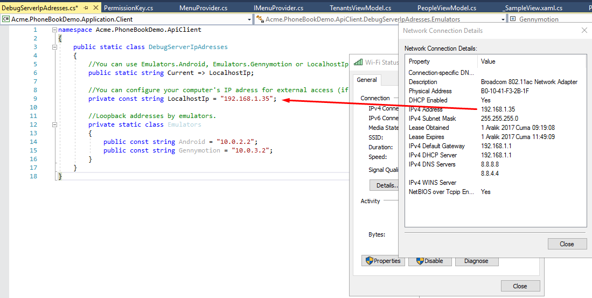
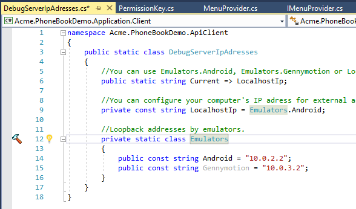
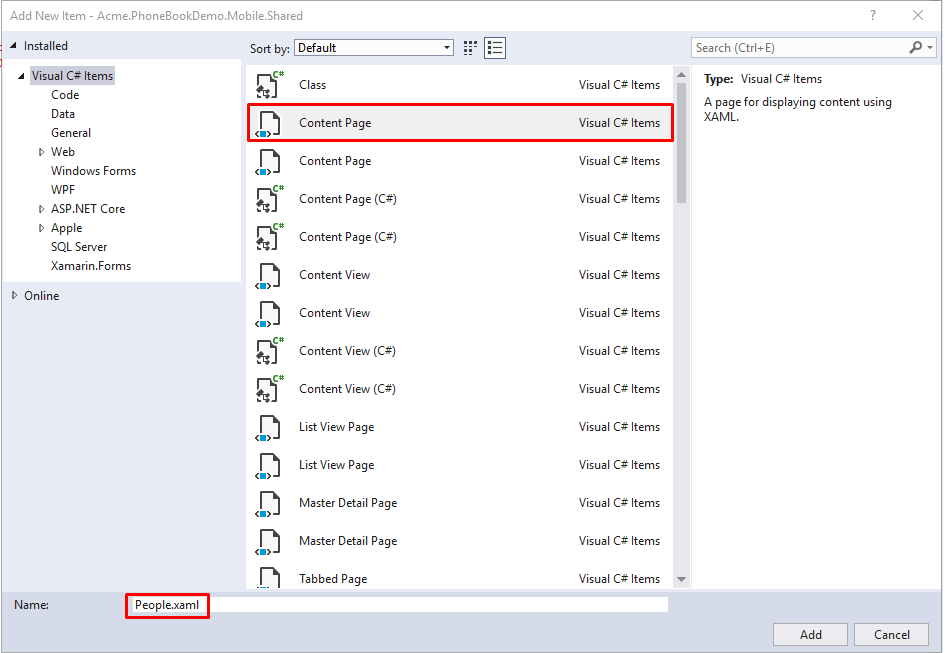
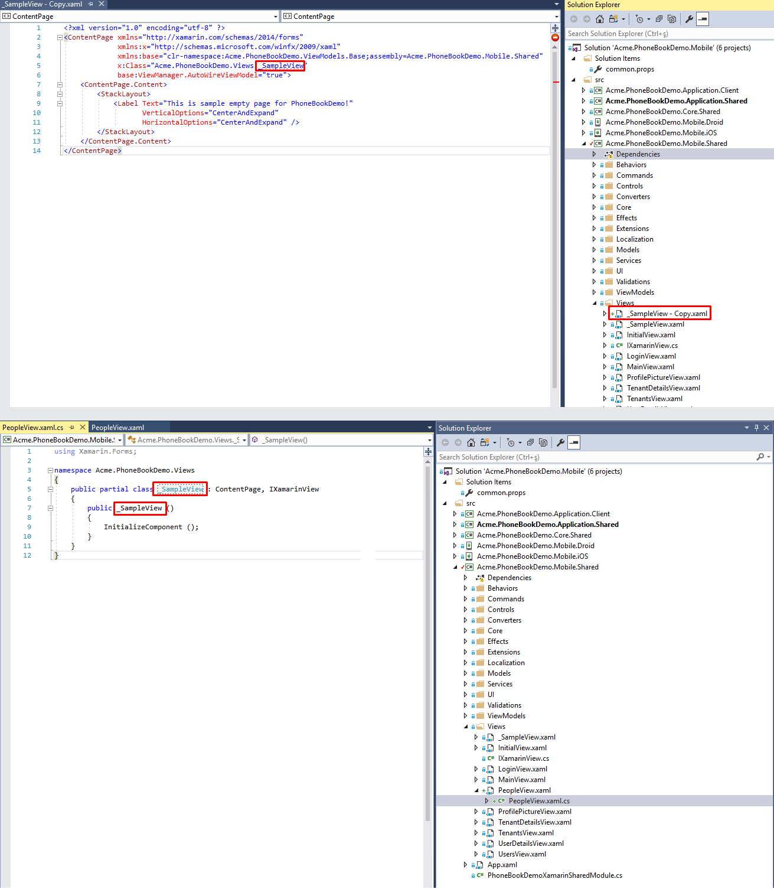
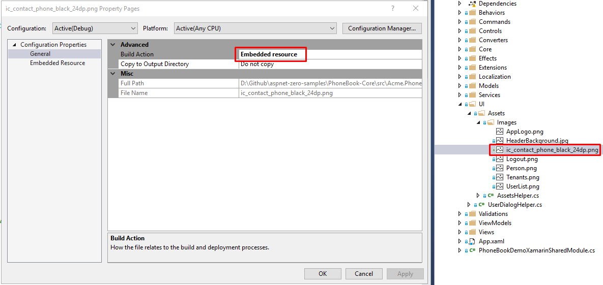
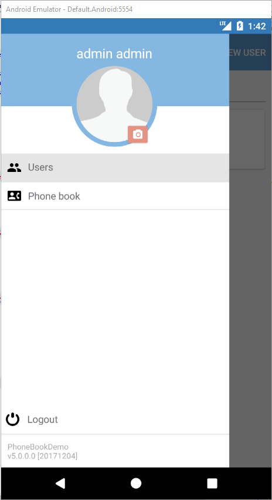

### Introduction

In this document, we will create a sample **Xamarin phonebook application** step by step integrated with ASP.NET Zero website. Be aware that only ASP.NET Core version is supported.

### Downloading Phonebook-Core Sample

In the [Developing Step By Step Phonebook](Developing-Step-By-Step-Core) documentation we've already completed how to create a phonebook on server side and web client. To resume this project, download the solution [Acme.PhoneBookDemo](https://github.com/aspnetzero/aspnet-zero-samples/tree/master/PhoneBook-Core) and open the **Acme.PhoneBookDemo.Mobile.sln** file.

### Configuring Host Address



If you are using an emulator, you can use the **emulator's loopback address** to reach your local computer. Eg: for Android emulator, it's **10.0.2.2**



### Creating Phonebook Application Service Proxy

To consume server API methods, we need to implement the **IPersonAppService** application service over HTTP transmission. Create a new folder called **PhoneBook** in
**Acme.PhoneBookDemo.Application.Client** project.

Then create a new class called **ProxyPersonAppService** in the **PhoneBook** folder. Derive ProxyPersonAppService from **ProxyAppServiceBase**, **IPersonAppService** interface. Visual Studio will
help us to add all unimplemented methods from IPersonAppService at once.

Add **async** keyword to all methods to be able to benefit from multi-tasking.


#### Implementing App Service Methods

In the ProxyAppServiceBase class you'll see *ApiClient*, which is being
used to call host web API methods. We'll use *ApiClient* to transfer
data with host.

ApiClient has **post, put, get, delete** HTTP methods. To decide which needs to be called for the corresponding method you can read [ASP.NET Boilerplate Application Services as Controllers](https://aspnetboilerplate.com/Pages/Documents/AspNet-Core#application-services-as-controllers).

To summarize that document: ASP.NET Boilerplate framework uses
**ConventionalHttpVerbs** by default. This means there's a naming
convention while implementing app service methods.
When method name starts with:

-   **Get** =&gt; ApiClient.GetAsync&lt;T&gt;(...);
-   **Put or Update** =&gt; ApiClient.PutAsync&lt;T&gt;(...);
-   **Delete or Remove** =&gt; ApiClient.DeleteAsync&lt;T&gt;(...);
-   **Post, Create or Insert** =&gt; ApiClient.PostAync&lt;T&gt;();
-   **If none of the above** =&gt; Post is used as default.

Based on the above information, we will implement the methods. The first
method is **GetPeople**, it starts with **Get** prefix, so we have to
use *ApiClient.GetAsync(...)* method.

**GetEndPoint(...)** adds the method name as a segment for the target
host web API url.
You have to pass the name of the application service method to GetEndPoint():

    public async Task<ListResultDto<PersonListDto>> GetPeople(GetPeopleInput input)
    {
        return await ApiClient.GetAsync<ListResultDto<PersonListDto>>(GetEndpoint(nameof(GetPeople)), input);
    }

Do the same for other methods.
The final view of **ProxyPersonAppService** class should be
like this:

    public class ProxyPersonAppService : ProxyAppServiceBase, IPersonAppService
    {
        public async Task<ListResultDto<PersonListDto>> GetPeople(GetPeopleInput input)
        {
            return await ApiClient.GetAsync<ListResultDto<PersonListDto>>(GetEndpoint(nameof(GetPeople)), input);
        }

        public async Task CreatePerson(CreatePersonInput input)
        {
            await ApiClient.PostAync(GetEndpoint(nameof(CreatePerson)), input);
        }

        public async Task DeletePerson(EntityDto input)
        {
            await ApiClient.DeleteAsync(GetEndpoint(nameof(DeletePerson)), input);
        }

        public async Task DeletePhone(EntityDto<long> input)
        {
            await ApiClient.DeleteAsync(GetEndpoint(nameof(DeletePhone)), input);
        }

        public async Task<PhoneInPersonListDto> AddPhone(AddPhoneInput input)
        {
            return await ApiClient.PostAync<PhoneInPersonListDto>(GetEndpoint(nameof(AddPhone)), input);
        }

        public async Task EditPerson(EditPersonInput input)
        {
            await ApiClient.PostAync(GetEndpoint(nameof(EditPerson)), input);
        }

        public async Task<GetPersonForEditOutput> GetPersonForEdit(IEntityDto input)
        {
            return await ApiClient.GetAsync<GetPersonForEditOutput>(GetEndpoint(nameof(GetPersonForEdit)), input);
        }
    }

When we complete the communication phase with the host service, we can
start to create person and person detail view for mobile.

Note that "**Page**" and "**View**" words are used for same meaning and
purpose to refer to **XAML** files.

Firstly we'll create view, then view-model. But it's up to you which
side you start. Let's create **PeopleView.xaml**.

### Creating People Page

#### Creating PeopleView

PeopleView is going to list all the persons. When we tap one of the
person, we'll navigate to person details. The person details page will
contain personal information and phone numbers of person. In **Acme.PhoneBookDemo.Mobile.Shared** project, there's **Views**
folder. All the pages must be located in **Views** folder. You can create a new empty **Content Page** as below, but in this example
we'll copy and paste **\_SampleView.xaml** file.


Copy and paste **\_SampleView.xaml** into the same folder. We'll rename
the file. All the views <span class="underline">must</span> end with
**"<span class="underline">View</span>"** postfix. This is mandatory for
auto matching related view-model. So rename **\_SampleView - Copy.xaml** to **PeopleView.xaml**.

After copy/paste, you have to rename the following for **PeopleView.xaml** as well:
-   **The class name in xaml:** x:Class="Acme.PhoneBookDemo.Views.\_SampleView" **>** x:Class="Acme.PhoneBookDemo.Views.PeopleView"
-   **The class name in xaml.cs:** public partial class \_SampleView **>** public partial class PeopleView
-   **The constructor of xaml.cs:** public \_SampleView() **>** public PeopleView()



We have created an empty view. To control this view, we have to create
view-model for this view. Next step is creating view-model of
PeopleView.xaml.

#### Creating PeopleViewModel

ASP.NET Zero Xamarin app uses
[MVVM](https://developer.xamarin.com/guides/xamarin-forms/enterprise-application-patterns/mvvm/)
pattern. So each view should have a view-model. According to
conventional view-model binding, view-model file names <span
class="underline">must</span> end with **"<span
class="underline">ViewModel</span>"** postfix.

So the view-model name for *PeopleView* must be **PeopleViewModel**. All
view-models <span class="underline">must</span> be located in
**ViewModels** folder.

You can create a new class called **PeopleViewModel** in **ViewModels**
folder. But as we did for the view, we'll use the empty template
view-model called **\_SampleViewModel.cs**.

Copy and paste **\_SampleViewModel.cs** and rename the following:

-   **The view-model filename:** \_SampleViewModel - Copy.cs **>** PeopleViewModel.cs
-   **The constructor of view-model:** public class \_SampleViewModel : XamarinViewModel **>** public class PeopleViewModel : XamarinViewModel

Thus far we have implemented the proxy class for *PersonAppService*,
created *People* view and created view-model *PeopleViewModel*.

To be able to see the new view in the app, there's one more thing to
do: adding this page to the navigation menu.

#### Adding People Page to Navigation Menu

To add a new menu item, open **MenuProvider** class in
**Acme.PhoneBookDemo.Mobile.Shared** project. The navigation menu items
are stored in a
[ObservableRangeCollection](https://developer.xamarin.com/api/type/System.Collections.ObjectModel.ObservableCollection%601/).
This is for notifying view whenever an item changes in the collection.

Add the new *NavigationMenuItem* in the list like below:

    public class MenuProvider : ISingletonDependency, IMenuProvider
    {
        private readonly ObservableRangeCollection<NavigationMenuItem> _menuItems = new ObservableRangeCollection<NavigationMenuItem>
        {
            new NavigationMenuItem
            {
                Title = L.Localize("Tenants"),
                Icon = "Tenants.png",
                ViewType = typeof(TenantsView),
                RequiredPermissionName = PermissionKey.Tenants,
            },
            new NavigationMenuItem
            {
                Title = L.Localize("Users"),
                Icon = "UserList.png",
                ViewType = typeof(UsersView),
                RequiredPermissionName = PermissionKey.Users,
            },
            new NavigationMenuItem
            {
                Title = L.Localize("PhoneBook"),
                Icon = "ic_contact_phone_black_24dp.png",
                ViewType = typeof(PeopleView),
                RequiredPermissionName = PermissionKey.Phonebook
            }
            ...
        }
    }

Let's set the properties of the new *NavigationMenuItem*:

1.  **Title:** It's already localized in the [Developing Step By Step
    Phonebook](Developing-Step-By-Step-Core.html). We just
    set localization key with this shortcut: **L.Localize("PhoneBook")**. And it localizes the menu text.
2.  **Icon:** Download a related png icon file. For this example, go to
    <https://material.io/icons/#ic_contact_phone> and download PNGS.
    Then extract the downloaded zip file. In the zip file, you can use *ic\_contact\_phone\_black\_24dp\\android\\drawable-xxhdpi\\ic\_contact\_phone\_black\_24dp.png*
    as the icon. Copy and paste the file into **UI\\Assets\\Images** folder in the
    **Acme.PhoneBookDemo.Mobile.Shared** project.  
    Right-click the png file and go to properties. In the
    **Advanced** section, set **Build Action** as **Embedded resource**.  
    This is mandatory! This will help to share the icon file across
    platforms.  
    Now set Icon property of *NavigationMenuItem* to
    **"ic\_contact\_phone\_black\_24dp.png"**:  
    

1.  **ViewType:** Must be the class name of the view in the **View**
    folder. The view name is *PeopleView*, so let's set view type to
    **typeof(PeopleView)**.
2.  **RequiredPermissionName:** A permission key has to be assigned to be
    able to show/hide the new menu according to the user's permission.
    In the previous document, it's already declared in "[Define the
    permission](https://www.aspnetzero.com/Documents/Developing-Step-By-Step-Core#define-the-permission)"
    section as "**Pages.Tenant.PhoneBook**". We need to use the same
    string for permission key. So what you have to do is add the below
    line to **PermissionKey** class like below:  

    ```c#
    public const string Phonebook = "Pages.Tenant.PhoneBook";
    ```

Let's run the application to see the new menu item.

In this example, we'll use Android platform to test the sample. Hence, set the startup
project to **Acme.PhoneBookDemo.Mobile.Droid**.

If you've already started Android emulator, you can directly run the
project. But if you've not started the emulator yet, it's advised to start the emulator first from the Visual Studio Toolbar as shown
below. The reason of initializing emulator is: sometimes Visual Studio
cannot make initial connection to the emulator for the first run. So
it's better to run it and wait until it starts up successfully. When you
see the emulator home screen, you can run the project (F5).


You will see a splash screen while initializing. After that you'll see
the app login page. The PhoneBook is defined on tenant side. You have to
switch to a tenant to see the PhoneBook menu item. On the top-right of
the screen, there's a toolbar button called **Change Tenant**. Tap that
button and enter **default** into the textbox. If the tenant **default** is available, you will see **"Current Tenant: default"**
label. If the tenant is not active or does not exist, then you'll get an
alert about that.


Enter your credentials and tap **Log In** button. If you see an alert
says "*You must change your password before logging on!*" you need to
login and change your password for the first time on the website.
(Currently Xamarin app doesn't have password change screen and will be
added in the next releases.)

When you successfully login, you can see the below screen with new
**Phone book** menu item.



Up to here we successfully added an empty People page. Let's populate
the view with data.

#### Populating People View with Data

The first function is listing people in PeopleView. To list repeating
items we use
[ListView](https://developer.xamarin.com/guides/xamarin-forms/user-interface/listview/).
Open **PeopleView.xaml** and set title of the view:

##### Setting Page Title

Add title tag and namespace into **ContentPage** tag like below:  

    <ContentPage
     ...
     xmlns:extensions="clr-namespace:Acme.PhoneBookDemo.Extensions.MarkupExtensions;assembly=Acme.PhoneBookDemo.Mobile.Shared"
     Title="{extensions:Translate PhoneBook}"
     ...>

##### Adding ListView Item

There's a placeholder label in **&lt;ContentPage.Content&gt;** tag.
Remove that Label and add the below ListView definition in
**ContentPage.Content** tag. In the below code, we populate the
Listview with **Persons** data. So in the view-model we need a public property **Persons**. Persons property must be IEnumerable and contain
**FullName** and **EmailAddress** string properties. All properties that
will be binded to view must be public.
[HasUnevenRows](https://developer.xamarin.com/api/property/Xamarin.Forms.ListView.HasUnevenRows/)
property automatically sizes list view rows for content. The main reason
we used **TextCell** in DataTemplate is performance. Xamarin docs say
**[<span style="font-weight: 400">Use the built-in cells (like TextCell
/ SwitchCell) instead of ViewCell whenever you
can</span>](https://developer.xamarin.com/guides/xamarin-forms/user-interface/listview/performance/#Improving_ListView_Performance)**.

    <ContentPage.Content>
        <ListView HasUnevenRows="True"
                  SeparatorVisibility="None"
                  ItemsSource="{Binding Persons}"
                  SelectedItem="{Binding SelectedPerson, Mode=TwoWay}">
            <ListView.ItemTemplate>
                <DataTemplate>
                    <TextCell Text="{Binding FullName}" Detail="{Binding EmailAddress}" />
                </DataTemplate>
            </ListView.ItemTemplate>
        </ListView>
    </ContentPage.Content>

Persons data needs to be binded in appearing event of page. To achieve
this we add a behavior to the page. Add the below code into the
ContentPage tag in **PeopleView.xaml**. This behaviour will execute
**PageAppearingCommand** in view-model. PageAppearingCommand will fetch
data from server. For the best user experience and smooth navigation,
it's better to start long-lasting operations after you show the view.
Never wait the main. Do not run blocking procedures in constructor.

    <?xml version="1.0" encoding="utf-8" ?>
    <ContentPage ...
        xmlns:behaviors="clr-namespace:Acme.PhoneBookDemo.Behaviors;assembly=Acme.PhoneBookDemo.Mobile.Shared"
     ...>

        <ContentPage.Content>
            <ListView HasUnevenRows="True"
                      SeparatorVisibility="None"
                      ItemsSource="{Binding Persons}"
                      SelectedItem="{Binding SelectedPerson, Mode=TwoWay}">
                <ListView.ItemTemplate>
                    <DataTemplate>
                        <TextCell Text="{Binding FullName}" Detail="{Binding EmailAddress}" />
                    </DataTemplate>
                </ListView.ItemTemplate>
            </ListView>
        </ContentPage.Content>

        <ContentPage.Behaviors>
            <behaviors:EventHandlerBehavior EventName="Appearing">
                <behaviors:InvokeCommandAction Command="{Binding PageAppearingCommand}" />
            </behaviors:EventHandlerBehavior>
        </ContentPage.Behaviors>

    </ContentPage>

The final look of **PeopleView.xaml** is like below:

    <ContentPage xmlns="http://xamarin.com/schemas/2014/forms"
                 xmlns:x="http://schemas.microsoft.com/winfx/2009/xaml"
                 x:Name="PeoplePage"
                 xmlns:base="clr-namespace:Acme.PhoneBookDemo.ViewModels.Base;assembly=Acme.PhoneBookDemo.Mobile.Shared"
                 xmlns:behaviors="clr-namespace:Acme.PhoneBookDeehaviors;assembly=Acme.PhoneBookDemo.Mobile.Shared"
                 xmlns:extensions="clr-namespace:Acme.PhoneBookDemo.Extensions.MarkupExtensions;assembly=Acme.PhoneBookDemo.Mobile.Shared"
                 x:Class="Acme.PhoneBookDemo.Views.PeopleView"
                 Title="{extensions:Translate PhoneBook}"
                 base:ViewManager.AutoWireViewModel="true">

        <ContentPage.Content>
            <StackLayout>
                <ListView HasUnevenRows="True"
                          SeparatorVisibility="None"
                          ItemsSource="{Binding Persons}"
                          SelectedItem="{Binding SelectedPerson, Mode=TwoWay}">
                    <ListView.ItemTemplate>
                        <DataTemplate>
                            <TextCell Text="{Binding FullName}" Detail="{Binding EmailAddress}" />
                        </DataTemplate>
                    </ListView.ItemTemplate>
                </ListView>
            </StackLayout>
        </ContentPage.Content>

        <ContentPage.Behaviors>
            <behaviors:EventHandlerBehavior EventName="Appearing">
                <behaviors:InvokeCommandAction Command="{Binding PageAppearingCommand}" />
            </behaviors:EventHandlerBehavior>
        </ContentPage.Behaviors>

    </ContentPage>

##### Creating People View-Model

In the **PeopleView** we have used Persons as items source of ListView.
So **PeopleViewModel** class needs to have a property called **Persons**
and a command called **PageAppearingCommand**.

The **ProxyPersonAppService GetPeople** method returns
**ListResultDto&lt;PersonListDto&gt;**. It is not convenient to directly
use the DTO object from server. The main reason is DTO doesn't implement
**INotifyPropertyChanged** interface. To overcome this issue, we create
a new mapping class. This mapping class is used and named as Model.
Additional advantage of this model class is, you can add extra
properties to use in your view. For example, you can add FullName that
combines name and surname. This increases app performance by rendering
less elements. So let's define the **PersonListModel** class. Create a
new folder called **Models/PhoneBook** in
**Acme.PhoneBookDemo.Mobile.Shared** project. Add a new class
**PersonListModel.cs** into **Models/PhoneBook** folder. To not add all
properties from the **PersonListDto** class, inherit the model class
from **PersonListDto** . We need a full name in view, that's why we add a
new property called **FullName** that joins *Name* and *Surname*.
Additionally, add a **\[AutoMapFrom(typeof(PersonListDto))\]** attribute
to map *PersonListDto* to *PersonListModel*. Then add **Phones**
property with type
**ObservableRangeCollection&lt;PhoneInPersonListDto&gt;**. As there's already
Phones property in PersonListDto, add **new** keyword to the property.
The complete definition of **PersonListModel** is like below:

    [AutoMapFrom(typeof(PersonListDto))]
    public class PersonListModel : PersonListDto, INotifyPropertyChanged
    {
        public string FullName => Name + " " + Surname;

        public new ObservableRangeCollection<PhoneInPersonListDto> Phones { get; set; }

        public event PropertyChangedEventHandler PropertyChanged;

        [NotifyPropertyChangedInvocator]
        protected virtual void OnPropertyChanged([CallerMemberName] string propertyName = null)
        {
            PropertyChanged?.Invoke(this, new PropertyChangedEventArgs(propertyName));
        }
    }

##### Listing People

Open **PeopleViewModel** class. We'll retrieve data from
**ProxyPersonAppService**. The interface of ProxyPersonAppService is
**IPersonAppService**. We use constructor injection to resolve
**IPersonAppService**. Create a new async method called
**FetchDataAsync** with *FilterText* parameter. Later we'll use
*FilterText* for searching people. Try to add postfix *Async* to async
method names. To show an indicator while we are retrieving data from
server, there's a method in view-model's base class called
**SetBusyAsync**. You can wrap your method with **SetBusyAsync** to show
an indicator that a background job is going on. You can create an async
command by using **HttpRequestCommand.Create()**. This is a shortcut
extension to create an async command. The final look of
**PeopleViewModel.cs** is like below:

    public class PeopleViewModel : XamarinViewModel
    {
        public ICommand PageAppearingCommand => HttpRequestCommand.Create(PageAppearingAsync);
        private readonly IPersonAppService _personAppService;
        private ObservableRangeCollection<PersonListModel> _persons = new ObservableRangeCollection<PersonListModel>();

        public PeopleViewModel(IPersonAppService personAppService)
        {
            _personAppService = personAppService;
        }

        public ObservableRangeCollection<PersonListModel> Persons
        {
            get => _persons;
            set
            {
                _persons = value;
                RaisePropertyChanged(() => Persons);
            }
        }

        public async Task PageAppearingAsync()
        {
            await FetchDataAsync();
        }

        public async Task FetchDataAsync(string filterText = null)
        {
            await SetBusyAsync(async () =>
            {
                var result = await _personAppService.GetPeople(new GetPeopleInput
                {
                    Filter = filterText
                });

           var personListModels = ObjectMapper.Map<IEnumerable<PersonListModel>>(result.Items);
                Persons.ReplaceRange(personListModels);
            });
        }
    }

When you run the app, you'll see the below screen. (You may see no data
if you've not inserted data in database. The listed data is already
inserted to database.)


##### Searching People

To search and filter people we'll use
[SearchBar](https://developer.xamarin.com/api/type/Xamarin.Forms.SearchBar/),
which is Xamarin built-in control that provides a search textbox. Open **PeopleView.xaml** and add the **SearchBar** before the ListView control. We'll bind **FilterText** property to the SearchBar. If
**FilterText** changes, it'll start to filter from server.

    <?xml version="1.0" encoding="utf-8" ?>
    <ContentPage ...>
        ...
        <ContentPage.Content>
            <StackLayout>
                <SearchBar Text="{Binding FilterText}" Placeholder="{extensions:Translate SearchWithThreeDot}"/>
                <ListView HasUnevenRows="True"
                          ItemsSource="{Binding Persons}"
                          SelectedItem="{Binding SelectedPerson, Mode=TwoWay}">
                    <ListView.ItemTemplate>
                        <DataTemplate>
                            <TextCell Text="{Binding FullName}" Detail="{Binding EmailAddress}" />
                        </DataTemplate>
                    </ListView.ItemTemplate>
                </ListView>
            </StackLayout>
        </ContentPage.Content>
    ...
    </ContentPage>

Now open **PeopleViewModel.cs** and add the below code. In setter of
**FilterText** property, we execute **SearchWithDelayAsync()** method.
As we cannot run async method in property setter, we use **AsyncRunner**
to make it sync. In **SearchWithDelayAsync** method, Task.Delay is used
to wait for new key press. If user changes the filter text
within the delay duration, then fetching will stop for new key press.
We've specified the delay in **PageDefaults.SearchDelayMilliseconds** as
1 second. If no new keypress in 1 second, it'll start to search.

    private string _filterText;

    public string FilterText
    {
        get => _filterText;
        set
        {
            _filterText = value;
            AsyncRunner.Run(SearchWithDelayAsync(_filterText));
        }
    }

    private async Task SearchWithDelayAsync(string filterText)
    {
        if (!string.IsNullOrEmpty(filterText))
        {
            await Task.Delay(PageDefaults.SearchDelayMilliseconds);
            if (filterText != _filterText)
            {
                return;
            }
        }

        await FetchDataAsync(filterText);
    }

Final look of the filtered list view is like below:


### Creating Person Details Page

Person details page will show personal information and phone numbers of
selected person. We will be editing personal information, adding and
removing phone numbers of the person. Also we'll use the same page for
creating new person and deleting existing person. To be able to navigate
to this page, user will tap on a person in the PeopleView.  
We'll first create view, then view-model of the page. Let's start with
creating the **PersonDetailsView.xaml**.

#### Creating Person Details View

Basically, we'll do the same steps as we did for **PeopleView** page.

-   Copy/paste **\_SampleView.xaml** and rename the file as
    **PersonDetailsView.xaml**.
-   Open **PersonDetailsView.xaml** and replace all **\_SampleView** to
    **PersonDetailsView**.
-   Delete the **&lt;Label&gt;** in **PeopleDetails.xaml**.
-   Go to code behind (***<span
    style="font-weight: 400">PersonDetailsView.xaml.cs</span>***) and
    rename all **\_SampleView** to **PersonDetailsView**.

Now we have an empty view. Let's put controls inside the
**PersonDetailsView.xaml**.

##### Creating Personal Information Section

The view will have 2 main sections. Personal information on the top and phone numbers on the bottom. Let's create personal information section!

-   Add highlighted rows to **ContentPage** tag.

    -   **xmlns:extensions**: To use *Translate* extension.
    -   **xmlns:controls**: To use *CardView* control.
    -   **x:Name**: To use as reference.
    -   **Title**: To show a page title. It'll dynamically change. For
        new person creation, we'll write "Create New Person", for
        existing person edit we'll write the name of person here.

    <!-- -->

        <?xml version="1.0" encoding="utf-8" ?>
        <ContentPage xmlns="http://xamarin.com/schemas/2014/forms"
                     xmlns:x="http://schemas.microsoft.com/winfx/2009/xaml"
                     xmlns:base="clr-namespace:Acme.PhoneBookDemo.ViewModels.Base;assembly=Acme.PhoneBookDemo.Mobile.Shared"
                     x:Class="Acme.PhoneBookDemo.Views.PersonDetailsView"
                     base:ViewManager.AutoWireViewModel="true"
                     xmlns:extensions="clr-namespace:Acme.PhoneBookDemo.Extensions.MarkupExtensions;assembly=Acme.PhoneBookDemo.Mobile.Shared"
                     xmlns:controls="clr-namespace:Acme.PhoneBookDemo.Controls;assembly=Acme.PhoneBookDemo.Mobile.Shared"
                     x:Name="PersonDetailsPage"
                     Title="{Binding Title}">
            <ContentPage.Content>
               ...
            </ContentPage.Content>
        </ContentPage>

-   Then add the **ListView** as root item in
    **&lt;ContentPage.Content&gt;** as shown below:
	<!-- -->

````xml
<?xml version="1.0" encoding="utf-8" ?>
<ContentPage xmlns="http://xamarin.com/schemas/2014/forms"
             xmlns:x="http://schemas.microsoft.com/winfx/2009/xaml"
             xmlns:base="clr-namespace:Acme.PhoneBookDemo.ViewModels.Base;assembly=Acme.PhoneBookDemo.Mobile.Shared"
             x:Class="Acme.PhoneBookDemo.Views.PersonDetailsView"
             base:ViewManager.AutoWireViewModel="true"
             xmlns:extensions="clr-namespace:Acme.PhoneBookDemo.Extensions.MarkupExtensions;assembly=Acme.PhoneBookDemo.Mobile.Shared"
             xmlns:controls="clr-namespace:Acme.PhoneBookDemo.Controls;assembly=Acme.PhoneBookDemo.Mobile.Shared"
             x:Name="PersonDetailsPage"
             Title="{Binding Title}">
    <ContentPage.Content>
        <ListView HasUnevenRows="True">
            <ListView.Header>

                    <controls:CardView Margin="0,10" >
                        <StackLayout Padding="10" Spacing="0" >
                            <controls:LabelSection Text="{extensions:Translate PersonalInformations}"/>
                            <controls:Divider Margin="0,0,0,5"/>

                            <Label Text="{extensions:Translate Name}"></Label>
                            <Entry Text="{Binding Model.Name, Mode=TwoWay}"/>

                            <Label Text="{extensions:Translate Surname}"></Label>
                            <Entry Text="{Binding Model.Surname, Mode=TwoWay}"/>

                            <Label Text="{extensions:Translate EmailAddress}"></Label>
                            <Entry Text="{Binding Model.EmailAddress, Mode=TwoWay}" Margin="0,0,0,10"/>

                            <!-- SAVE BUTTON -->
                            <Button Margin="{StaticResource ActionButtonMargin}"
                                    Style="{StaticResource ActionButton}"
                                    Text="{extensions:Translate Save}"
                                    Command="{Binding SavePersonCommand}"/>

                        </StackLayout>
                    </controls:CardView>

            </ListView.Header>
        </ListView>
    </ContentPage.Content>
</ContentPage>
````

ListView works best when it's the root element (otherwise you may have
scrolling issues). That's why we put ListView in the first place.
ListView consists of 3 parts: Header, Items, Footer. We'll use
header to show personal information and items to list phone numbers.
Footer will not be used.

We set ListView
**[HasUnevenRows="True"](https://developer.xamarin.com/api/property/Xamarin.Forms.ListView.HasUnevenRows/)**.
This is for automatically sizing list view rows.

In the **ListView.Header** tag, we place a **CardView**. This is a
custom control that draws a border to highlight section.  
**LabelSection** is another custom control that shows label
as a title.  
**Divider** is a custom control as well that draws a horizontal line.

In **CardView,** add a **&lt;StackLayout&gt;** to show elements
vertically. Put labels, entries for **Name**, **Surname** and
**EmailAddress** fields. All the entries are
[TwoWay](https://docs.microsoft.com/en-us/xamarin/xamarin-forms/app-fundamentals/data-binding/binding-mode#two-way-bindings) binding, because we propagate value in both directions.  

ListView control seems to be an easy but complicated control. We recommend to use ListView in these circumstances:

-   Try to use ListView as root item of the Page.
-   Do not use nested ListViews (ListView in ListView).
-   Use
    [TextCell](https://developer.xamarin.com/api/type/Xamarin.Forms.TextCell/)
    and
    [SwitchCell](https://developer.xamarin.com/api/type/Xamarin.Forms.SwitchCell/)
    wherever you can.
-   Avoid placing a ListView inside a [ScrollView](https://developer.xamarin.com/guides/xamarin-forms/user-interface/layouts/scroll-view/).

#### Creating PersonDetailsViewModel

The view-model name for PersonDetailsView must be
**PersonDetailsViewModel**. Copy **\_SampleViewModel.cs** in
**ViewModels** folder and paste into the same folder. Then rename the
new file as **PersonDetailsViewModel.cs**. Open the file and rename
**\_SampleViewModel** class name to **PersonDetailsViewModel**. Now we
have an empty view-model. Do the following steps in
**PersonDetailsViewModel** class:

-   Inject **IPersonAppService** to the constructor. This is for data
    transfer with server.

        private readonly IPersonAppService _personAppService;

        public PersonDetailsViewModel(IPersonAppService personAppService)
        {
            _personAppService = personAppService;
        }   

-   To save user, create an async method called **SavePersonAsync()**.
    This method will update existing person or create new person and
    it'll be used in the command of save button.

        private async Task SavePersonAsync()
        {
            if (IsExistingPerson)
            {
                await UpdateExistingPersonAsync();
            }
            else
            {
                await CreateNewPersonAsync();
            }

            await NavigationService.GoBackAsync();
        }

        private async Task UpdateExistingPersonAsync()
        {
            var editPersonInput = new EditPersonInput
            {
                EmailAddress = Model.EmailAddress,
                Name = Model.Name,
                Surname = Model.Surname,
                Id = Model.Id
            };

            await _personAppService.EditPerson(editPersonInput);
        }

        private async Task CreateNewPersonAsync()
        {
            var createPersonInput = new CreatePersonInput
            {
                EmailAddress = Model.EmailAddress,
                Name = Model.Name,
                Surname = Model.Surname,
            };

            await _personAppService.CreatePerson(createPersonInput);
        }

-   Create a command for save button.

        public ICommand SavePersonCommand => AsyncCommand.Create(SavePersonAsync);

-   Another important property is the model. Create a public property
    with name Model. RaisePropertyChanged event helps to notify view
    that model is changed.

        private PersonListModel _model;
        public PersonListModel Model
        {
            get => _model;
            set
            {
                _model = value;
                RaisePropertyChanged(() => Model);
            }
        }

-   To retrieve the selected person from PeopleView, we'll use the
    **InitializeAsync(object navigationData)** method. This method is
    located in the base class of view-model and is being executed by
    navigation service. You need to cast navigationData to your
    specified type. We'll use the same view-model for new person
    creation. So if navigationData is null, it means it's a new person.
    Create a private bool property called **IsExistingPerson** for new
    person or existing person discrimination. And add
    **IsAddPhoneButtonEnabled** to disable AddPhoneNumber button if
    input is not valid.

        private bool _isExistingPerson;
        public bool IsExistingPerson
        {
            get => _isExistingPerson;
            set
            {
                _isExistingPerson = value;
                RaisePropertyChanged(() => IsExistingPerson);
            }
        }

        private bool _isAddPhoneButtonEnabled;
        public bool IsAddPhoneButtonEnabled
        {
            get => _isAddPhoneButtonEnabled;
            set
            {
                _isAddPhoneButtonEnabled = value;
                RaisePropertyChanged(() => IsAddPhoneButtonEnabled);
            }
        }

        public override async Task InitializeAsync(object navigationData)
        {
            IsExistingPerson = navigationData != null;
            IsAddPhoneButtonEnabled = false;

            if (IsExistingPerson)
            {
                Model = (PersonListModel)navigationData;
            }
            else
            {
                Model = new PersonListModel();
            }
        }

Up to here, we listed people and update one of them by tapping on the
person item. Now let's implement new user creation functionality. We've
already covered create person in PersonDetailsViewModel. We'll just need
to navigate to PersonDetailsView with an empty navigationData. The rest
will work fine.

##### Add Person Creation Functionality

-   Creating new person needs permission. Open **PermissionKey** class
    and add the below line for shortcut. We'll use it to hide/show
    Create Person button.

        public const string PhoneBookCreatePerson = "Pages.Tenant.PhoneBook.CreatePerson";

-   Open **PeopleView.xaml** and add the lines to the **ContentPage**
    tag. The x:Name gives a name to the page. It'll be needed for being
    referenced in toolbar item. And we import **permission** namespace to
    use PermissionKey class.

        <ContentPage ...
            x:Name="PeoplePage"
            xmlns:permission="clr-namespace:Acme.PhoneBookDemo.Services.Permission;assembly=Acme.PhoneBookDemo.Mobile.Shared"
            xmlns:controls="clr-namespace:Acme.PhoneBookDemo.Controls;assembly=Acme.PhoneBookDemo.Mobile.Shared"
        ...>

-   Adding a toolbar item is easy! Insert toolbar item into
    **ContentPage.ToolbarItems** as a child. We used a special toolbar
    item, which is derived from ToolbarItem. This extended toolbar item
    can be visible/hidden by binding property. The default ToolbarItem
    has no such feature. In the IsVisible property, we used
    **HasPermission** extension. This extension is located in
    *Extensions\\MarkupExtensions*. It returns true/false according to
    the Text property. And as a Text property, we pass
    **PermissionKey.PhoneBookCreatePerson**. The command property is
    being executed when button is tapped. We binded
    **CreateNewPersonCommand**. In the next step, this command will be
    added to the view-model.

        <ContentPage.ToolbarItems>
            <controls:HideableToolbarItem
                Text="{extensions:Translate CreateNewPerson}"
                Command="{Binding CreateNewPersonCommand}"
                IsVisible="{extensions:HasPermission Text={x:Static permission:PermissionKey.PhoneBookCreatePerson}}"
                ParentPage="{x:Reference PeoplePage}" />
        </ContentPage.ToolbarItems>

-   Now open **PeopleViewModel.cs** and add the below code. We
    navigate to PersonDetailsView with null parameter, because we handle
    the null case as new person creation.

        public ICommand CreateNewPersonCommand => HttpRequestCommand.Create(CreateNewPersonAsync);
        public async Task CreateNewPersonAsync()
        {
            await GotoPersonDetailsAsync(null);
        }

         public PersonListModel SelectedPerson
                {
                    get => _selectedPerson;
                    set
                    {
                        _selectedPerson = value;
                        RaisePropertyChanged(() => SelectedPerson);
                        AsyncRunner.Run(GotoPersonDetailsAsync(_selectedPerson));
                    }
                }

        private async Task GotoPersonDetailsAsync(PersonListModel person)
        {
            await NavigationService.SetDetailPageAsync(typeof(PersonDetailsView), person, pushToStack: true);
        }

##### Input Validation

We've implemented create and update person functions, but we didn't
validate input. Validating an object before sending to server is very
easy. Open **PersonDetailsViewModel.cs** and add **Validate()** method.

    private static bool Validate(object input)
    {
        var validationResult = DataAnnotationsValidator.Validate(input);
        if (validationResult.IsValid)
        {
            return true;
        }

        UserDialogHelper.Warn(validationResult.ConsolidatedMessage);
        return false;
    }

Then use **Validate()** method in **UpdateExistingPersonAsync()** and in
**CreateNewPersonAsync()** methods like below:

    private async Task UpdateExistingPersonAsync()
    {
        var editPersonInput = new EditPersonInput
        {
            EmailAddress = Model.EmailAddress,
            Name = Model.Name,
            Surname = Model.Surname,
            Id = Model.Id
        };

        if (!Validate(editPersonInput))
        {
            return;
        }

        await _personAppService.EditPerson(editPersonInput);
    }

    private async Task CreateNewPersonAsync()
    {
        var createPersonInput = new CreatePersonInput
        {
            EmailAddress = Model.EmailAddress,
            Name = Model.Name,
            Surname = Model.Surname,
        };

        if (!Validate(createPersonInput))
        {
            return;
        }

        await _personAppService.CreatePerson(createPersonInput);
    }

To test it, run the app and try to **create a person** with an **invalid
email address**.

##### Deleting Person

-   Add the delete permission key in **PermissionKey.cs**.

        public const string PhoneBookDeletePerson = "Pages.Tenant.PhoneBook.DeletePerson";

-   We'll place a delete button inside the person details view. So open
    the **PersonDetailsView.xaml** and add the button as highlighted
    below.

    In the next step, we'll add **DeletePersonCommand** in view-model, as
    it's used as button's command. And visibility of button is being
    binded to **IsDeleteButtonVisible** property. The reason is we'll
    hide the button if user has no delete permission or it's a new user
    creation page.

        <ContentPage.Content>
            <ListView HasUnevenRows="True"
                      ItemsSource="{Binding Model.Phones}" Margin="10">

                <ListView.Header>
                    <StackLayout>

                        <controls:CardView Margin="0,10" >
                            <StackLayout Padding="10" Spacing="0" >
                                <controls:LabelSection Text="{extensions:Translate PersonalInformations}"/>
                                <controls:Divider Margin="0,0,0,5"/>

                                <Label Text="{extensions:Translate Name}"></Label>
                                <Entry Text="{Binding Model.Name, Mode=TwoWay}"/>

                                <Label Text="{extensions:Translate Surname}"></Label>
                                <Entry Text="{Binding Model.Surname, Mode=TwoWay}"/>

                                <Label Text="{extensions:Translate EmailAddress}"></Label>
                                <Entry Text="{Binding Model.EmailAddress, Mode=TwoWay}" Margin="0,0,0,10"/>

                                <!-- SAVE BUTTON -->
                                <Button Margin="{StaticResource ActionButtonMargin}"
                                            Style="{StaticResource ActionButton}"
                                            Text="{extensions:Translate Save}"
                                            Command="{Binding SavePersonCommand}"/>

                                <!-- DELETE BUTTON -->
                                <Button Margin="{StaticResource ActionButtonMargin}"
                                            IsVisible="{Binding IsDeleteButtonVisible}"
                                            Style="{StaticResource DangerButton}"
                                            Text="{extensions:Translate Delete}"
                                            Command="{Binding DeletePersonCommand}"/>
                            </StackLayout>
                        </controls:CardView>
                ...

-   Open **PersonDetailsViewModel.cs** and add the highlighted codes.

    We inject **IPermissionService** to check whether user has delete
    permission. The delete button will be visible if user has
    permission. The delete button is binded to **IsDeleteButtonVisible**
    property. We create the **DeletePersonCommand**. In this command, we
    ask user for a confirmation with
    **UserDialogs.Instance.ConfirmAsync(...)**. If user accepts, we make
    request to server with **\_personAppService.DeletePerson(...)**, then
    we leave the screen with **NavigationService.GoBackAsync()** method.

        using System.Threading.Tasks;
        using System.Windows.Input;
        using Abp.Application.Services.Dto;
        using Acme.PhoneBookDemo.Core.Threading;
        using Acme.PhoneBookDemo.PhoneBook;
        using Acme.PhoneBookDemo.PhoneBook.Dto;
        using Acme.PhoneBookDemo.Services.Permission;
        using Acme.PhoneBookDemo.UI;
        using Acme.PhoneBookDemo.Validations;
        using Acme.PhoneBookDemo.ViewModels.Base;

        namespace Acme.PhoneBookDemo.ViewModels
        {
            public class PersonDetailsViewModel : XamarinViewModel
            {
                private readonly IPersonAppService _personAppService;
                private readonly IPermissionService _permissionService;
                private bool _isNewPerson;
                private bool _isDeleteButtonVisible;

                public ICommand SavePersonCommand => AsyncCommand.Create(SavePersonAsync);
                public ICommand DeletePersonCommand => AsyncCommand.Create(DeletePersonAsync);

                public bool IsDeleteButtonVisible
                {
                    get => _isDeleteButtonVisible;
                    set
                    {
                        _isDeleteButtonVisible = value;
                        RaisePropertyChanged(() => IsDeleteButtonVisible);
                    }
                }

                private async Task DeletePersonAsync()
                {
                    var accepted = await UserDialogs.Instance.ConfirmAsync(L.Localize("UserDeleteWarningMessage", Model.FullName),
                        L.Localize("AreYouSure"), L.Localize("YesDelete"), L.Localize("Cancel"));

                    if (!accepted)
                    {
                        return;
                    }

                    await SetBusyAsync(async () =>
                    {
                        await _personAppService.DeletePerson(new EntityDto(Model.Id));
                        await NavigationService.GoBackAsync();
                    });
                }

                ...
                public PersonDetailsViewModel(IPersonAppService personAppService, IPermissionService permissionService)
                {
                    _personAppService = personAppService;
                    _permissionService = permissionService;
                }

                public override async Task InitializeAsync(object navigationData)
                {
                    IsExistingPerson = navigationData != null;
                    IsAddPhoneButtonEnabled = false;

                    if (IsExistingPerson)
                    {
                        Model = (PersonListModel)navigationData;
                        IsDeleteButtonVisible = _permissionService.HasPermission(PermissionKey.PhoneBookDeletePerson);
                    }
                    else
                    {
                        Model = new PersonListModel();
                        IsDeleteButtonVisible = false;
                    }
                }
            }
        }

###### Listing Phone Numbers

To list phone numbers, we add following lines to
**PersonDetailsView.xaml**:

    <ListView HasUnevenRows="True" ItemsSource="{Binding Model.Phones}" Margin="10">
        ...
        <ListView.ItemTemplate>
            <DataTemplate>
                <ViewCell>
                    <StackLayout Orientation="Horizontal" BackgroundColor="White" Padding="10,0,10,0" >
                        <Label Text="{Binding Type}" VerticalOptions="Center" FontAttributes="Bold"/>
                        <Label Text="{Binding Number}" Style="{StaticResource ActiveLabel}" VerticalOptions="Center"/>
                    </StackLayout>
                </ViewCell>
            </DataTemplate>
        </ListView.ItemTemplate>

###### Deleting Phone Number

To delete a phone number, we put Iconize button. This control uses Font
Awesome to create a button with icon. The only disadvantage of the
control is: you cannot use text and icon at the same time! For more
information about iconize library, you can check out
<https://github.com/jsmarcus/Xamarin.Plugins/tree/master/Iconize/>.

Add the below namespace to the **ContentPage** tag in
**PersonDetailsView.xaml**:

    xmlns:iconize="clr-namespace:FormsPlugin.Iconize;assembly=FormsPlugin.Iconize"

Add delete button after phone number label. See the highlighted section
below:

    <ListView.ItemTemplate>
        <DataTemplate>
            <ViewCell>
                <StackLayout Orientation="Horizontal" BackgroundColor="White" Padding="10,0,10,0" >
                    <Label Text="{Binding Type}" VerticalOptions="Center" FontAttributes="Bold"/>
                    <Label Text="{Binding Number}" Style="{StaticResource ActiveLabel}" VerticalOptions="Center"/>
                    <iconize:IconButton Margin="3"
                                Command="{Binding Source={x:Reference PersonDetailsPage}, Path=BindingContext.DeletePhoneNumberCommand}"
                                CommandParameter="{Binding .}"
                                Text="fa-trash"
                                TextColor="White"
                                BackgroundColor="Red"
                                HeightRequest="{StaticResource SmallActionButtonSize}"
                                WidthRequest="{StaticResource SmallActionButtonSize}"
                                VerticalOptions="CenterAndExpand"
                                HorizontalOptions="EndAndExpand">
                    </iconize:IconButton>
                </StackLayout>
            </ViewCell>
        </DataTemplate>
    </ListView.ItemTemplate>

The text of button is fa-trash. This is a Font Awesome text. You can
find other Font Awesome icons here: <http://fontawesome.io/icons/>

The command property of **IconButton** is a bit different than usual
binding. The reason is **DeletePhoneNumberCommand** is not in
**PhoneInPersonListDto**. But it's a root property located in
view-model. That's why we set **Source** of command to
**PersonDetailsPage** and **Path** to
**BindingContext.DeletePhoneNumberCommand**. Setting
**CommandParameter** to **"."** refers to **PhoneInPersonListDto**. So
we'll be sending **PhoneInPersonListDto** as parameter to
**DeletePhoneNumberCommand** in the view-model.

Let's create **DeletePhoneNumberCommand** in the view-model. Open
**PersonDetailsViewModel.cs** and add these methods and property.

    public ICommand DeletePhoneNumberCommand => new Command<PhoneInPersonListDto>(async phone => await DeletePhoneNumberAsync(phone));

    private async Task DeletePhoneNumberAsync(PhoneInPersonListDto phone)
    {
        await SetBusyAsync(async () =>
        {
            await _personAppService.DeletePhone(new EntityDto<long>(phone.Id));
            Model.Phones.Remove(phone);
        });
    }

The delete button will look like below:


###### Adding Phone Numbers

To add new phone numbers, add a new CardView to
**PersonDetailsView.xaml**.

    <ContentPage xmlns="http://xamarin.com/schemas/2014/forms"
                 xmlns:x="http://schemas.microsoft.com/winfx/2009/xaml"
                 xmlns:base="clr-namespace:Acme.PhoneBookDemo.ViewModels.Base;assembly=Acme.PhoneBookDemo.Mobile.Shared"
                 x:Class="Acme.PhoneBookDemo.Views.PersonDetailsView"
                 base:ViewManager.AutoWireViewModel="true"
                 xmlns:extensions="clr-namespace:Acme.PhoneBookDemo.Extensions.MarkupExtensions;assembly=Acme.PhoneBookDemo.Mobile.Shared"
                 xmlns:controls="clr-namespace:Acme.PhoneBookDemo.Controls;assembly=Acme.PhoneBookDemo.Mobile.Shared"
                 xmlns:iconize="clr-namespace:FormsPlugin.Iconize;assembly=FormsPlugin.Iconize"
                 x:Name="PersonDetailsPage"
                 Title="{Binding Title}">
        <ContentPage.Content>
            <ListView HasUnevenRows="True"
                      ItemsSource="{Binding Model.Phones}" Margin="10">

                <ListView.Header>
                    <StackLayout>

                        <controls:CardView Margin="0,10" >
                            <StackLayout Padding="10" Spacing="0" >
                                <controls:LabelSection Text="{extensions:Translate PersonalInformations}"/>
                                <controls:Divider Margin="0,0,0,5"/>

                                <Label Text="{extensions:Translate Name}"></Label>
                                <Entry Text="{Binding Model.Name, Mode=TwoWay}"/>

                                <Label Text="{extensions:Translate Surname}"></Label>
                                <Entry Text="{Binding Model.Surname, Mode=TwoWay}"/>

                                <Label Text="{extensions:Translate EmailAddress}"></Label>
                                <Entry Text="{Binding Model.EmailAddress, Mode=TwoWay}" Margin="0,0,0,10"/>

                                <!-- SAVE BUTTON -->
                                <Button Margin="{StaticResource ActionButtonMargin}"
                                        Style="{StaticResource ActionButton}"
                                        Text="{extensions:Translate Save}"
                                        Command="{Binding SavePersonCommand}"/>

                                <!-- DELETE BUTTON -->
                                <Button Margin="{StaticResource ActionButtonMargin}"
                                        IsVisible="{Binding IsDeleteButtonVisible}"
                                        Style="{StaticResource DangerButton}"
                                        Text="{extensions:Translate Delete}"
                                        Command="{Binding DeletePersonCommand}"/>
                            </StackLayout>
                        </controls:CardView>

                        <controls:CardView Margin="0" IsVisible="{Binding IsExistingPerson}" >
                            <StackLayout Padding="10" Spacing="0">

                                <controls:LabelSection Text="{extensions:Translate PhoneNumber}"/>
                                <controls:Divider Margin="0,0,0,5"/>

                                <Grid>
                                    <Grid.ColumnDefinitions>
                                        <ColumnDefinition Width="0.3*"/>
                                        <ColumnDefinition Width="0.7*"/>
                                    </Grid.ColumnDefinitions>

                                    <Picker Title="{extensions:Translate Type}"
                                            ItemsSource="{Binding PhoneTypes}"
                                            HorizontalOptions="FillAndExpand"
                                            SelectedItem="{Binding SelectedPhoneType}"/>
                                    <Entry Text="{Binding NewPhoneNumber, Mode=TwoWay}"
                                           Grid.Column="1"
                                           Placeholder="{extensions:Translate PhoneNumber}"/>
                                </Grid>

                                <!-- ADD PHONE BUTTON -->
                                <Button Margin="{StaticResource ActionButtonMargin}"
                                        Style="{StaticResource ActionButton}"
                                        Text="{extensions:Translate Add}"
                                        Command="{Binding AddPhoneNumberCommand}"
                                        CommandParameter="{Binding Model.Id}"
                                        IsEnabled="{Binding IsAddPhoneButtonEnabled}"/>

                            </StackLayout>
                        </controls:CardView>

                    </StackLayout>
                </ListView.Header>

And we will add the view-model codes to the
**PersonDetailsViewModel.cs**:

    public List<string> PhoneTypes { get; } = Enum.GetNames(typeof(PhoneType)).ToList();
    public ICommand AddPhoneNumberCommand => new Command<int>(async personId => await AddPhoneNumberAsync(personId) , _ => IsAddPhoneButtonEnabled);

    private string _newPhoneNumber;
    private string _selectedPhoneType = PhoneType.Mobile.ToString();

    public string SelectedPhoneType
    {
        get => _selectedPhoneType;
        set
        {
            _selectedPhoneType = value;
            RaisePropertyChanged(() => SelectedPhoneType);
        }
    }

    public string NewPhoneNumber
    {
        get => _newPhoneNumber;
        set
        {
            _newPhoneNumber = value;
            RaisePropertyChanged(() => NewPhoneNumber);
            IsAddPhoneButtonEnabled = !string.IsNullOrWhiteSpace(_newPhoneNumber);
        }
    }

    private async Task AddPhoneNumberAsync(int personId)
    {
        var input = new AddPhoneInput
        {
            Number = NewPhoneNumber,
            PersonId = personId,
            Type = (PhoneType)Enum.Parse(typeof(PhoneType), SelectedPhoneType)
        };

        if (!Validate(input))
        {
            return;
        }

        await SetBusyAsync(async () =>
        {
            var phone = await _personAppService.AddPhone(input);
            Model.Phones.Add(phone);
            NewPhoneNumber = "";
            RaisePropertyChanged(() => Model.Phones);
        });
    }

Final look on iOS platform:


### Conclusion

In this document, we built a complete example that covers most parts of the ASP.NET Zero Xamarin development. We intentionally used different approaches for similar tasks to show you different styles of development. ASP.NET Zero provides an architecture, but does not restrict you. You can decide on your own style of development.

#### Source Code

You should [purchase](/Prices) ASP.NET Zero in order to get **source
code**. After purchasing, you can get the sample project from private
GitHub repository: <https://github.com/aspnetzero/aspnet-zero-samples>
