# Development Guide

## Introduction

In [Getting Started](Getting-Started-Core.md) document, a new sample project is created named "**Acme.PhoneBookDemo**". This document is a complete guide while developing your project. We definitely suggest to read this document before starting to the development. Since ASP.NET Zero is built on [ASP.NET Boilerplate](https://aspnetboilerplate.com/) application framework, this document highly refers it's [documentation](https://aspnetboilerplate.com/Pages/Documents).

Before reading this document, it's suggested to run the application and explore the user interface. This will help you to have a better understanding of concepts defined here.

#### Pre Requirements

Following tools are needed in order to use ASP.NET Zero Core solution:

- [Visual Studio 2017 v15.3.5](https://www.visualstudio.com)+

- Visual Studio Extensions:
  -   [Web
      Compiler](https://marketplace.visualstudio.com/items?itemName=MadsKristensen.WebCompiler)
  -   [Typescript](https://www.microsoft.com/en-us/download/details.aspx?id=48593)
      2.0+

- [nodejs](https://nodejs.org/en/download/) 6.9+ with npm 3.10+

						  

- [gulp](https://www.npmjs.com/package/gulp) (must be installed globally)

- [yarn](https://yarnpkg.com/)

- SQL Server

#### Solution Structure (Layers)

After you create and [download](https://aspnetzero.com/Download) your project, you have a solution structure as shown below for **\*.Web.sln**:

There are two more solutions, **\*.Mobile.sln** contains only Xamarin application development projects and **\*.All.sln** contains both mobile and web development projects.


There are 12 projects in the solution:

-   **Core.Shared** project contains const, enum and helper classes used
    both in mobile & web projects.
-   **Core** project contains domain layer classes (like
    [entities](https://aspnetboilerplate.com/Pages/Documents/Entities)
    and [domain
    services](https://aspnetboilerplate.com/Pages/Documents/Domain-Services)).
-   **Application.Shared** project contains [application service
    interfaces](https://aspnetboilerplate.com/Pages/Documents/Application-Services#DocIApplicationServiceInterface)
    and
    [DTO](https://aspnetboilerplate.com/Pages/Documents/Data-Transfer-Objects)s.
-   **Application** project contains application logic (like
    [application
    services](https://aspnetboilerplate.com/Pages/Documents/Application-Services)).
-   **EntityFrameworkCore** project contains your DbContext,
    [repository](https://aspnetboilerplate.com/Pages/Documents/Repositories)
    implementations, database migrations and other EntityFramework Core
    specific concepts.
-   **Web.Mvc** project contains the presentation/API layer
    (Controllers, Views, javascripts, styles, images and so on) for
    backend and frontend applications.
-   **Web.Host** project does not contain any view/css/js files.
    Instead, it just serves the application as remote API. So, any
    device can consume your application as API.
-   **Web.Core** project contains common classes used by Mvc and Host
    projects.
-   **Web.Public** project is a separated web application that can be
    used to create a public web site or a landing page for your
    application.
-   **Migrator** project is a console application that runs database
    migrations.
-   **ConsoleApiClient** project is a simple console application for
    performing API requests to the application authenticated via
    IdentityServer4.
-   **Tests** project contains unit and integration tests.

#### Applications

ASP.NET Zero solution contains **four** applications:

-   **Back End Application** (Web.Mvc): This is the main application
    which is entered by username and password.
-   **Back End API** (Web.Host): An application to only serve the main
    application as API and does not provide UI.
-   <span class="auto-style3">Public Web Site</span> (Web.Public): This
    can be used to create a public web site or a landing page for your
    application.
-   **Migrator**: Console application that runs database migrations.

#### Multi tenancy

Multi-tenancy is used to build **SaaS** (Software as a Service)
applications easily. With this technique, we can deploy **single
application** to serve to **multiple customers**. Each Tenant will have
it's own **roles**, **users** and **settings**.

ASP.NET Zero's all code-base is developed to be **multi-tenant**. But,
it [**can be disabled**](Getting-Started#DocConfigureMultiTenancy) with
a single line of configuration if you are developing a **single-tenant**
application. When you disable it, all multi-tenancy stuff will be hidden
and not available. If multi-tenancy is disabled, there will be a single
tenant named **Default**.

There are two types of perspective in multi-tenant applications:

-   **Host**: Manages tenants and system.
-   **Tenant**: Uses the application features.

Read [multi tenant
documentation](https://aspnetboilerplate.com/Pages/Documents/Multi-Tenancy)
if you are building multi-tenant applications.

#### Web Site Root URL

**appsettings.json** in Web.Mvc project contains a setting, named
"**WebSiteRootAddress**", which stores root URL of the web application:

    "WebSiteRootAddress": "http://localhost:62114/"

It's used to calculate some URLs in the application. So, you need to
change this on deployment. For multi-tenant applications, this URL can
contain dynamic tenancy name. In that case, put {TENANCY\_NAME} instead
of tenancy name like:

    "WebSiteRootAddress": "http://{TENANCY_NAME}.mydomain.com/"

Thus, ASP.NET Zero can automatically detect current tenant from URLs. If
you configure it as above, you should also redirect all subdomains to
your application. To do that;

1.  You should configure DNS to redirect all subdomains to a static IP
    address. To declare 'all subdomains', you can use a wildcard e.g.
    **\*.mydomain.com**.
2.  You should configure IIS to bind this static IP to your application.

There may be other ways of doing it but this is the simplest.

Similar to "WebSiteRootAddress", "ServerRootAddress" setting is also
exists in appsettings.json in .Web.Host project. In addition, .Web.Host
application contains "**ClientRootAddress**" which is used if this API
is used by the [Angular](Developing-Step-By-Step-Angular.md) UI. If
you are not using Angular UI, you can ignore it. Finally,
"**CorsOrigins**" setting is used to allow some domains for cross origin
requests. This is also useful when you are hosting your Angular UI in a
separated server/domain.

### Account Controller

**AccountController** provides **login**, **register**, **forgot
password** and **email activation** pages.

#### Layout

Account management pages have a separated **\_Layout** view under
**Views/Account** folder:


Related **Script** and **Style** resources located under
**view-resources/Views/Account** folder:


As similar, all views of the application have corresponding style and
script files under **wwwroot/view-resources** folder.

#### Login

Main view for AccountController is the Login page:


The **tenant selection** section above login section is only shown in a
**multi-tenant** application and if "subdomain tenancy name detection"
is **not possible** (See host settings section). When we click Change
link, tenant change dialog appears and we can change the tenant. There
is a single tenant named **Default** in the initial database (See Entity
framework section for initial seed data). Leave tenancy name input as
blank to login as **host**.

We can use **admin** user name and **123qwe** password in first run the
application. At first login, we should change admin password since
123qwe is not very secure:

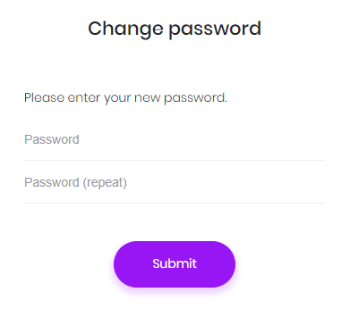

After changing password we are redirected to the **backend
application**.

#### Social Logins

ASP.NET Zero supports social media logins. To enable it, we should
change the following settings in **appsettings.json** file.

      "Authentication": {
        "Facebook": {
          "IsEnabled": "false",
          "AppId": "",
          "AppSecret": ""
        },
        "Google": {
          "IsEnabled": "false",
          "ClientId": "",
          "ClientSecret": ""
        },
        "Twitter": {
          "IsEnabled": "false",
          "ConsumerKey": "",
          "ConsumerSecret": ""
        },
        "Microsoft": {
          "IsEnabled": "false",
          "ConsumerKey": "",
          "ConsumerSecret": ""
        }
      },

You can find many documents on the web to learn how to obtain
authentication keys for social platforms. So, we will not go to details
of creating apps on social medias. Once you get your keys, you can write
them into appsettings.json. When you enable it, social media logos are
automatically shown on the login page as shown below:


#### OpenId Connect Login

In addition to social logins, ASP.NET Zero includes OpenId Connect Login
integrated. It's configuration can be changed in <span
class="auto-style3"> appsettings.json</span>:

    "OpenId": {
      "IsEnabled": "false",
      "Authority": "",
      "ClientId": "",
      "ClientSecret": ""
    }

#### Two Factor Login

ASP.NET Zero is ready to provide two factor login, but it's disabled as
default. You can easily enable it in host settings page (in Security
tab):


Note: In a multi-tenant application, two factor authentication is
available to tenants only if it's enabled in the host settings. Also,
email verification and SMS verification settings are only available in
the host side. This is by design.

When it's enabled, user is asked to select a verification provider after
entering user name and password:


Then a **confirmation code** is sent to the selected provider and user
enters the code in the next page:


##### Email Verification

This is available if user has a confirmed email address. Since email
sending is disabled in debug mode, you can see the code in logs. In
release mode, email will be sent (You can change this and make emailing
available in also debug. See sending emails section).

##### SMS Verification

This is available if user has a confirmed phone number. SMS sending is
not implemented actually (because it requires an integration to an SMS
vendor). Current implementation just writes security code to logs. You
should complete **SmsSender** class in the solution to make it usable.
Otherwise, disable SMS verification in the settings.

##### Twilio Integration

In order to enable Twilio integration, just uncomment the following line in your **CoreModule** (in your .Core project):

```
Configuration.ReplaceService<ISmsSender,TwilioSmsSender>();
```

You also need to configure **AccountSid**, **AuthToken** and **SenderNumber** in appsetting.json file.

#### User Lockout

As seen in the previous section, you can configure user lockout
settings. Users are lockout when they enter wrong password for a
specified count and duration.

#### Register

When we click the "**Create Account**" link in the login page, a
registration form is shown:

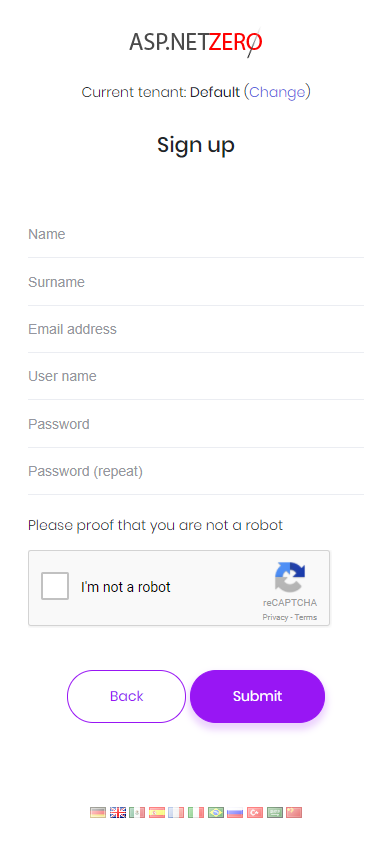

A user can be register for a tenant, not for host if this is a
multi-tenant application. If it's single-teant, there will be no tenancy
name input here.

**Recaptcha** (security question) is optional. It uses Google's
recaptcha service. Recaptcha service works per domain. So, to make it
properly work, you should create your own private and public keys for
your domain on <https://www.google.com/recaptcha> and replace keys in
**appsettings.json** file.

#### Email Activation

When a user registers as shown above, an email confirmation code is sent
to his email address. If user did not receive this email for some
reason, he can click Email activation and re-send the confirmation code.

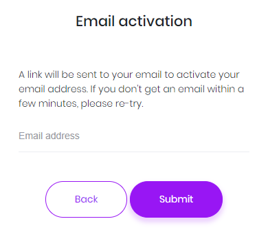

Again, Tenancy name input is not shown for a single-tenant application
or tenant name is known via subdomain (like tenancyname.mydomain.com).

#### Forgot Password

If a user forgots his password, he can click the "Forgot Password" link
to get an email to reset the password.


### Back End Application

This is the actual application which is entered by username and
password. You will mostly work on this application to add your business
requirements.

#### Application Folders

Backend application is built in a dedicated area, named "**App**" by
default, but can be determined while you are [creating the
solution](Getting-Started.md). So, all controllers, views and models
are located under **Areas/App** folder. Also, related script and style
files are located under **wwwroot/view-resources/Areas/App** folder, as
shown below:


#### Main Menu

Application's main menu is defined in **AppNavigationProvider** class.
See ABP's [navigation
documentation](https://aspnetboilerplate.com/Pages/Documents/Navigation)
to have a deep understanding on creating menus. When you add a new menu
item, it's automatically rendered in the layout.

#### Layout

Layout of the application is located under **Areas/App/Views/Layout**
folder. It uses **Components** for **header**, **footer** and
**sidebar**:

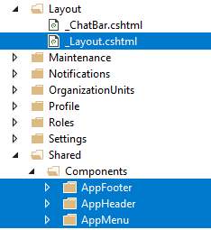

Main menu is rendered in **menu** component. Layout also highly uses
bundling & minification (see the section below) system for script and
style includes.

#### Edition Management

*If you're not developing a multi-tenant application, you can skip this
section.*

Most **SaaS** (multi-tenant) applications have **editions** (packages)
those have different **features**. Thus, they can provide different
**price and feature options** to their tenants (customers). **Editions
page** (available in host login) is used to manage application's
editions:


Editions are used to group feature values and assign to tenants. When we
click Actions/Edit for an edition, we can see it's poperties:

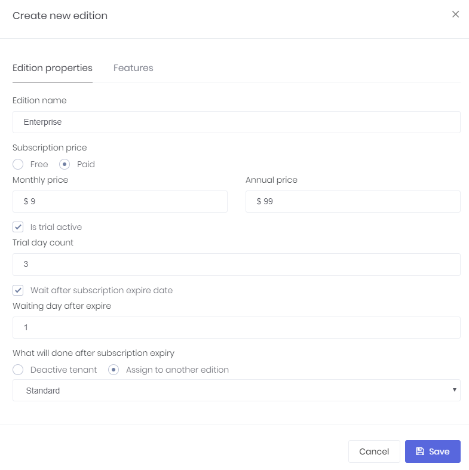

An edition can be free or paid. If it's a paid edition then you should
enter monthly and annual prices. You can allow tenants to use trial
version of this edition for a specified days. Then you can determine an
expire strategy: How many days to allow a tenant to use the application
after subscription expires. And finally, you can deactivate tenant or
assign to a free edition if they don't extend their subscription.

Features tab is used to determining features available for the edition:


See [feature
management](https://aspnetboilerplate.com/Pages/Documents/Feature-Management)
and [edition
management](https://aspnetboilerplate.com/Pages/Documents/Zero/Edition-Management)
documents for more information.

#### Tenant Management

*If you're not developing a multi-tenant application, you can skip this
section.*

If this is a multi-tenant application and you logged in as a host user,
then tenants page is shown:

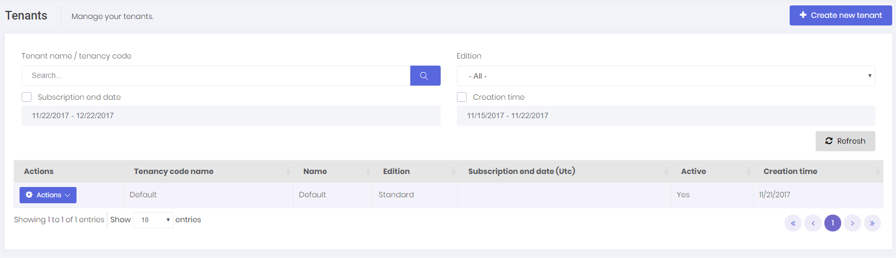

A tenant is represented by **Tenant** class. Tenant class [can be
extended](Extending-Existing-Entities.md) by adding new properties.
There is an only one tenant, named **Default** as initial. **Tenancy
Name** (code name) is the **unique** name of a tenant. A tenant can be
**active** or **passive**. If it's passive, no user of this tenant can
login to the application.

When we click the "**Create New Tenant**" button, a dialog is shown:

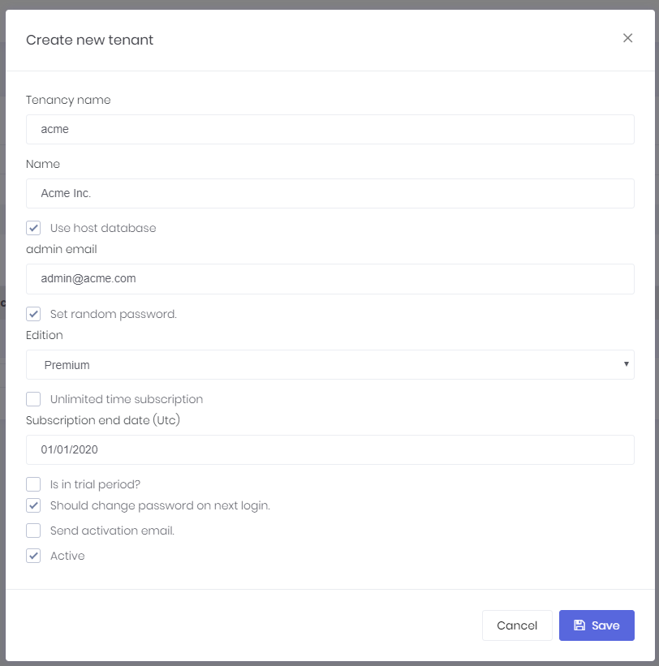

**Tenancy name** should be unique and not contain spaces or other
special chars since it may be used as subdomain name (like
tenancyname.mydomain.com. See the section below). **Name** can be
anything. **Admin email** is used as email address of the admin user of
new tenant. Admin user is automatically created with the tenant. We can
set a random password for admin and send activation email. When user
first logins, he/she should change the password. We can uncheck this to
enter a known password.

When we create a new tenant, we should select/create a database to store
new tenant's data. We can select '**Use host database**' to store tenant
data in host database (can be used for single database approach) or we
can specify a connection string to create/use a **dedicated database**
for new tenant. ASP.NET Zero supports **hybrid** approach. That means you
can use host database for some tenants and create dedicated databases
for some other tenants. Even you can **group** some tenants in a
separated database.

Once you assign an edition to the tenant, you can select an expiration
date (see edition management section to know what happens after
subscription expiration).

All tenant actions are handled by **TenantAppService** class. Example
(deleting a tenant):

    [AbpAuthorize(AppPermissions.Pages_Tenants_Delete)]
    public async Task DeleteTenant(EntityRequestInput input)
    {
        var tenant = await TenantManager.GetByIdAsync(input.Id);
        CheckErrors(await TenantManager.DeleteAsync(tenant));
    }

TenantAppService mostly uses **TenantManager** domain service for tenant
operations.

##### Tenant Edition and Features

An **edition** can be **assigned** to a tenant (while creating or
editing). Tenant will inherit all features of the assigned edition. But
we can also override features and values for a tenant. Click
**actions/change features** for a tenant to **customize** it's features:

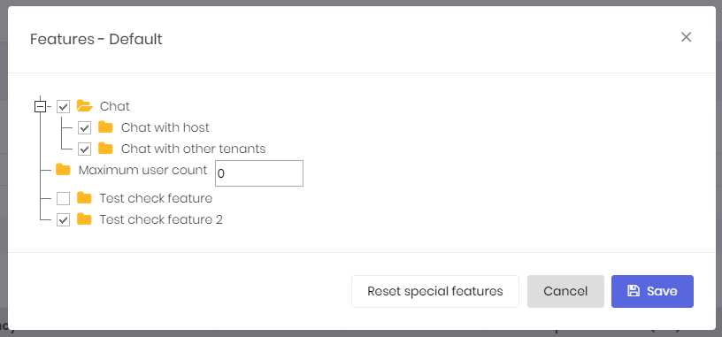

##### Tenant User Impersonation

As a host user, we may want to perform operations in behalf of a tenant.
In this case, we can click the "**Login as this tenant**" button in the
actions. When we click it, we see **a modal to select a user** of the
tenant. We can select any user and perform operations allowed that user.
See **User Impersonation** section in this document for more
information.

##### Using Tenancy Name As Subdomain

A multi-tenant application generally uses subdomain to identify current
tenant. **tenant1**.mydomain.com, **tenant2**.mydomain.com and so on.
ASP.NET Zero automatically identify and get tenant name from subdomain
(See host settings section).

#### Host Dashboard

Host dashboard is used to show some statistics about tenants, editions
and income:


This is a fully implemented dashboard except two sample statistics
(sample statistics 1 & 2) those are placeholders for your own
statistics.

#### Organization Units

Organization units (OU) are used to hierarchically group user and
entities. Then you can get user or entities based on their OUs. When we
click Administration/Organization units, we enter the related page:

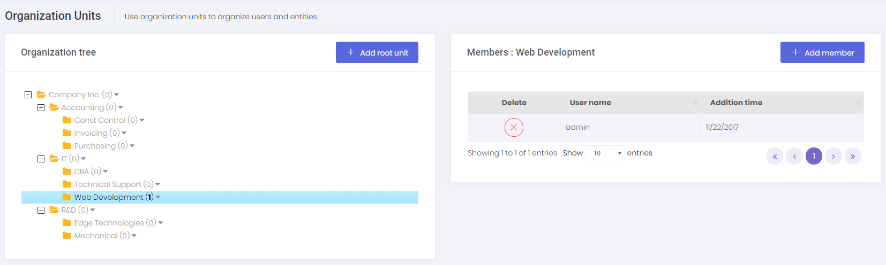

Here, we can manage OUs (create, edit, delele, move) and members
(add/remove).

**OrganizationUnitManager** is used to manage OUs, **UserManager** is
used to manage OU members in the code. **OrganizationUnitAppService**
performs the application logic.

In the left OU tree, we can **right click** to an OU (or left click to
**arrow** at the right) to open **context menu** for OU operations. When
we try to **add a member**, a modal is shown to select the user:


This is actually a **generic lookup modal** and can be used to select
any type of entity (see
Areas/App/Views/Common/Modals/\_LookupModal.cshtml and it's related
script file). To select the users, we created **FindUsers** method in
**CommonLookupAppService** then configured the modal to work with this
method (see view-resources/Areas/App/Views/OrganizationUnits/index.js
file for usage of lookupModal.open).

See [organization unit management
document](https://aspnetboilerplate.com/Pages/Documents/Zero/Organization-Units)
for more information.

#### Role Management

When we click Administration/Roles menu, we enter to the role management
page:

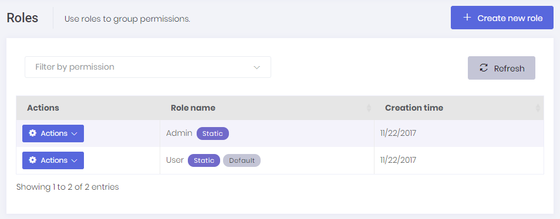

Roles are used to **group permissions**. When a user has a role, then
he/she will have all permissions of that role.

A role is represented by the **Role** class. Role class can be extended
by adding new properties.

**RoleManager** performs domain logic, **RoleAppService** performs
application logic for roles.

Roles can be dynamic or static:

-   **Static role**: A static role has a known **name** (like 'admin')
    and can not change this name (we can change **display name**). It's
    exists on the system startup and can not be deleted. Thus, we can
    write our code based on a static role name.
-   **Dynamic role**: We can create a dynamic role after deployment.
    Then we can grant permissions for that role, we can assign the role
    to some users and we can delete it. We can not know names of dynamic
    roles in development time.

One or more roles can be set as **default**. Default roles are assigned
to new added/registered users as default. This is not a development time
property and can be set or changed after deployment.

In startup project, we have static **admin** role for host (for
multi-tenant apps). Also, we have static **admin** and **user** roles
for tenants. **Admin** roles have all permissions granted by default.
**User** role is the **default** role for new users and has no
permission by default. These can be changed easily. See
**StaticRoleNames** class for all static roles and **AppRoleConfig** for
changing static roles.

##### Role Permissions

Since roles are used to group permissions, we can set permissions of a
role while creating or editing as shown below:


(not all permissions shown in the figure above)

Every tenant has it's own roles and any change in roles for a tenant
does not effect other tenants. Also, host has also own isolated roles.

#### User Management

When we click Administration/Users menu, we enter to the user management
page:

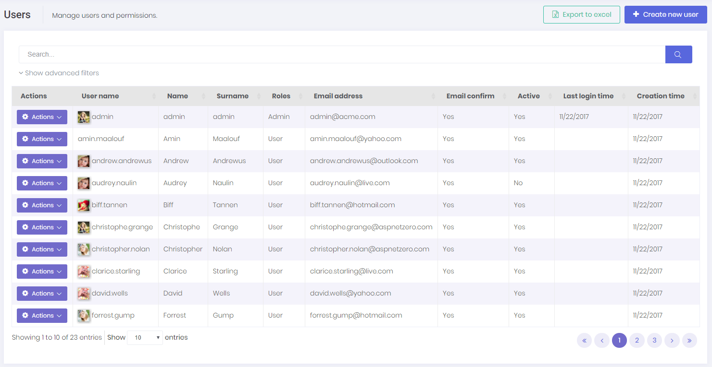

**Users** are people who can **login** to the application and perform
some operations based on their **permissions**.

**User** class represents a user. User class [can be
extended](Extending-Existing-Entities.md) by adding new properties.

**UserManager** is used to perform domain logic, **UserAppService** is
used to perform application logic for users.

A user can have zero or more **roles**. If a user has more than one
role, he inherits union of permissions of all these roles. Also, we can
set **user-specific permission**. A user specific permission setting
overrides role settings for this permission. A screenshot of user
permission dialog:


(not all permissions shown in the figure above)

A dialog is used to create/edit a user:


We can change user's **password**, make her **active/passive** and so
on... A user can have a **profile picture**. It can be changed by the
user (See User Menu section). **Admin** user can not be deleted as a
business rule. If you don't want to use admin, you can make it passive.

##### User Impersonation

As admin (or any allowed user), we may want to login as a user and
perform operations in behalf of that user, without knowing his password.
When we click "**Login as this user**" icon in the actions of a user, we
are automatically redirected and logged in as this user. This is called
as "**user impersonation**". When we impersonate a user, a "**back to my
account**" option is added to the user profile menu:


In an impersonated account, we can only perform operations allowed to
that user. That means, everything **exactly** works as same as this user
logged in himself. The only difference is shown in audit logs which
indicates that operations are performed by somebody else. Notice that;
Also a **red 'back' icon** shown near to the user name to indicate that
you are in an impersonated account.

Impersonation is done in **AccountController** of the Web project.

#### Language Management

Language management page is used to manage (add/edit/delete)
**application languages** and change **localized texts**:

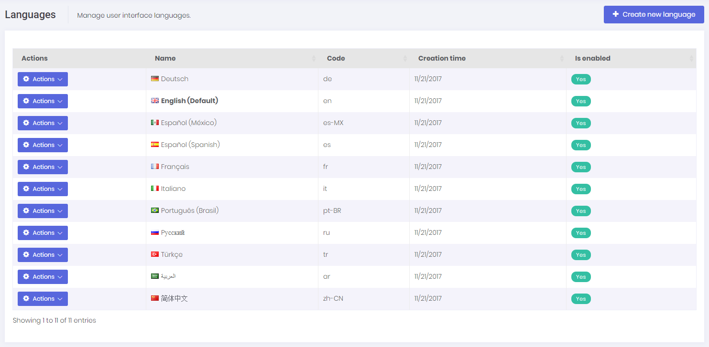

We can create new language, edit/delete an existing language and **set a
language as default**. Note that; tenants can not edit/delete default
languages, but host users can do.

When we click to **Change text** for any language, we are redirected to
a new view to edit language texts:


We can select any language as a **base** (reference) and change
**target** language's texts. Base language is just to help the
translation progress. Since there maybe different [localization
sources](https://aspnetboilerplate.com/Pages/Documents/Localization#DocLocalizationSources),
we select the source to translate. When we click the edit icon, we can
see the edit modal for the selected text:

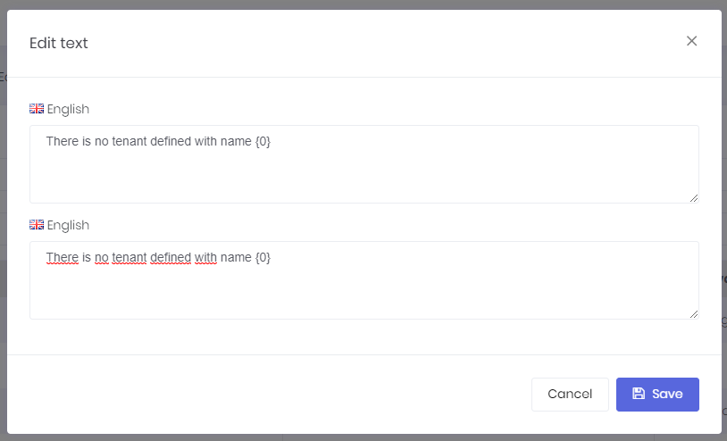

**Host** users (if allowed) can edit languages and localized texts.
These languages will be default for all tenants for a multi-tenant
application. **Tenants** inherit languages and localized texts and can
**override** localized texts or can add new languages.

Both pages use **LanguageAppService** class as application service. It
has methods to manage languages and localized texts.
**IApplicationLanguageManager** and **IApplicationLanguageTextManager**
interfaces are used to perform domain logic (as used by
LanguageAppService).

See [language
management](https://aspnetboilerplate.com/Pages/Documents/Zero/Language-Management)
and
[localization](https://aspnetboilerplate.com/Pages/Documents/Localization)
documents for more information.

#### Audit Logs

In audit logs page, we can see all user interactions with the
application:


All application service methods and MVC controller actions are
automatically logged and can be viewed here. See [audit logs
documentation](https://aspnetboilerplate.com/Pages/Documents/Audit-Logging)
to learn how to configure it. When we click the magnifier icon, we can
see all details an audit log:


Audit log report is provided by **AuditLogAppService** class.

#### Subscription

Tenants can manage (show, extend or upgrade) their edition/plan
subscriptions using this page:


All payment records for extending/upgrading current licenses are kept in
the system. These records can be seen on "Payment History" tab on
subscription page.

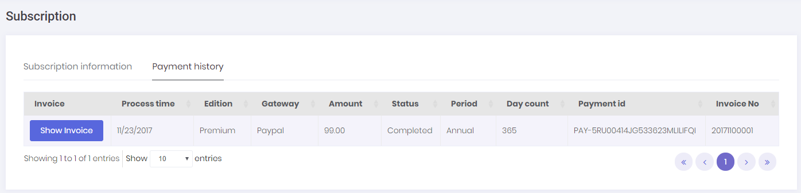

Tenants can also create & print invoices for these payments by clicking
the "Show Invoice" button. System will automatically generate an invoice
number and show the generated invoice. In order to use this function,
both Host & Tenant must set invoice informations on host setting/tenant
setting page.

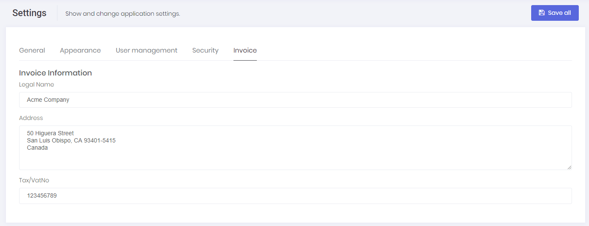

After all, invoices for payments related to subscription can be
generated. You can see a sample invoice below:

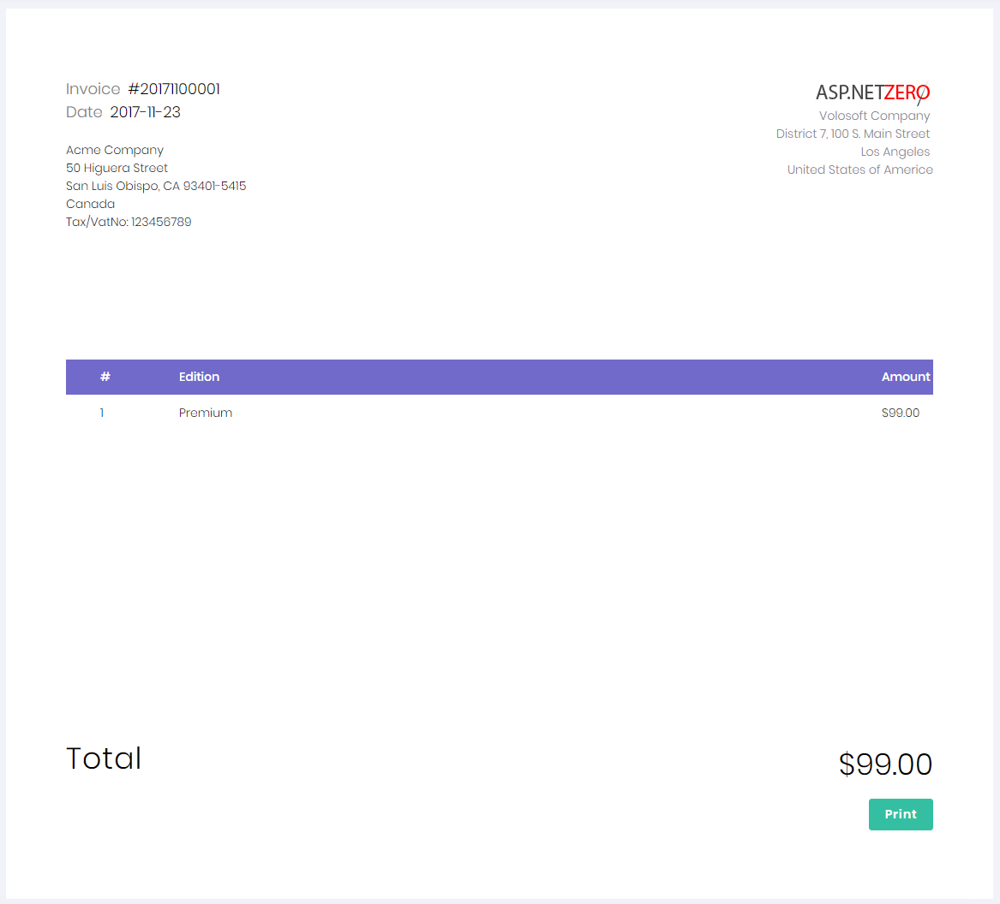

#### Visual Settings

ASP.NET Zero's look of UI can be modified in visual settings page. This
page is used to modify look of UI both for system and personal user
accounts. If a user doesn't have permission to see this page, then user
will see an item named "Visual Settings" in his personal menu.


Users who have permission to see this page will see the same item in the
application menu.

In this page, users can change visual settings for Layout, Header, Menu
and Footer of the application.

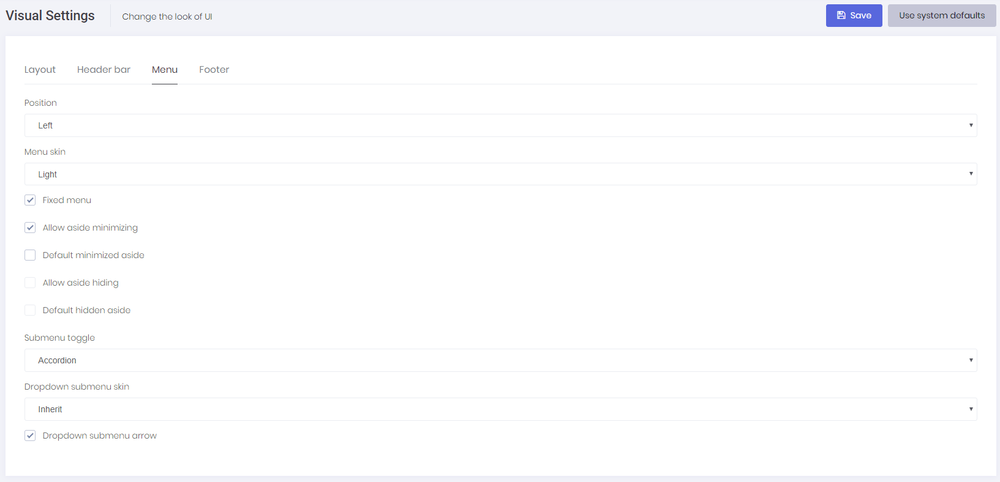

#### Host Settings

Host settings page is used to configure some system settings:

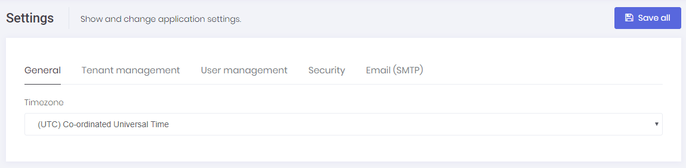

**Timezone** is an important setting in this page. ASP.NET Zero can work
in multiple zones. Each user can see dates and times in their own time
zone. Timezone setting in this page allows you to set default time zone
for the application including all tenants and users. Tenants and users
can change time zone in their own settings. Timezone setting is
available only if you are using UTC clock. [See
documentation](https://aspnetboilerplate.com/Pages/Documents/Timing) to
switch to UTC.

SAVE ALL button saves all settings in one click. HostSettingAppService
is used to retrieve and save settings (See setting provider section for
more information).

**Security** tab in host settings page contains password complexity and
other security settings. Host can define system wide security settings
in this tab. Each tenant can override this setting in tenant settings
page. **PasswordComplexityChecker** class is responsible for checking if
a password satisfies the password complexity settings.

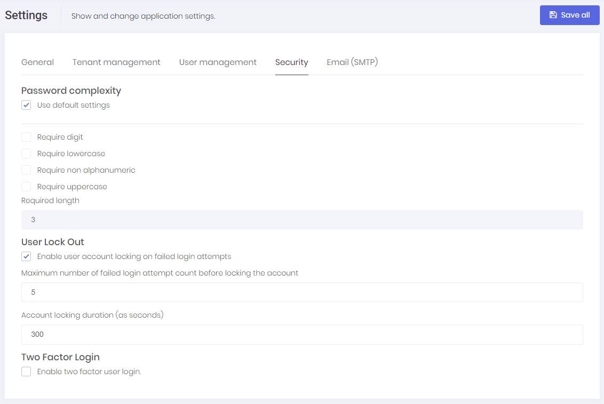

**Email(SMTP)** tab allows you to configure smtp settings for your app. AspNet Zero uses MailKit to send emails. By default, smtp certificate validation is disabled in **YourProjectNameMailKitSmtpBuilder.cs** class. If you are able to validate mail server's certificate, you need to modify **ServerCertificateValidationCallback** in **YourProjectNameMailKitSmtpBuilder.cs**.

#### Tenant Settings

In a multi-tenant application, tenant settings are shown as below:


If we disable multi-tenancy, some host settings are also shown in this
page (since there is no host setting page). Tenants can also define
password complexity settings for their users or they can use password
complexity settings defined by host user.

**TenantSettingAppService** is used to get/set tenant settings.

##### Enabling LDAP (Active Directory) Authentication

LDAP (Active Directory) Authentication is disabled by default. To make
it work, we should disable multi-tenancy since LDAP auth is not used in
a multi-tenant system normally. In CoreModule class in .Core project, we
should enable the following line:

    Configuration.Modules.ZeroLdap().Enable(typeof(AppLdapAuthenticationSource));

Then, we can see **LDAP settings** section in settings page:

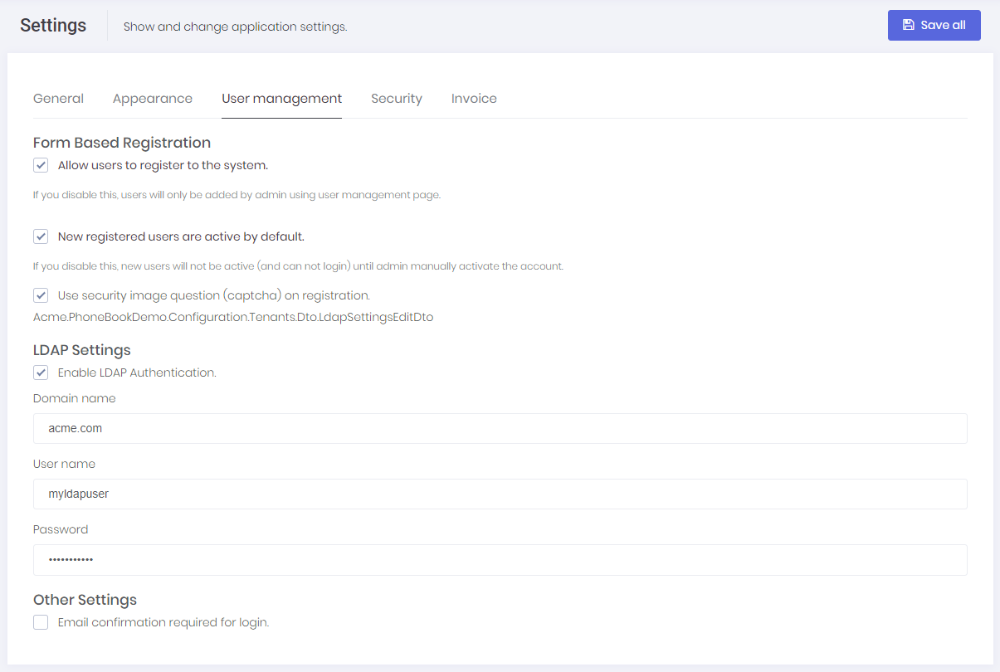

We can check "**Enable LDAP Authentication**" to enable it. If the
server works in domain and application runs with a domain user or local
system, then generally even **no need** to set Domain name, user and
password. You can logout and then login with your **domain user name and
password**. If not, you should set these credentials.

						   

																  
																	   
													

#### Maintenance

Maintenance page is available to **host side** for multi tenant
applications (for single tenant applications it's shown in tenant side)
and shown as below:


In the **Caches** tab, we can clear some or all caches. Clearing caches
may be needed if you manually change database and want to refresh
application cache. **CachingAppService** is used to clear caches in the
server side.

**Website Logs** tab is used to see and download logs:

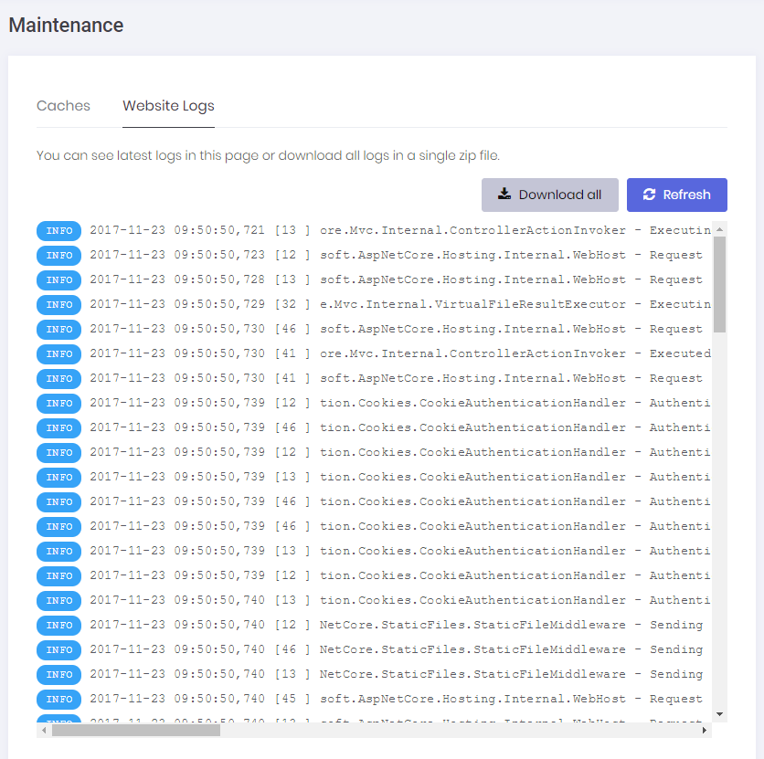

**WebLogAppService** is used to get logs from server.

#### Tenant Dashboard

ASP.NET Zero startup project also includes a **sample** dashboard. It's
just for demo purposes, you can make it as a start point for your actual
dashboard:

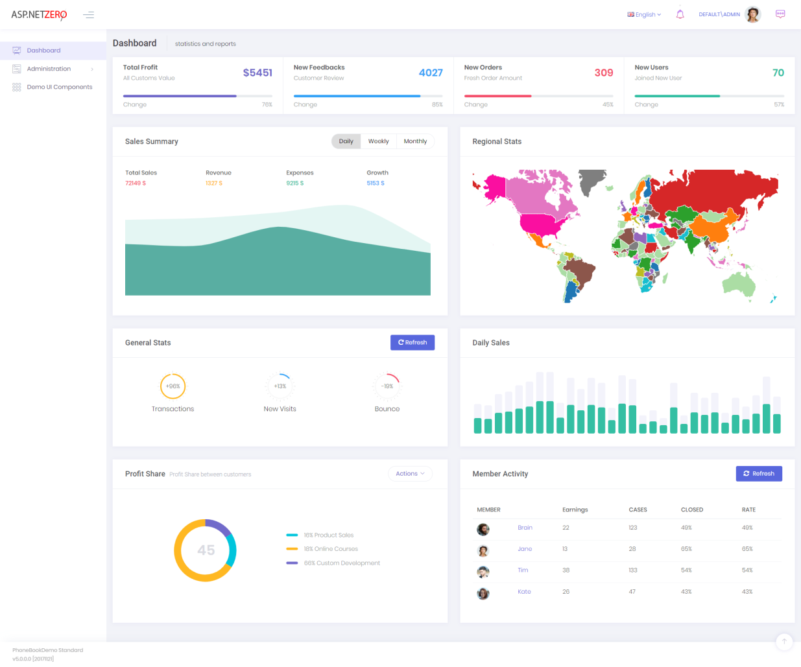

Client gets all data from server, server generates random data.

#### Notifications

Notification icon is located next to the language selection button. The
number in the red circle shows unread notification count.

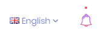

User can see 3 recent notifications by clicking this icon.

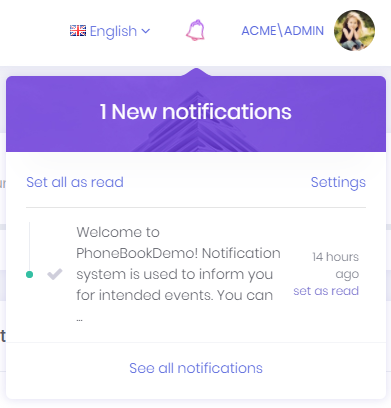

User can marks all notifications as read by clicking the "Set all as
read" link or can mark a single notification by clicking the "set as
read" link next to each notification.

Notifications are sent real-time using SignalR. In addition, a **desktop
push notification** is shown when a notification is received.

##### Notification Settings

"Settings" link opens notification settings dialog.


In this dialog there is a global setting for user to enable/disable
receiving notifications. If this setting is enabled, then user can
enable/disable each notification individually.

You can also define your custom notifications in
**AppNotificationProvider** class. For example, new user registration
notification is defined in the **AppNotificationProvider** as below.

    context.Manager.Add(
         new NotificationDefinition(
            AppNotificationNames.NewUserRegistered,
            displayName: L("NewUserRegisteredNotificationDefinition"),
            permissionDependency: new SimplePermissionDependency(AppPermissions.Pages_Administration_Users)
        )
    );

See [notification
definitions](https://aspnetboilerplate.com/Pages/Documents/Notification-System#notification-definitions)
section for detailed information.

**AppNotifier** class is used to publish notifications.
**NotificationAppService** class is used to manage application logic for
notifications. See [notifications
documentation](https://aspnetboilerplate.com/Pages/Documents/Notification-System)
for detailed information.

##### Notification List

All notifications of user are listed in this page.


**.NET Core Compatibility**

Since SignalR is not ready yet for .NET Core, real time notifications
will not work if you select .NET Core as your base framework.

#### Chat

Chat icon is located next to user's profile image on top right corner of
the page. The number in the red circle shows total unread chat message
count.


When user clicks this icon, chat panel appears on the right of page.
This panel contains friends of user and list of blocked users.

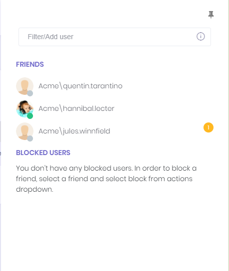

User can add new friends by writing the username into username textbox
above friend list. If "Chat with other tenants" feature is enabled for
tenant, users of other tenants can be added as a friend by writing
\[tenancy name\]\\\[user name\] (ex: Default\\admin). If "Chat with host
users" feature is enabled, host users can be added as friend by writing
.\\\[user name\] in the same textbox.

While online friends/users have a green circle on their profile image,
offline friends/users have a gray circle.

User can pin or unpin the chat panel by clicking the pin icon on top
right corner of the chat panel. Application tries to remember last state
of chat panel and restores it when user login to application.

When a friend/user is selected, conversation panel is opened.


Chat system also allows sending images, files and link of current page
to friends

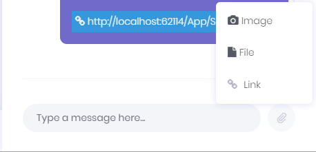

User can block or unblock friend/user in this area. There is a wrench
icon right of the selected user's username. This icon opens an action
menu and this menu contains block user or unblock user actions according
to user's block status.

Chat messages are distributed over **ChatHub** signalR hub class which
uses **ChatMessageManager** domain class.

**ChatUserStateWatcher** class is responsible for watching
online/offline state changes of chat users. When a user becomes online
or offline, this class catches the state change and notifies friends of
related user.

**FriendshipAppService** and **FriendshipManager** classes are
responsible for managing friendship requests. Chat messages from blocked
users are not delivered to target users.

Since chat is a real time operation, application caches friends of
online users and unread message count from each friend.
**UserFriendsCache** class manages these caching operations.

**UserFriendCacheSyncronizer** class is responsible for keeping user
friends cache up to date. In order to do that, it watches some events of
Friendship and ChatMessage entities.

**.NET Core Compatibility**

Since SignalR is not ready yet for .NET Core, chat feature will not work
if you select .NET Core as your base framework.

##### Chat Features

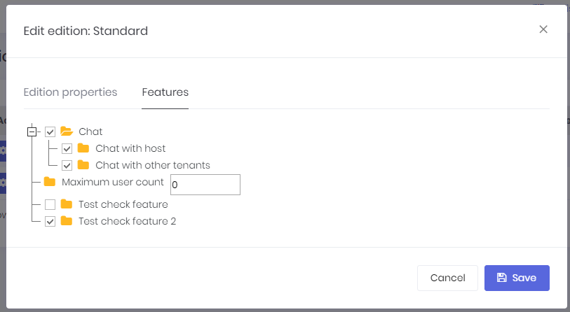

There are three chat features in the system. These are "Chat", "Chat
with host", "Chat with other tenants". These features can be
enabled/disabled per edition/tenant. By using these features host can
enable/disable chat with other tenant's users or host users.

#### User Menu

A user can click his name at top right corner to open user menu:

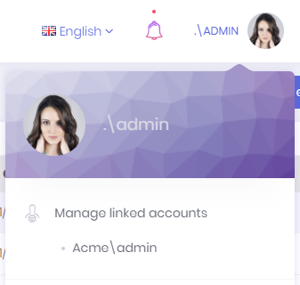

##### Linked Accounts

Linked accounts are used to link multiple accounts to each other. In
this way, a user can easily navigate through his/her accounts using this
feature.

User can link new accounts or delete already linked accounts by clicking
the "Manage accounts" link.


In order to link a new account, user must enter login credentials of
related account.


**UserLinkAppService** class is used to manage application logic for
account linking, **UserLinkManager** class is used to manage domain
logic for account linking.

##### Profile Settings

My settings is used to change user profile settings:

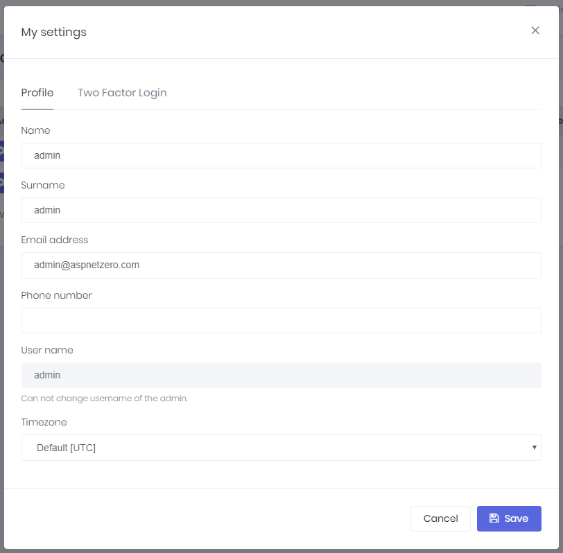

As shown here, **admin** user name can not be changed. It's considered a
special user name since it's used in database migration seed. Other
users can change their usernames. **ProfileAppService** is used to
get/change settings.

##### Login Attempts

All login attempts (success of failed) are logged in the application. A
user can see last login attempts for his/her account.
**UserLoginAppService** is used to get login attempts from server.

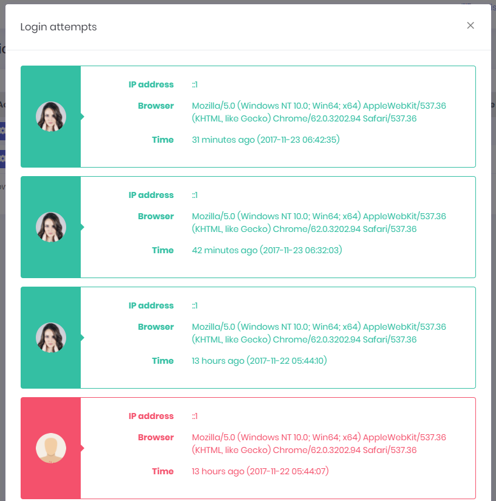

##### Change Picture

A user can change own profile picture. **ProfileController** is used to
upload and get user profile pictures. Currently, jpg/jpeg, gif and png
files are supported, you can extend it.

##### Change Password

**ProfileAppService** is used to change password.

##### Download Collected Data

A user can download his/her collected data using this menu item.

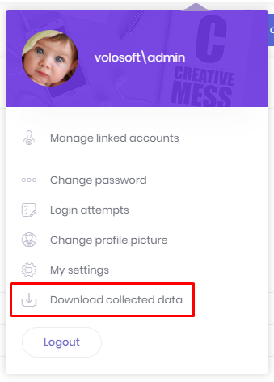

##### Logout

**AccountController** is used to logout the user and redirect to Login
page.

### Web.Host Application

ASP.NET Zero solution contains an extra project, **Web.Host**, which just
exposes all application functionality as **remote API**. Thus, you can
consume your application as API from any device. Actually, Web.Mvc
project also does it, provides API for all application functionality.
The difference is that Web.Mvc project has also MVC Controllers, Views,
scripts and so on. If you just want to deploy API without UI, you can
use Web.Host project. Otherwise, you can even delete it. We are using
Web.Host project to provide server side API to [Angular
SPA](Development-Guide-Angular.md).

A few notes on Web.Host project:

-   It has only **token based (JWT) authentication** (plus social login
    possibility). No form based authentication (because there is no UI).
-   It does **not** implement **CSRF** protection since it's not a
    security concern in token based auth.
-   It enables **CORS**. So, cross origin requests are allowed. It only
    allows to **http://localhost:4200** by default (see Startup class
    for the configuration).
-   Configured and enabled **Swagger UI** by default.

### Migrator Console Application

ASP.NET Zero includes a tool, Migrator.exe, to easily migrate your
databases. You can run this application to create/migrate host and
tenant databases.


This application gets host connection string from it's **own
appsettings.json file**. It will be same as in the appsettings.json in
.Web project at the beginning. Be sure that the connection string in
config file is the database you want. After getting **host**
**connection sring**, it first creates the host database or apply
migrations if it does already exists. Then it gets connection strings of
tenant databases and runs migrations for those databases. It skips a
tenant if it has not a dedicated database or it's database is already
migrated for another tenant (for shared databases between multiple
tenants).

You can use this tool on development or on product environment to
migrate databases on deployment, instead of EntityFramework's own
Migrate.exe (which requires some configuration and can only work for
single database in one run).

### Public Web Site

ASP.NET Zero contains a separated application that can be a starting
point for your public web site or a landing page for your application.
Set **Web.Public** as **Startup Project** and run the application:


There are two pages here: **Home Page** and **About**. Contents of these
pages are just placeholders and for demo purposes. You can completely
remove content and build your page upon your needs. Also, you should
change the **logo** with your Company's logo.

See [metronic front-end
theme](http://keenthemes.com/free-bootstrap-templates/multi-purpose-corporate-frontend-themefreebie-corporate-frontend-theme/)for
all possibilities and components to build a richer web site.

Menus are defined in **FrontEndNavigationProvider** class. When you add
a new menu item here, it will be automatically shown in the menu. There
is a **Login** link at the top right corner. This link takes us to the
**Login page** to enter to the **backend** application.

#### Layout

Layout of front-end pages are located under **Views/Layout** folder:


**\_Layout** is the main layout file that includes scripts and styles.
Language flags and the menu is rendered in **Header component** which is
located under Shared/Components. \_PreFooter is not used but you can add
it to the \_Layout if you want.

#### New Tenant Registration

When you click "**New Tenant**" link (at the top right area) you are
redirected to the edition/plan selection page:

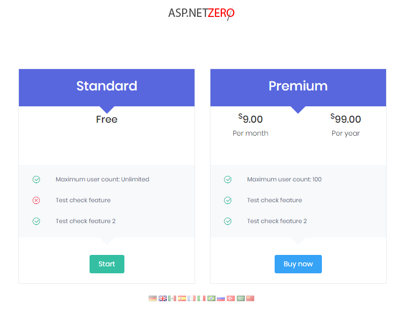

Actually, this UI is located in the main application. When you pick an
edition, you are redirected to the payment or register form depending on
the button you clicked. Register form is shown as below:


#### Single Sign On

Public web site has a login integration to the main application. When
you click to login button (at the top right area) you are redirected to
the main application. If you are already logged then you automatically
login in the public web site too. If not, you can enter your username
and password to login. Then you are redirected back to the public web
site and your username is shown at the top right:

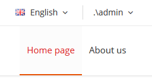

To make this working, public web site and main application must know
their URLs. There are two configuration for that:

1.   In the **appsettings.json** of the **Web.**<span

    class="auto-style3">Public</span> project, set
    "**AdminWebSiteRootAddress**" to root URL of the main application.
2.   In the **appsettings.json** of the **Web.**<span

    class="auto-style3">Mvc</span> project, set
    "**RedirectAllowedExternalWebSites**" to root URL of the public web
    site.

Both configuration is properly set for the development environment. You
should change them when you publish your project.

#### Setup Page

ASP.NET Zero application can be set-up using install page. This page is
developed to create initial database, apply migrations and configure the
application according to user's input on this page. Setup page can be
accessed via **http://yourwebsite.com/Install**.


### Infrastructure

#### Startup Class

ASP.NET Core is initialized from the **Startup** class in the
application. We configure all libraries (including ABP) in this class.
We suggest you to start by checking this class. It is also integrated to
**OWIN**. So, you can add OWIN middlewares here.

#### NPM & Front End Dependencies

ASP.NET Zero solution uses [npm](https://www.npmjs.com/) package manager
to obtain front end library dependencies (like Bootstrap and jQuery).
So, you can easily add new packages or update existing packages on
command line interface. You can see all installed npm packages in
**package.json** of the .Web.Mvc project.

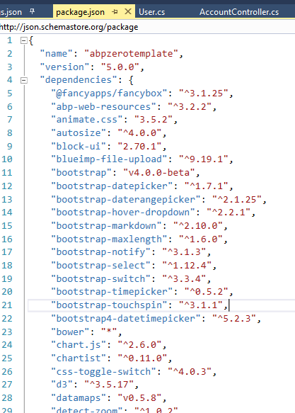

NPM installs dependencies into node\_modules folder which will be placed
in the root folder of MVC project. But, in ASP.NET Core, it is suggested
to place client side libraries under wwwroot folder. Also, size of
node\_modules folder will be very big (more than 250 MB) and we don't
want to send all of those files to production when we publish our
application. In order to overcome this, we have used gulp to move
necessary files from **\*.Web.Mvc/node\_modules** to
**\*.Web.Mvc/wwwroot/lib**. Mapping from node_modules to wwwroot/lib folder is defined in **package-mapping-config.js** file. So, when you add a new package to your solution, you also need to add a mapping to this file defining the files you want to move from node_modules to wwwroot/lib folder for newly added package. 

Here is a sample **package-mapping-config.js** file;


In order to create css and javascript bundles https://www.nuget.org/packages/BundlerMinifier.Core/ package is used. Bundling definitions are stored in **bundleconfig.json** file. If you don't want to modify this file manually, you can use https://marketplace.visualstudio.com/items?itemName=MadsKristensen.BundlerMinifier Visual Studio extension to create bundling definitions for you.

#### Application Services as MVC API Controllers

ASP.NET Zero project highly use AJAX to provide a better user
experience. UI calls **application service methods** via AJAX. So, it's
needed to create MVC API controllers as adapters (A Client calls MVC API
Controller action via AJAX, then it calls application service method).
ABP framework automatically creates MVC API Controllers for all
application services. So, no need to manually create MVC API Controllers
for application services.See related
[documentation](https://aspnetboilerplate.com/Pages/Documents/AspNet-Core#application-services-as-controllers)
for more. While ABP dynamically create Web API Controllers, we can also
create regular MVC API Controllers as we always do.

#### Localization

ASP.NET Zero **User Interface** is completely localized. ASP.NET Zero
uses **dynamic, database based, per-tenant** localization (See the
related section above).

XML files are used as base translation for desired languages:

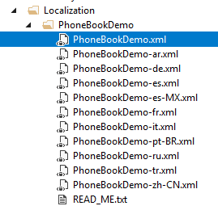

PhoneBook will be your ProjectName. You can add more XML files by
copying one XML file and translate to desired language. See [valid
culture codes](http://www.csharp-examples.net/culture-names/).

When you are adding a new localizable text, add it to the XML file of
the default language then use in your application (Also, add translated
values to corresponding XML files). No need to add it to database
migration code since value in the XML file will be used as default.

**Application languages** are defined in **DefaultLanguagesCreator**
class. This is used as a **seed data** in Entity Framework Migration.
So, if you want to **add a new default language**, just add it into
DefaultLanguagesCreator class. Also, you should add a corresponding XML
file as described above as default translation.

See
[localization](https://aspnetboilerplate.com/Pages/Documents/Localization)
and [language
management](https://aspnetboilerplate.com/Pages/Documents/Zero/Language-Management)
documentations for more information.

#### EntityFrameworkCore Integration

ASP.NET Zero template uses EntityFramework Core **code-first** and
**migrations**. PhoneBook**DbContext** (YourProjectDbContext for your
project) defines the DbContext class. **Migrations** folder contains EF
migrations.

PhoneBook**RepositoryBase** class is the base class for your custom
repositories. See entity [framework
integration](https://aspnetboilerplate.com/Pages/Documents/EntityFramework-Integration)
documentation for more.

##### Database Migrations

You can use Package Manager Console to add new migrations and update
your database as you normally do. See EF Core's
[documentation](https://docs.microsoft.com/en-us/ef/core/miscellaneous/cli/powershell)
for details.

#### Exception Handling

ASP.NET Zero uses ABP's [exception
handling](https://aspnetboilerplate.com/Pages/Documents/AspNet-Core#exception-filter)
system. Thus, you don't need to handle & care about exceptions in most
time.

ASP.NET Zero solution adds **exception handling middlewares** in the
**Startup** class like that:

    if (env.IsDevelopment())
    {
        app.UseDeveloperExceptionPage();
    }
    else
    {
        app.UseStatusCodePagesWithRedirects("~/Error?statusCode={0}");
        app.UseExceptionHandler("/Error");
    }

So, you get a nicely formatted exception page in development and a more
user friendly error page in production. See **ErrorController** and it's
related views (**Views\\Error**) for details.

#### User Secrets

ASP.NET Core introduced [user
secrets](https://docs.microsoft.com/en-us/aspnet/core/security/app-secrets)
system to store **sensitive data** in development. ASP.NET Zero uses
this system (it's configured properly for your solution). You may want
to use a different connection string (or social media API keys) in
development and do not want to add these secret data in your
appsettings.json in the project (and do not want to commit these
sensitive information to your source control system). Then use secret
manager tool to store this sensitive information in your local computer
and allow your application to read them from your local computer if
available.

For example, you can use the following command, in Windows **command
prompt** in the location of **Core** project, to change connection
string for your local development environment:

    dotnet user-secrets set ConnectionStrings:Default "Server=1.2.3.4;Database=MyProjectDevDb;User=sa;Password=12345678"

This user secret value overrides the value in the appsettings.json. See
ASP.NET's [own
documentation](https://docs.microsoft.com/en-us/aspnet/core/security/app-secrets)
for details about user secrets.

#### Authorization Provider

Authorization system is based on permissions. **AppPermissions**
contains constants for permission names and **AppAuthorizationProvider**
class defines all permissions in the system. We should define a
permission here before using it in application layer.

See [authorization
documentation](https://aspnetboilerplate.com/Pages/Documents/Authorization)
to learn how to configure permissions.

#### Feature Provider

**AppFeatureProvider** class defines features of the application for
multi-tenant applications. Feature names are defined in **AppFeatures**
class as contants.

See [feature management
documentation](https://aspnetboilerplate.com/Pages/Documents/Feature-Management)
to learn how to define and use features.

#### Setting Provider

Every setting has a unique name. Setting names are defined in
**AppSettings** class as constants. All settings and their default
values are defined in **AppSettingProvider** class.

See [setting
documentation](https://aspnetboilerplate.com/Pages/Documents/Setting-Management)
to learn how to create and use settings.

#### Navigation Provider

Menus are automatically generated using definitions in
**AppNavigationProvider** class. We have two menus: **Main** (the main
menu in the backend application) and **FrontEnd** (Main menu in
front-end web site).

See [navigation
documentation](https://aspnetboilerplate.com/Pages/Documents/Navigation)
for more information.

#### Caching And Redis Cache

ASP.NET Zero uses **in-memory** caching but it's ready to use **Redis**
as cache server. If you want to enable it, just uncomment the following
line in your **WebCoreModule** (in your .Web.Core project):

    Configuration.Caching.UseRedis(...);

Redis server should be up & running to be able to use it. See [caching
documentation](https://aspnetboilerplate.com/Pages/Documents/Caching)
for more information.

#### Background Jobs And HangFire

ABP framework contains a **background job system** with a **default**
background job manager. If you want to use
[Hangfire](http://hangfire.io/) as your background job manager, you can
easily enable it;

1.  Uncomment **AddHangfire** and **UseHangfireDashboard** and
    **UseHangfireServer** lines in Startup.cs (of Web.Mvc or Web.Host
    depending on your case).
2.  Uncomment Configuration.BackgroundJobs.UseHangfire in
    ...WebCoreModule.cs class in your .Web.Core project.

**Note**: Hangfire creates it's **own tables** in the database on first
run. See [background
job](https://aspnetboilerplate.com/Pages/Documents/Background-Jobs-And-Workers)
and [hangfire
integration](https://aspnetboilerplate.com/Pages/Documents/Hangfire-Integration)
documents for more information.

#### SignalR Integration

SignalR is properly configured and integrated to the startup template.
Real time notification and chat systems use it. You can direcly use
SignalR in your applications.

Notice that; As the time being, SignalR [has not been
released](https://github.com/aspnet/Home/wiki/Roadmap#12) for ASP.NET
Core yet. We integrated **OWIN** to ASP.NET Core pipeline in order to
use SignalR in the application. See [SignalR
integration](https://aspnetboilerplate.com/Pages/Documents/SignalR-Integration)
document for more information on SignalR.

**.NET Core Compatibility**

Since SignalR is not ready yet for .NET Core, SignalR integration is
disabled if you select .NET Core as your base framework.

#### Logging

ASP.NET Zero uses **Log4Net** for logging as default. Configuration is
defined in **log4net.config** file in the .Web project. It writes all
logs to **App\_Data/Logs/Logs.txt** folder of web site as default. When
you publish your project, remember to configure **write permission** to
Logs folder.

Check [logging
documentation](https://aspnetboilerplate.com/Pages/Documents/Logging) to
see how to inject ILogger and write logs.

#### DTO Mappings

ASP.NET Zero uses [AutoMapper](http://automapper.org/) for DTO to Entity
mappings (and other types of object-to-object mappings). We use
[Abp.AutoMapper](https://www.nuget.org/packages/Abp.AutoMapper) library
that makes usage of AutoMapper simpler and declarative.

For instance, see the DTO class that is used to transfer a tenant
editing information:

    [AutoMap(typeof (Tenant))]
    public class TenantEditDto : EntityDto
    {
        [Required]
        [StringLength(Tenant.MaxTenancyNameLength)]
        public string TenancyName { get; set; }
    
        [Required]
        [StringLength(Tenant.MaxNameLength)]
        public string Name { get; set; }
    
        public bool IsActive { get; set; }
    }

Here, **AutoMap** attribute automatically creates mapping between
**TenantEditDto** and **Tenant** classes. Then we can automatically
convert a Tenant object to TenantEditDto (and vice verse) object as
shown below:

    [AbpAuthorize(AppPermissions.Pages_Tenants_Edit)]
    public async Task<TenantEditDto> GetTenantForEdit(EntityRequestInput input)
    {
        return ObjectMapper.Map<TenantEditDto>(await TenantManager.GetByIdAsync(input.Id));
    }

<span class="auto-style3">ObjectMapper</span> (this property comes from
base class, but can be injected as IObjectMapper when you need somewhere
else) is used to perform mappings.

##### Custom Object Mappings

Attribute based mapping may not be sufficient in some cases. If you need
to directly use Automapper API to configure your mappings, you should do
it in **CustomDtoMapper** class.

See [Data Transfer Objects
documentation](https://aspnetboilerplate.com/Pages/Documents/Data-Transfer-Objects)
for more information on DTOs.

#### Sending Emails

ASP.NET Zero sends emails to users in some cases (like forgot password
and email confirmation). Email template is defined in
**Emailing/EmailTemplates** folder of .Core project (**default.html**).
You can change default email template by editing this file.

**Email sending** is disabled in DEBUG mode. Because, development
environment may not be configured properly to send emails. You can
enable it if you want. It's enabled in RELEASE mode. Check
*YourProjectName*CoreModule class's PreInitialize method to change it if
you like.

**.NET Core Compatibility**

Since .NET Core does not support smpt client, ASP.NET Zero uses
[MailKit](https://github.com/jstedfast/MailKit) to send emails.

#### BinaryObjectManager

User **profile pictures** are stored in database, instead of file
system. But it's not stored in Users table for performance reasons
(Users are frequently retrieved from database, but profile pictures are
rarely needed).

A general-purpose binary saving mechanism built in ASP.NET Zero.
**BinaryObject** entity can be used to save any type of binary objects
(byte arrays). Since a profile picture can be converted to a byte array,
user profile pictures are saved here.

**IBinaryObjectManager** interface defines methods to save, get and
delete binary objects. **DbBinaryObjectManager** implements it to save
binary object in database. For example, **ProfileController** uses
IBinaryObjectManager to get current user's profile picture from
database.

You can create a different implementation of **IBinaryObjectManager**
interface to store files in another destination.

#### Soft Deletes

It's common to use the **soft-delete** pattern which is used to not
delete an entity from database but only mark it as 'deleted'. So, if an
entity is soft-deleted, it should not be accidentally retrieved into the
application. ABP's **data filters** make this automatically.

In ASP.NET Zero, most entities are soft-deleted. See ABP's [data filter
documentation](https://aspnetboilerplate.com/Pages/Documents/Data-Filters)
for more information about this topic.

#### Bundling, Minifying and Compiling

ASP.NET Zero uses [Bundler & Minifier Visual Studio
extension](https://visualstudiogallery.msdn.microsoft.com/9ec27da7-e24b-4d56-8064-fd7e88ac1c40)
for bundling & minifying script and style files. It should be installed
in your Visual Studio. **bundleconfig.json** file defines all bundling
configuration.

ASP.NET Zero also uses [Web Compiler Visual Studio
extension](https://visualstudiogallery.msdn.microsoft.com/3b329021-cd7a-4a01-86fc-714c2d05bb6c)
for compiling [LESS](http://lesscss.org/) files to CSS files. This
extension also should be installed in your Visual Studio.
**compilerconfig.json** defines all compiling configuration.

See documentation of these extensions to learn to use them.

#### Base Classes

There are some useful base classes used in the application:

-   PhoneBook**AppServiceBase** can be used as a base class for all
    **application services**.
-   PhoneBook**DomainServiceBase** can be used as a base class for
    **domain services**.
-   PhoneBook**ControllerBase** can be used as a base class for ASP.NET
    Core **MVC Controllers**.
-   PhoneBook**RazorPage** can be used as a base class for ASP.NET **MVC
    Views**. Actually, all views are automatically inherit this since
    it's defined in **\_ViewImports.cshtml** files. You can add some
    common properties/methods here to use in all views.
-   PhoneBook**ServiceBase** can be used as a base class for other
    service-like classes. UserEmailer class inherits it, for instance.
-   PhoneBook**RepositoryBase** can be used as a base class for [custom
    repository](https://aspnetboilerplate.com/Pages/Documents/EntityFramework-Integration#DocCustomRepositoryMethods)
    implementations.

It's strongly recommended to inherit one of these classes upon your
needs since they really make Logging, Localization, Authorization...
easier.

#### CSRF/XSRF Protection

ABP framework simplifies and automates CSRF protection as much as
possible. ASP.NET Zero template comes with pre-configured and working out
of the box. For more information please see ABP's [XSRF-CSRF-Protection
documentation](https://aspnetboilerplate.com/Pages/Documents/XSRF-CSRF-Protection#aspnet-core)

#### Versioning

**AppVersionHelper** class is used to define **current version** of the
application in single place. Version and release date automatically
shown bottom left corner in the backend application pages. This helps us
to see running application version always.

### Token Based Authentication

 Any application can authenticate and use any functionality in the
application as API. For instance, you can create a mobile application
consumes the same API. In this section, we'll demonstrate usage of the
API from [Postman](https://www.getpostman.com/docs/introduction) (a
Google Chrome extension).

#### Authentication

We suggest you to disable two factor authentication for the user which
will be used for remote authentication. Otherwise, two factor
authentication flow should be implemented by the client. We assume that
you have disabled two factor authentication for the **admin** user of
**default** tenant since we will use it in this sample.

Following headers should be configured for all requests (Abp.TenantId is
Id of the default tenant. This is not required for single tenant
applications or if you want to work with host users):


Then we can send username and password as a **POST** request to
http://localhost:62114**/api/TokenAuth/Authenticate**

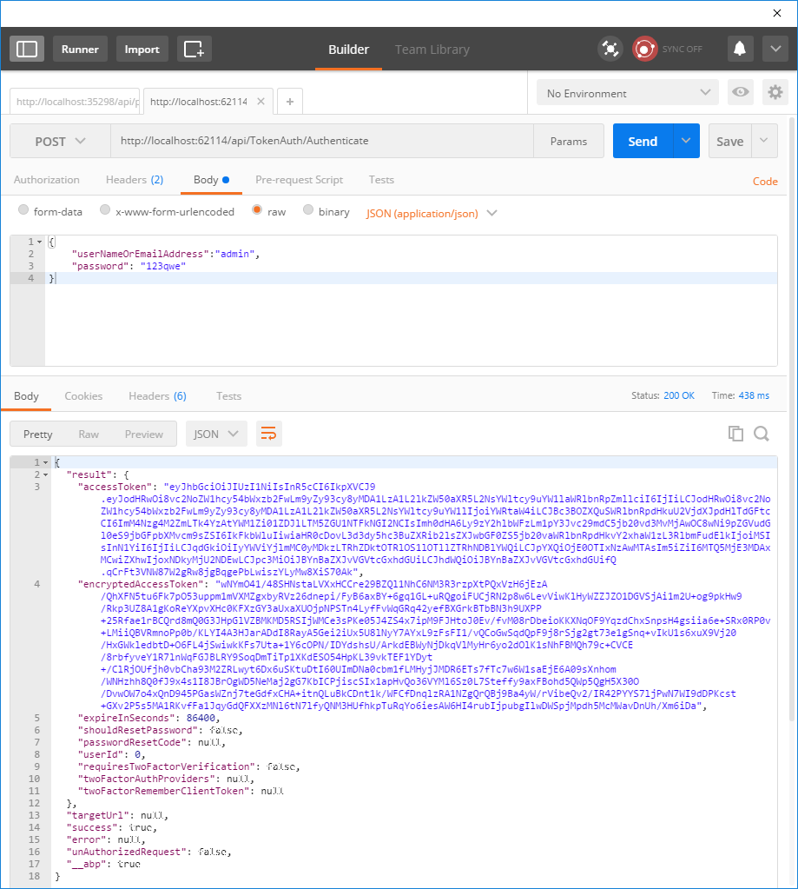

In the returning response, **accessToken** will be used to authorize for
the API.

#### Using API

After authenticate and get the access token, we can use it to call any
**authorized** actions. All **services** are available to be used
remotely. For example, we can use the **User service** to get a **list
of users**:

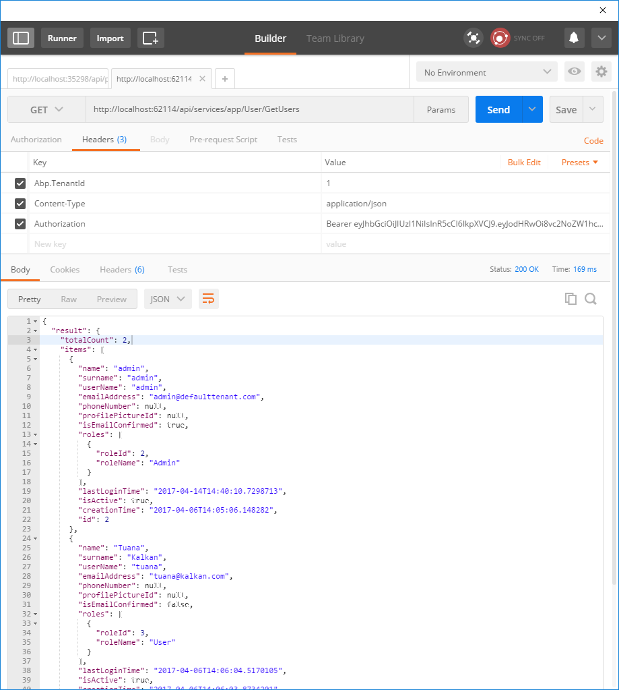

We sent a GET request to
http://localhost:62114**/api/services/app/User/GetUsers** and added
Authorization to the header as "**Bearer &lt;accessToken&gt;**".
Returning JSON contains the list of users.

### Swagger UI

[Swagger UI](http://swagger.io/swagger-ui/) is **integrated** to ASP.NET
Zero but **disabled by default**. Swagger UI configuration is located in
**S**<span class="auto-style3">tartup</span> class in the **.Web**
project. You can enable it by just uncommenting the related lines:

In Startup.**ConfigureServices** method, enable the following line:

    services.AddSwaggerGen();

And in Startup.Configure method, enable the following lines:

    app.UseSwagger();
    app.UseSwaggerUi();

You can browse **swagger ui** with this URL: "/**swagger/ui**".

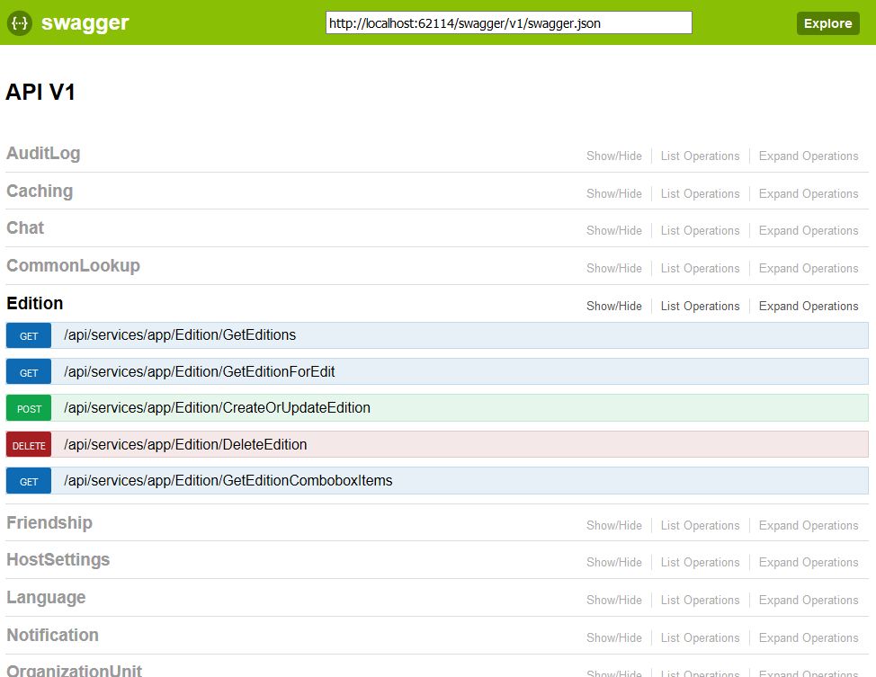

Thus, anyone (or any application) can explore, test and use the API
easily.

### Identity Server 4 Integration

[IdentityServer4](http://identityserver.io/) is an OpenID Connect and
OAuth 2.0 framework for ASP.NET Core. ASP.NET Zero is integrated to
IdentityServer4. It's **enabled by default**.

#### Configuration

You can enable/disable or configure it from **appsettings.json** file

    "IdentityServer": {
      "IsEnabled": "true",
      "Clients": [
        {
          "ClientId": "client",
          "AllowedGrantTypes": [ "password" ],
          "ClientSecrets": [
            {
              "Value": "def2edf7-5d42-4edc-a84a-30136c340e13"
            }
          ],
          "AllowedScopes": [ "default-api" ]
        },
        {
          "ClientId": "demo",
          "ClientName": "MVC Client Demo",
          "AllowedGrantTypes": [ "hybrid", "client_credentials" ],
          "RequireConsent": "true",
          "ClientSecrets": [
            {
              "Value": "def2edf7-5d42-4edc-a84a-30136c340e13"
            }
          ],
          "RedirectUris": [ "http://openidclientdemo.com:8001/signin-oidc" ],
          "PostLogoutRedirectUris": [ "http://openidclientdemo.com:8001/signout-callback-oidc" ],
          "AllowedScopes": [ "openid", "profile", "email", "phone", "default-api" ],
          "AllowOfflineAccess": "true"
        }
      ]
    }

#### Testing with Client

ASP.NET Zero solution has a sample console application
(ConsoleApiClient) that can connects to the application, authenticates
through IdentityServer4 and calls an API.

#### OpenId Connect Integration

Once IdentityServer4 integration is enabled Web.Mvc application becomes
an OpenId Connect server. That means another web application can use
standard OpenId Connect protocol to authenticate users with your
application and get permission to share their information (a.k.a.
consent screen).

#### More

See [IdentityServer4's own
documentation](http://docs.identityserver.io/en/latest/) to
understand and configure IdentityServer4.

### Unit Testing

ASP.NET Zero startup project contains **unit** and **integration**
tests. Tests are developed using following tools:

-   [xUnit](http://xunit.github.io/) as as testing framework.
-   [SQLite
    In-Memory](https://docs.microsoft.com/en-us/ef/core/miscellaneous/testing/sqlite)
    database for mocking entity framework and database.
-   [Abp.TestBase](http://www.nuget.org/packages/Abp.TestBase) to
    simplify integration testing for ABP based applications.
-   [Shouldly](https://github.com/shouldly/shouldly) as assertion
    library.

Tests cover **Domain** (core) and **Application** layers of the project.
Open Test Explorer (Test\\Windows\\Test Explorer in VS main menu) to run
unit tests:

Some unit tests (tenant creation, edition creation etc.) are only valid
in multi tenancy concept. You can change
AbpZeroTemplateConsts.MultiTenancyEnabled to false in order to make your
application single tenant. Thus, multitenancy related tests will be
skipped.


These unit tests will be a guide to understand the code. Also, they can
be a model while writing your own unit tests for your application's
functionalities.

All unit test classes (actually they are integration tests since they
work integrated to ABP, EntityFramework, AutoMapper and other libraries
used up to application layer) are derived from **AppTestBase**. It
initializes ABP system, mocks database using Effort, creates initial
test data and logins to the application for each tests. It also provides
some useful common methods for all tests.

Here, a sample unit test in the application:

    public class UserAppService_Delete_Tests : UserAppServiceTestBase
    {
        [Fact]
        public async Task Should_Delete_User()
        {
            //Arrange
            CreateTestUsers();
    
            var user = await GetUserByUserNameOrNullAsync("artdent");
            user.ShouldNotBe(null);
    
            //Act
            await UserAppService.DeleteUser(new IdInput<long>(user.Id));
    
            //Assert
            user = await GetUserByUserNameOrNullAsync("artdent");
            user.IsDeleted.ShouldBe(true);
        }
    }

It creates some users to test and then verifies there is a user named
"artdent". Then it calls **DeleteUser** method of the **user application
service** (which is being tested). Finally, checks if user is deleted.
Here, User is a Soft Delete entity, so it's **IsDeleted** property must
be true if it's deleted.

You can read [this
article](http://www.codeproject.com/Articles/871786/Unit-testing-in-Csharp-using-xUnit-Entity-Framewor)
to understand unit testing better.

### Publishing

**Email Settings**

If you don't configure email settings, some functions may not work (Like
new tenant registration).

Publishing ASP.NET Zero is not different than any other solution. You
can use Visual Studio as normally you do.

#### Publish to The Azure

Read [this document](Step-by-step-publish-to-azure-core-mvc.md) to publish to the Azure.

### ASP.NET Zero Power Tools

**ASP.NET Zero Power Tools** creates all related layers (including UI) by defining an entity.

See [documentation](https://aspnetzero.com/Documents/Development-Guide-Rad-Tool) to learn how to use it.

#### Configuration

ASP.NET Zero is properly configured for development. But when you want
to publish your application to your **test/production environment**, you
may need to change some configuration in order to make it properly work.
Each section in this document describes it's own configuration, but we
will provide a summary here.

Every application in the solution has it's own **appsettings.json** that
should be independently configured.

##### Web.Mvc Application

-   "**ConnectionStrings:Default**": Database connection string.
-   "**Abp.RedisCache**": Redis cache settings if you are enabled [Redis
    cache
    provider](https://aspnetboilerplate.com/Pages/Documents/Caching#redis-cache-integration).
-   "**App:WebSiteRootAddress**": Root URL of this application.
-   "**App:RedirectAllowedExternalWebSites**": A comma separated list of
    root URLs those are allowed to be redirected once user logins. For
    security reasons, ASP.NET Zero only redirects to local URLs except
    this list. If you will use the public web site, you should add it's
    root URL to this list.
-   "**Authentication**": Authentication settings especially for
    external login providers.
-   "**Recaptcha**": Recaptcha settings if you enabled it.
-   "**IdentityServer**": IdentityServer settings. It's important to
    disable it if you are not using IdentityServer. If you are using,
    ensure that you configured proper settings.
-   "**Payment**": Payment provider settings if you are developing a
    paid SaaS product.

Web.Public Application

-   "**ConnectionStrings:Default**": Database connection string.
-   "**App:WebSiteRootAddress**": Root URL of this application (the
    public web site).
-   "**App:AdminWebSiteRootAddress**": Root URL of the main (Web.Mvc)
    application.

Migrator Application

-   "**ConnectionStrings:Default**": Database connection string.

Web.Host Application

-   "**ConnectionStrings:Default**": Database connection string.
-   "**Abp.RedisCache**": Redis cache settings if you are enabled [Redis
    cache
    provider](https://aspnetboilerplate.com/Pages/Documents/Caching#redis-cache-integration).
-   "**App:**<span class="auto-style3">ServerRootAddress</span>": Root
    URL of this application.
-   "**App:ClientRootAddress**": Root URL of the Angular application (if
    you are using Angular as UI).
-   "**App:CorsOrigins**": Allowed origins for cross origin requests
    (splitted by comma).
-   "**Authentication**": Authentication settings especially for
    external login providers.
-   "**IdentityServer**": IdentityServer settings. It's important to
    disable it if you are not using IdentityServer. If you are using,
    ensure that you configured proper settings.
-   "**Payment**": Payment provider settings if you are developing a
    paid SaaS product.

#### Publishing to IIS

Read [this document](Step-by-step-core-publish-to-iis.md) to publish to the IIS.

#### Publishing to Docker Containers

ASP.NET Zero solution has a **build folder** which contains a Powershell
script to **build & publish** your solution to the **output** folder. It
also contains **Docker** files to run your application inside Docker
containers. These files are very simple, you can improve them based on
your needs.

#### Penetration Test

Asp.Net Zero (v5) has been scanned for vulnerabilities with the latest version of [OWASP ZAP (v2.7.0)](https://www.owasp.org/index.php/OWASP_Zed_Attack_Proxy_Project). The OWASP Zed Attack Proxy (ZAP) is one of the world's most popular security tools and is actively maintained by hundreds of international volunteers, see [Security-Report](Security-Report-Core.md) for details.

### Used Library & Frameworks

Many open source frameworks and libraries are used to build ASP.NET Zero
project. Here, a list of all libraries.

-   Server side
    -   [ASP.NET Boilerplate Framework &
        Module-Zero](https://aspnetboilerplate.com)
    -   [ASP.NET Core](https://docs.microsoft.com/en-us/aspnet/core/)
    -   [ASP.NET Identity Core (and social login
        extensions)](https://docs.microsoft.com/en-us/aspnet/core/security/authentication/identity)
    -   [SignalR](http://www.asp.net/signalr)
    -   [EntityFramework
        Core](https://docs.microsoft.com/en-us/ef/core/index)
    -   [Castle Windsor](http://www.castleproject.org/projects/windsor/)
    -   [AutoMapper](http://automapper.org/)
    -   [IdentityServer4](http://identityserver.io/)
    -   [HangFire](http://hangfire.io/)
    -   [Log4Net](https://logging.apache.org/log4net/)
    -   [PaulMiami reCAPTCHA](https://github.com/PaulMiami/reCAPTCHA)
    -   [xUnit](https://xunit.github.io/)
    -   [Swashbuckle](https://github.com/domaindrivendev/Ahoy)
    -   [StackExchange.Redis](https://github.com/StackExchange/StackExchange.Redis)
    -   [System.Linq.Dynamic.Core](https://github.com/StefH/System.Linq.Dynamic.Core)
    -   [EPPlus](http://epplus.codeplex.com/)
-   Client side
    -   [Metronic Theme](http://keenthemes.com/metronic-theme/)
    -   [Twitter Bootstrap](http://getbootstrap.com/)
    -   [Bootstrap Hover
        Dropdown](https://github.com/CWSpear/bootstrap-hover-dropdown)
    -   [Bootstrap Date Range
        Picker](https://github.com/dangrossman/bootstrap-daterangepicker)
    -   [Bootstrap Switch](http://www.bootstrap-switch.org/)
    -   [Bootstrap
        Select](http://silviomoreto.github.io/bootstrap-select)
    -   [jQuery](http://jquery.com/)
    -   [jQuery UI](http://jqueryui.com/)
    -   [jQuery BlockUI](http://malsup.com/jquery/block/)
    -   [jQuery Slimscroll](http://rocha.la/jQuery-slimScroll)
    -   [jQuery Sparkline](http://omnipotent.net/jquery.sparkline/)
    -   [jQuery Uniform](https://github.com/pixelmatrix/uniform)
    -   [jQuery Validation](http://jqueryvalidation.org/)
    -   [Datatables](https://datatables.net/)
    -   [jQuery Ajax Forms](http://malsup.com/jquery/form/)
    -   [jQuery Timeago](https://github.com/rmm5t/jquery-timeago)
    -   [Json2](https://github.com/douglascrockford/JSON-js)
    -   [Jcrop](https://github.com/tapmodo/Jcrop)
    -   [LocalForage](https://github.com/localForage/localForage)
    -   [Js Cookie](https://github.com/js-cookie/js-cookie)
    -   [Moment.js](http://momentjs.com/)
    -   [Moment.js Timezone](http://momentjs.com/timezone/)
    -   [Mustache.js](https://github.com/janl/mustache.js)
    -   [Underscore.js](http://underscorejs.org/)
    -   [JsTree](https://www.jstree.com/)
    -   [Morris](http://morrisjs.github.io/morris.js/)
    -   [Respondjs](https://github.com/scottjehl/Respond)
    -   [Font-Awesome](http://fontawesome.io/)
    -   [Famfamfam flags](http://www.famfamfam.com/lab/icons/flags/)
    -   [Simple Line
        Icons](http://thesabbir.github.io/simple-line-icons/)
    -   [SpinJs](http://fgnass.github.io/spin.js/)
    -   [SweetAlert](http://t4t5.github.io/sweetalert/)
    -   [Toastr](http://codeseven.github.io/toastr/)
