# Development Guide

## Introduction

In the [Getting Started](Getting-Started.md) document, a new sample
project is created named "**Acme.PhoneBook**". This document is a guide
while developing your project. You should definitely read this document
before starting your custom development. Since ASP.NET Zero is built on
[ASP.NET Boilerplate](https://aspnetboilerplate.com/) application
framework, this document repeatedly refers ASP.NET Boilerplate's
[documentation](https://aspnetboilerplate.com/Pages/Documents).

Before reading this document, you should run the application and explore
the user interface. This will help you to have a better understanding of
concepts defined here.

### Pre Requirements

The following tools are needed in order to use the ASP.NET Zero
solution:

-   Visual Studio 2017 v15.3.5 or higher
-   Visual Studio Extensions:
    -   [Typescript](https://www.microsoft.com/en-us/download/details.aspx?id=48593)
        2+
-   SQL Server

### Solution Structure (Layers)

When you create and [download](https://aspnetzero.com/Download) your project, there will be a
solution structure as shown below:


There are seven projects in the solution:

-   **Core** project contains domain layer classes (like
    [entities](https://aspnetboilerplate.com/Pages/Documents/Entities)
    and [domain
    services](https://aspnetboilerplate.com/Pages/Documents/Domain-Services)).
-   **Application** project contains application logic (like
    [application
    services](https://aspnetboilerplate.com/Pages/Documents/Application-Services)
    and
    [DTO](https://aspnetboilerplate.com/Pages/Documents/Data-Transfer-Objects)s).
-   **EntityFramework** project contains your DbContext,
    [repository](https://aspnetboilerplate.com/Pages/Documents/Repositories)
    implementations, database migrations and other EntityFramework
    specific concepts.
-   **WebApi** project contains Web API Controllers.
-   **Web** project contains the presentation layer (javascripts, styles
    and views).
-   **Migrator** project is a console application that runs database
    migrations.
-   **Tests** project contains unit and integration tests.

### Applications

ASP.NET Zero solution contains **four** applications:

-   **Front End MVC Application**: This can be used to create a public
    web site or a landing page for your application.
-   **AngularJS Back End Single-Page** **Application**. This is the
    application which is entered by username and password. It's built as
    a SPA with AngularJS.
-   **MVC Back End Multi-Page Application**: This has identical
    functionality with the AngularJS application but is built using MVC
    and jQuery (no AngularJS).
-   **Migrator**: Console application that runs database migrations.

Thus, the back-end application is built in two different architectures
(SPA and MPA). You can choose the one you are most comfortable with. If
you just want to build a SPA, you can safely remove MPA files from your
project, or vice versa.

### Multi tenancy

Multi-tenancy is used to build **SaaS** (Software as a Service)
applications easily. With this technique, we can deploy **single
application** to serve to **multiple customers**. Each Tenant will have
it's own **roles**, **users** and **settings**.

All of the ASP.NET Zero's code-base is developed to be **multi-tenant**.
But, it [**can be disabled**](Getting-Started#DocConfigureMultiTenancy)
with a single line of configuration if you are developing
**single-tenant** application. If you disable it, all multi-tenancy
stuff will be hidden and not available. If multi-tenancy is disabled,
there will be a single tenant named **Default**.

There are two types of perspective in multi-tenant applications:

-   **Host**: Manages tenants and system. This is you, the SaaS
    provider.
-   **Tenant**: Uses the application features. This is your customers.

ASP.NET Zero uses ABP's (ASP.NET Boilerplate) **[data
filters](https://aspnetboilerplate.com/Pages/Documents/Data-Filters)**.
Therefore it automatically filters tenant data if you properly use
filter interfaces. Read [multi-tenant
documentation](https://aspnetboilerplate.com/Pages/Documents/Multi-Tenancy)
if you are building multi-tenant applications.

### Web Site Root URL

**web.config** file contains a setting, named "**WebSiteRootAddress**",
which stores root URL of the web application:

    <add key="WebSiteRootAddress" value="http://localhost:6240/" />

It's used to calculate some URLs in the application. So, you need to
change this on deployment. For multi-tenant applications, this URL can
contain dynamic tenancy name. In that case, put {TENANCY\_NAME} instead
of tenancy name like:

    <add key="WebSiteRootAddress" value="http://{TENANCY_NAME}.mydomain.com/" />

Thus, ASP.NET Zero can automatically detect current tenant from URLs. If
you configure it as above, you should also redirect all subdomains to
your application. To do that;

1.  You should configure DNS to redirect all subdomains to a static IP
    address. To declare 'all subdomains', you can use a wildcard e.g.
    **\*.mydomain.com**.
2.  You should configure IIS to bind this static IP to your application.

There may be other ways of doing it but this is the simplest.

## Front End MVC Application

ASP.NET Zero contains front-end pages that can be a starting point for
your public web site or a landing page for the application. When you
first run the project, you will see the Home Page as shown below:


There are two pages here: **Home Page** and **About**. Content of these
pages initially consists of placeholders for demo purposes that you
should change. You can completely remove that content and build your
page based on your needs. Also, you should change the **logo** with your
Company's logo, of course.

See [metronic front-end
theme](http://keenthemes.com/multi-purpose-corporate-frontend-themefreebie-corporate-frontend-theme/)
to review the myriad options and components available as part of the
theme - they are an extensive resource that will enable you to more
quickly build a richer web site.

Menus are defined in **FrontEndNavigationProvider** class. When you add
a new menu item here, it will be automatically shown in the menu. There
is a **Login** link at the top right corner. This link takes us to the
**Login page** for the **backend** application.

### Layout

Layout of front-end pages is located in the **Views/Layout** folder of
the **.Web** project:

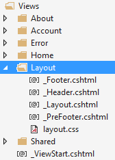

**\_Layout** is the main layout file that includes scripts and styles.
Language flags and the menu is rendered in **\_Header** file.
\_PreFooter is not used but you can add it to the \_Layout if you want.

### Tenant Sign Up

When you click the "New tenant" link in the front end application, you
can sign up to become a new tenant:

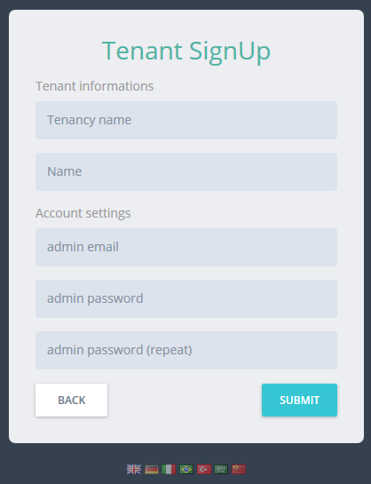

Here, you can create a new tenant. **TenantRegistrationController** is
used to register a new tenant. Tenant registration can be
enabled/disabled and settings can be changed in the settings page of the
backend application.

## Account Controller

**AccountController** provides **login**, **register**, **forgot
password** and **email activation** pages.

### Layout

Account management pages have a separate **\_Layout** view under
**Views/Account** folder:

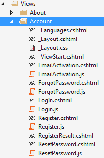

### Login

Main view for the AccountController is the Login page:


The first input is **tenancy name** which is shown only in a
**multi-tenant** application and if "subdomain tenancy name detection"
is **not possible** (See host settings section). There is a single
tenant named **Default** in the initial database (see Entity framework
section for initial seed data). Leave tenancy name input as blank to
login as **host**.

You can use **admin** user name and **123qwe** password when you first
run the application. At first login, you should change admin password
since **123qwe** is not very secure:

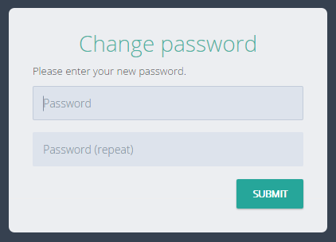

After changing password you will be redirected to the Angular
application.

### Social Logins

ASP.NET Zero supports social media logins. To enable it, you should
change the following settings in the **web.config** file.

    <add key="ExternalAuth.Facebook.IsEnabled" value="false" />
    <add key="ExternalAuth.Facebook.AppId" value="" />
    <add key="ExternalAuth.Facebook.AppSecret" value="" />
        
    <add key="ExternalAuth.Twitter.IsEnabled" value="false" />
    <add key="ExternalAuth.Twitter.ConsumerKey" value="" />
    <add key="ExternalAuth.Twitter.ConsumerSecret" value="" />
    
    <add key="ExternalAuth.Google.IsEnabled" value="false" />
    <add key="ExternalAuth.Google.ClientId" value="" />
    <add key="ExternalAuth.Google.ClientSecret" value="" />

You can separately enable and configure each social media login option.
To learn 'how to obtain social media API keys for your application', you
can refer to [this
document](http://www.asp.net/mvc/overview/security/create-an-aspnet-mvc-5-app-with-facebook-and-google-oauth2-and-openid-sign-on)
or search the web (there are many resources on the web). So, we will not
go to details of creating apps on social medias. Once you get your keys,
you can write them into web.config. When you enable it, social media
logos are shown on the login page as shown below:

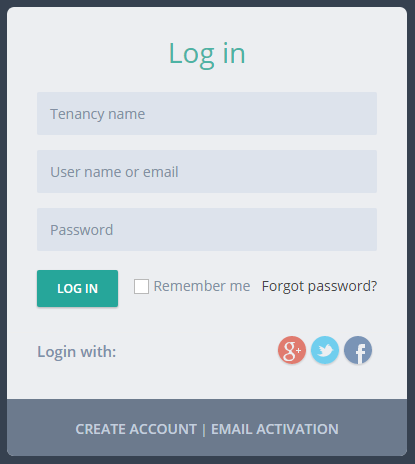

Then you can click a social media icon to login with your existing
account. Check **Startup** class to see where this configuration is
used. You can add more social media options yourself.

### OpenId Connect Login

In addition to social logins, ASP.NET Zero integrates with OpenId
Connect login. It's configuration can be changed in **web.config**:

    <add key="ExternalAuth.OpenId.IsEnabled" value="false" />
    <add key="ExternalAuth.OpenId.Authority" value="" />
    <add key="ExternalAuth.OpenId.ClientId" value="" />
    <add key="ExternalAuth.OpenId.ClientSecret" value="" />

A logo (similar to social logos above) is shown in Login page when its
enabled.

### Active Directory Federation Service (ADFS) Login

ADFS is just another external login like the social logins. In order to
configure ADFS login, you just need to configure the following settings
in the **web.config** file.

    <add key="ExternalAuth.WsFederation.IsEnabled" value="false" />
    <add key="ExternalAuth.WsFederation.MetaDataAddress" value="" />
    <add key="ExternalAuth.WsFederation.Wtrealm" value="" />

### Two Factor Login

ASP.NET Zero is ready to provide two factor login, but its disabled by
default. You can easily enable it in the host settings page (on the
Security tab):


Note: In a multi-tenant application, two factor authentication is
available to tenants only if it's enabled in the host settings. Also,
email verification and SMS verification settings are only available in
the host side. This is by design.

When its enabled, the user is asked to select a verification provider
after entering their name and password:

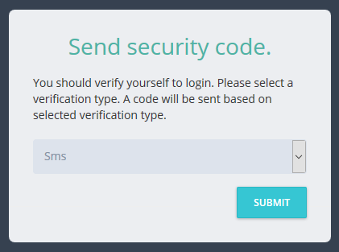

After that, a **confirmation code** is sent to the selected provider and
the user enters the code in the next page:

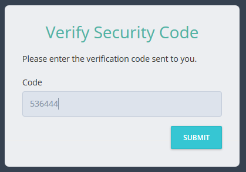

#### Email Verification

This is available if the user has a confirmed email address. Since email
sending is disabled in debug mode, you can see the code in logs. In
release mode, email will be sent (you can change this and make emailing
available in debug as well -- see the sending emails section).

#### SMS Verification

This is available if the user has a confirmed phone number. Note that
SMS sending is not fully implemented because it requires an integration
to an SMS vendor. The current implementation just writes security codes
to logs. You should complete the **IdentitySmsMessageService** class in
the solution to make it usable. Otherwise, disable SMS verification in
the settings.

### User Lockout

As seen in the previous section, you can configure user lockout
settings. Users are locked out when they enter wrong password for a
specified count and duration.

### Register

When you click the "**Create Account**" link in the login page, a
registration form is shown:

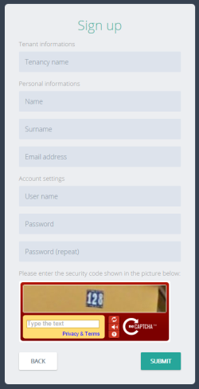

A user can be registered for a tenant, not for host if this is a
multi-tenant application. If it is single-teant, there will be no
tenancy name input here.

**Recaptcha** (security question) is optional. It uses Google's
recaptcha service. Recaptcha service works per domain. So, to make it
properly work, you should create your own private and public keys for
your domain on <https://www.google.com/recaptcha> and replace the keys
in the **web.config** file.

### Email Activation

When a user registers as shown above, an email confirmation code is sent
to their email address. If user did not receive this email for some
reason, he can click Email activation and re-send the confirmation code.

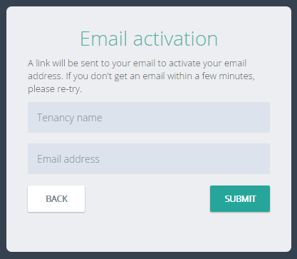

Again, Tenancy name input is not shown for a single-tenant application
or when tenant name is known via subdomain (like
tenancyname.mydomain.com).

### Forgot Password

If a user forgots their password, they can click the "Forgot Password"
link and will then be sent an email to reset their password.

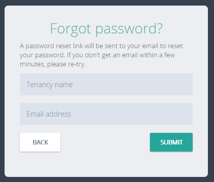

## AngularJS Back End Single-Page Application

The backend in ASP.NET Zero is a **single page AngularJS application**.
When you login, you are redirected to the **ApplicationController**. It
returns the layout view of the application.

**Note**: There is also a multi-page version of the same application
built with ASP.NET MVC and jQuery (see the related section in this
document).

### Application Folders

All view, script and styles files are located in **App** folder (not all
folders/files are not shown here):

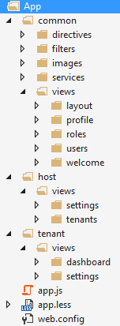

There are three main folders here:

-   **common**: Contains common resources used by both host and tenants.
-   **host**: Contains host-specific resources.
-   **tenant**: Contains tenant-specific resources.

Given a view, directive, service, image -- used by both tenants and host
-- it should be placed under the **common** folder as shown above. You
should place the tenant or host specific directives, services, etc.
under their own folder, not in the common folder. If you are developing
a single-tenant application, you can place your files under the tenant
section.

### Main Menu

Application's main menu is defined in the **AppNavigationProvider**
class. See ABP's [navigation
documentation](https://aspnetboilerplate.com/Pages/Documents/Navigation)
to get a deep understanding on creating menus.

### Routes

**app.js** is the entrance point of the application. You define the
**app** AngularJS module and AngularJS **routes** in this file. Angular
**ui-router** is used for routing. Routes (states in ui-router) are
dynamically defined based on the current user's permissions (see
authorization section). Example:

```javascript
if (abp.auth.hasPermission('Pages.Administration.Tenant.Settings')) {
    $stateProvider.state('tenant.settings', {
        url: '/settings',
        templateUrl: '~/App/tenant/views/settings/index.cshtml',
        menu: 'Administration.Settings.Tenant'
    });
}
```

Conditional routing definition prevents users from accessing an
unauthorized page by simply entering a URL into the browser's address
bar. **Menu** definition helps us to highlight the appropriate menu item
when this route is activated.

As you see, **.cshtml** files are used for views. While **.html** files
can be used, using .cshtml files allows us to take advantage of Razor's
power when creating views.

### Layout

Layout of the application is located under common/views/**layout**
folder. All scripts and styles in the App folder (and subfolders) are
**bundled** (see AppBundleConfig class). Any scripts and styles that you
place there will be automatically added to the layout.


Layout consists of different parts as shown above. The main menu is
rendered in **sidebar**.

### Edition Management

*If you're not developing a multi-tenant application, you can skip this
section.*

Most **SaaS** (multi-tenant) applications have **editions** (packages)
which contain different **feature sets**. That us how they can provide
different **price and other options** to their tenants
(customers). **Editions page** (available in host login) is used to
manage an application's editions:

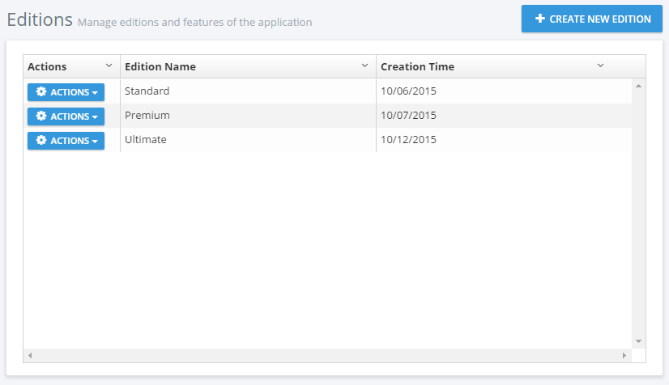

Editions are used to group feature values and assign to tenants. When
you click Actions/Edit for an edition, you can see the assigned features
for that edition:


The startup project only contains the Chat feature (and it's wto
sub-features) and they can be enabled/disabled per edition/tenant. All
features are defined in **AppFeatureProvider** class. Feature values are
stored in the **AbpFeatures** table. Features are not restricted to
boolean (enabled/disabled) values and can contain different types of
values as shown below: 


 See [feature
management](https://aspnetboilerplate.com/Pages/Documents/Feature-Management)
and [edition
management](https://aspnetboilerplate.com/Pages/Documents/Zero/Edition-Management)
documents for more information.

### Tenant Management

*If you're not developing a multi-tenant application, you can skip this
section.*

If this is a multi-tenant application and you logged in as a host user,
then tenants page is shown:

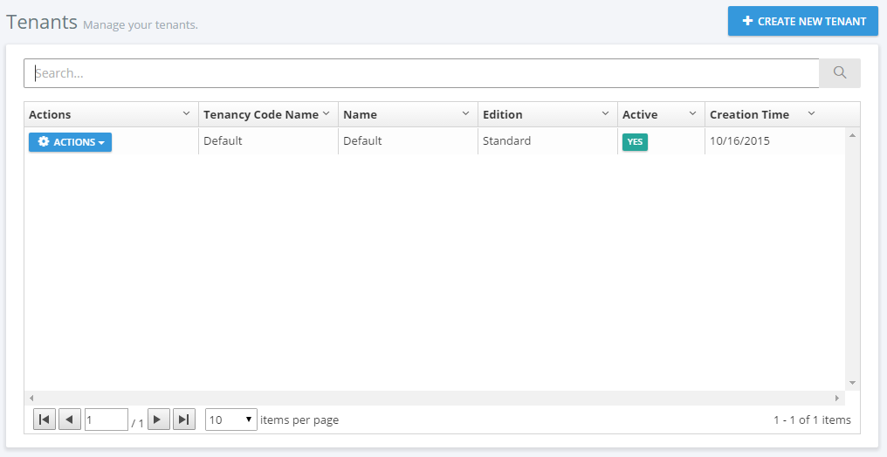

A tenant is represented by the **Tenant** class. The Tenant class can be
extended by adding new properties. Initially, there is only one tenant,
named **Default**. **Tenancy Name** (code name) is the **unique** name
of a tenant. A tenant can be **active** or **passive**. If it is
passive, users associated with this tenant cannot login to the
application.

When you click the "**Create new Tenant**" button, a dialog is shown:

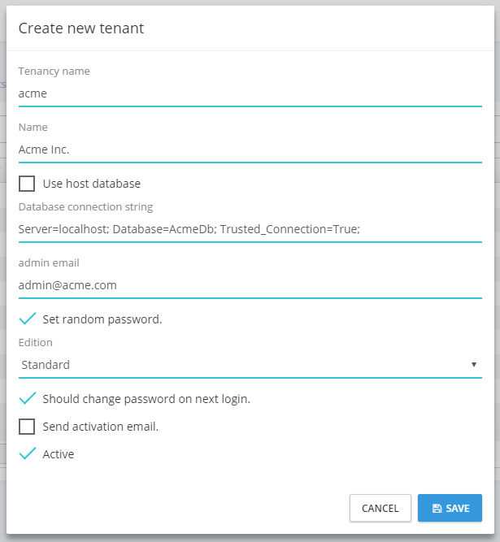

**Tenancy name** should be unique and not contain spaces or other
special chars since it may be used as the subdomain name (e.g.
tenancyname.mydomain.com -- see the section below). **Name** can be
anything. **Admin email** is used as the email address of the admin user
of the new tenant. Admin user is automatically created with the tenant.
You can set a random password for admin and send an activation email.
When the user first logs in, he/she should change the password. You can
uncheck this to enter a known password.

When you create a new tenant, you should select/create a database to
store the new tenant's data. You can select '**Use host database**' to
store tenant data in host database (can be used for single database
approach) or you can specify a connection string to create/use a
**dedicated database** for the new tenant. ASP.NET Zero supports a
**hybrid** approach. That means you can use host database for some
tenants and create dedicated databases for other tenants. You can even
**group** some tenants in a separated database.

All tenant actions are handled by the **TenantAppService** class.
Example (deleting a tenant):

    [AbpAuthorize(AppPermissions.Pages_Tenants_Delete)]
    public async Task DeleteTenant(EntityRequestInput input)
    {
        var tenant = await TenantManager.GetByIdAsync(input.Id);
        CheckErrors(await TenantManager.DeleteAsync(tenant));
    }

TenantAppService mostly uses **TenantManager** domain service for tenant
operations.

#### Tenant Edition and Features

An **edition** can be **assigned** to a tenant during tenant creation or
by editing the tenant. The tenant will inherit all features of the
assigned edition. You can also override features and values for a
tenant. Click **actions/change features** for a tenant to **customize**
its features:

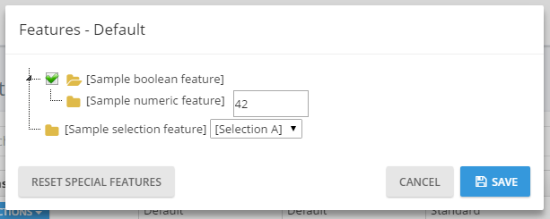

#### Tenant User Impersonation

As a host user, you may want to perform operations on behalf of a
tenant. In that case, you can click the Actions button of a tenant and
select "**Login as this tenant**" option:

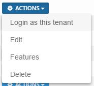

When you click it, you see **a modal to select a user** of the tenant.
You can select any user and perform such operations as that user is
allowed. See **User Impersonation** section in this document for more
information.

#### Using Tenancy Name As Subdomain

A multi-tenant application generally uses subdomains to identify current
tenant. **tenant1**.mydomain.com, **tenant2**.mydomain.com and so on.
ASP.NET Zero automatically identifies and gets the tenant name from the
subdomain (see host settings section).

### Organization Units

Organization units (OU) are used to hierarchically group users and
entities. Then you can get user or entities based on their OUs. When you
click Administration/Organization units, you go to the related page:

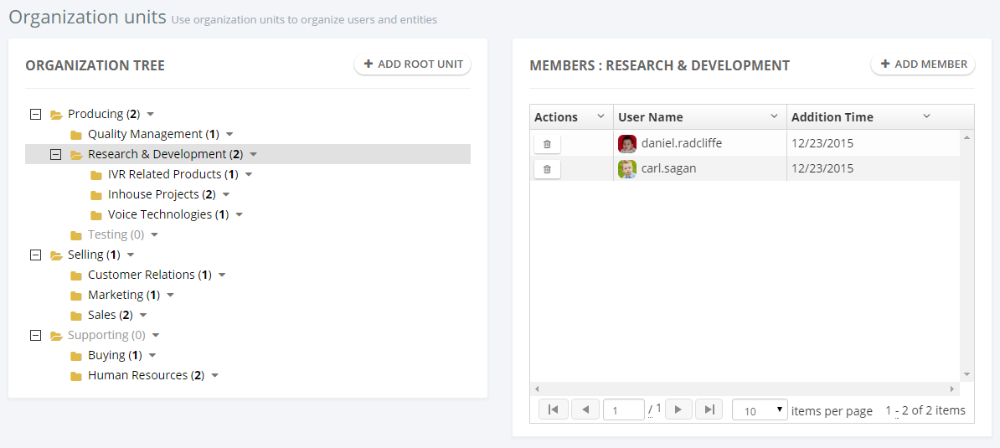

Here, you can manage OUs (create, edit, delele, move) and members
(add/remove).

**OrganizationUnitManager** is used to manage OUs, **UserManager** is
used to manage OU members in the code. **OrganizationUnitAppService**
performs the application logic.

In the left OU tree, you can **right click** to an OU (or left click to
**arrow** at the right) to open **context menu** for OU operations. When
you try to **add a member**, a modal is shown to select the user:


This is actually a **generic lookup modal** and can be used to select
any type of entity (see App/common/views/common/lookup.js and
corresponding view). To select the users, you create a **FindUsers**
method in **CommonLookupAppService** then configure the modal to work
with that method (see organizationUnits/index.js file for usage of
lookupModal.open).

See [organization unit management
document](https://aspnetboilerplate.com/Pages/Documents/Zero/Organization-Units)
for more information.

### Role Management

When you click Administration/Roles menu, you go to the role management
page:


Roles are used to **group permissions**. When a user has a role, then
he/she will have all permissions of that role.

A role is represented by the **Role** class. The role class can be
extended by adding new properties.

**RoleManager** performs domain logic; **RoleAppService** performs
application logic for roles.

Roles can be dynamic or static:

-   **Static role**: A static role has a known **name** (like 'admin')
    and you cannot change this name (you can change **the display
    name**). It exists on the system startup and can not be deleted,
    thus allowing us to depend on the unchanging static role name in our
    code.
-   **Dynamic role**: You can create a dynamic role after deployment.
    Then you can grant permissions for that role, assign the role to
    some users, and/or delete it. Obviously, you cannot depend on
    knowing names of dynamic roles when in the development context.

One or more roles can be set as **default**. Default roles are assigned
to newly added/registered users as default. This is not a development
time property and can be set or changed after deployment.

In the startup project, you have a static **admin** role for the host
(for multi-tenant apps). Also, you have a static **admin** and **user**
roles for tenants. **Admin** roles have all permissions granted by
default. **User** role is the **default** role for new users and has no
permissions by default. These can be changed easily. See
**StaticRoleNames** class for all static roles and **AppRoleConfig** for
changing static roles.

#### Role Permissions

Since roles are used to group permissions, you can set permissions of a
role while creating or editing as shown below:


(not all permissions are shown in the figure above)

Every tenant has its own roles and any change in roles for a tenant does
not affect other tenants. Also, host has its own isolated roles.

### User Management

When you click on the Administration/Users menu item, you go to the user
management page:


**Users** are people who can **login** to the application and perform some operations based on their **permissions**.

**User** class represents a user. User class can be extended by adding new properties.

**UserManager** is used to perform domain logic; **UserAppService** is used to perform application logic for users.

A user can have zero or more **roles**. If a user has more than one
role, he inherits union of permissions of all the roles assigned to
him/her. Also, you can set **user-specific permissions**. A user
specific permission setting overrides role settings for this permission.
A screenshot of user permission dialog (not all permissions are shown
here):


(not all permissions shown in the figure above)

A dialog is used to create/edit a user:

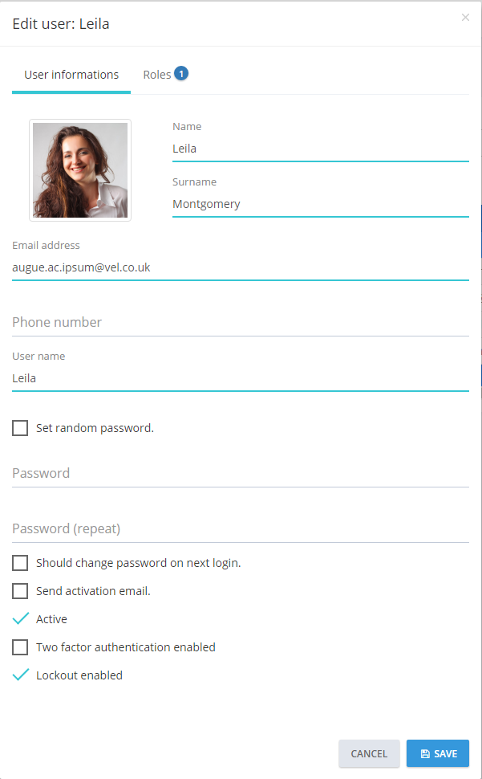

You can change user's **password**, make him **active/passive** and so
on. A user can have a **profile picture**. It can be changed by the user
(see User Menu section). **Admin** user cannot be deleted as a business
rule. If you don't want to use admin, you can make it passive.

#### User Impersonation

As admin (or any allowed user), you may want to login as a user and
perform operations on behalf of that user, without knowing their
password. Click Actions button for any user and select "**Login as this
user**":


When you click it, you are automatically redirected and logged in as
this user. This is called "**user impersonation**". When you impersonate
a user, a "**back to my account**" option is added to the user profile
menu:


In an impersonated account, you can only perform operations that that
user is allowed to do. That means everything works **exactly** the same
as if that user logged in themself. The only difference is that audit
logs will indicate that operations are performed by somebody else. Note
that also a **red 'back' icon** is shown close to the username to
indicate that you are currently impersonating another user.

Impersonation is done in **AccountController** of the Web project.

### Language Management

The language management page is used to manage (add/edit/delete)
**application languages** and change **localized texts**:

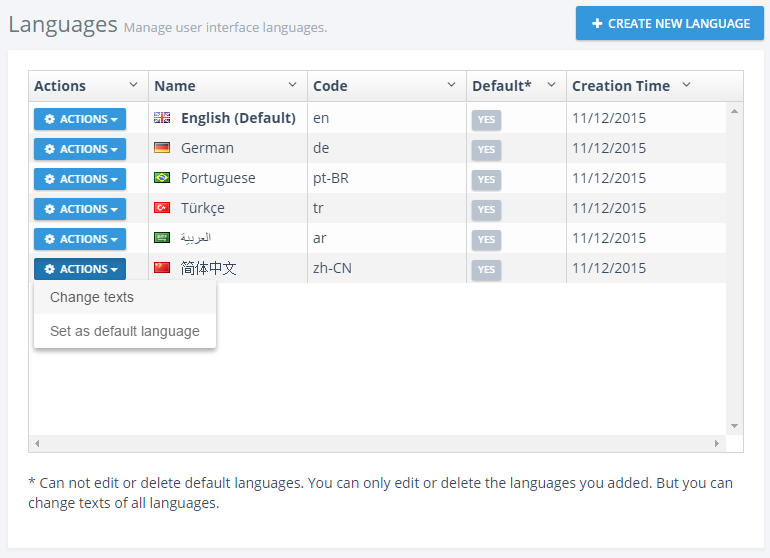

You can create new language, edit/delete an existing language and **set
a language as default**. When you click to **Change text** for any
language, you are redirected to a new view to edit language texts:


You can select any language as a **base** (reference) and change the
**target** language's texts. Since there may be different [localization
sources](https://aspnetboilerplate.com/Pages/Documents/Localization#DocLocalizationSources),
you select the source to translate. When you click the edit icon, you
can see the edit modal for the selected text:


**Host** users (if allowed) can edit languages and localized texts.
These languages will be default for all tenants for a multi-tenant
application. **Tenants** inherit languages and localized texts and can
**override** localized texts or can add new languages.

Both pages use the **LanguageAppService** class as application service.
It has methods to manage languages and localized texts. **The
IApplicationLanguageManager** and **IApplicationLanguageTextManager**
interfaces are used to perform domain logic (as used by
LanguageAppService).

See [language management
documentation](https://aspnetboilerplate.com/Pages/Documents/Zero/Language-Management)
for more information.

### Audit Logs

The audit logs page displays all user interactions with the application:

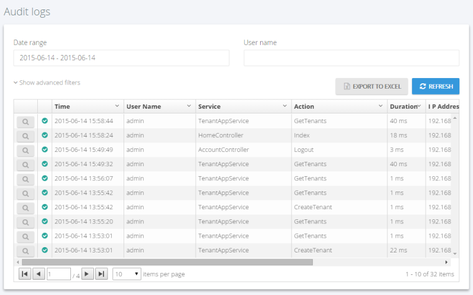

All application service methods and MVC controller actions are
automatically logged and can be viewed here. See [audit logs
documentation](https://aspnetboilerplate.com/Pages/Documents/Audit-Logging)
to learn how to configure it. When you click the magnifier icon, you can
see all details for an audit log entry:

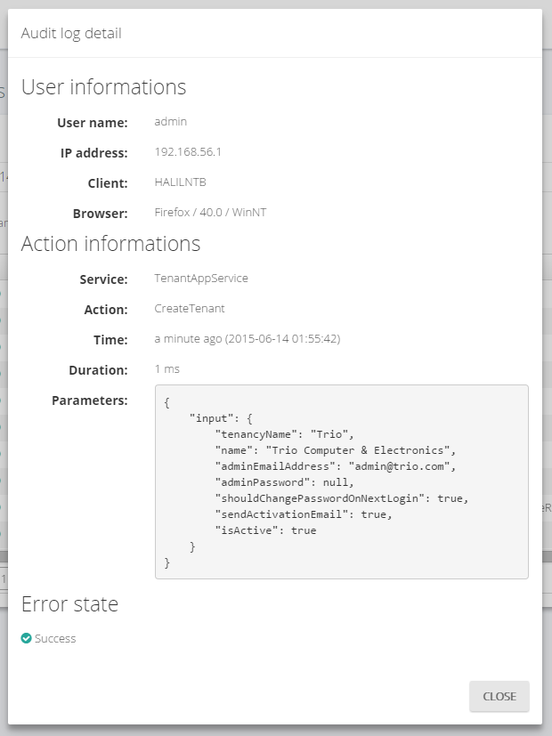

The audit log report is provided by the **AuditLogAppService** class.

### Host Settings

The host settings page is used to configure some system settings:


**Timezone** is an important setting on this page. ASP.NET Zero can work
in multiple timezones. While it's easy to change, default startup
solution does not enable UTC datetimes. See [timing
document](https://aspnetboilerplate.com/Pages/Documents/Timing) to know
how to change.

When you switch to UTC datetime, all DateTimes are stored as UTC by
default, but each user can see dates and times in his own time zone.
Timezone setting on this page allows you to set a default time zone for
the application including all tenants and users. Tenants and users can
change the time zone in their own settings.

On the host settings page, there are also other settings. The "SAVE ALL"
button saves all settings in one click. HostSettingAppService is used to
retrieve and save settings (see setting provider section for more
information).

The **Security** tab on the host settings page contains password
complexity settings. The host can define system wide password complexity
settings on this tab. Each tenant can override this setting on the
tenant settings page. **PasswordComplexityChecker** class is responsible
for checking if a password satisfies the password complexity settings.

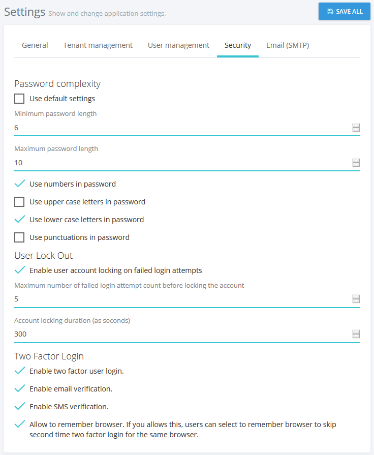

### Tenant Settings

In a multi-tenant application, tenant settings are shown as below:


If you disable multi-tenancy, some host settings are also shown on this
page (since there is no host setting page). Tenants can also define
password complexity settings for their users or they can use password
complexity settings defined by the host user.

The **TenantSettingAppService** is used to get/set tenant settings.

#### Enabling LDAP (Active Directory) Authentication

LDAP (Active Directory) Authentication is disabled by default. To make
it work, you should disable multi-tenancy since LDAP auth is not used in
a multi-tenant system normally. In CoreModule class in .Core project,
you should enable the following line:

    Configuration.Modules.ZeroLdap().Enable(typeof(AppLdapAuthenticationSource));

Then you can see the **LDAP settings** section on the settings page:

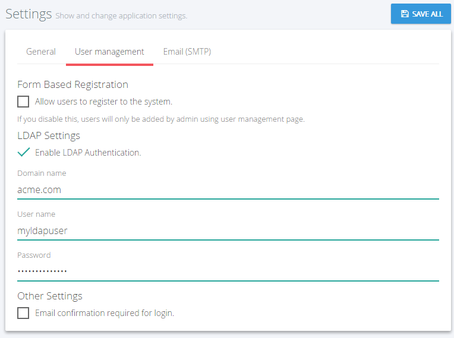

You can check "**Enable LDAP Authentication**" to enable it. If the
server works in domain mode and the application runs with a domain user
or local system, then generally there is **no need** to set the domain
name, user, and password. You can logout and then login with your
**domain user name and password**. If not, you should set this
information.

### Maintenance

The maintenance page is only available to the **host** and is shown
below:

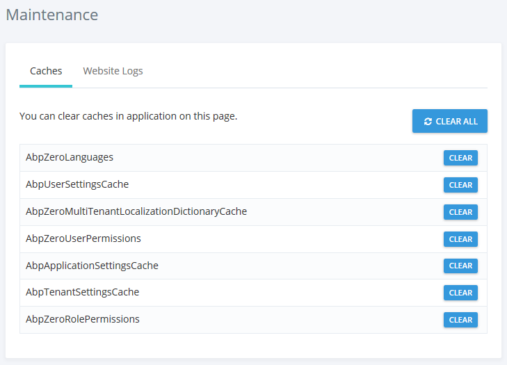

On the **Caches** tab you can clear some or all caches. Clearing caches
may be needed if you manually change the database and want to refresh
the application cache. **CachingAppService** is used to clear caches on
the server side.

**Website Logs** tab is used to see and download logs:

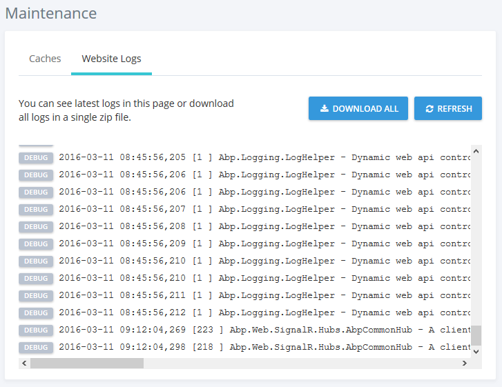

**WebLogAppService** is used to get logs from server.

### Tenant Dashboard

ASP.NET Zero startup project also includes a **sample** dashboard. It is
just for demo purposes, you can use it as a starting point for your
actual dashboard:

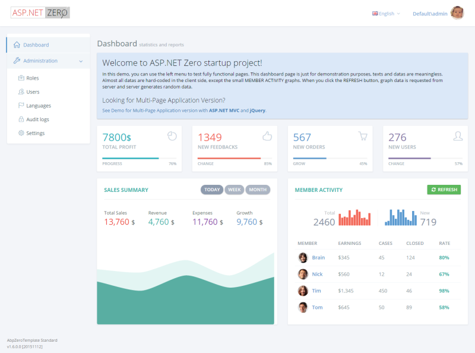

Here, only **Member Activity** graph data is retrieved from server (from
**TenantDashboardAppService**). You can click the refresh button to
generate random graphs.

### Notifications

Notification icon is located next to the language selection button. The
number in the red circle shows the unread notification count.


A user can see three recent notifications by clicking this icon.

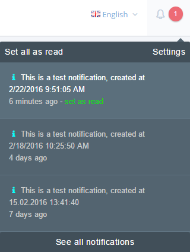

A user can mark all notifications as read by clicking the "Set all as
read" link or can mark a single notification by clicking the "set as
read" link next to each notification.

#### Notification Settings

"Settings" link opens notification settings dialog.


In this dialog there is a global setting for the user to enable/disable
receiving notifications. If this setting is enabled, then the user can
enable/disable each notification individually.

You can also define your custom notifications in the
**AppNotificationProvider** class. For example, a new user registration
notification is defined in the **AppNotificationProvider** as below.

```csharp
context.Manager.Add(
     new NotificationDefinition(
        AppNotificationNames.NewUserRegistered,
        displayName: L("NewUserRegisteredNotificationDefinition"),
        permissionDependency: new SimplePermissionDependency(AppPermissions.Pages_Administration_Users)
    )
);
```

See [notification
definitions](https://aspnetboilerplate.com/Pages/Documents/Notification-System#notification-definitions)
section for detailed information.

The **AppNotifier** class is used to publish notifications. The
**NotificationAppService** class is used to manage application logic for
notifications. See [notifications
documentation](https://aspnetboilerplate.com/Pages/Documents/Notification-System)
for detailed information.

#### Notification List

All notifications connected to the user are listed on this page.

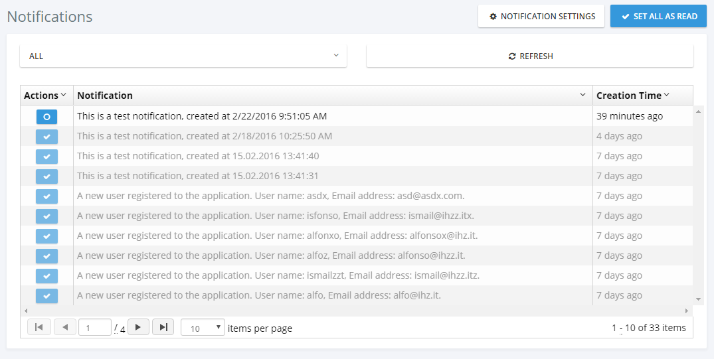

### Chat

The chat icon is located next to the user's profile image on the top
right corner of the page. The number in the red circle shows the total
unread chat message count.

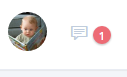

When user clicks this icon, a chat panel appears on the right of page.
This panel contains a list of friends of the user and a list of blocked
users.


A user can add new friends by writing their username(s) into the
username textbox above the friend list. If the "Chat with other tenants"
feature is enabled for the tenant, users of other tenants can be added
as a friend by writing \[tenancy name\]\\\[user name\] (ex:
Default\\admin). If the "Chat with host users" feature is enabled, host
users can be added as friends by writing .\\\[user name\] in the same
textbox.

Online friends/users have a green circle on their profile image; offline
friends/users have a gray circle.

A user can pin or unpin the chat panel by clicking the pin icon on the
top right corner of the chat panel. The application will remember the
last state of chat panel and restores it when the user logs in to
application.

When a friend/user is selected, the conversation panel is opened.


A user can block or unblock their friends/other users in this area.
There is a wrench icon to the right of the selected user's username.
This icon opens an action menu that contains "block user" or "unblock
user" actions according to the target user's block status.

Chat messages are distributed via the **ChatHub** SignalR hub class
which uses the **ChatMessageManager** domain class.

The **ChatUserStateWatcher** class is responsible for watching
online/offline state changes of chat users. When a user's status changes
from online to offline, or vice-versa, this class catches the state
change and notifies friends of the related user.

The **FriendshipAppService** and the **FriendshipManager** classes are
responsible for managing friendship requests. Chat messages from blocked
users are not delivered to target users.

Since chat is a real time operation, the application caches friends of
online users and unread message count from each friend. The
**UserFriendsCache** class manages these caching operations.

The **UserFriendCacheSyncronizer** class is responsible for keeping the
user friends cache up to date. In order to do that, it watches some
events of the Friendship and ChatMessage entities.

#### Chat Features

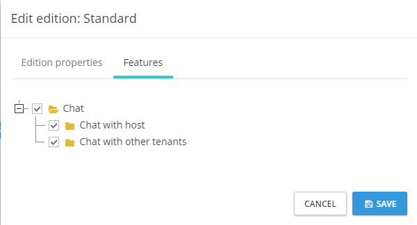

There are three chat features in the system. These are "Chat", "Chat
with host", "Chat with other tenants". These features can be
enabled/disabled per edition/tenant. By using these features the host
can enable/disable chat with other tenant's users or host users.

### User Menu

A user can click his name at the top right corner to open the user menu:

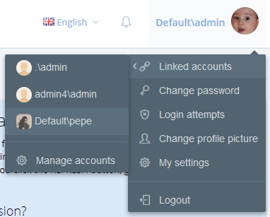

#### Linked Accounts

Linked accounts are used to link multiple accounts to each other. A user
can easily navigate through his/her accounts using this feature.

A user can link new accounts or delete already linked accounts by
clicking the "Manage accounts" link.


In order to link a new account, a user must enter the login credentials
of the related account.

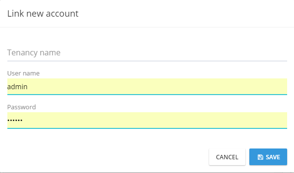

The **UserLinkAppService** class is used to manage application logic for
account linking; the **UserLinkManager** class is used to manage domain
logic for account linking.

#### Profile Settings

My settings is used to change user profile settings:


As shown here, the **admin** user name cannot be changed. It's
considered a special user name since it's used in the database migration
seed. Other users can change their usernames. **ProfileAppService** is
used to get/change settings.

#### Login Attempts

All login attempts (success or failed) are logged in the application. A
user can see the last login attempts for his/her account. The
**UserLoginAppService** is used to get login attempts from server.


#### Change Picture

A user can change their own profile picture. **ProfileController** is
used to upload and get user profile pictures. The [AngularJS file
upload](https://github.com/nervgh/angular-file-upload) module used to
select and upload a profile picture to the server. Currently, jpg/jpeg,
gif and png files are supported, you can extend this to allow additional
file extensions.

#### Change Password

**ProfileAppService** is used to change password.

#### Logout

**AccountController** is used to logout the user and redirect to the
Login page.

## MVC Back End Multi Page Application

The same backend application is also available as a **MPA** using
ASP.NET **MVC**, **Web API** and **jQuery**. All functionality is
identical with the SPA AngularJS application. It uses the same application
services to perform actions. This is a screenshot from the application:


Since all functionality is identical, you can read the SPA section
above to understand the application. A few differences in setup are
explained below.

### Application Folders

This application is included in the .**Web** project as a separated
**Area** as shown below:

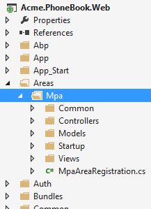

This is a classic MVC folder structure with Controllers, Models and
Views.

### Main Menu

Application's main menu is defined in the **MpaNavigationProvider**
class. See ABP's [navigation
documentation](https://aspnetboilerplate.com/Pages/Documents/Navigation)
to get a deep understanding on creating menus.

### Layout

Layout of the application is located under Views/**Layout** folder.


The header, footer and siderbar are developed as partial views.

## Migrator Console Application

ASP.NET Zero includes a tool, Migrator.exe, to easily migrate your
databases. You can run this application to create/migrate host and
tenant databases.


This application gets the host connection string from its **own .config
file**. It will be the same in the web.config at the beginning. Be sure
that the connection string in the config file is the database you want.
After getting **host connection sring**, it first creates the host
database or applies migrations if appropriate. Then it gets the
connection strings of the tenant databases and runs migrations for those
databases. It skips a tenant if it has not a dedicated database or its
database is already migrated for another tenant (for shared databases
between multiple tenants).

You can use this tool on development or production to migrate databases
on deployment, instead of EntityFramework's own Migrate.exe (which
requires some configuration and can work for single database in one
run).

## Infrastructure

### Dynamic Web API Layer

Both SPA and MPA application use AJAX extensively to provide a better
user experience. They call application service methods via AJAX. Thus it
is necessary to create web API controllers as adapters (A Client calls
Web API Controller action via AJAX, then it calls application service
method).

The ABP framework automatically creates a [dynamic web API
layer](https://aspnetboilerplate.com/Pages/Documents/Dynamic-Web-API)
using the application service interface definitions. There is no web API
Controller actually. You build dynamic web api controllers in
PhoneBook**WebApiModule** class in .WebApi project. See [dynamic Web API
layer
documentation](https://aspnetboilerplate.com/Pages/Documents/Dynamic-Web-API)
for more information.

While ABP dynamically create Web API Controllers, you can also create
regular Web API Controllers as you might normally do. 

### Localization

The ASP.NET Zero **User Interface** is completely localized. ASP.NET Zero
uses **dynamic, database based, per-tenant** localization (see the
related section above).

XML files are used as the base translation for desired languages:


PhoneBook will be your ProjectName. You can add more XML files by
copying one XML file and translate it to the desired language. Notice
that the XML files should be an **embedded resource**. See [valid
culture codes](http://www.csharp-examples.net/culture-names/).

When you are adding a new localizable text snippet, add it to the XML
file of the default language then use it in your application. You should
also add translated values to the corresponding XML files. It is not
necessary to add it to the database migration code since the value in
the XML file will be used as default.

**Application languages** are defined in the **DefaultLanguagesCreator**
class. This is used as a **seed data** in Entity Framework Migration.
So, if you want to **add a new language**, just add it to the
DefaultLanguagesCreator class. Also, you can add a corresponding XML
file as described above as default translation.

See
[localization](https://aspnetboilerplate.com/Pages/Documents/Localization)
and [language
management](https://aspnetboilerplate.com/Pages/Documents/Zero/Language-Management)
documentations for more information.

### EntityFramework Integration

The ASP.NET Zero template uses EntityFramework **code-first** and
**migrations**. PhoneBook**DbContext** (YourProjectDbContext for your
project) defines the DbContext class. **Migrations** folder contains the
EF migrations.

The PhoneBook**RepositoryBase** class is the base class for your custom
repositories. See entity [framework
integration](https://aspnetboilerplate.com/Pages/Documents/EntityFramework-Integration)
documentation for more information.

### Authorization Provider

The authorization system is based on permissions. **AppPermissions**
contains constants for permission names and the
**AppAuthorizationProvider** class defines all permissions in the
system. You should define a permission here before using it in the
application layer.

See [authorization
documentation](https://aspnetboilerplate.com/Pages/Documents/Authorization)
to learn how to configure permissions.

### Feature Provider

**AppFeatureProvider** class defines features of the application for
multi-tenant applications. Feature names are defined in the
**AppFeatures** class as constants.

See [feature management
documentation](https://aspnetboilerplate.com/Pages/Documents/Feature-Management)
to learn how to define and use features.

### Setting Provider

Every setting has a unique name. Setting names are defined in the
**AppSettings** class as constants. All settings and their default
values are defined in the **AppSettingProvider** class.

See [setting
documentation](https://aspnetboilerplate.com/Pages/Documents/Setting-Management)
to learn how to create and use settings.

### Navigation Provider

Menus are automatically generated using definitions in the
**AppNavigationProvider** class. You have two menus: **Main** (the main
menu in the AngularJS application) and **FrontEnd** (main menu in the
front-end web site).

See [navigation
documentation](https://aspnetboilerplate.com/Pages/Documents/Navigation)
for more information.

### Caching And Redis Cache

ASP.NET Zero uses **in-memory** caching but it's ready to use **Redis**
as a cache server. If you want to enable it, just uncomment the
following line in your **WebModule** (in App\_Start folder in your .Web
project):

```csharp
Configuration.Caching.UseRedis();
```

Redis server should be running to be able to use it. See [caching
documentation](https://aspnetboilerplate.com/Pages/Documents/Caching)
for more information.

### Background Jobs And HangFire

ABP framework contains a **background job system** with a **default**
background job manager. If you want to use
[Hangfire](http://hangfire.io/) as your background job manager, you can
easily enable it.

First, uncomment these lines in **WebModule** (in App\_Start folder in
your .Web project):

```csharp
Configuration.BackgroundJobs.UseHangfire(configuration =>
{
    configuration.GlobalConfiguration.UseSqlServerStorage("Default");
});
```

If you want to enable the Hangfire dashboard, you can uncomment the
following line in **Startup.cs** (in App\_Start folder in your .Web
project):

```csharp
app.UseHangfireDashboard();
```

**Note**: Hangfire creates its **own tables** in the database. See
[background
job](https://aspnetboilerplate.com/Pages/Documents/Background-Jobs-And-Workers)
and [hangfire
integration](https://aspnetboilerplate.com/Pages/Documents/Hangfire-Integration)
documents for more information.

### SignalR Integration

SignalR is properly configured and integrated in the startup template.
The real time notification system uses it. You can direcly use SignalR
in your applications. See [SignalR
integration](https://aspnetboilerplate.com/Pages/Documents/SignalR-Integration)
document for more information.

### Logging

ASP.NET Zero uses **Log4Net** for logging as default. Configuration is
defined in **log4net.config** file in the .Web project. It writes all
logs into the **Logs** folder of the web site as default. When you
publish your project, remember to configure **write permission** for the
Logs folder.

Check [logging
documentation](https://aspnetboilerplate.com/Pages/Documents/Logging) to
see how to inject ILogger and write logs.

### DTO Mappings

ASP.NET Zero uses [AutoMapper](http://automapper.org/) for DTO to Entity
mappings (and other types of object-to-object mappings). You use the
[Abp.AutoMapper](https://www.nuget.org/packages/Abp.AutoMapper) library
that uses AutoMapper, which is simple and declarative.

See the DTO class that is used to transfer a tenant's editing
information:

```csharp
[AutoMap(typeof (Tenant))]
public class TenantEditDto : EntityDto
{
    [Required]
    [StringLength(Tenant.MaxTenancyNameLength)]
    public string TenancyName { get; set; }

    [Required]
    [StringLength(Tenant.MaxNameLength)]
    public string Name { get; set; }

    public bool IsActive { get; set; }
}
```

Here, the **AutoMap** attribute automatically creates mapping between
**TenantEditDto** and the **Tenant** classes. Then you can automatically
convert a Tenant object to a TenantEditDto (and vice verse) object as
shown below:

```csharp
[AbpAuthorize(AppPermissions.Pages_Tenants_Edit)]
public async Task<TenantEditDto> GetTenantForEdit(EntityRequestInput input)
{
    return (await TenantManager.GetByIdAsync(input.Id)).MapTo<TenantEditDto>();
}
```

**MapTo** method does mapping.

#### Custom Object Mappings

Attribute based mapping may not be sufficient in some cases. If you need
to directly use Automapper API to configure your mappings, you should do
it in the **CustomDtoMapper** class.

See [Data Transfer Objects
documentation](https://aspnetboilerplate.com/Pages/Documents/Data-Transfer-Objects)
for more information on DTOs.

### Sending Emails

ASP.NET Zero sends emails to users in some cases (e.g. forgot password
and email confirmation). The email template is defined in the
**Emailing/EmailTemplates** folder of .Core project (**default.html**).
You can change the default email template by editing this file.

**Email sending** is disabled in DEBUG mode. This is because the
development environment may not be configured properly to send emails.
You can enable it if you want. It is enabled in RELEASE mode. Check the
*YourProjectName*CoreModule class's PreInitialize method to change it if
you like.

### BinaryObjectManager

User **profile pictures** are stored in the database, instead of in the
file system. But it's not stored in Users table for performance reasons
(Users are frequently retrieved from database, but profile pictures are
rarely needed).

A general-purpose binary saving mechanism built in ASP.NET Zero: The
**BinaryObject** entity can be used to save any type of binary objects
(byte arrays). Since a profile picture can be converted to a byte array,
user profile pictures are saved here.

The **IBinaryObjectManager** interface defines methods to save, get, and
delete binary objects. **DbBinaryObjectManager** implements it to save
binary objects in the database. For example, **ProfileController** uses
IBinaryObjectManager to get current user's profile picture from the
database.

You can create a different implementation of the
**IBinaryObjectManager** interface to store files in another
destination.

### Soft Deletes

It's common to use the **soft-delete** pattern which is used to not
delete an entity from the database but only mark it as 'deleted.' Thus,
if an entity is soft-deleted, it will not be accidentally retrieved into
the application. ABP's **data filters** make this happen automatically.

In ASP.NET Zero, most entities are soft-deleted. See ABP's [data filter
documentation](https://aspnetboilerplate.com/Pages/Documents/Data-Filters)
for more information about.

### Bundling & Minifying

ASP.NET Zero uses [ASP.NET
Optimization](https://www.nuget.org/packages/Microsoft.AspNet.Web.Optimization)
for bundling & minifying script and style files. Bundles are defined in
different files:

-   **AppBundleConfig**: For SPA bundles.
-   **MpaBundleConfig**: For MPA bundles.
-   **FrontEndBundleConfig**: For the front end application.
-   **CommonBundleConfig**: For some common resources.

Also, see the **ScriptPaths** and **StylePaths** classes. They contain
constants for locations of JS and CSS files.

### Base Classes

There are some useful base classes used in the application:

-   PhoneBook**AppServiceBase** can be used as a base class for all
    **application services**.
-   PhoneBook**DomainServiceBase** can be used as a base class for
    **domain services**.
-   PhoneBook**ControllerBase** can be used as a base class for ASP.NET
    **MVC Controllers**.
-   PhoneBook**WebViewPageBase** can be used as a base class for ASP.NET
    **MVC Views**. Actually, all views will automatically inherit this
    since it is defined in the web.config files. You can add some common
    properties/methods there to use it in all views.
-   PhoneBook**ServiceBase** can be used as a base class for other
    service-like classes. UserEmailer class inherits it, for instance.
-   PhoneBook**RepositoryBase** can be used as a base class for [custom
    repository](https://aspnetboilerplate.com/Pages/Documents/EntityFramework-Integration#DocCustomRepositoryMethods)
    implementations.
-   PhoneBook**ApiControllerBase** can be used as a base class for
    regular Web API Controllers.

It's strongly recommended to inherit one of these classes since they
really make Logging, Localization, Authorization, etc. easier.

### CSRF/XSRF Protection

ABP framework simplifies and automates CSRF protection as much as
possible. ASP.NET Zero template comes with CSRF protection pre-configured
and working out of the box. For more information please see ABP's
[XSRF-CSRF-Protection
documentation](https://aspnetboilerplate.com/Pages/Documents/XSRF-CSRF-Protection)

### Versioning

The **AppVersionHelper** class is used to define the **current version**
of the application in a single place. When you change the **Version**
here, all projects in the application will be verisoned. Also, the
version and release date are automatically shown in the bottom left
corner on the application pages. That way you can always see the running
application version.

## Token Based Authentication

ASP.NET Zero uses cookie based authentication for browsers. However, if
you want to consume Web APIs or application services (those are exposed
via dynamic web api) from a mobile application, you probably want a
token based authentication mechanism. ASP.NET Zero includes bearer token
authentication infrastructure. **AccountController** in **.WebApi**
project contains an **Authenticate** action to get the token. Then you
can use the token for subsequent requests.

Here, **Postman** (chrome extension) will be used to demonstrate
requests and responses.

### Authentication

Just send a **POST** request to
**http://localhost:6234/api/Account/Authenticate** with
**Context-Type="application/json"** as shown below:


We sent a **JSON request body** includes **tenancyName**,
**userNameOrEmailAddress** and **password**. tenancyName is not used to
authenticate as a **host** user. As seen above, **result** property of
returning JSON contains the token. You can save it and use for
subsequent requests.

### Use API

After authenticating and getting the token, you can use it to call any
**authorized** actions. All **application services** are available to be
used remotely. For example, you can use the **User service** to get a
**list of users**:


Just made a **POST** request to
**http://localhost:6234/api/services/app/user/GetUsers** with
**Content-Type="application/json"** and **Authorization="Bearer
*your-******auth-token*****"**. Request body was just empty **{}**. Of
course, request and response body will be different for different APIs.

Almost all operations available in the UI are also available via the Web
API (since the UI uses the same Web API) and can be easily consumed.

## Swagger UI

Swagger UI is integrated into ASP.NET Zero. The Swagger UI configuration
is located in the **WebApiModule** class in the WebApi project. You can
browse the Swagger UI under "/**swagger/ui/index**".

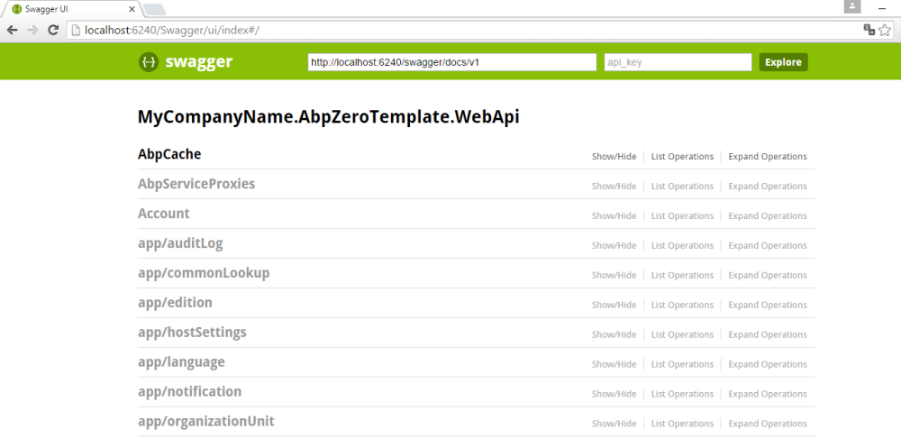

## Unit Testing

The ASP.NET Zero startup project contains **unit** and **integration**
tests. Tests are developed using the following tools:

-   [xUnit](http://xunit.github.io/) as testing framework.
-   [Shouldly](https://github.com/shouldly/shouldly) as assertion
    library.
-   [Effort](https://github.com/tamasflamich/effort) for mocking entity
    framework and database.
-   [Abp.TestBase](http://www.nuget.org/packages/Abp.TestBase) to
    simplify integration testing for ABP based applications.

Tests cover the **Domain** (core) and **Application** layers of the
project. Open Test Explorer (Test\\Windows\\Test Explorer in VS main
menu) to run unit tests:

A new setting named **MultiTenancyEnabled** is introduced for unit test
project with ASP.NET Zero v2.2. If you disable multi tenancy in your Core
module, you also need to change this setting's value to false in unit
test project's App.config. In this way, test related to multi tenancy
will not be executed. Because some unit tests (tenant creation, edition
creation etc.) are only valid in multi tenancy concept.

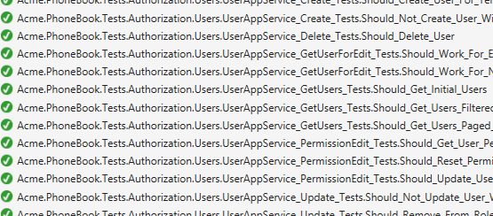

These unit tests are a guide to understand the code. Also, they can be a
model while writing your own unit tests for your application's
functionality.

All unit test classes (actually they are integration tests since they
work integrated to ABP, EntityFramework, AutoMapper and other libraries
used -- up to application layer) are derived from **AppTestBase**. It
initializes ABP system, mocks the database using Effort, creates the
initial test data and logs in to the application for each of the tests.
It also provides some useful common methods for all tests.

Here is a sample unit test from the application:

```csharp
public class UserAppService_Delete_Tests : UserAppServiceTestBase
{
    [Fact]
    public async Task Should_Delete_User()
    {
			  
											  
		 
        //Arrange
        CreateTestUsers();

        var user = await GetUserByUserNameOrNullAsync("artdent");
        user.ShouldNotBe(null);

        //Act
        await UserAppService.DeleteUser(new IdInput<long>(user.Id));

        //Assert
        user = await GetUserByUserNameOrNullAsync("artdent");
        user.IsDeleted.ShouldBe(true);
		 
    }
}
```

It creates some users to test and then verifies there is a user named
"artdent". Then it calls the **DeleteUser** method of the **user
application service** (which is being tested). Finally, it checks if the
user is deleted. Here, the User is a Soft Delete entity, so its
**IsDeleted** property must be true if it is deleted.

You can read [this
article](http://www.codeproject.com/Articles/871786/Unit-testing-in-Csharp-using-xUnit-Entity-Framewor)
to understand unit testing better.

## Publishing

**Email Settings**

If you don't configure email settings, some functions may not work (Like
new tenant registration).

Publishing ASP.NET Zero is not different than any other solution. You
can use Visual Studio as normally you do.

### Publish to The Azure

Read [this document](Step-by-step-publish-to-azure-mvc5.md) to publish to the Azure.

## Library & Frameworks Used

Many open source frameworks and libraries are used to build ASP.NET Zero
project. Here is a list of all libraries:

-   Server side
    -   [ASP.NET Boilerplate Framework &
        Module-Zero](https://aspnetboilerplate.com)
    -   [ASP.NET MVC](http://www.asp.net/mvc)
    -   [ASP.NET Web API](http://www.asp.net/web-api)
    -   [ASP.NET Identity Framework (and social login
        extensions)](http://www.asp.net/identity)
    -   [ASP.NET Web Optimization
        Framework](http://www.asp.net/mvc/overview/performance/bundling-and-minification)
    -   [SignalR](http://www.asp.net/signalr)
    -   [EntityFramework](http://www.asp.net/entity-framework)
    -   [EntityFramework.DynamicFilters](https://github.com/jcachat/EntityFramework.DynamicFilters)
    -   [Castle Windsor](http://www.castleproject.org/projects/windsor/)
    -   [AutoMapper](http://automapper.org/)
    -   [HangFire](http://hangfire.io/)
    -   [Log4Net](https://logging.apache.org/log4net/)
    -   [RecaptchaNet](https://github.com/tanveery/recaptcha-net)
    -   [xUnit](https://xunit.github.io/)
    -   [Swashbuckle](https://github.com/domaindrivendev/Swashbuckle)
    -   [StackExchange.Redis](https://github.com/StackExchange/StackExchange.Redis)
    -   [SharpZipLib](http://icsharpcode.github.io/SharpZipLib/)
    -   [System.Linq.Dynamic](https://github.com/kahanu/System.Linq.Dynamic)
    -   [EPPlus](http://epplus.codeplex.com/)
-   Client side
    -   [Metronic Theme](http://keenthemes.com/metronic-theme/)
    -   [Twitter Bootstrap](http://getbootstrap.com/)
    -   [Bootstrap Hover
        Dropdown](https://github.com/CWSpear/bootstrap-hover-dropdown)
    -   [Bootstrap Date Range
        Picker](https://github.com/dangrossman/bootstrap-daterangepicker)
    -   [Bootstrap Switch](http://www.bootstrap-switch.org/)
    -   [Bootstrap
        Select](http://silviomoreto.github.io/bootstrap-select)
    -   [AngularJs](https://angularjs.org/)
    -   [Angular UI-Bootstrap](https://angular-ui.github.io/bootstrap/)
    -   [Angular UI-Router](http://angular-ui.github.io/ui-router/site/)
    -   [Angular UI-Utils](https://github.com/angular-ui/ui-utils)
    -   [Angular UI-Grid](http://ui-grid.info/)
    -   [Angular File
        Upload](https://github.com/nervgh/angular-file-upload)
    -   [Angular Date Range
        Picker](https://github.com/fragaria/angular-daterangepicker)
    -   [Angular ocLazyLoad](https://github.com/ocombe/ocLazyLoad)
    -   [Angular Moment](https://github.com/urish/angular-moment)
    -   [Angular Bootstrap
        Switch](https://github.com/frapontillo/angular-bootstrap-switch)
    -   [jQuery](http://jquery.com/)
    -   [jQuery UI](http://jqueryui.com/)
    -   [jQuery BlockUI](http://malsup.com/jquery/block/)
    -   [jQuery Slimscroll](http://rocha.la/jQuery-slimScroll)
    -   [jQuery Sparkline](http://omnipotent.net/jquery.sparkline/)
    -   [jQuery Uniform](https://github.com/pixelmatrix/uniform)
    -   [jQuery Validation](http://jqueryvalidation.org/)
    -   [jQuery Ajax Forms](http://malsup.com/jquery/form/)
    -   [Js Cookie](https://github.com/js-cookie/js-cookie)
    -   [Modernizr](http://modernizr.com/)
    -   [Moment.js](http://momentjs.com/)
    -   [Moment.js Timezone](http://momentjs.com/timezone/)
    -   [Underscore.js](http://underscorejs.org/)
    -   [JsTree](https://www.jstree.com/)
    -   [Morris](http://morrisjs.github.io/morris.js/)
    -   [Respondjs](https://github.com/scottjehl/Respond)
    -   [Font-Awesome](http://fontawesome.io/)
    -   [Simple Line
        Icons](http://thesabbir.github.io/simple-line-icons/)
    -   [SpinJs](http://fgnass.github.io/spin.js/)
    -   [SweetAlert](http://t4t5.github.io/sweetalert/)
    -   [Toastr](http://codeseven.github.io/toastr/)
