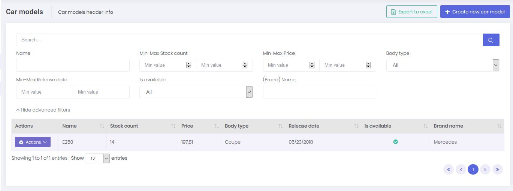
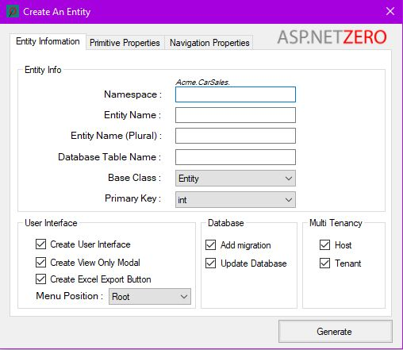
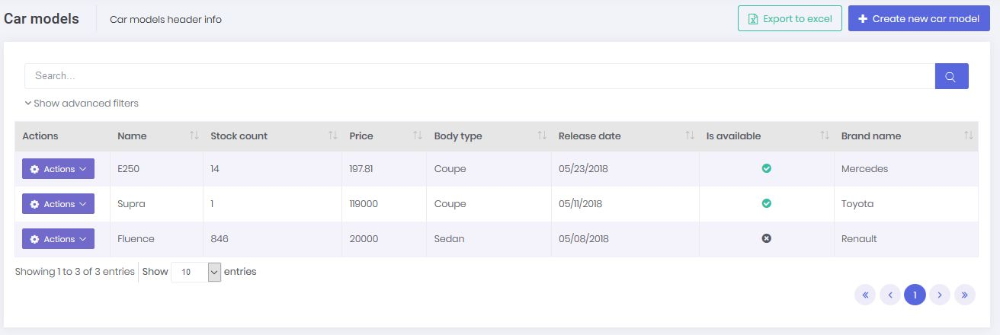

 
  
### Introduction

 In this document, we will introduce **ASP.NET Zero Power Tools** and explain it. This tool is developed to minimize the effort of creating a new entity. It creates all the related layers (including UI) by defining an entity.

### Download And Install

 If your project version is 5.1.0+, all you have to do is just install the **ASP.NET Zero Power Tools** extension on Visual Studio from https://marketplace.visualstudio.com/items?itemName=Volosoft.AspNetZeroPowerTools.

 If your project version is below 5.1.0, you also have to copy the AspNetZeroRadTool folder to your own project from a newly downloaded 5.1.0+ project.

 This tool doesn't support versions before v5.0.0.
 
### How To Use It?

 The extension can be found inside the **Tools** menu (Tools -> Asp.Net Zero -> Create An Entity). When you run it, you will see the interface for creating an entity. After carefully filling out the fields, press the **Generate** button to start the code generation process. 

 

 A simple console will appear and give you information about the process. If there is no warning or failure, run your project to see the results. If you don't see the new page on UI, grant yourself the required **permissions** in the application.

Warning: If you are working on ASP.NET Core & Angular template, after generating the entity via Power Tools, run your ***.Web.Host** project and then run "**./angular/nswag/refresh.bat**" to update **service-proxies.ts**.

 Warning: Be sure that you have saved your work before running this tool since it will add new files and modify some of the existing files. We strongly recommend using a source control system (like Git).  Otherwise, backup your project.

### How It Works?

DLLs (that are inside the folder mentioned above) do all the work. The extension is just a user interface. This design is required, otherwise it would only be available for Visual Studio Windows users. However, since the tool is built on .NET Core platform, **Mac** or **Linux** users can safely use the tool. 

On Mac and Linux, you have to manually do some of the work that is done by the extension. This involves just creating a short and basic[ JSON file](https://aspnetzero.com/Documents/Development-Guide-Rad-Tool-Mac-Linux) as input.

### How To Edit Pre-defined Templates Or Create A New Template?

 The templates are inside "/AspNetZeroRadTool/FileTemplates" directory in your project's root directory. Every template is split into three files: "MainTemplate.txt", "PartialTemplates.txt" and "TemplateInfo.txt". If you want to edit any file, just copy it in same directory and change it's extension to ".custom.txt" from ".txt".  For example, you can create "MainTemplate.custom.txt" to override "MainTemplate.txt" in same directory. Please don't make any changes to the original templates.
 
 To create a new template, do the same process as editing a pre-defined template. The tool doesn't know any info about templates and discovers them in the "/FileTemplates" directory every time it is run. This means your new template will be processed like the pre-defined ones. (".custom" extension is not needed for new templates.)

 You can request help from our support team on [github](github.com/aspnetzero/aspnet-zero-core)  or  [forum](https://forum.aspnetboilerplate.com/viewforum.php?f=5)  if you are struggling.

### Generated Files

 Here is the full list of the files that are created or modified by the tool, if you give a basic "Cars" entity as input.

#### Server Side

**Created**

 -   Car.cs
 -   CarDto.cs
 -   LookupDto.cs
 -   GetAllForLookupTableInput.cs
 -   GetCarForEditOutput.cs
 -   GetAllCarsOutput.cs
 -   CreateOrEditCarDto.cs
 -   GetAllCarsInput.cs
 -   CarConsts.cs
 -   ICarAppService
 -   CarAppService
 -   CarsExcelExporter.cs
 -   ICarsExcelExporter.cs

**Modified**

 -   AppAuthorizationProvider.cs
 -   AppPermissions.cs
 -   ProjectNameDbContext.cs
 -   CustomDtoMapper.cs
 -   ProjectName.xml (English localization file)

 (Optionally, adds a database migration and updates the database.)

#### Client Side

##### Angular

**Created**

 -   cars.component.ts
 -   cars.component.html
 -   create-or-edit-car-modal.component.ts
 -   create-or-edit-car-modal.component.html
 -   Lookup-Table-modal.component.ts
 -   Lookup-Table-modal.component.html
 -   Lookup-Table-modal.component.less

**Modified**

 -   app-navigation.service.ts
 -   service-proxy.module.ts
 -   (Main or Admin)-routing.module.ts
 -   (Main or Admin).module.ts

##### Mvc

**Created**

 -   CarsController.cs
 -   CarsViewModel.cs
 -   CreateOrEditCarViewModel.cs
 -   Index.js
 -   Index.cshtml
 -   createOrEditModal.js
 -   createOrEditModal.cshtml
 -   LookupTableViewModel.cshtml
 -   LookupTableModal.js
 -   LookupTableModal.cshtml

**Modified**

 -   (AppArea)NavigationProvider.cs
 -   (AppArea)PageNames.cs
 
  (Lookup files are created per foreign key.)
 

 
 
