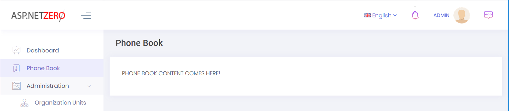
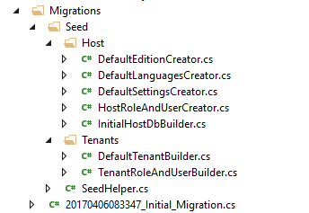
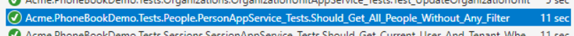
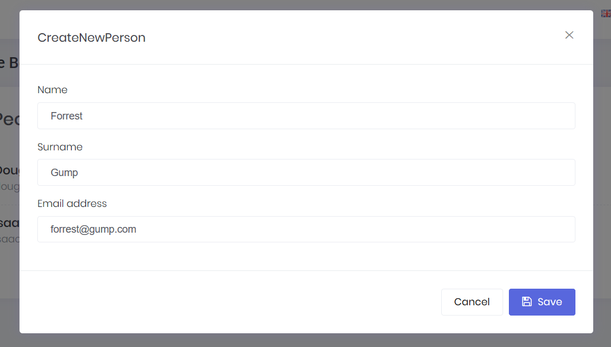
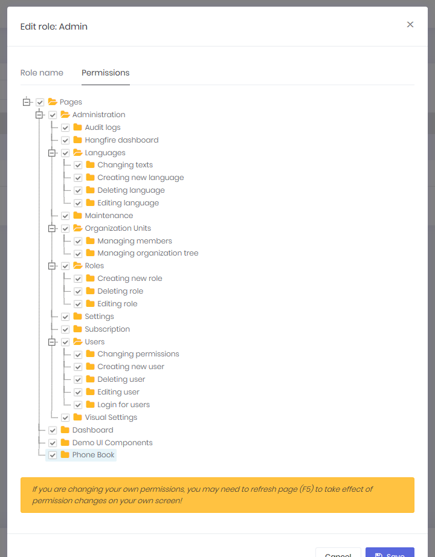
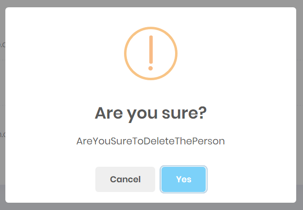
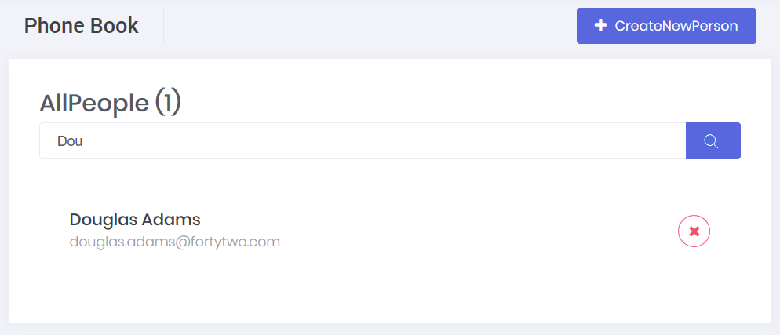
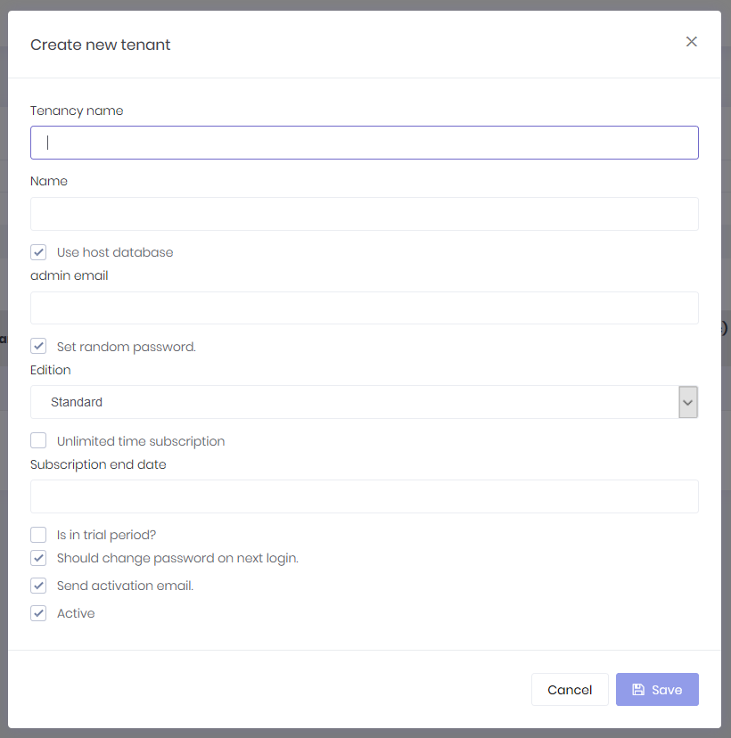

### Introduction

In this document, we will create a sample **phonebook application**
based on ASP.NET Zero (ASP.NET Core & Angular 5 version) step by step.
After all steps, we will have a multi-tenant, localized, authorized,
configurable, testable... application.

### Creating And Running The Project

We're creating and downloading the solution named
"**Acme.PhoneBookDemo**" as described in [Getting
Started](Getting-Started-Angular.md) document. Please follow the
getting started document, run the application, login as default tenant
admin (select Default as tenancy name, use admin as username and 123qwe
as password) and see the dashboard below:

Logout from the application for now. We will make our application
**single-tenant** (we will convert it to multi-tenant later). So, we
open **PhoneBookDemoConsts** class in the **Acme.PhoneBookDemo.Core.Shared**
project and disable multi-tenancy as shown below:

    public class PhoneBookDemoConsts
    {
        public const string LocalizationSourceName = "PhoneBookDemo";

        public const string ConnectionStringName = "Default";

        public const bool MultiTenancyEnabled = false;

        public const int PaymentCacheDurationInMinutes = 30;
    }

**Note:** If you log in before changing **MultiTenancyEnabled** to
false, you might be get login error. To overcome this, you should remove
cookies.

### Adding a New Menu Item

Let's begin from UI and create a new page named "**Phone book**".

#### Defining a Menu Item

Open **src\\app\\shared\\layout\\nav\\app-navigation.service.ts** in the
client side (**Acme.PhoneBookDemo.AngularUI**) which defines menu items
in the application. Create new menu item as shown below (You can add it
right after the dashboard menu item).

    new AppMenuItem("PhoneBook", null, "flaticon-book", "/app/main/phonebook")

**PhoneBook** is the menu name (will localize below), **null** is for
permission name (will set it later), **flaticon-book** is just an
arbitrary icon class (from [this
set](http://keenthemes.com/metronic/preview/?page=components/icons/flaticon&demo=default))
and **/phonebook** is the Angular route.

If you run the application, you can see a new menu item on the left
menu, but it won't work (it redirect to default route) if you click to
the menu item, since we haven't defined the Angular route yet.

#### Localize Menu Item Display Name

Localization strings are defined in **XML** files in **.Core** project
(in server side) as shown below:

Open PhoneBookDemo.xml (the **default**, **English** localization
dictionary) and add the following line:

    <text name="PhoneBook">Phone Book</text>

If we don't define "PhoneBook"s value for other localization
dictionaries, default value is shown in all languages. For example, we
can define it also for Turkish in PhoneBookDmo-tr.xml file:

    <text name="PhoneBook">Telefon Rehberi</text>

Note: Any change in server side (including change localization texts)
requires recycle of the server application. We suggest to use Ctrl+F5 if
you don't need to debugging for a faster startup. In that case, it's
enough to make a re-build to recycle the application.

#### Angular Route

Angular has a powerful URL routing system. ASP.NET Zero has defined
routes in a few places (for modularity, see [dev
guide](Development-Guide-Angular.md)). We want to add phone book page
to the main module. So, open **src\\app\\main\\main-routing.module.ts**
(in the client side) and add a new route just below to the dashboard:

    { path: 'phonebook', component: PhoneBookComponent }

We get an error since we haven't defined PhoneBookComponent yet. Also,
we ignored permission for now (will implement later).

### Creating the PhoneBookComponent

Create a **phonebook** folder inside **src/app/main** folder and add a
new typescript file (**phonebook.component.ts**) in the phonebook folder
as shown below:

    import { Component, Injector } from '@angular/core';
    import { AppComponentBase } from '@shared/common/app-component-base';
    import { appModuleAnimation } from '@shared/animations/routerTransition';

    @Component({
        templateUrl: './phonebook.component.html',
        animations: [appModuleAnimation()]
    })

    export class PhoneBookComponent extends AppComponentBase {
        constructor(
            injector: Injector
        ) {
            super(injector);
        }
    }

We inherited from **AppComponentBase** which provides some common
functions and fields (like localization and access control) for us. It's
not required, but makes our job easier. Now, we can return back to
**main-routing.module.ts** and add import statement for the newly
created PhoneBookComponent class:

    import { PhoneBookComponent } from './phonebook/phonebook.component';

As we declared in **phonebook.component.ts** we should create a
**phonebook.component.html** view in the same phonebook folder:

    

        

            

                

                    <h3 class="m-subheader__title m-subheader__title--separator">
                        {{l("PhoneBook")}}
                    </h3>
                

            

        

        

            

                

                    
PHONE BOOK CONTENT COMES HERE!

                

            

        

    

**l** (lower case 'L') function comes from **AppComponentBase** and used
to easily localize texts. **\[@routerTransition\]** attribute is
required for page transition animation.

And finally, Angular requires to relate every component to a **module**.
So, we are making the following changes on the **main.module.ts**:

    import { NgModule } from '@angular/core';
    import { CommonModule } from '@angular/common';
    import { FormsModule } from '@angular/forms';

    import { DashboardComponent } from './dashboard/dashboard.component';
    import { PhoneBookComponent } from './phonebook/phonebook.component';

    import { ModalModule, TabsModule, TooltipModule } from 'ngx-bootstrap';
    import { AppCommonModule } from '@app/shared/common/app-common.module';
    import { UtilsModule } from '@shared/utils/utils.module';
    import { MainRoutingModule } from './main-routing.module';

    @NgModule({
        imports: [
            CommonModule,
            FormsModule,
            ModalModule,
            TabsModule,
            TooltipModule,
            AppCommonModule,
            UtilsModule,
            MainRoutingModule
        ],
        declarations: [
          DashboardComponent,
          PhoneBookComponent
        ]
    })
    export class MainModule { }

Added an **import** statement and added PhoneBookComponent to
**declarations** array. Now, we can refresh the page to see the new
added page:

Note: Angular-cli automatically re-compiles and refreshes the page when
any changes made to any file in the application.

### Creating Person Entity

We define entities in **.Core** (domain) project (in server side). We
can define a **Person** entity (mapped to **PbPersons** table in
database) to represent a person in phone book as shown below (I created
in a new folder/namespace named PhoneBook):

    using System.ComponentModel.DataAnnotations;
    using System.ComponentModel.DataAnnotations.Schema;
    using Abp.Domain.Entities.Auditing;

    namespace Acme.PhoneBookDemo.PhoneBook
    {
        [Table("PbPersons")]
        public class Person : FullAuditedEntity
        {
            public const int MaxNameLength = 32;
            public const int MaxSurnameLength = 32;
            public const int MaxEmailAddressLength = 255;

            [Required]
            [MaxLength(MaxNameLength)]
            public virtual string Name { get; set; }

            [Required]
            [MaxLength(MaxSurnameLength)]
            public virtual string Surname { get; set; }

            [MaxLength(MaxEmailAddressLength)]
            public virtual string EmailAddress { get; set; }
        }
    }

Person's **primary key** type is **int** (as default). It inherits
**FullAuditedEntity** that contains **creation**, **modification** and
**deletion** audit properties. It's also **soft-delete**. When we delete
a person, it's not deleted by database but marked as deleted (see
[entity](https://aspnetboilerplate.com/Pages/Documents/Entities) and
[data
filters](https://aspnetboilerplate.com/Pages/Documents/Data-Filters)
documentations for more information). We created consts for
**MaxLength** properties. This is a good practice since we will use same
values later.

We add a DbSet property for Person entity to **PhoneBookDemoDbContext**
class defined in **.EntityFrameworkCore** project.

    public class PhoneBookDemoDbContext : AbpZeroDbContext<Tenant, Role, User>
    {
        public virtual DbSet<Person> Persons { get; set; }

        //...other code
    }

### Database Migrations

We use **EntityFramework Code-First migrations** to migrate database
schema. Since we added **Person entity**, our DbContext model is
changed. So, we should create a **new migration** to create the new
table in the database.

Open **Package Manager Console**, run the **Add-Migration
"Added\_Persons\_Table"** command as shown below:

This command will add a **migration class** named
"**Added\_Persons\_Table**" as shown below:

    public partial class Added_Persons_Table : Migration
    {
        protected override void Up(MigrationBuilder migrationBuilder)
        {
            migrationBuilder.CreateTable(
                name: "PbPersons",
                columns: table => new
                {
                    Id = table.Column(nullable: false)
                        .Annotation("SqlServer:ValueGenerationStrategy", SqlServerValueGenerationStrategy.IdentityColumn),
                    CreationTime = table.Column(nullable: false),
                    CreatorUserId = table.Column(nullable: true),
                    DeleterUserId = table.Column(nullable: true),
                    DeletionTime = table.Column(nullable: true),
                    EmailAddress = table.Column(maxLength: 255, nullable: true),
                    IsDeleted = table.Column(nullable: false),
                    LastModificationTime = table.Column(nullable: true),
                    LastModifierUserId = table.Column(nullable: true),
                    Name = table.Column(maxLength: 32, nullable: false),
                    Surname = table.Column(maxLength: 32, nullable: false)
                },
                constraints: table =>
                {
                    table.PrimaryKey("PK_PbPersons", x => x.Id);
                });
        }

        protected override void Down(MigrationBuilder migrationBuilder)
        {
            migrationBuilder.DropTable(
                name: "PbPersons");
        }
    }

We don't have to know so much about format and rules of this file. But,
it's suggested to have a basic understanding of migrations. In the same
Package Manager Console, we write **Update-Database** command in order
to apply the new migration to database. After updating, we can see that
**PbPersons table** is added to database.

But this new table is empty. In ASP.NET Zero, there are some classes to
fill initial data for users and settings:

So, we can add a separated class to fill some people to database as
shown below:

    namespace Acme.PhoneBookDemo.Migrations.Seed.Host
    {
        public class InitialPeopleCreator
        {
            private readonly PhoneBookDemoDbContext _context;

            public InitialPeopleCreator(PhoneBookDemoDbContext context)
            {
                _context = context;
            }

            public void Create()
            {
                var douglas = _context.Persons.FirstOrDefault(p => p.EmailAddress == "douglas.adams@fortytwo.com");
                if (douglas == null)
                {
                    _context.Persons.Add(
                        new Person
                        {
                            Name = "Douglas",
                            Surname = "Adams",
                            EmailAddress = "douglas.adams@fortytwo.com"
                        });
                }

                var asimov = _context.Persons.FirstOrDefault(p => p.EmailAddress == "isaac.asimov@foundation.org");
                if (asimov == null)
                {
                    _context.Persons.Add(
                        new Person
                        {
                            Name = "Isaac",
                            Surname = "Asimov",
                            EmailAddress = "isaac.asimov@foundation.org"
                        });
                }
            }
        }
    }

These type of default data is good since we can also use these data in
**unit tests**. Surely, we should be careful about seed data since this
code will always be executed in each **PostInitialize** of your
PhoneBookEntityFrameworkCoreModule. This class (InitialPeopleCreator) is
created and called in **InitialHostDbBuilder** class. This is not so
important, just for a good code organization (see source codes).

    public class InitialHostDbBuilder
    {
        //existing codes...

        public void Create()
        {
            //existing code...
            new InitialPeopleCreator(_context).Create();

            _context.SaveChanges();
        }
    }

We run our project again, it runs seed and adds two people to PbPersons
table:

### Creating Person Application Service

An Application Service is used from client (presentation layer) to
perform operations (use cases) of the application.

Application service interface and DTOs are located in
**.Application.Shared** project. We are creating an application service to
get people from the server. So, we're first creating an **interface** to
define the person application service (while this interface is optional,
we suggest you to create it):

    using Abp.Application.Services;
    using Abp.Application.Services.Dto;

    namespace Acme.PhoneBookDemo.PhoneBook
    {
        public interface IPersonAppService : IApplicationService
        {
            ListResultDto<PersonListDto> GetPeople(GetPeopleInput input);
        }
    }

An application service method gets/returns **DTO**s. **ListResultDto**
is a pre-build helper DTO to return a list of another DTO.
**GetPeopleInput** is a DTO to pass request parameters to **GetPeople**
method. So, GetPeopleIntput and PersonListDto are defined as shown
below:

    public class GetPeopleInput
    {
        public string Filter { get; set; }
    }

    public class PersonListDto : FullAuditedEntityDto
    {
        public string Name { get; set; }

        public string Surname { get; set; }

        public string EmailAddress { get; set; }
    }

**CustomDtoMapper.cs** is used to create mapping from **Person** to
**PersonListDto**. **FullAuditedEntityDto** is inherited to
implement audit properties automatically. See [application
service](https://aspnetboilerplate.com/Pages/Documents/Application-Services)
and
[DTO](https://aspnetboilerplate.com/Pages/Documents/Data-Transfer-Objects)
documentations for more information. We are adding the following mappings.

    ...
    // PhoneBook (we will comment out other lines when the new DTOs are added)
    configuration.CreateMap<Person, PersonListDto>();
    //configuration.CreateMap<AddPhoneInput, Phone>();
    //configuration.CreateMap<CreatePersonInput, Person>();
    //configuration.CreateMap<Person, GetPersonForEditOutput>();
    //configuration.CreateMap<Phone, PhoneInPersonListDto>();

After defining interface, we can implement it as shown below: (in
**.Application** project)

    public class PersonAppService : PhoneBookDemoAppServiceBase, IPersonAppService
    {
        private readonly IRepository<Person> _personRepository;

        public PersonAppService(IRepository<Person> personRepository)
        {
            _personRepository = personRepository;
        }

        public ListResultDto<PersonListDto> GetPeople(GetPeopleInput input)
        {
            var people = _personRepository
                .GetAll()
                .WhereIf(
                    !input.Filter.IsNullOrEmpty(),
                    p => p.Name.Contains(input.Filter) ||
                         p.Surname.Contains(input.Filter) ||
                         p.EmailAddress.Contains(input.Filter)
                )
                .OrderBy(p => p.Name)
                .ThenBy(p => p.Surname)
                .ToList();

            return new ListResultDto<PersonListDto>(ObjectMapper.Map<List<PersonListDto>>(people));
        }
    }

We're injecting **person repository** (it's automatically created by
ABP) and using it to filter and get people from database.

**WhereIf** is an extension method here (defined in Abp.Linq.Extensions
namespace). It performs Where condition, only if filter is not null or
empty. **IsNullOrEmpty** is also an extension method (defined in
Abp.Extensions namespace). ABP has many similar shortcut extension
methods. **ObjectMapper.Map** method automatically converts list of
Person entities to list of PersonListDto objects with using
configurations in **CustomDtoMapper.cs** in **.Application** project.

#### Connection & Transaction Management

We don't manually open database connection or start/commit transactions
manually. It's automatically done with ABP framework's Unit Of Work
system. See [UOW
documentation](https://aspnetboilerplate.com/Pages/Documents/Unit-Of-Work)
for more.

#### Exception Handling

We don't handle exceptions manually (using a try-catch block). Because
ABP framework automatically handles all exceptions on the web layer and
returns appropriate error messages to the client. It then handles errors
on the client and shows needed error information to the user. See
[exception handling
document](https://aspnetboilerplate.com/Pages/Documents/Handling-Exceptions)
for more.

### Creating Unit Tests For PersonAppService

You can skip this section if you are not interested in **automated
testing**.

By writing unit test, we can test **PersonAppService.GetPeople** method
without creating a user interface. We write unit test in .**Tests**
project in the solution.

#### MultiTenancy In Tests

Since we disabled multitenancy, we should disable it for unit tests too.
Open **PhoneBookDemoConsts** class in the Acme.PhoneBook.Core project
and set "**MultiTenancyEnabled**" to false. After a rebuild and run unit
tests, you will see that some tests are skipped (those are related to
multitenancy).

Let's create first test to verify getting people without any filter:

    using Acme.PhoneBookDemo.People;
    using Acme.PhoneBookDemo.People.Dtos;
    using Shouldly;
    using Xunit;

    namespace Acme.PhoneBookDemo.Tests.People
    {
        public class PersonAppService_Tests : AppTestBase
        {
            private readonly IPersonAppService _personAppService;

            public PersonAppService_Tests()
            {
                _personAppService = Resolve<IPersonAppService>();
            }

            [Fact]
            public void Should_Get_All_People_Without_Any_Filter()
            {
                //Act
                var persons = _personAppService.GetPeople(new GetPeopleInput());

                //Assert
                persons.Items.Count.ShouldBe(2);
            }
        }
    }

We derived test class from **AppTestBase**. AppTestBase class
initializes all system, creates an in-memory fake database, seeds
initial data (that we created before) to database and logins to
application as admin. So, this is actually an **integration test** since
it tests all server-side code from entity framework mapping to
application services, validation and authorization.

In constructor, we get (resolve) an **IPersonAppService** from
**dependency injection** container. It creates the **PersonAppService**
class with all dependencies. Then we can use it in test methods.

Since we're using [xUnit](http://xunit.github.io/), we add **Fact**
attribute to each test method. In the test method, we called
**GetPeople** method and checked if there are **two people** in the
returned list as we know that there were 2 people in **initial**
database.

Let's run the **all unit tests** in Test Explorer and see if it works:

As you see, it worked **successfully**. Now, we know that
PersonAppService works properly without any filter. Let's add a new unit
test to get filtered people:

    [Fact]
    public void Should_Get_People_With_Filter()
    {
        //Act
        var persons = _personAppService.GetPeople(
            new GetPeopleInput
            {
                Filter = "adams"
            });

        //Assert
        persons.Items.Count.ShouldBe(1);
        persons.Items[0].Name.ShouldBe("Douglas");
        persons.Items[0].Surname.ShouldBe("Adams");
    }

Again, since we know initial database, we can check returned results
easily. Here, initial test data is important. When we change initial
data, our test may fail even if our services are correct. So, it's
better to write unit tests independent of initial data as much as
possible. We could check incoming data to see if every people contains
"adams" in his/her name, surname or email. Thus, if we add new people to
initial data, our tests remain working.

There are many techniques on unit testing, I kept it simple here. But
ASP.NET Zero template makes very easy to write unit and integration
tests by base classes and pre-build test codes. 

### Using GetPeople Method From Angular Component

Now, we can switch to the client side and use GetPeople method to show a
list of people on the UI.

#### Service Proxy Generation

First, run (prefer Ctrl+F5 to be faster) the server side application
(.Web.Host project). Then run **nswag/refresh.bat** file on the client
side to re-generate service proxy classes (they are used to call server
side service methods).

Since we added a new service, we should add it to
**src/shared/service-proxies/service-proxy.module.ts**. Just open it and
add **ApiServiceProxies.PersonServiceProxy** to the providers array.
This step is only required when we add a new service. If we change an
existing service, it's not needed.

#### Angular-Cli Watcher

Sometimes angular-cli can not understand the file changes. In that case,
stop it and re-run **npm start** command.

#### PhoneBookComponent Typescript Class

Change **phonebook.component.ts** as like below:

    import { Component, Injector, OnInit } from '@angular/core';
    import { AppComponentBase } from '@shared/common/app-component-base';
    import { appModuleAnimation } from '@shared/animations/routerTransition';
    import { PersonServiceProxy, PersonListDto, ListResultDtoOfPersonListDto } from '@shared/service-proxies/service-proxies';

    @Component({
        templateUrl: './phonebook.component.html',
        animations: [appModuleAnimation()]
    })
    export class PhoneBookComponent extends AppComponentBase implements OnInit {

        people: PersonListDto[] = [];
        filter: string = '';

        constructor(
            injector: Injector,
            private _personService: PersonServiceProxy
        ) {
            super(injector);
        }

        ngOnInit(): void {
            this.getPeople();
        }

        getPeople(): void {
            this._personService.getPeople(this.filter).subscribe((result) => {
                this.people = result.items;
            });
        }
    }

We inject **PersonServiceProxy**, call its **getPeople** method and
**subscribe** to get the result. We do this in **ngOnInit** function
(defined in Angular's **OnInit** interface). Assigned returned items to
the **people** class member.

#### Rendering People In Angular View

Now, we can use this people member from the view,
**phonebook.component.html**:

    

        

            

                

                    <h3 class="m-subheader__title m-subheader__title--separator">
                        {{l("PhoneBook")}}
                    </h3>
                

            

        

        

            

                

                    <h3>{{l("AllPeople")}}</h3>
                    

                        

                            

                                

                                    <h3 class="m-widget1__title">{{person.name + ' ' + person.surname}}</h3>
                                    {{person.emailAddress}}
                                

                            

                        

                    

                

            

        

    

We simply used **ngFor** directive to loop and render people data. See
the result:

We successfully retrieved list of people from database to the page.

#### About Showing Tabular Data

We normally use a javascript based rich table/grid library to show
tabular data, instead of manually rendering data like that. For example,
we used [TurboTable](https://www.primefaces.org/primeng/#/table) library to show users on the Users
page of ASP.NET Zero. Always use such components since they make things
much more easier and provides a much better user experience.

We did not use a table component here, because we want to show basics of
Angular instead of going details of a 3rd party library.

### Creating a New Person

Next step is to create a modal to add a new item to phone book.

#### Add a CreatePerson Method to PersonAppService

We first define **CreatePerson** method in **IPersonAppService**
interface:

    Task CreatePerson(CreatePersonInput input);

Then we create **CreatePersonInput** DTO that defines parameters of the
method:

    public class CreatePersonInput
    {
        [Required]
        [MaxLength(PersonConsts.MaxNameLength)]
        public string Name { get; set; }

        [Required]
        [MaxLength(PersonConsts.MaxSurnameLength)]
        public string Surname { get; set; }

        [EmailAddress]
        [MaxLength(PersonConsts.MaxEmailAddressLength)]
        public string EmailAddress { get; set; }
    }

**CreatePersonInput** is mapped to **Person** entity (comment out
related line in CustomDtoMapper.cs and we will use mapping below).
All properties are decorated with **data annotation attributes**
to provide automatic
**[validation](https://aspnetboilerplate.com/Pages/Documents/Validating-Data-Transfer-Objects)**.
Notice that we use same consts defined in **PersonConsts.cs** in
**.Core.Shared** project for **MaxLength** properties. After adding this
class, you can remove consts from **Person** entity and use this new
consts class.

    public class PersonConsts
    {
        public const int MaxNameLength = 32;
        public const int MaxSurnameLength = 32;
        public const int MaxEmailAddressLength = 255;
    }

Here, the implementation of CreatePerson method:

    public async Task CreatePerson(CreatePersonInput input)
    {
        var person = ObjectMapper.Map<Person>(input);
        await _personRepository.InsertAsync(person);
    }

A Person entity is created by mapping given input, then inserted to
database. We used **async/await** pattern here. All methods in ASP.NET
Zero startup project is **async**. It's advised to use async/await
wherever possible.

#### Test CreatePerson Method

You can skip this section if you don't interest in **automated
testing**.

We can create a unit test method to test CreatePerson method as shown
below:

    [Fact]
    public async Task Should_Create_Person_With_Valid_Arguments()
    {
        //Act
        await _personAppService.CreatePerson(
            new CreatePersonInput
            {
                Name = "John",
                Surname = "Nash",
                EmailAddress = "john.nash@abeautifulmind.com"
            });

        //Assert
        UsingDbContext(
            context =>
            {
                var john = context.Persons.FirstOrDefault(p => p.EmailAddress == "john.nash@abeautifulmind.com");
                john.ShouldNotBe(null);
                john.Name.ShouldBe("John");
            });
    }

Test method also written using **async/await** pattern since calling
method is async. We called CreatePerson method, then checked if given
person is in the database. **UsingDbContext** method is a helper method
of **AppTestBase** class (which we inherited this unit test class from).
It's used to easily get a reference to DbContext and use it directly to
perform database operations.

This method successfully works since all required fields are supplied.
Let's try to create a test for **invalid arguments**:

    [Fact]
    public async Task Should_Not_Create_Person_With_Invalid_Arguments()
    {
        //Act and Assert
        await Assert.ThrowsAsync<AbpValidationException>(
            async () =>
                    {
                        await _personAppService.CreatePerson(
                            new CreatePersonInput
                            {
                                Name = "John"
                            });
                    });
    }

We did not set **Surname** property of CreatePersonInput despite it being
**required**. So, it throws **AbpValidationException** automatically.
Also, we can not send null to CreatePerson method since validation
system also checks it. This test calls CreatePerson with invalid
arguments and asserts that it throws AbpValidationException. See
[validation
document](https://aspnetboilerplate.com/Pages/Documents/Validating-Data-Transfer-Objects)
for more information.

#### Creating a Modal

We will create a Bootstrap Modal to create a new person. ASP.NET Zero
uses [ngx-bootstrap](https://github.com/valor-software/ngx-bootstrap)
library to create modals (you can use another library, but we will use
it in this sample too). Final modal will be like below:

First of all, we should use **nswag/refresh.bat** to re-generate
service-proxies. This will generate the code that is needed to call
PersonAppService.**CreatePerson** method from client side. Notice that
you should rebuild & run the server side application before
re-generating the proxy scripts.

We are starting from creating a new component, named
**create-person-modal.component.ts** into client side phonebook folder:

    import { Component, ViewChild, Injector, ElementRef, Output, EventEmitter } from '@angular/core';
    import { ModalDirective } from 'ngx-bootstrap';
    import { PersonServiceProxy, CreatePersonInput } from '@shared/service-proxies/service-proxies';
    import { AppComponentBase } from '@shared/common/app-component-base';
    import { finalize } from 'rxjs/operators';
    
    @Component({
        selector: 'createPersonModal',
        templateUrl: './create-person-modal.component.html'
    })
    export class CreatePersonModalComponent extends AppComponentBase {

        @Output() modalSave: EventEmitter<any> = new EventEmitter<any>();

        @ViewChild('modal') modal: ModalDirective;
        @ViewChild('nameInput') nameInput: ElementRef;

        person: CreatePersonInput = new CreatePersonInput();

        active: boolean = false;
        saving: boolean = false;

        constructor(
            injector: Injector,
            private _personService: PersonServiceProxy
        ) {
            super(injector);
        }

        show(): void {
            this.active = true;
            this.person = new CreatePersonInput();
            this.modal.show();
        }

        onShown(): void {
            this.nameInput.nativeElement.focus();
        }

        save(): void {
            this.saving = true;
            this._personService.createPerson(this.person)
                .pipe(finalize(() => this.saving = false))
                .subscribe(() => {
                    this.notify.info(this.l('SavedSuccessfully'));
                    this.close();
                    this.modalSave.emit(this.person);
                });
        }

        close(): void {
            this.modal.hide();
            this.active = false;
        }
    }

Let me explain some parts of this class:

-   It has a selector, **createPersonModal**, which will be used as like
    an HTML element in the person list page.
-   It extends **AppComponentBase** to take advantage of it (defines
    this.l and this.notify in this sample).
-   Defines an event, **modalSave**, which is triggered when we
    successfully save the modal. Thus, the main page will be informed
    and it can reload the person list.
-   Declares two **ViewChild** members (**modal** and **nameInput**) to
    access some elements in the view.
-   Injects **PersonServiceProxy** to call server side method while
    creating the person.
-   It focuses to **name** input when modal is shown.

The code is simple and easy to understand except a small hack: an active
flag is used to reset validation for Angular view (explained in
angular's
[documentation](https://angular.io/docs/ts/latest/cookbook/form-validation.html)).

As declared in the component, we are creating the
**create-person-modal.component.html** file in the same folder as shown
below:

    

        

            

                <form *ngIf="active" #personForm="ngForm" novalidate (ngSubmit)="save()">
                    

                        <h4 class="modal-title">
                            {{l("CreateNewPerson")}}
                        </h4>
                        <button type="button" class="close" (click)="close()" aria-label="Close">
                            &times;
                        </button>
                    

                    

                        

                            <label>{{l("Name")}}</label>
                            <input #nameInput class="form-control" type="text" name="name" [(ngModel)]="person.name" required maxlength="32">
                        

                        

                            <label>{{l("Surname")}}</label>
                            <input class="form-control" type="email" name="surname" [(ngModel)]="person.surname" required maxlength="32">
                        

                        

                            <label>{{l("EmailAddress")}}</label>
                            <input class="form-control" type="email" name="emailAddress" [(ngModel)]="person.emailAddress" required maxlength="255" pattern="^\w+([\.-]?\w+)*@\w+([\.-]?\w+)*(\.\w{1,})+$">
                        

                    

                    

                        <button [disabled]="saving" type="button" class="btn btn-secondary" (click)="close()">{{l("Cancel")}}</button>
                        <button type="submit" class="btn btn-primary" [disabled]="!personForm.form.valid" [buttonBusy]="saving" [busyText]="l('SavingWithThreeDot')"><i class="fa fa-save"></i> {{l("Save")}}</button>
                    

                </form>
            

        

    

Most of this code is similar for all modals. The important part is how
we binded model to the view using the ngModel directive. As like all
components, Angular requires to relate it to a module. We should add it to
**declarations** array of **main.module.ts** as like shown below:

    ...previous imports
    import { CreatePersonModalComponent } from './phonebook/create-person-modal.component';

    @NgModule({
        imports: [
            ...existing module imports...
        ],
        declarations: [
            DashboardComponent,
            PhoneBookComponent,
            CreatePersonModalComponent
        ]
    })
    export class MainModule { }

We need to put a "Create new person" button to the 'people list page' to
open the modal when clicked to the button. To do that, we made the
following changes in **phonebook.component.html**:

    

        

            

                

                    <h3 class="m-subheader__title m-subheader__title--separator">
                        {{l("PhoneBook")}}
                    </h3>
                

                

                    <button class="btn btn-primary" (click)="createPersonModal.show()"><i class="fa fa-plus"></i> {{l("CreateNewPerson")}}</button>
                

            

        

        

            

                

                    <h3>{{l("AllPeople")}}</h3>
                    

                        

                            

                                

                                    <h3 class="m-widget1__title">{{person.name + ' ' + person.surname}}</h3>
                                    {{person.emailAddress}}
                                

                            

                        

                    

                

            

        

        <createPersonModal #createPersonModal (modalSave)="getPeople()"></createPersonModal>
    

Made some minor changes in the view; Added a **button** to open the
modal and the **createPersonModal** component as like another HTML tag
(which matches to the selector in the
**create-person-modal.component.ts**).

### Authorization For Phone Book

At this point, anyone can enter phone book page since no authorization
defined. We will define two permission:

-   A permission to **enter phone book page**.
-   A permission to **create new person** (which is a child permission
    of first one, as naturally).

#### Permission for Entering Phone Book Page

##### Define the permission

Go to **AppAuthorizationProvider** class in the server side and add a
new permission as shown below (you can add just below the dashboard
permission):

    pages.CreateChildPermission(AppPermissions.Pages_Tenant_PhoneBook, L("PhoneBook"), multiTenancySides: MultiTenancySides.Tenant);

A permission should have a unique name. We define permission names as
constant strings in **AppPermissions** class. It's a simple constant
string:

    public const string Pages_Tenant_PhoneBook = "Pages.Tenant.PhoneBook";

Unique name of this permission is "**Pages.Tenant.PhoneBook**". While
you can set any string (as long as it's unique), it's suggested to use
that convention. A permission can have a localizable display name:
"**PhoneBook**" here. (See "Adding a New Page" section for more about
localization, since it's very similar). Lastly, we set this as a
**tenant** level permission.

##### Add AbpAuthorize attribute

**AbpAuthorize** attribute can be used as **class level** or **method
level** to protect an application service or service method from
unauthorized users. Since all server side code is located in
PersonAppService class, we can declare a class level attribute as shown
below:

    [AbpAuthorize(AppPermissions.Pages_Tenant_PhoneBook)]
    public class PersonAppService : PhoneBookAppServiceBase, IPersonAppService
    {
        //...
    }

Now, let's try to enter Phone Book page by clicking the menu item:

We get an error message. This exception is thrown when any method of
PersonAppService is called without required permission.

##### Guard Angular Route

We got an exception about permission. Server did not send the data but
we can still enter the page. To prevent it, open
**main-routing.module.ts** and change the route definition like that:

    { path: 'phonebook', component: PhoneBookComponent, data: { permission: 'Pages.Tenant.PhoneBook' } }

**AuthRouteGuard** class automatically checks route permission data and
prevents entering to the view if specified permission is not granted.
Try to click Phone Book menu!

##### Hide Unauthorized Menu Item

While user can not enter to the page, the menu item still there! We
should also **hide** the Phone book **menu item**. It's easy, open
**app-navigation-service.ts** and add change PhoneBook menu definition
as shown below:

    new AppMenuItem("PhoneBook", 'Pages.Tenant.PhoneBook', "flaticon-book", "/app/main/phonebook")

##### Grant permission

So, how we can enter the page now? Simple, go to **Role Management**
page and edit **admin** role:

We see that a **new permission** named "**Phone book**" added to
**permissions** tab. So, we can check it and save the role. After
saving, we need to **refresh** the whole page to refresh permissions for
the current user. We could also grant this permission for a specific
user (see [development guide document](Development-Guide.md) for
details about roles and users).

Now, we can enter the Phone book page again.

#### Permission for Create New Person

While a permission for a page is useful and probably always needed, we
may want to define additional permissions to perform some **specific
actions** on a page, like creating a new person.

##### Define the Permission

Defining a permission is similar (in the AppAuthorizationProvider
class):

    var phoneBook = pages.CreateChildPermission(AppPermissions.Pages_Tenant_PhoneBook, L("PhoneBook"), multiTenancySides: MultiTenancySides.Tenant);
    phoneBook.CreateChildPermission(AppPermissions.Pages_Tenant_PhoneBook_CreatePerson, L("CreateNewPerson"), multiTenancySides: MultiTenancySides.Tenant);

First permission was defined before. In the second line, we are creating
a child permission of first one. Remember to create a constant in
AppPermissions class:

    public const string Pages_Tenant_PhoneBook_CreatePerson = "Pages.Tenant.PhoneBook.CreatePerson";

##### Add AbpAuthorize Attribute

This time, we're declaring **AbpAuthorize** attribute just for
**CreatePerson** method:

    [AbpAuthorize(AppPermissions.Pages_Tenant_PhoneBook_CreatePerson)]
    public async Task CreatePerson(CreatePersonInput input)
    {
        //...
    }

##### Hide Unauthorized Button

If we run the application and try to create a person, we get an
authorization error after clicking the save button. But, it's good to
**completely hide Create New Person button** if we don't have the
permission. It's very simple:

Open the **phonebook.component.html** view and use **isGranted**
condition as shown below:

    <button *ngIf="isGranted('Pages.Tenant.PhoneBook.CreatePerson')" class="btn btn-primary" (click)="createPersonModal.show()"><i class="fa fa-plus"></i> {{l("CreateNewPerson")}}</button>

In this way, the "Create New Person" button does not rendered in server
and user can not see this button.

##### Grant permission

To see the button again, we can go to role or user manager and grant
related permission as shown below:

As shown above, **Create new person** permission is a child permission
of the **Phone book**. Remember to refresh page to get permissions
updated.

### Deleting a Person

Let's add a delete button in people list as shown below:

We're starting from UI in this case.

#### View

We're changing **phonebook.component.html** view to add a delete button
(related part is shown here):

    ...
    <h3>{{l("AllPeople")}}</h3>
    

        

            

                

                    <h3 class="m-widget1__title">{{person.name + ' ' + person.surname}}</h3>
                    {{person.emailAddress}}
                

                

                    <button id="deletePerson" (click)="deletePerson(person)" title="{{l('Delete')}}" class="btn btn-outline-danger m-btn m-btn--icon m-btn--icon-only m-btn--pill" href="javascript:;">
                        <i class="fa fa-times"></i>
                    </button>
                

            

        

    

    ...

We simply added a button which calls **deletePerson** method (will be
defined) when it's clicked. You can define a permission for 'deleting
person' as we did for 'creating person' above.

#### Style

We're using a **[LESS](http://lesscss.org/)** style here to take the
button right. Created a file named **phonebook.component.less** (in
phonebook folder) and added following lines:

    .m-widget1__item{
        button#deletePerson {
            /* styles */
        }
    }

And adding the style to the **phonebook.component.ts** Component
declaration:

    @Component({
        templateUrl: './phonebook.component.html',
        styleUrls: ['./phonebook.component.less'],
        animations: [appModuleAnimation()]
    })

Now, we can now see the buttons, but they don't work since we haven't
defined the deletePerson method yet.

#### Application Service

Let's leave the client side and add a DeletePerson method to the server
side. We are adding it to the service interface,**IPersonAppService:**:

    Task DeletePerson(EntityDto input);

**EntityDto** is a shortcut of ABP if we only get an id value.
Implementation (in **PersonAppService**) is very simple:

    [AbpAuthorize(AppPermissions.Pages_Tenant_PhoneBook_DeletePerson)]
    public async Task DeletePerson(EntityDto input)
    {
        await _personRepository.DeleteAsync(input.Id);
    }

#### Service Proxy Generation

Since we changed server side services, we should re-generate the client
side service proxies via NSwag. Make server side running and use
refresh.bat as we did before.

#### Component Script

Now, we can add **deletePerson** method to **phonebook.component.ts**:

    deletePerson(person: PersonListDto): void {
        this.message.confirm(
            this.l('AreYouSureToDeleteThePerson', person.name),
            isConfirmed => {
                if (isConfirmed) {
                    this._personService.deletePerson(person.id).subscribe(() => {
                        this.notify.info(this.l('SuccessfullyDeleted'));
                        _.remove(this.people, person);
                    });
                }
            }
        );
    } 

It first shows a confirmation message when we click the delete button:

If we click Yes, it simply calls **deletePerson** method of
**PersonAppService** and shows a
**[notification](https://aspnetboilerplate.com/Pages/Documents/Javascript-API/Notification)**
if operation succeed. Also, removes the person from the person array
using [lodash](https://lodash.com/) library. We also added an import
statement before the @Component declaration:

    import * as _ from 'lodash';

### Filtering people

Now, we will implement **search** functionality of **GetPeople** method.
UI is shown below:

We added a search input to **phonebook.component.html** view (showing
the related part of the code):

    <h3>{{l("AllPeople")}} ({{people.length}})</h3>
    <form autocomplete="off">
        

            

                

                    

                        

                            <input [(ngModel)]="filter" name="filterText" autoFocus class="form-control m-input" [placeholder]="l('SearchWithThreeDot')" type="text">
                            
                                <button (click)="getPeople()" class="btn btn-primary" type="submit"><i class="flaticon-search-1"></i></button>
                            
                        

                    

                

            

        

    </form>

    

        

            

                

                    <h3 class="m-widget1__title">{{person.name + ' ' + person.surname}}</h3>
                    {{person.emailAddress}}
                

                

                    <button id="deletePerson" (click)="deletePerson(person)" title="{{l('Delete')}}" class="btn btn-outline-danger m-btn m-btn--icon m-btn--icon-only m-btn--pill" href="javascript:;">
                        <i class="fa fa-times"></i>
                    </button>
                

            

        

    

We also added currently filtered people count (people.length) in the
header. Since we have already defined and used the filter property in
**phonebook.component.ts** and implemented in the server side, this new
code immediately works.

### Extending the Application: Adding Phone Numbers

Until now, we did not even mention about phone numbers. It's time to
extend our domain to support **multiple phone numbers** for a person.

### Creating Phone Entity

Let's start by creating a new Entity, **Phone** in **.Core** project:

    [Table("PbPhones")]
    public class Phone : CreationAuditedEntity<long>
    {
        public const int MaxNumberLength = 16;

        [ForeignKey("PersonId")]
        public virtual Person Person { get; set; }
        public virtual int PersonId { get; set; }

        [Required]
        public virtual PhoneType Type { get; set; }

        [Required]
        [MaxLength(MaxNumberLength)]
        public virtual string Number { get; set; }
    }

Phone entities are stored in **PbPhones** table. Its primary key is
**long** and it inherits creation auditing properties. It has a reference
to **Person** entity which owns the phone number.

We added a **Phones** collection to the People:

    [Table("PbPersons")]
    public class Person : FullAuditedEntity
    {
        //...other properties

        public virtual ICollection<Phone> Phones { get; set; }
    }

We have a **PhoneType** enum as shown below: (in **.Core**
project)

    public enum PhoneType : byte
    {
        Mobile,
        Home,
        Business
    }

Lastly, we're also adding a DbSet property for Phone to our DbContext:

    public virtual DbSet<Phone> Phones { get; set; }

### Adding Database Migration

Our entity model has changed, so we need to add a new migration. Run
this command in the .EntityFramework project's directory:

This will create a new code based migration file to create **PbPhones**
table:

    public partial class Added_Phone : Migration
    {
        protected override void Up(MigrationBuilder migrationBuilder)
        {
            migrationBuilder.CreateTable(
                name: "PbPhones",
                columns: table => new
                {
                    Id = table.Column<long>(nullable: false)
                        .Annotation("SqlServer:ValueGenerationStrategy", SqlServerValueGenerationStrategy.IdentityColumn),
                    CreationTime = table.Column<DateTime>(nullable: false),
                    CreatorUserId = table.Column<long>(nullable: true),
                    Number = table.Column<string>(maxLength: 16, nullable: false),
                    PersonId = table.Column<int>(nullable: false),
                    Type = table.Column<byte>(nullable: false)
                },
                constraints: table =>
                {
                    table.PrimaryKey("PK_PbPhones", x => x.Id);
                    table.ForeignKey(
                        name: "FK_PbPhones_PbPersons_PersonId",
                        column: x => x.PersonId,
                        principalTable: "PbPersons",
                        principalColumn: "Id",
                        onDelete: ReferentialAction.Cascade);
                });

            migrationBuilder.CreateIndex(
                name: "IX_PbPhones_PersonId",
                table: "PbPhones",
                column: "PersonId");
        }

        protected override void Down(MigrationBuilder migrationBuilder)
        {
            migrationBuilder.DropTable(
                name: "PbPhones");
        }
    }

Before updating database, we can go to database
**InitialPeopleCreator**, rename it to **InitialPeopleAndPhoneCreator**
and add example **phone numbers** for example people (We renamed
InitialPeopleCreator.cs to InitialPeopleAndPhoneCreator.cs):

    public class InitialPeopleAndPhoneCreator
    {
        //...

        public void Create()
        {
            var douglas = _context.Persons.FirstOrDefault(p => p.EmailAddress == "douglas.adams@fortytwo.com");
            if (douglas == null)
            {
                _context.Persons.Add(
                    new Person
                    {
                        Name = "Douglas",
                        Surname = "Adams",
                        EmailAddress = "douglas.adams@fortytwo.com",
                        Phones = new List<Phone>
                                    {
                                        new Phone {Type = PhoneType.Home, Number = "1112242"},
                                        new Phone {Type = PhoneType.Mobile, Number = "2223342"}
                                    }
                    });
            }

            var asimov = _context.Persons.FirstOrDefault(p => p.EmailAddress == "isaac.asimov@foundation.org");
            if (asimov == null)
            {
                _context.Persons.Add(
                    new Person
                    {
                        Name = "Isaac",
                        Surname = "Asimov",
                        EmailAddress = "isaac.asimov@foundation.org",
                        Phones = new List<Phone>
                                    {
                                        new Phone {Type = PhoneType.Home, Number = "8889977"}
                                    }
                    });
            }
        }
    }

We added two phone numbers to Douglas, one phone number to Isaac. But if
we run our application now, phones are not inserted since this seed code
checks if person exists, and does not insert if it already exists.
Since we haven't deployed yet, we can delete database
(or remove entries from people table) and re-create it.

Now, we are running our application to re-create database and seed it.
You can check database to see **PbPhones** table and rows.

### Changing GetPeople Method

We're changing **PersonAppService.GetPeople** method to **include**
phone numbers of people into return value.

First, we're changing **PersonListDto** to contain a list of phones:

    public class PersonListDto : FullAuditedEntityDto
    {
        public string Name { get; set; }

        public string Surname { get; set; }

        public string EmailAddress { get; set; }

        public Collection<PhoneInPersonListDto> Phones { get; set; }
    }

    public class PhoneInPersonListDto : CreationAuditedEntityDto<long>
    {
        public PhoneType Type { get; set; }

        public string Number { get; set; }
    }

So, added also a DTO to transfer phone numbers and mapped from Phone
entity. Now, we can change GetPeople method to get Phones from database:

    public ListResultDto<PersonListDto> GetPeople(GetPeopleInput input)
    {
        var persons = _personRepository
            .GetAll()
            .Include(p => p.Phones)
            .WhereIf(
                !input.Filter.IsNullOrEmpty(),
                p => p.Name.Contains(input.Filter) ||
                        p.Surname.Contains(input.Filter) ||
                        p.EmailAddress.Contains(input.Filter)
            )
            .OrderBy(p => p.Name)
            .ThenBy(p => p.Surname)
            .ToList();

        return new ListResultDto<PersonListDto>(ObjectMapper.Map<List<PersonListDto>>(persons));
    }

We only added **Include** extension method to the query. Rest of the
codes remains same. Furthermore, it would work without adding this, but
much slower (since it will lazy load phone numbers for every person
separately).

### AddPhone and DeletePhone Methods

We are adding two more methods to IPersonAppService interface as shown
below:

    Task DeletePhone(EntityDto<long> input);
    Task<PhoneInPersonListDto> AddPhone(AddPhoneInput input);

We could create a new, separated IPhoneAppService. It's your choice.
But, we can consider Person as an aggregate and add phone related
methods here. AddPhoneInput DTO is shown below:

    public class AddPhoneInput
    {
        [Range(1, int.MaxValue)]
        public int PersonId { get; set; }

        [Required]
        public PhoneType Type { get; set; }

        [Required]
        [MaxLength(PhoneConsts.MaxNumberLength)]
        public string Number { get; set; }
    }

We used PhoneConsts.MaxNumberLength for Number field. You should create
this consts in **.Core.Shared**.

    public class PhoneConsts
    {
        public const int MaxNumberLength = 16;
    }

Now, we can implement these methods:

    public async Task DeletePhone(EntityDto<long> input)
    {
        await _phoneRepository.DeleteAsync(input.Id);
    }

    public async Task<PhoneInPersonListDto> AddPhone(AddPhoneInput input)
    {
        var person = _personRepository.Get(input.PersonId);
        await _personRepository.EnsureCollectionLoadedAsync(person, p => p.Phones);

        var phone = ObjectMapper.Map<Phone>(input);
        person.Phones.Add(phone);

        //Get auto increment Id of the new Phone by saving to database
        await CurrentUnitOfWork.SaveChangesAsync();

        return ObjectMapper.Map<PhoneInPersonListDto>(phone);
    }

(Note: We injected **IRepository&lt;Phone, long&gt;** in the constructor
and set to \_phoneRepository field, as similar to \_personRepository)

**DeletePhone** method is simple. It only deletes phone with given id.

**AddPhone** method **gets** the person from database and add new phone
to person.Phones collection. Then is **save changes**. Saving changes
causes inserting new added phone to database and get its **Id**.
Because, we are returning a DTO that contains newly created phone
informations including Id. So, it should be assigned before mapping in
the last line. (Notice that; normally it's not needed to call
CurrentUnitOfWork.SaveChangesAsync. It's automatically called at the end
of the method. We called it in the method since we need to save entity
and get its Id immediately. See [UOW
document](https://aspnetboilerplate.com/Pages/Documents/Unit-Of-Work#DocAutoSaveChanges)
for more.)

There may be different approaches for AddPhone method. You can directly
work with a **phone repository** to insert new phone. They all have
different pros and cons. It's your choice.

### Edit Mode For Phone Numbers

Final UI is shown below:

When we click the **edit icon** for a person, its row is expanded and
all phone numbers are shown. Then we can delete any phone by clicking
the icon at left. We can add a new phone from the inputs at last line.

#### View

Changes in view are shown below:

    

        

            

                <h3 class="m-widget1__title">{{person.name + ' ' + person.surname}}</h3>
                {{person.emailAddress}}
            

            

                <button (click)="editPerson(person)" title="{{l('Edit')}}" class="btn btn-outline-primary m-btn m-btn--icon m-btn--icon-only m-btn--pill">
                    <i class="fa fa-pencil"></i>
                </button>
                <button id="deletePerson" (click)="deletePerson(person)" title="{{l('Delete')}}" class="btn btn-outline-danger m-btn m-btn--icon m-btn--icon-only m-btn--pill" href="javascript:;">
                    <i class="fa fa-times"></i>
                </button>
            

        

        

            

                <table class="table table-hover">
                    <thead>
                        <tr>
                            <th style="width:10%"></th>
                            <th style="width:15%">{{l("Type")}}</th>
                            <th style="width:75%">{{l("PhoneNumber")}}</th>
                        </tr>
                    </thead>
                    <tbody>
                        <tr *ngFor="let phone of person.phones">
                            <td>
                                <button (click)="deletePhone(phone, person)" class="btn btn-outline-danger m-btn m-btn--icon m-btn--icon-only m-btn--pill">
                                    <i class="fa fa-times"></i>
                                </button>
                            </td>
                            <td>{{getPhoneTypeAsString(phone.type)}}</td>
                            <td>{{phone.number}}</td>
                        </tr>
                        <tr>
                            <td>
                                <button (click)="savePhone()" class="btn btn-sm btn-success">
                                    <i class="fa fa-floppy-o"></i>
                                </button>
                            </td>
                            <td>
                                <select name="Type" [(ngModel)]="newPhone.type"class="form-control">
                                    <option value="0">{{l("PhoneType_Mobile")}}</option>
                                    <option value="1">{{l("PhoneType_Home")}}</option>
                                    <option value="2">{{l("PhoneType_Business")}}</option>
                                </select>
                            </td>
                            <td><input type="text" name="number" [(ngModel)]="newPhone.number" class="form-control" /></td>
                        </tr>
                    </tbody>
                </table>
            

        

    

We added an edit button for each person. Then added a table for each
person that shows phones of the related person and allows adding a new
phone. Phones table is only shown if we click the edit button.

#### PhoneBook Component Class

Before changing PhoneBookComponent, we should re-generate
service-proxies using nswag as did above. And finally we can change
PhoneBookComponent as shown below:

    import { Component, Injector, OnInit } from '@angular/core';
    import { AppComponentBase } from '@shared/common/app-component-base';
    import { appModuleAnimation } from '@shared/animations/routerTransition';
    import { PersonServiceProxy, PersonListDto, ListResultDtoOfPersonListDto, PhoneInPersonListDto, AddPhoneInput, AddPhoneInputType, PhoneInPersonListDtoType } from '@shared/service-proxies/service-proxies';

    import * as _ from 'lodash';

    @Component({
        templateUrl: './phonebook.component.html',
        styleUrls: ['./phonebook.component.less'],
        animations: [appModuleAnimation()]
    })
    export class PhoneBookComponent extends AppComponentBase implements OnInit {

        people: PersonListDto[] = [];
        filter: string = '';

        editingPerson: PersonListDto = null;
        newPhone: AddPhoneInput = null;

        constructor(
            injector: Injector,
            private _personService: PersonServiceProxy
        ) {
            super(injector);
        }

        ngOnInit(): void {
            this.getPeople();
        }

        getPeople(): void {
            this._personService.getPeople(this.filter).subscribe((result) => {
                this.people = result.items;
            });
        }

        deletePerson(person: PersonListDto): void {
            this.message.confirm(
                this.l('AreYouSureToDeleteThePerson', person.name),
                isConfirmed => {
                    if (isConfirmed) {
                        this._personService.deletePerson(person.id).subscribe(() => {
                            this.notify.info(this.l('SuccessfullyDeleted'));
                            _.remove(this.people, person);
                        });
                    }
                }
            );
        }

        editPerson(person: PersonListDto): void {
            if (person === this.editingPerson) {
                this.editingPerson = null;
            } else {
                this.editingPerson = person;

                this.newPhone = new AddPhoneInput();
                this.newPhone.type = AddPhoneInputType._0;
                this.newPhone.personId = person.id;
            }
        };

        getPhoneTypeAsString(phoneType: PhoneInPersonListDtoType): string {
            switch (phoneType) {
                case PhoneInPersonListDtoType._0:
                    return this.l('PhoneType_Mobile');
                case PhoneInPersonListDtoType._1:
                    return this.l('PhoneType_Home');
                case PhoneInPersonListDtoType._2:
                    return this.l('PhoneType_Business');
                default:
                    return '?';
            }
        };

        deletePhone(phone, person): void {
            this._personService.deletePhone(phone.id).subscribe(() => {
                this.notify.success(this.l('SuccessfullyDeleted'));
                _.remove(person.phones, phone);
            });
        };

        savePhone(): void {
            if (!this.newPhone.number) {
                this.message.warn('Please enter a number!');
                return;
            }

            this._personService.addPhone(this.newPhone).subscribe(result => {
                this.editingPerson.phones.push(result);
                this.newPhone.number = '';

                this.notify.success(this.l('SavedSuccessfully'));
            });
        };
    }

### Edit Mode For People

Now we want to edit name, surname and e-mail of people:

  

First of all, we create the necessary DTOs to transfer people's id, name,
surname and e-mail. Then create the functions in PersonAppService for
editing people:  

    [AbpAuthorize(AppPermissions.Pages_Tenant_PhoneBook_EditPerson)]
    public async Task<GetPersonForEditOutput> GetPersonForEdit(GetPersonForEditInput input)
    {
        var person = await _personRepository.GetAsync(input.Id);
        return ObjectMapper.Map<GetPersonForEditOutput>(person);
    }

    [AbpAuthorize(AppPermissions.Pages_Tenant_PhoneBook_EditPerson)]
    public async Task EditPerson(EditPersonInput input)
    {
        var person = await _personRepository.GetAsync(input.Id);
        person.Name = input.Name;
        person.Surname = input.Surname;
        person.EmailAddress = input.EmailAddress;
        await _personRepository.UpdateAsync(person);
    }

#### View

Create edit-person-modal.component.html:

    

      

        

          <form *ngIf="active" #personForm="ngForm" novalidate (ngSubmit)="save()">
            

                <h4 class="modal-title">
                {{l("EditPerson")}}
              </h4>
              <button type="button" class="close" (click)="close()" aria-label="Close">
                &times;
              </button>          
            

            

              

                <label>{{l("Name")}}</label>
                <input #nameInput class="form-control" type="text" name="name" [(ngModel)]="person.name" required maxlength="32">            
              

              

                <label>{{l("Surname")}}</label>
                <input class="form-control" type="email" name="surname" [(ngModel)]="person.surname" required maxlength="32">
              

              

              <label>{{l("EmailAddress")}}</label>
                <input class="form-control" type="email" name="emailAddress" [(ngModel)]="person.emailAddress" required maxlength="255" pattern="^\w+([\.-]?\w+)*@\w+([\.-]?\w+)*(\.\w{1,})+$">                        
              

            

            

              <button [disabled]="saving" type="button" class="btn btn-secondary" (click)="close()">{{l("Cancel")}}</button>
              <button type="submit" class="btn btn-primary" [disabled]="!personForm.form.valid" [buttonBusy]="saving" [busyText]="l('SavingWithThreeDot')"><i class="fa fa-save"></i> {{l("Save")}}</button>
            

          </form>
        

      

    

Add those lines to **phonebook.component.html:**:

            <button (click)="editPerson(person)" title="{{l('Edit')}}" class="btn btn-outline-primary m-btn m-btn--icon m-btn--icon-only m-btn--pill">
                <i class="fa fa-plus"></i>
            </button>
            <button *ngIf="isGranted('Pages.Tenant.PhoneBook.EditPerson')" (click)="editPersonModal.show(person.id)" title="{{l('EditPerson')}}" class="btn btn-outline-success m-btn m-btn--icon m-btn--icon-only m-btn--pill">
                <i class="fa fa-pencil"></i>
            </button>
           <button id="deletePerson" (click)="deletePerson(person)" title="{{l('Delete')}}" class="btn btn-outline-danger m-btn m-btn--icon m-btn--icon-only m-btn--pill" href="javascript:;">
                <i class="fa fa-times"></i>
            </button>
                    .
                    .
                    .
                    .
                    .
    <createPersonModal #createPersonModal(modalSave)="getPeople()"></createPersonModal>
    <editPersonModal #editPersonModal (modalSave)="getPeople()"></editPersonModal>

#### Controller

Create edit-person-modal.component.ts:

    import { Component, ViewChild, Injector, ElementRef, Output, EventEmitter } from '@angular/core';
    import { ModalDirective } from 'ngx-bootstrap';
    import { PersonServiceProxy, EditPersonInput } from '@shared/service-proxies/service-proxies';
    import { AppComponentBase } from '@shared/common/app-component-base';

    @Component({
      selector: 'editPersonModal',
      templateUrl: './edit-person-modal.component.html'
    })
    export class EditPersonModalComponent extends AppComponentBase {

      @Output() modalSave: EventEmitter<any> = new EventEmitter<any>();

      @ViewChild('modal') modal: ModalDirective;
      @ViewChild('nameInput') nameInput: ElementRef;

      person: EditPersonInput = new EditPersonInput();

      active: boolean = false;
      saving: boolean = false;

      constructor(
        injector: Injector,
        private _personService: PersonServiceProxy
      ) {
        super(injector);
      }

      show(personId): void {
        this.active = true;
        this._personService.getPersonForEdit(personId).subscribe((result)=> {
          this.person = result;
          this.modal.show();
        });

      }

      onShown(): void {
       // this.nameInput.nativeElement.focus();
      }

      save(): void {
        this.saving = true;
        this._personService.editPerson(this.person)
          .subscribe(() => {
            this.notify.info(this.l('SavedSuccessfully'));
            this.close();
            this.modalSave.emit(this.person);
          });
        this.saving = false;
      }

      close(): void {
        this.modal.hide();
        this.active = false;
      }
    }

Add those lines to **main.module.ts:**:

        import { EditPersonModalComponent } from './phonebook/edit-person-modal.component';
    .
    .
    .
    .
    .
    .
        declarations: [
          DashboardComponent,
          PhoneBookComponent,
          CreatePersonModalComponent,
          EditPersonModalComponent
        ]
    .
    .

### Multi Tenancy

We have built a fully functional application until here. Now, we will
see how to convert it to a multi-tenant application easily. Logout from
the application before any change.

#### Enable Multi Tenancy

We disabled multi-tenancy at the beginning of this document. Now,
re-enabling it in **PhoneBookDemoConsts** class:

    public const bool MultiTenancyEnabled = true;

#### Make Entities Multi Tenant

In a multi-tenant application, a tenant's entities should be isolated by
other tenants. For this example project, every tenant should have own
phone book with isolated people and phone numbers.

When we implement IMustHaveTenant interface, ABP automatically [filters
data](https://aspnetboilerplate.com/Pages/Documents/Data-Filters) based
on current Tenant, while retrieving entities from database. So, we
should declare that Person entity must have a tenant using
**IMustHaveTenant** interface:

    public class Person : FullAuditedEntity, IMustHaveTenant
    {
        public virtual int TenantId { get; set; }

        //...other properties
    }

We may want to add IMustHaveTenant interface to also Phone entity. This
is needed if we directly use phone repository to get phones. In this
sample project, it's not needed.

Since entities have changed, we should create a new database migration:

    Add-Migration "Implemented_IMustHaveTenant_For_Person"

This command creates a new code-first database migration. The migration
class adds an annotation this is needed for automatic filtering. We
don't have to know what it is since it's done automatically. It also
adds a **TenantId** column to PbPersons table as shown below:

    migrationBuilder.AddColumn<int>(name: "TenantId",table: "PbPersons",nullable: false,defaultValue: 1);

I added **defaultValue as 1** to AddColumn options. Thus, current people
are automatically assigned to **default tenant** (default tenant's id is
always 1).

Now, we can update the database again:

    Update-Database

#### Run The Multi Tenant Application

**It's finished**! We can test the application. Run the project,
**login** as the **host admin** (click Change link and clear tenancy
name) shown below:

After login, we see the **tenant list** which only contains a
**default** tenant. We can create a new tenant:

I created a new tenant named **trio**. Now, tenant list has two tenants:

 I can **logout** and login as **trio** tenant **admin** (Change current
tenant to trio):

After login, we see that phone book is empty:

It's empty because trio tenant has a completely isolated people list.
You can add people here, logout and login as different tenants (you can
login as default tenant for example). You will see that each tenant has
an isolated phone book and can not see other's people.

### Code Generation

Using new **ASP.NET Zero Power Tools**, you can speed up your development.

See [documentation](https://aspnetzero.com/Documents/Development-Guide-Rad-Tool) to learn how to use it.

### Conclusion

In this document, we built a complete example that covers most parts of
the ASP.NET Zero system. We hope that it will help you to build your own
application.

We intentionally used different approaches for similar tasks to show you
different styles of development. ASP.NET Zero provides an architecture
but does not restrict you. You can make your own style development.

#### Source Code

You should [purchase](/Prices) ASP.NET Zero in order to get **source
code**. After purchasing, you can get the sample project from private
Github repository: <https://github.com/aspnetzero/aspnet-zero-samples>
