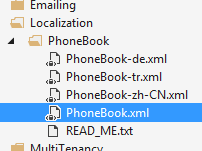
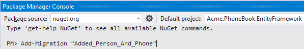
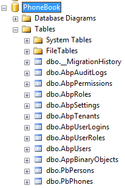
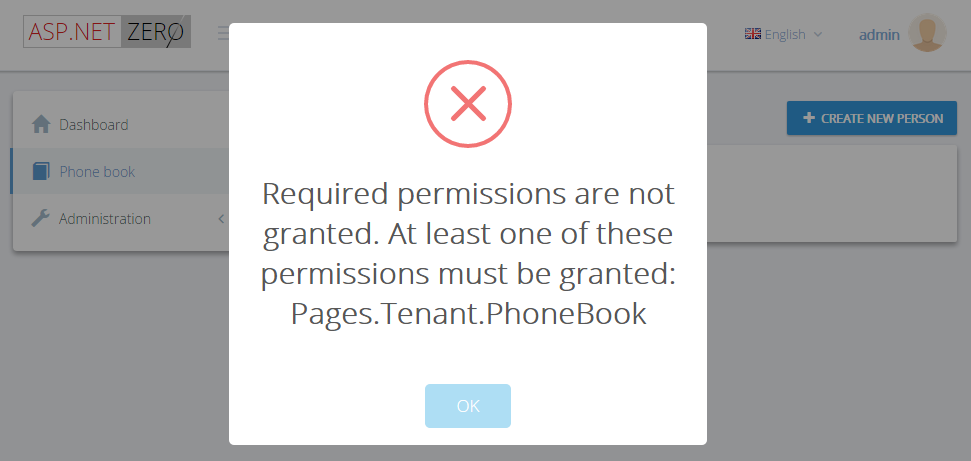
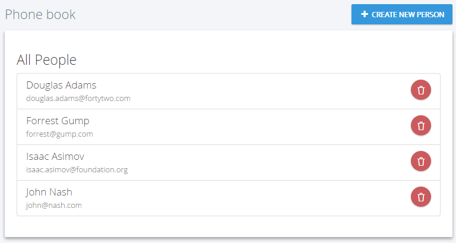
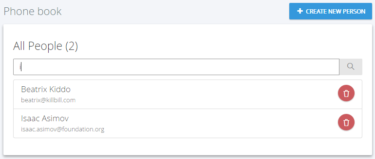
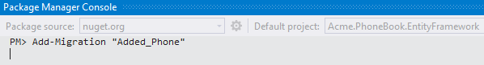

### Introduction

In this document, we will create a sample **phonebook application**
based on ASP.NET Zero step by step. After all steps, we will have a
multi-tenant, localized, authorized, configurable, testable...
appliaction.

### Creating The Project

We're creating and downloading the solution named "**Acme.PhoneBook**"
as described in [Getting Started](Getting-Started.md) document. After
opening solution in Visual Studio, we see an NLayered solution that
consists of six projects:

Also, run database migrations, create the database and login to the
application as described in [getting started](Getting-Started.md)
document. After all completed and logged in to the application, we see a
dashboard as shown below:

We will make our application **single-tenant** (we will convert it to
multi-tenant later). So, we open **PhoneBookCoreModule** class and
disable multi-tenancy as shown below:

    [DependsOn(typeof(AbpZeroCoreModule))]
    public class PhoneBookCoreModule : AbpModule
    {
        public override void PreInitialize()
        {
            //Enable this line to create a multi-tenant application.
            //Configuration.MultiTenancy.IsEnabled = true;
        }
    }

#### Switch to MPA

Do not skip to switch default application to the MPA version (click "See
Demo for Multi-Page Application version with ASP.NET MVC and jQuery").

### Adding a New Page

Let's begin from UI and create a new page named "**Phone book**".

#### Defining a menu item

**AppNavigationProvider** class defines menus in the application. When
we change this class, menus are automatically changed. Open this class
and create new menu item as shown below.

    .AddItem(new MenuItemDefinition(
        PageNames.App.Tenant.PhoneBook,
        L("PhoneBook"),
        url: "tenant.phonebook",
        icon: "glyphicon glyphicon-book"
        )
    )

Every menu item must have a **unique name** to identify this menu item.
Menu names are defined in PageNames class as constants. We add a new
constant: "**PhoneBook**".

#### Localizing Menu Item Display Name

A menu item should also have a **localizable shown name**. It's used to
display menu item on the page. **L("PhoneBook")** is the localized name of
our new menu. **L** method is a helper method gets a localization key
and simply returns a **LocalizableString** object (see
AppNavigationProvider class).

Localization strings are defined in **XML** files in **.Core** project
as shown below:

Open PhoneBook.xml (the **default**, **English** localization
dictionary) and add the following line:

    <text name="PhoneBook" value="Phone book" />

If we don't define "PhoneBook"s value for other localization
dictionaries, default value is shown in all languages. We can define it
also for Turkish in PhoneBook-tr.xml file:

    <text name="PhoneBook" value="Telefon rehberi" />

#### Other menu item properties

**url** can be a URL or **AngularJS route** (state in Angular
**ui-router** used in ASP.NET Zero) that will be activated when we click
the menu item. We will define this route below.

Lastly, **icon** is the shown menu icon for new menu item. It can be a
**css** class. We can use Glyphicon, Font-Awesome or another css font
library here.

See [navigation
document](https://aspnetboilerplate.com/Pages/Documents/Navigation) for
more information on menu definitions.

### Creating AngularJS Route

AngularJS routes are defined in **app.js**. We're adding a new route
definition as shown below:

    $stateProvider.state('tenant.phonebook', {
        url: '/phonebook',
        templateUrl: '~/App/tenant/views/phonebook/index.cshtml'
    });

'**tenant.phonebook**' is the **unique** name of this state (route).
**url** is the mapped URL to this route and **templateUrl** is the view
path for this route.

Note that 'tenant.phonebook' is a **second level state** (child of
'tenant' abstract state). See Angular UI's route document for more
information on defining states. But, in most cases, you can define it
easily by taking existing routes as reference.

### Creating AngularJS View and Controller

The last step to see our new page is to create an AngularJS view and
controller for it:

We can use **empty** controller and view located under
**common/views/\_empty** folder to simplify creating a new view.

#### Controller

Creating an empty Controller file, **index.js** under
**App/tenant/views/phonebook** folder:

    (function() {
        appModule.controller('tenant.views.phonebook.index', [
            '$scope',
            function ($scope) {
                var vm = this;

                $scope.$on('$viewContentLoaded', function () {
                    Metronic.initAjax();
                });

                //...
            }
        ]);
    })();

This is the minimum controller definition that creates a controller
named '**tenant.views.phonebook.index**' and triggers Metronic's init
method for this page. Controller name is completely arbitrary. You can
set any string. We use this naming **as convention** and it's advised to
follow this convention when developing applications based on ASP.NET
Zero.

#### View

Creating an empty view, **index.cshtml** under
**App/tenant/views/phonebook** folder:

    

        

            

                

                    

                        <h1>
                            @L("PhoneBook")
                        </h1>
                    

                

            

        

        

            

                
PHONE BOOK CONTENT COMES HERE!

            

        

    

We can use **.cshtml (razor)** files as views (thanks to ABP framework).
That makes easy localization**,** conditionally creating some part of
the view (based on some user permissions for example) and so on. Don't
confuse about all these html structure. You can simple copy empty view
from **common/views/\_empty** folder .

Now, it's time to run application and see the new phone book page:

Menu item display name and page title are localized. Try to change UI
language to see difference.

### Creating Person Entity

We define entities in **.Core** (domain) project. We can define a
**Person** entity (mapped to **PbPersons** table in database) to
represent a person in phone book as shown below:

    [Table("PbPersons")]
    public class Person : FullAuditedEntity
    {
        public const int MaxNameLength = 32;
        public const int MaxSurnameLength = 32;
        public const int MaxEmailAddressLength = 255;

        [Required]
        [MaxLength(MaxNameLength)]
        public virtual string Name { get; set; }

        [Required]
        [MaxLength(MaxSurnameLength)]
        public virtual string Surname { get; set; }

        [MaxLength(MaxEmailAddressLength)]
        public virtual string EmailAddress { get; set; }
    }

Person's **primary key** type is **int** (as default). It inherits
**FullAuditedEntity** that contains **creation**, **modification** and
**deletion** audit properties. It's also **soft-delete**. When we delete
a person, it's not deleted by database but marked as deleted (see
[entity](https://aspnetboilerplate.com/Pages/Documents/Entities) and
[data
filters](https://aspnetboilerplate.com/Pages/Documents/Data-Filters)
documentations for more information). We created consts for
**MaxLength** properties. This is a good practice since we will use same
values later.

We add a DbSet property for Person entity to **PhoneBookDbContext**
class defined in **.EntityFramework** project.

    public class PhoneBookDbContext : AbpZeroDbContext<Tenant, Role, User>
    {
        public virtual IDbSet<Person> Persons { get; set; }

        //...other entities

        public PhoneBookDbContext()
            : base("Default")
        {

        }

        //...other codes
    }

### Database Migrations

We use **EntityFramework Code-First migrations** to migrate database
schema. Since we added **Person entity**, our DbContext model is
changed. So, we should create a **new migration** to create the new
table in the database.

After opening **Package Manager Console** and selecting
**.EntityFramework** as **default project**, we write the following
command:

This command will add a **migration class** named
"**Added\_Persons\_Table**" as shown below:

    public partial class Added_Persons_Table : DbMigration
    {
        public override void Up()
        {
            CreateTable(
                "dbo.PbPersons",
                c => new
                    {
                        Id = c.Int(nullable: false, identity: true),
                        Name = c.String(nullable: false, maxLength: 32),
                        Surname = c.String(nullable: false, maxLength: 32),
                        EmailAddress = c.String(maxLength: 255),
                        IsDeleted = c.Boolean(nullable: false),
                        DeleterUserId = c.Long(),
                        DeletionTime = c.DateTime(),
                        LastModificationTime = c.DateTime(),
                        LastModifierUserId = c.Long(),
                        CreationTime = c.DateTime(nullable: false),
                        CreatorUserId = c.Long(),
                    },
                annotations: new Dictionary<string, object>
                {
                    { "DynamicFilter_Person_SoftDelete", "EntityFramework.DynamicFilters.DynamicFilterDefinition" },
                })
                .PrimaryKey(t => t.Id);

        }

        public override void Down()
        {
            DropTable("dbo.PbPersons",
                removedAnnotations: new Dictionary<string, object>
                {
                    { "DynamicFilter_Person_SoftDelete", "EntityFramework.DynamicFilters.DynamicFilterDefinition" },
                });
        }
    }

We don't have to know so much about format and rules of this file. But,
it's suggested to have a basic understanding of migrations. In the same
Package Manager Console, we write "**Update-Database**" command in order
to apply the new migration to database. After updating, we can see that
**PbPersons table** is added to database.

But this new table is empty. We can use EntityFramework's **Seed**
method to add some initial data to database. In ASP.NET Zero, there are
some classes to fill initial data for users and settings:

So, we can add a separated class to fill some people to database as
shown below:

    public class InitialPeopleCreator
    {
        private readonly PhoneBookDbContext _context;

        public InitialPeopleCreator(PhoneBookDbContext context)
        {
            _context = context;
        }

        public void Create()
        {
            var douglas = _context.Persons.FirstOrDefault(p => p.EmailAddress == "douglas.adams@fortytwo.com");
            if (douglas == null)
            {
                _context.Persons.Add(
                    new Person
                    {
                        Name = "Douglas",
                        Surname = "Adams",
                        EmailAddress = "douglas.adams@fortytwo.com"
                    });
            }

            var asimov = _context.Persons.FirstOrDefault(p => p.EmailAddress == "isaac.asimov@foundation.org");
            if (asimov == null)
            {
                _context.Persons.Add(
                    new Person
                    {
                        Name = "Isaac",
                        Surname = "Asimov",
                        EmailAddress = "isaac.asimov@foundation.org"
                    });
            }
        }
    }

These type of default data is good since we can also use these data in
**unit tests**. Surely, we should be careful about seed data since this
code will always be executed after each **Update-Database** command (See
EntityFramework documentations to know more about seed data). This class
is created and called in **DefaultTenantBuilder** class, and it's called
from EntityFramework's **Configuration** class. This is not so
important, just for a good code organization (see source codes).

We execute **Update-Database** command again. This command runs seed and
adds two people to PbPersons table:

### Creating Person Application Service

An Application Service is used from client (presentation layer) to
perform operations (use cases) in the application.

Application services are located in **.Application** project. We create
first application service to get people from server. We're creating an
**interface** to define the person application service:

    public interface IPersonAppService : IApplicationService
    {
        ListResultDto<PersonListDto> GetPeople(GetPeopleInput input);
    }

An application service method gets/returns **DTO**s. **ListResultDto**
is a pre-build helper DTO to return a list of another DTO.
**GetPeopleInput** is a DTO to pass request parameters to **GetPeople**
method. So, GetPeopleIntput and PersonListDto are defined as shown
below:

    public class GetPeopleInput
    {
        public string Filter { get; set; }
    }

    [AutoMapFrom(typeof(Person))]
    public class PersonListDto : FullAuditedEntityDto
    {
        public string Name { get; set; }

        public string Surname { get; set; }

        public string EmailAddress { get; set; }
    }

**AutoMapFrom** attribute is used to configure **AutoMapper** to create
mapping from **Person** to **PersonListDto**. **FullAuditedEntityDto**
is inherited to implement audit properties automatically. See [application
service](https://aspnetboilerplate.com/Pages/Documents/Application-Services)
and
[DTO](https://aspnetboilerplate.com/Pages/Documents/Data-Transfer-Objects)
documentations for more information.

After defining interface, we can implement it as shown below:

    public class PersonAppService : PhoneBookAppServiceBase, IPersonAppService
    {
        private readonly IRepository<Person> _personRepository;

        public PersonAppService(IRepository<Person> personRepository)
        {
            _personRepository = personRepository;
        }

        public ListResultDto<PersonListDto> GetPeople(GetPeopleInput input)
        {
            var persons = _personRepository
                .GetAll()
                .WhereIf(
                    !input.Filter.IsNullOrEmpty(),
                    p => p.Name.Contains(input.Filter) ||
                            p.Surname.Contains(input.Filter) ||
                            p.EmailAddress.Contains(input.Filter)
                )
                .OrderBy(p => p.Name)
                .ThenBy(p => p.Surname)
                .ToList();

            return new ListResultDto<PersonListDto>(persons.MapTo<List<PersonListDto>>());
        }
    }

We're injecting **person repository** (it's automatically created by
ABP) and using it to filter and get people from database.

**WhereIf** is an extension method here (defined in Abp.Linq.Extensions
namespace). It performs Where condition, only if filter is not null or
empty. **IsNullOrEmpty** is also an extension method (defined in
Abp.Extensions namespace). ABP has many similar shortcut extension
methods. **MapTo** method automatically converts list of Person entities
to list of PersonListDto objects using **AutoMapper** library.

#### Connection & Transaction Management

We don't manually open database connection or start/commit transactions
manually. It's automatically done with ABP framework's Unit Of Work
system. See [UOW
documentation](https://aspnetboilerplate.com/Pages/Documents/Unit-Of-Work)
for more.

#### Exception Handling

We don't handle exceptions manually (using a try-catch block). Because
ABP framework automatically handles all exceptions on the web layer and
returns appropriate error messages to the client. It then handles errors
on the client and shows needed error information to the user. See
[exception handling
document](https://aspnetboilerplate.com/Pages/Documents/Handling-Exceptions)
for more.

### Creating Unit Tests For PersonAppService

You can skip this section if you don't interest in **automated
testing**.

By writing unit test, we can test **PersonAppService.GetPeople** method
without creating a user interface that calls it and shows people on the
screen.

We write unit test in .**Tests** project in the solution. Let's create
first test to verify getting people without any filter:

    public class PersonAppService_Tests : AppTestBase
    {
        private readonly IPersonAppService _personAppService;

        public PersonAppService_Tests()
        {
            _personAppService = Resolve<IPersonAppService>();
        }

        [Fact]
        public void Should_Get_All_People_Without_Any_Filter()
        {
            //Act
            var persons = _personAppService.GetPeople(new GetPeopleInput());

            //Assert
            persons.Items.Count.ShouldBe(2);
        }
    }

We derived test class from **AppTestBase**. AppTestBase class
initializes all system, creates an in-memory fake database, seeds
initial data (that we created before) to database and logins to
application as admin. So, this is actually an **integration test** since
it tests all server-side codes from entity framework mapping to
application services, validation and authorization.

In constructor, we get (resolve) an **IPersonAppService** from
**dependency injection** container. It creates the **PersonAppService**
class with all dependencies. Then we can use it in test methods.

Since we're using [xUnit](http://xunit.github.io/), we add **Fact**
attribute to each test method. In the test method, we called
**GetPeople** method and checked if there are **two people** in the
returned list as we know that there were 2 people in **initial**
database.

Let's run the **all unit tests** in Test Explorer and see if it works:

As you see, it worked **successfully**. Now, we know that
PersonAppService works properly without any filter. Let's add a new unit
test to get filtered people:

    [Fact]
    public void Should_Get_People_With_Filter()
    {
        //Act
        var persons = _personAppService.GetPeople(
            new GetPeopleInput
            {
                Filter = "adams"
            });

        //Assert
        persons.Items.Count.ShouldBe(1);
        persons.Items[0].Name.ShouldBe("Douglas");
        persons.Items[0].Surname.ShouldBe("Adams");
    }

Again, since we know initial database, we can check returned results
easily. Here, initial test data is important. When we change initial
data, our test may fail even if our services are correct. So, it's
better to write unit tests independent of initial data as much as
possible. We could check incoming data to see if every people contains
"adams" in his/her name, surname or email. Thus, if we add new people to
initial data, our tests remain working.

There are many techniques on unit testing, I kept it simple here. But
ASP.NET Zero template makes very easy to write unit and integration
tests by base classes and pre-build test codes.

### Testing PersonAppService From Browser Console

Now, lets run and **login** to the application again, open Chrome
Developer Console (or similar tools in other browsers) and write the
following command:

This command performs an **AJAX** call to PersonAppService.**GetPeople**
method. We can see the request if we open **Network** tab:

As we see, an AJAX request made and people are got successfully.

So, how this happen? How we could call to a C\# class method (notice
that it's not an MVC Controller or Web API Controller, just a plain C\#
class) from javascript like calling a javascript method? This is
provided by ASP.NET Boilerplate. See [dynamic web api
layer](https://aspnetboilerplate.com/Pages/Documents/Dynamic-Web-API)
documentation for more information. You can always call application
services from console to debug or see returned JSON structure.

We can also check Audit Logs to see the request. Open **AbpAuditLogs**
table in PhoneBook database to see the call information:

There are some other fields not shown here. So, we see that User with
Id=2 called GetPeople method of the PersonAppService in recorded time
with the shown parameters and it' executed in 134 ms.

### Calling GetPeople Method From AngularJS Controller

It's time to open phonebook AngularJS **controller** and get people to
show on the view.

    (function() {
        appModule.controller('tenant.views.phonebook.index', [
            '$scope', 'abp.services.app.person',
            function($scope, personService) {
                var vm = this;

                vm.persons = [];

                personService.getPeople({}).then(function(result) {
                    vm.persons = result.data.items;
                });
            }
        ]);
    })();

We inject '**abp.services.app.person**' as **personService** parameter
(See [dynamic web api
layer](https://aspnetboilerplate.com/Pages/Documents/Dynamic-Web-API)
documentation to know how this service is automatically created). Then
we call **getPeople** method and create a **success** handler to get
**result** of the **AJAX** request. That's all!

### Rendering People In AngularJS View

We show people on the page is most basic form. See the changed view
below:

    

    ...            
                <h3>@L("AllPeople")</h3>

                

                    <a href="javascript:;" class="list-group-item" ng-repeat="person in vm.persons">
                        <h4 class="list-group-item-heading">
                            {{person.name}} {{person.surname}}
                        </h4>
                        

                            {{person.emailAddress}}
                        

                    </a>
                

    ...
    

We used **ng-repeat** directive of AngularJS to render the array of
people (vm.persons). See the result:

We successfully retrieved list of people from database to the page.

### Creating a new people

Next step is to create a modal to add a new item to phone book.

#### Add a CreatePerson Method to PersonAppService

We first define **CreatePerson** method in **IPersonAppService**
interface:

    Task CreatePerson(CreatePersonInput input);

Then we create **CreatePersonInput** DTO that defines parameters of the
method:

    [AutoMapTo(typeof(Person))]
    public class CreatePersonInput
    {
        [Required]
        [MaxLength(Person.MaxNameLength)]
        public string Name { get; set; }

        [Required]
        [MaxLength(Person.MaxSurnameLength)]
        public string Surname { get; set; }

        [EmailAddress]
        [MaxLength(Person.MaxEmailAddressLength)]
        public string EmailAddress { get; set; }
    }

**CreatePersonInput** is mapped to **Person** entity (we will use
mapping below). All properties are decorated by **data annotation
attributes** to provide automatic
**[validation](https://aspnetboilerplate.com/Pages/Documents/Validating-Data-Transfer-Objects)**.
Notice that we use same consts defined in Person entity for
**MaxLength** properties.

Here, the implementation of CreatePerson method:

    public async Task CreatePerson(CreatePersonInput input)
    {
        var person = input.MapTo<Person>();
        await _personRepository.InsertAsync(person);
    }

A Person entity is created by mapping given input, then inserted to
database. We used **async/await** pattern here. All methods in ASP.NET
Zero startup project is **async**. It's advised to use async/await
wherever possible.

#### Test CreatePerson Method

You can skip this section if you don't interest in **automated
testing**.

We can create a unit test method to test CreatePerson method as shown
below:

    [Fact]
    public async Task Should_Create_Person_With_Valid_Arguments()
    {
        //Act
        await _personAppService.CreatePerson(
            new CreatePersonInput
            {
                Name = "John",
                Surname = "Nash",
                EmailAddress = "john.nash@abeautifulmind.com"
            });

        //Assert
        UsingDbContext(
            context =>
            {
                var john = context.Persons.FirstOrDefault(p => p.EmailAddress == "john.nash@abeautifulmind.com");
                john.ShouldNotBe(null);
                john.Name.ShouldBe("John");
            });
    }

Test method also written using **async/await** pattern since calling
method is async. We called CreatePerson method, then checked if given
person is in the database. **UsingDbContext** method is a helper method
of **AppTestBase** class (which we inherited this unit test class from).
It's used to easily get a reference to DbContext and use it directly to
perform database operations.

This method successfully works since all required fields are supplied.
Let's try to create a test for **invalid arguments**:

    [Fact]
    public async Task Should_Not_Create_Person_With_Invalid_Arguments()
    {
        //Act and Assert
        await Assert.ThrowsAsync<AbpValidationException>(
            async () =>
                    {
                        await _personAppService.CreatePerson(
                            new CreatePersonInput
                            {
                                Name = "John"
                            });
                    });
    }

We did not set **Surname** property of CreatePersonInput despite it being
**required**. So, it throws **AbpValidationException** automatically.
Also, we can not send null to CreatePerson method since validation
system also checks it. This test calls CreatePerson with invalid
arguments and asserts that it throws AbpValidationException. See
[validation
document](https://aspnetboilerplate.com/Pages/Documents/Validating-Data-Transfer-Objects)
for more information.

#### Creating a Modal

We will create a [Angular UI-Bootstrap
modal](https://angular-ui.github.io/bootstrap/#/modal) to create a
new person as shown below:

View code is shown below: 

    @using Acme.PhoneBook.People
    

        <form name="createPersonForm" role="form" novalidate class="form-validation">
            

                <h4 class="modal-title">
                    @L("CreateNewPerson")
                </h4>
            

            

                

                    <input class="form-control" type="text" name="Name" ng-model="vm.person.name" required maxlength="@Person.MaxNameLength">
                    <label>@L("Name")</label>
                

                

                    <input type="text" name="Surname" class="form-control" ng-model="vm.person.surname" required maxlength="@Person.MaxSurnameLength">
                    <label>@L("Surname")</label>
                

                

                    <input type="email" name="EmailAddress" class="form-control" ng-model="vm.person.emailAddress" maxlength="@Person.MaxEmailAddressLength">
                    <label>@L("EmailAddress")</label>
                

            

            

                <button ng-disabled="vm.saving" type="button" class="btn btn-default" ng-click="vm.cancel()">@L("Cancel")</button>
                <button type="submit" button-busy="vm.saving" busy-text="@L("SavingWithThreeDot")" class="btn btn-primary blue" ng-click="vm.save()" ng-disabled="createPersonForm.$invalid"><i class="fa fa-save"></i> @L("Save")</button>
            

        </form>
    

We have a form with three input (name, surname and email address)
**validated** using AngularJS. We're using **Person** entity's const
values in view to set same **maxlength** to input controls.

**Save** button is **disabled** if the form is **invalid**.
**button-busy** directive makes buttons disable and animates it while
submitting form:

AngularJS **controller** of this view is shown below:

    (function () {
        appModule.controller('tenant.views.phonebook.createPersonModal', [
            '$scope', '$uibModalInstance', 'abp.services.app.person',
            function ($scope, $uibModalInstance, personService) {
                var vm = this;

                vm.saving = false;
                vm.person = {};

                vm.save = function () {
                    vm.saving = true;
                    personService.createPerson(vm.person).then(function () {
                        abp.notify.info(app.localize('SavedSuccessfully'));
                        $uibModalInstance.close();
                    }).finally(function () {
                        vm.saving = false;
                    });
                };

                vm.cancel = function () {
                    $uibModalInstance.dismiss();
                };
            }
        ]);
    })();

Controller is simple. It calls **createPerson** method of
**PersonAppService** when we click the **Save** button. **vm.saving**
flag is **true** during AJAX operation. This value is used on view to
disable and make buttons animated. If createPerson success, modal is
**closed**.

#### Opening the Modal

We return to phone book view and add a **button** to open this modal:

    <button class="btn btn-primary blue" ng-click="vm.openCreatePersonModal()"><i class="fa fa-plus"></i> @L("CreateNewPerson")</button>

**vm.openCreatePersonModal** method is called when we click this button:

    (function() {
        appModule.controller('tenant.views.phonebook.index', [
            '$scope', '$uibModal', 'abp.services.app.person',
            function ($scope, $uibModal, personService) {
                var vm = this;

                vm.persons = [];

                function getPeople() {
                    personService.getPeople({}).then(function (result) {
                        vm.persons = result.data.items;
                    });
                }

                vm.openCreatePersonModal = function () {
                    var modalInstance = $uibModal.open({
                        templateUrl: '~/App/tenant/views/phonebook/createPersonModal.cshtml',
                        controller: 'tenant.views.phonebook.createPersonModal as vm',
                        backdrop: 'static'
                    });

                    modalInstance.result.then(function () {
                        getPeople();
                    });
                };

                getPeople();
            }
        ]);
    })();

We open modal using $uibModal service by providing view and controller.
We re-load person list (by calling getPeople function) after modal
closed.

### Authorization For Phone Book

At this point, anyone can enter phone book page since no authorization
defined. We will define two permission:

-   A permission to **enter phone book page**.
-   A permission to **create new person** (which is a child permission
    of first one, as naturally).

#### Permission for Entering Phone Book Page

##### Define the permission

Go to **AppAuthorizationProvider** class and add a new permission as
shown below:

    pages.CreateChildPermission(AppPermissions.Pages_Tenant_PhoneBook, L("PhoneBook"), multiTenancySides: MultiTenancySides.Tenant);

A permission should have a unique name. We define permission names as
constant strings in **AppPermissions** class. It's a simple constant
string:

    public const string Pages_Tenant_PhoneBook = "Pages.Tenant.PhoneBook";

Unique name of this permission is "**Pages.Tenant.PhoneBook**". While
you can set any string (as long as it's unique), it's suggested to use
this convention. A permission can have a localizable display name:
"**PhoneBook**" here. (See "Adding a New Page" section for more about
localization, since it's very similar). Lastly, we set this as a
**tenant** level permission.

##### Add AbpAuthorize attribute

**AbpAuthorize** attribute can be used as **class level** or **method
level** to protect an application service or service method from
unauthorized users. Since all server side code is located in
PersonAppService class, we can declare a class level attribute as shown
below:

    [AbpAuthorize(AppPermissions.Pages_Tenant_PhoneBook)]
    public class PersonAppService : PhoneBookAppServiceBase, IPersonAppService
    {
        //...
    }

Now, let's try to enter Phone Book page by clicking the menu item:

We get an error message. This exception is thrown when any method of
PersonAppService is called without needed permission.

##### Hide Unauthorized Menu Item

This secures the service, but we should also **hide** the Phone book
**menu item**. It's easy, open AppNavigationProvider and add
requiredPermissionName as shown below:

    new MenuItemDefinition(
        PageNames.App.Tenant.PhoneBook,
        L("PhoneBook"),
        url: "tenant.phonebook",
        icon: "glyphicon glyphicon-book",
        requiredPermissionName: AppPermissions.Pages_Tenant_PhoneBook
    )

##### Disable AngularJS route

While hiding menu item prevents user to enter the page by clicking it,
he can still enter the page by entering the following URL directly to
address bar of browsers:

    http://localhost:6234/Application#/tenant/phonebook

We should also conditionally define AngularJS routes. Thus, if user has no
permission to enter this page, he can not activate the route:

    if (abp.auth.hasPermission('Pages.Tenant.PhoneBook')) {
        $stateProvider.state('tenant.phonebook', {
            url: '/phonebook',
            templateUrl: '~/App/tenant/views/phonebook/index.cshtml',
            menu: 'PhoneBook'
        });
    }

We wrapper route definition by an if block that checks related
permission. Now, user can not open the page without the permission. He
is redirected to default route by AngularJS.

##### Grant permission

So, how we can enter the page now? Simple, go to **Role Management**
page and edit **admin** role:

We see that a **new permission** named "**Phone book**" added to
**permissions** tab. So, we can check it and save the role. After
saving, we need to **refresh** the whole page to refresh permissions for
the current user. We could also grant this permission for a specific
user (see [development guide document](Development-Guide.md) for
details about roles and users).

Now, we can enter the Phone book page again.

#### Permission for Create New Person

While a permission for a page is useful and probably needed always, we
may need to define additional permissions to perform some **specific
actions** on a page, like creating a new person.

##### Define the permission

Defining a permission is similar:

    var phoneBook = pages.CreateChildPermission(AppPermissions.Pages_Tenant_PhoneBook, L("PhoneBook"), multiTenancySides: MultiTenancySides.Tenant);
    phoneBook.CreateChildPermission(AppPermissions.Pages_Tenant_PhoneBook_CreatePerson, L("CreateNewPerson"), multiTenancySides: MultiTenancySides.Tenant);

First permission was defined before. In the second line, we are creating
a child permission of first one.

##### Add AbpAuthorize attribute

This time, we're declaring **AbpAuthorize** attribute just for
**CreatePerson** method:

    [AbpAuthorize(AppPermissions.Pages_Tenant_PhoneBook_CreatePerson)]
    public async Task CreatePerson(CreatePersonInput input)
    {
        //...
    }

##### Hide Unauthorized Button

If we run the application and try to create a person, we get an
authorization error after clicking the save button. But, it's good to
**completely hide Create New Person button** if we don't have the
permission. There are a few ways of doing it.

We can implement it in **index.cshtml** razor view on **server side**
using **IsGranted** method:

    @if (IsGranted(AppPermissions.Pages_Tenant_PhoneBook_CreatePerson))
    {
        <button class="btn btn-primary blue" ng-click="vm.openCreatePersonModal()"><i class="fa fa-plus"></i> @L("CreateNewPerson")</button>
    }

In this way, the Create New Person does not rendered in server and user
can not see this button.

As an alternative, we can check permission on **client side**. First, we
declare a variable in AngularJS controller:

    vm.permissions = {
        createPerson: abp.auth.hasPermission('Pages.Tenant.PhoneBook.CreatePerson')
    };

And then use it in a **ng-if** directive in view to conditionally render
the button:

    <button ng-if="vm.permissions.createPerson" class="btn btn-primary blue" ng-click="vm.openCreatePersonModal()"><i class="fa fa-plus"></i> @L("CreateNewPerson")</button>

##### Grant permission

To see the button again, we can go to role or user manager and grant
related permission as shown below:

As shown above, **Create new person** permission is a child permission
of the **Phone book**.

See [authorization
documentation](https://aspnetboilerplate.com/Pages/Documents/Authorization)
for more information on authorization.

### Deleting a Person

Let's add a delete button in people list as shown below:

We're starting from UI in this case.

#### View

We're changing index.cshtml view to add a button (related part is shown
here):

    

        <a href="javascript:;" class="list-group-item" ng-repeat="person in vm.persons">
            <h4 class="list-group-item-heading">
                {{person.name}} {{person.surname}}
                <button ng-if="vm.permissions.deletePerson" ng-click="vm.deletePerson(person)" title="@L("Delete")" class="btn btn-circle btn-icon-only red delete-person" href="javascript:;">
                    <i class="icon-trash"></i>
                </button>
            </h4>
            

                {{person.emailAddress}}
            

        </a>
    

Surely, we defined 'delete person' permission as like before.

#### Style

We're using a **[LESS](http://lesscss.org/)** style here to take button
right. Created a file named index.less and added following lines:

    #AllPeopleList {
        .list-group-item-heading {
            button.delete-person {
                float: right;
            }
        }
    }

Pre-built bundling configuration automatically includes styles to
layout.

#### Controller

Now, creating a **deletePerson** function in AngularJS controller (that
was called from view above):

    vm.deletePerson = function (person) {
        abp.message.confirm(
            app.localize('AreYouSureToDeletePerson', person.name),
            function (isConfirmed) {
                if (isConfirmed) {
                    personService.deletePerson({
                        id: person.id
                    }).then(function () {
                        abp.notify.success(app.localize('SuccessfullyDeleted'));
                        getPeople();
                    });
                }
            }
        );
    };

It first shows a confirmation message when we click the delete button:

If we click Yes, it simply calls **deletePerson** method of
**PersonAppService** and shows a notification if operation succeed.

Localization string "**AreYouSureToDeletePerson**" was defined like
that:

    <text name="AreYouSureToDeletePerson" value="Are you sure to delete person named {0}?" />

So, we can pass a name into localize method. This is similar to C\#'s
string.Format method.

#### Application Service

First, adding a new method definition to **IPersonAppService** interface
as always:

    Task DeletePerson(EntityDto input);

**EntityDto** is a shortcut of ABP if we only get an id value.
Implementation (in **PersonAppService**) is very simple:

    [AbpAuthorize(AppPermissions.Pages_Tenant_PhoneBook_DeletePerson)]
    public async Task DeletePerson(EntityDto input)
    {
        await _personRepository.DeleteAsync(input.Id);
    }

We also **authorized** deleting a person as did before for creating a
person.

### Filtering people

Now, we will implement **search** functionality of **GetPeople** method.
UI is shown below:

We added a search input to filter people:

    <input ng-model="vm.filterText" auto-focus class="form-control" placeholder="@L("SearchWithThreeDot")" type="text">
    
        <button ng-click="vm.getPeople()" class="btn btn-default" type="submit"><i class="icon-magnifier"></i></button>
    

and changed title to show people count:

    <h3>@L("AllPeople") ({{vm.persons.length}})</h3>

Lastly, changed **getPeople** function in controller, to send
**vm.filterText** to server:

    vm.getPeople = function() {
        personService.getPeople({
            filter: vm.filterText
        }).then(function (result) {
            vm.persons = result.data.items;
        });
    };

That's all. It works since we already have implemented filtering on
server.

### Extending the Application: Adding Phone Numbers

Until now, we did not even mention about phone numbers. It's time to
extend our domain to support **multiple phone numbers** for a person.

### Creating Phone Entity

Let's start by creating a new Entity, **Phone** in **.Core** project:

    [Table("PbPhones")]
    public class Phone : CreationAuditedEntity<long>
    {
        public const int MaxNumberLength = 16;

        [ForeignKey("PersonId")]
        public virtual Person Person { get; set; }
        public virtual int PersonId { get; set; }

        [Required]
        public virtual PhoneType Type { get; set; }

        [Required]
        [MaxLength(MaxNumberLength)]
        public virtual string Number { get; set; }
    }

Phone entities are stored in **PbPhones** table. Its primary key is
**long** and it inherits creation auditing properties. It has a reference
to **Person** entity which owns the phone number.

We added a **Phones** collection to the People:

    [Table("PbPersons")]
    public class Person : FullAuditedEntity
    {
        //...other properties

        public virtual ICollection<Phone> Phones { get; set; }
    }

We have a **PhoneType** enum as shown below:

    public enum PhoneType : byte
    {
        Mobile,
        Home,
        Business
    }

Lastly, we're also adding a DbSet property for Phone to our DbContext:

    public virtual IDbSet<Phone> Phones { get; set; }

### Adding Database Migration

Our entity model has changed, so we need to add a new migration:

This will create a new code based migration file to create **PbPhones**
table:

    public partial class Added_Phone : DbMigration
    {
        public override void Up()
        {
            CreateTable(
                "dbo.PbPhones",
                c => new
                    {
                        Id = c.Long(nullable: false, identity: true),
                        PersonId = c.Int(nullable: false),
                        Type = c.Byte(nullable: false),
                        Number = c.String(nullable: false, maxLength: 16),
                        CreationTime = c.DateTime(nullable: false),
                        CreatorUserId = c.Long(),
                    })
                .PrimaryKey(t => t.Id)
                .ForeignKey("dbo.PbPersons", t => t.PersonId, cascadeDelete: true)
                .Index(t => t.PersonId);

        }

        public override void Down()
        {
            DropForeignKey("dbo.PbPhones", "PersonId", "dbo.PbPersons");
            DropIndex("dbo.PbPhones", new[] { "PersonId" });
            DropTable("dbo.PbPhones");
        }
    }

Before updating database, we can go to database **seed** code and add
example **phone numbers** for example people:

    public class InitialPeopleAndPhoneCreator
    {
        //...

        public void Create()
        {
            var douglas = _context.Persons.FirstOrDefault(p => p.EmailAddress == "douglas.adams@fortytwo.net");
            if (douglas == null)
            {
                _context.Persons.Add(
                    new Person
                    {
                        Name = "Douglas",
                        Surname = "Adams",
                        EmailAddress = "douglas.adams@fortytwo.com",
                        Phones = new List<Phone>
                                    {
                                        new Phone {Type = PhoneType.Home, Number = "1112242"},
                                        new Phone {Type = PhoneType.Mobile, Number = "2223342"}
                                    }
                    });
            }

            var asimov = _context.Persons.FirstOrDefault(p => p.EmailAddress == "isaac.asimov@foundation.org");
            if (asimov == null)
            {
                _context.Persons.Add(
                    new Person
                    {
                        Name = "Isaac",
                        Surname = "Asimov",
                        EmailAddress = "isaac.asimov@foundation.org",
                        Phones = new List<Phone>
                                    {
                                        new Phone {Type = PhoneType.Home, Number = "8889977"}
                                    }
                    });
            }
        }
    }

We added two phone numbers to Douglas, one phone number to Isaac. But if
we run Update-Database now, phones are not inserted since this seed code
checks if person exists, and does not insert if it already exists.
Since we haven't deployed yet, we can delete database
(or remove entries from people table) and re-create it.

Now, we are running **Update-Database** command in Package Manager
Console to re-create database and seed it. You can check database to see
**PbPhones** table and rows.

### Changing GetPeople Method

We're changing **PersonAppService.GetPeople** method to **include**
phone numbers of people into return value.

First, we're changing **PersonListDto** to contain a list of phones:

    [AutoMapFrom(typeof(Person))]
    public class PersonListDto : FullAuditedEntityDto
    {
        public string Name { get; set; }

        public string Surname { get; set; }

        public string EmailAddress { get; set; }

        public Collection<PhoneInPersonListDto> Phones { get; set; }
    }

    [AutoMapFrom(typeof(Phone))]
    public class PhoneInPersonListDto : CreationAuditedEntityDto<long>
    {
        public PhoneType Type { get; set; }

        public string Number { get; set; }
    }

So, added also a DTO to transfer phone numbers and mapped from Phone
entity. Now, we can change GetPeople method to get Phones from database:

    public ListResultDto<PersonListDto> GetPeople(GetPeopleInput input)
    {
        var persons = _personRepository
            .GetAll()
            .Include(p => p.Phones)
            .WhereIf(
                !input.Filter.IsNullOrEmpty(),
                p => p.Name.Contains(input.Filter) ||
                        p.Surname.Contains(input.Filter) ||
                        p.EmailAddress.Contains(input.Filter)
            )
            .OrderBy(p => p.Name)
            .ThenBy(p => p.Surname)
            .ToList();

        return new ListResultDto<PersonListDto>(persons.MapTo<List<PersonListDto>>());
    }

We only added **Include** extension method to the query. Rest of the
codes remains same. Furthermore, it would work without adding this, but
much slower (since it will lazy load phone numbers for every person
separately).

### AddPhone and DeletePhone Methods

We are adding two more methods to IPersonAppService interface as shown
below:

    Task DeletePhone(EntityDto<long> input);
    Task<PhoneInPersonListDto> AddPhone(AddPhoneInput input);

We could create a new, separated IPhoneAppService. It's your choice.
But, we can consider Person as an aggregate and add phone related
methods here. AddPhoneInput DTO is shown below:

    [AutoMapTo(typeof(Phone))]
    public class AddPhoneInput
    {
        [Range(1, int.MaxValue)]
        public int PersonId { get; set; }

        [Required]
        public PhoneType Type { get; set; }

        [Required]
        [MaxLength(Phone.MaxNumberLength)]
        public string Number { get; set; }
    }

Now, we can implement these methods:

    public async Task DeletePhone(EntityDto<long> input)
    {
        await _phoneRepository.DeleteAsync(input.Id);
    }

    public async Task<PhoneInPersonListDto> AddPhone(AddPhoneInput input)
    {
        var person = _personRepository.Get(input.PersonId);

        var phone = input.MapTo<Phone>();
        person.Phones.Add(phone);

        await CurrentUnitOfWork.SaveChangesAsync();

        return phone.MapTo<PhoneInPersonListDto>();
    }

**DeletePhone** method is simple. It only deletes phone with given id.

**AddPhone** method **gets** the person from database and add new phone
to person.Phones collection. Then is **save changes**. Saving changes
causes inserting new added phone to database and get its **Id**.
Because, we are returning a DTO that contains newly created phone
informations including Id. So, it should be assigned before mapping in
the last line. (Notice that; normally it's not needed to call
CurrentUnitOfWork.SaveChangesAsync. It's automatically called at the end
of the method. We called it in the method since we need to save entity
and get its Id immediately. See [UOW
document](https://aspnetboilerplate.com/Pages/Documents/Unit-Of-Work#DocAutoSaveChanges)
for more.)

There may be different approaches for AddPhone method. You can directly
work with a **phone repository** to insert new phone. They all have
different pros and cons. It's your choice.

### Edit Mode For People List

Final UI is shown below:

When we click the **green edit icon** for a person, its row is expanded
and all phone numbers are shown. Then we can delete any number by
clicking the icon at left. We can add a new phone from the inputs at
last line.

#### View

Changes in view are shown below:

    

        

            <h4 class="list-group-item-heading">
                {{person.name}} {{person.surname}}
                
                    <button ng-click="vm.editPerson(person)" title="@L("Edit")" class="btn btn-circle btn-icon-only green">
                        <i class="icon-pencil"></i>
                    </button>
                    <button ng-if="vm.permissions.deletePerson" ng-click="vm.deletePerson(person)" title="@L("Delete")" class="btn btn-circle btn-icon-only red">
                        <i class="icon-trash"></i>
                    </button>
                
            </h4>
            

                {{person.emailAddress}}
            

            

                <table class="table table-hover">
                    <thead>
                        <tr>
                            <th style="width:10%"></th>
                            <th style="width:15%">@L("Type")</th>
                            <th style="width:75%">@L("PhoneNumber")</th>
                        </tr>
                    </thead>
                    <tbody>
                        <tr ng-repeat="phone in person.phones">
                            <td>
                                <button ng-click="vm.deletePhone(phone, person)" class="btn btn-sm btn-default">
                                    <i class="icon-trash"></i>
                                </button>
                            </td>
                            <td>{{vm.getPhoneTypeAsString(phone.type)}}</td>
                            <td>{{phone.number}}</td>
                        </tr>
                        <tr>
                            <td>
                                <button ng-click="vm.addPhone(person.newPhone, person)" class="btn btn-sm green">
                                    <i class="fa fa-floppy-o"></i>
                                </button>
                            </td>
                            <td>
                                <select name="Type" ng-model="person.newPhone.type">
                                    <option value="0">@L("PhoneType_Mobile")</option>
                                    <option value="1">@L("PhoneType_Home")</option>
                                    <option value="2">@L("PhoneType_Business")</option>
                                </select>
                            </td>
                            <td><input type="text" name="Number" ng-model="person.newPhone.number" /></td>
                        </tr>
                    </tbody>
                </table>
            

        

    

We added an edit button for each person. Then added a table (shown if
this person is being edited) for each person that shows phones of the
related person and allows adding a new phone.

#### Controller

Added following codes into the AngularJS controller:

    vm.editingPerson = null;

    vm.editPerson = function(person) {
        if (person == vm.editingPerson) {
            vm.editingPerson = null;
        } else {
            vm.editingPerson = person;
        }
    };

    vm.getPhoneTypeAsString = function(typeAsNumber) {
        switch (typeAsNumber) {
        case 0:
            return app.localize('PhoneType_Mobile');
        case 1:
            return app.localize('PhoneType_Home');
        case 2:
            return app.localize('PhoneType_Business');
        default:
            return '?';
        }
    };

    vm.deletePhone = function(phone, person) {
        personService.deletePhone({
            id: phone.id
        }).then(function() {
            abp.notify.success(app.localize('SuccessfullyDeleted'));
            person.phones = _.without(person.phones, phone);
        });
    };

    vm.addPhone = function(phone, person) {
        if (!phone || !phone.type || !phone.number) {
            abp.message.warn('Please select a phone type and enter a number!');
            return;
        }

        phone.personId = person.id;

        personService.addPhone(phone)
            .then(function(result) {
                abp.notify.success(app.localize('SavedSuccessfully'));
                person.phones.push(result);
                phone.number = '';
            });
    };

### Multi Tenancy

We have built a fully functional application until here. Now, we will
see how to convert it to a multi-tenant application easily.

#### Enable Multi Tenancy

We disabled multi-tenancy at the beginning of this document. Now,
re-enabling it in **PhoneBookCoreModule** class:

    Configuration.MultiTenancy.IsEnabled = true;

#### Make Entities Multi Tenant

In a multi-tenant application, a tenant's entities should be isolated by
other tenants. For this example project, every tenant should have own
phone book with isolated people and phone numbers.

When we implement IMustHaveTenant interface, ABP automatically [filters
data](https://aspnetboilerplate.com/Pages/Documents/Data-Filters) based
on current Tenant, while retrieving entities from database. So, we
should declare that Person entity must have a tenant using
**IMustHaveTenant** interface:

    public class Person : FullAuditedEntity, IMustHaveTenant
    {
        public virtual int TenantId { get; set; }

        //...other properties
    }

We may want to add IMustHaveTenant interface to also Phone entity. This
is needed if we directly use phone repository to get phones. In this
sample project, it's not needed.

Since entities have changed, we should create a new database migration:

    Add-Migration "Implemented_IMustHaveTenant_For_Person"

This command creates a new code-first database migration. The migration
class adds an annotation this is needed for automatic filtering. We
don't have to know what it is since it's done automatically. And also it
adds a TenantId column to PbPersons table as shown below:

    AddColumn("dbo.PbPersons", "TenantId", c => c.Int(nullable: false, defaultValue: 1));

I added **defaultValue as 1** to AddColumn options. Thus, current People
are automatically assigned to **default tenant** (default tenant's id is
1).

Now, we can update the database again:

    Update-Database

#### Run The Multi Tenant Application

**It's finished**! We can test the application. Run the project,
**login** as **host** as shown blow:

Since we enabled multi-tenancy, we see a **Tenancy name** input on login
form. When we leave it **empty**, we login as a **host user**. Default
**admin** password is **123qwe**.

After login, we see the **tenant list** which only contains a
**default** tenant. We can create a new tenant:

I created a new tenant named **trio**. Now, tenant list has two tenants:

 I can **logout** and login as trio **tenant admin**:

After login, we see that phone book is empty:

It's empty because trio tenant has a completely isolated people list.
You can add people here, logout and login as different tenants (you can
login as default tenant for example). You will see that each tenant has
an isolated phone book and can not see other's people.

### Conclusion

In this document, we built a complete example that covers most parts of
the ASP.NET Zero system. We hope that it will help you to build your own
application.

#### Source Code

You should [purchase](/Prices) ASP.NET Zero in order to get **source
code**. After purchasing, you can get the sample project from private
Github repository: <https://github.com/aspnetzero/aspnet-zero-samples>
