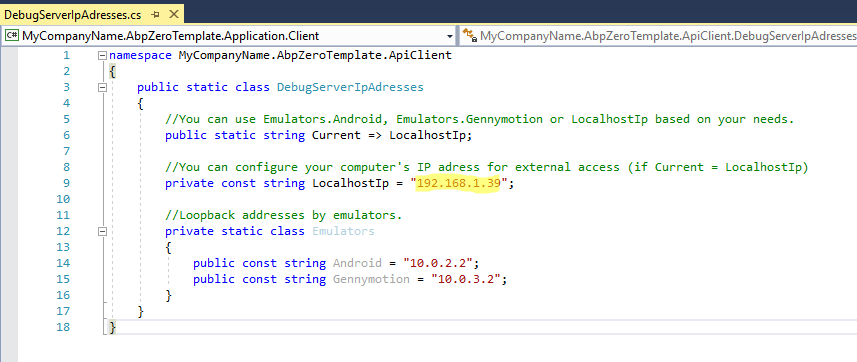
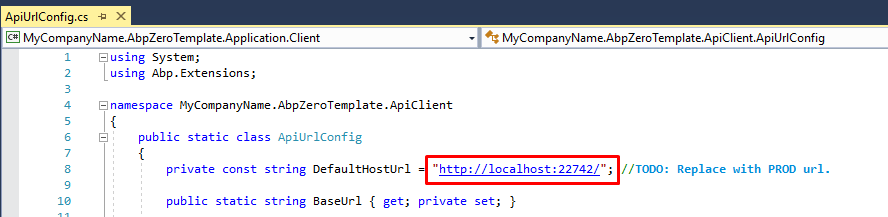
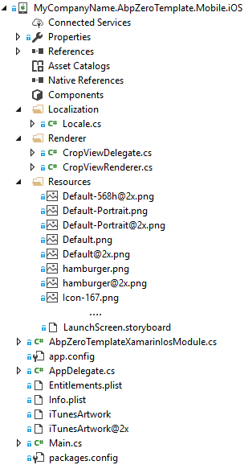
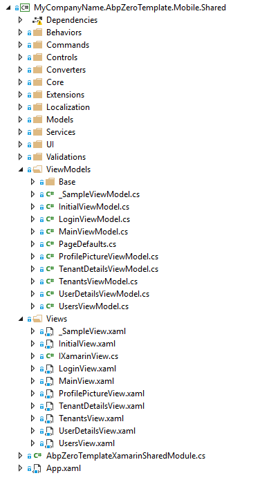
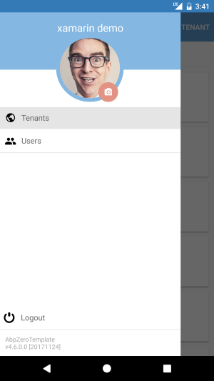
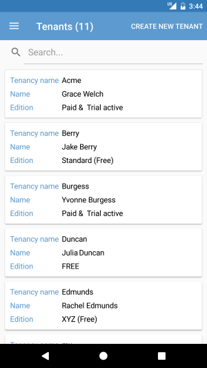

# Development Guide

## Introduction

Xamarin is a cross-platform UI toolkit that allows developers to
efficiently create native cross platform user interface layouts.  
This document is intended to show how to setup a Xamarin development
environment and introduce existing features and user interfaces on
ASP.NET Zero Xamarin platform. For an overview of the Xamarin
installation and setup practices see [Xamarin.Forms
Requirements](https://developer.xamarin.com/guides/xamarin-forms/getting-started/installation/)
and
[Installation](https://developer.xamarin.com/guides/cross-platform/getting_started/installation/).  
For an overview of the ASP.NET Zero getting started see [ASP.NET Zero
Getting Started.](Getting-Started-Core) The ASP.NET Zero Xamarin is only
available for ASP.NET Core included Angular UI and Mvc UI.

### Prerequisites

Following tools are needed in order to develop ASP.NET Zero Xamarin:

-   [Visual Studio 2017 v15.4.4](https://www.visualstudio.com)+
-   Mac for iOS simulator

ASP.NET Zero Xamarin applications can be written for the following
operating systems:

-   iOS 8 or higher
-   Android 4.0.3 (API 15) or higher ([more
    details](https://developer.xamarin.com/guides/xamarin-forms/getting-started/installation/#android))

### Android

You should have the latest Android SDK Tools and Android API platform
installed. You can update to the latest versions using the [Android SDK
Manager](https://developer.xamarin.com/guides/android/application_fundamentals/using-the-sdk-manager/).

Additionally, the target/compile version for Android projects **must** be set to ***Use latest installed
platform***. However the minimum version can be set to API 15 so you can
continue to support devices that use Android 4.0.3 and newer.

These values are set in the **Project Options**:

**Project Options &gt; Application &gt; Application Properties**

### Mac System Requirements

You can use Visual Studio for Mac to develop Xamarin.Forms apps on OS X
El Capitan (10.11) or newer. To develop iOS apps, it is recommended
having at least the iOS 10 SDK and Xcode latest installed.

### Windows System Requirements

Xamarin.Forms apps for iOS and Android can be built on any Windows
installation that supports Xamarin development. A networked Mac is
required for iOS development.

### Solution Structure (Layers)

After you [download](/Download) your project, you will see 3 types of
solutions;

-   **.Mobile** Xamarin and related projects included.
-   **.Web** Web and related projects included.
-   **.All** All the projects included.

For Xamarin development, you can open **.Mobile.sln**.

Xamarin Architecture

Mobile Solution

There are 6 projects in the mobile solution:

-   **Core.Shared** project contains basic primitive types like consts,
    enums that used in all layers of the solution.
-   **Application.Shared** project contains data transfer objects (DTOs)
    and interfaces of application services shared with application layer
    of the backend.
-   **Application.Client** project contains Web Api client (bridge
    between mobile app and host) and proxy classes of Application
    Services.
-   **Mobile.Shared** project houses the code shared by iOS and Android
    platforms, views, view models, localization and platform
    abstractions.
-   **Mobile.iOS** project contains iOS specific classes.
-   **Mobile.Droid** project contains Android specific classes.

## Debugging

### Host

To start debugging Xamarin app you need to configure host settings. You
can use **Web.Host** to feed the Xamarin app.  
Open Windows Command Prompt. Go to the folder where your **Web.Host csproj** file is located.  
Then run the commands below to start hosting your Web API.

    SET ASPNETCORE_ENVIRONMENT=Development
    SET ASPNETCORE_URLS=http://*:22742
    dotnet run

In order to every time write these lines, you can download the batch
file below and run it to host your web api.

[Download Start-Host.zip](https://github.com/aspnetzero/documents/tree/master/doc/etc/start-host.zip)

Note that you can feed the Xamarin app with **Web.Mvc** project as well. If you want to use **Web.Mvc**, it runs on port **62114** (default). Don't forget to use the port **62114**  instead of 22742

**Warning**

Before running the batch file, open it in notepad and replace the
Web.Host or Web.Mvc directory path with yours!

After you successfully run the host or mvc project you will see the
output as below;

**Host started successfully:**  

**Mvc started successfully:**  

**Warning**

Do not start Web.Mvc or Web.Host project via Visual Studio. Default
settings of Visual Studio does not allow external connections. For more
info you can read [External Network Access to Kestrel and IIS Express in
ASP.NET
Core](https://weblog.west-wind.com/posts/2016/Sep/28/External-Network-Access-to-Kestrel-and-IIS-Express-in-ASPNET-Core)

We have successfully started host. Now we can configure Xamarin app to
connect this host.

### Debugging Xamarin App

To start debugging you need to change the IP address in
**DebugServerIpAddresses** class. In the below screen you see the IP
address 192.168.1.39, this is the IP of host computer. If you host
Web.Mvc or Web.Host from your computer then change this IP with your
computer's LAN IP.  
If you host Web.Mvc or Web.Host from another computer then you have to
change this IP address with that computer's IP address.

**Info**
If you are using an emulator and the emulator is running on the same computer with host, you can use loopback IP addresses. Eg: Android emulator loopback IP address is 10.0.2.2

  

**Warning**
When you publish your Xamarin app for production you need to change **DefaultHostUrl** in **ApiUrlConfig** class! 

**Important**
Be aware that connecting over WiFi needs both the device and the computer to be on the same WiFi network! (To avoid confusions to you can completely turn off your mobile data connection)

For further information read Xamarin official document about [how to set up device for development](https://developer.xamarin.com/guides/android/getting_started/installation/set_up_device_for_development/)

### Debugging Android

There are a few installation steps and configuration details required to
install Xamarin.Android. It's highly recommended you to read the
[Xamarin Android Setup and Deployment
document](https://developer.xamarin.com/guides/android/getting_started/installation/)
for necessary setups.

After successful setup, set **\*.Mobile.Droid** as startup project.
Choose an Android emulator from list and press start button.

  

### Debugging iOS

There are a few requirements that must be adhered to when developing for
iOS in Visual Studio. A Mac is required to compile IPA files.
Applications cannot be deployed to a device without Apple's certificates
and code-signing tools. Also, the iOS simulator can be used only on a
Mac.

**Information**

There are a number of configuration options available to debug iOS app.
It's highly recommended you to read the [Xamarin iOS Getting started
document](https://developer.xamarin.com/guides/iOS/getting_started/installation/windows/introduction_to_xamarin_iOS_for_visual_studio/)
to build an iOS application and debug using a networked Mac to host
Apple's compiler and simulator.  

After you successfully configure and connect to a Mac, choose an iPhone
simulator from list and press start button.

  

 [Xamarin Live Player](https://www.xamarin.com/live/) currently does not
support some of the key features. Thus ASP.NET Zero Xamarin application
cannot be debugged on Xamarin Live Player. Further information read
[Xamarin Live Player
limitations.](https://developer.xamarin.com/guides/cross-platform/live/limitations/)

 [LiveXAML](https://www.livexaml.com/) is a Xaml previewer runs while
you are debugging your application. Whenever you save any XAML file, it
automatically updates the running application. LiveXAML is a paid
product. If you want to purchase LiveXAML, ASP.NET Zero customers get
30% discount.

## Xamarin.Forms

A key component of building cross-platform applications is being able to
share code across various platform-specific projects. ASP.NET Zero
Xamarin is using Xamarin.Forms to maximize code sharing between two end
platforms (iOS & Android). It is expected to write shared codes in
Mobile.Shared project so that it will be used in both iOS and Android.
If you need platform specific development then try to use class
abstractions in shared project and implement/extend in end platforms.

### Mobile.Droid

Xamarin Android project has a very basic structure. ASP.NET Zero adds or
modifies these files in the default project;

Android Project Structure

-   **SplashActivity** There are time consuming background operations
    while starting up the app. Android does not have a default way to
    show a splash screen on startup. *SplashActivity* class is the main
    launcher. It initializes Abp module (in
    *AbpZeroTemplateXamarinAndroidModule* class).  
    As this app requires internet connection, first thing is checking
    whether device can connect to internet or not. If there's no
    internet connection, a confirmation dialog appears on the device to
    ask user for enabling internet. Finally *SplashActivity* directly
    routes to *MainActivity*.
-   **MainActivity** This is the main startup Activity for the
    application. In this activity, platform specific initializations are
    done. Unobserved and Unhandled exceptions handlers are registered
    here with *ExceptionHandler* class. Finally *MainActivity* routes to
    App class which is in the shared project.
-   **CropViewRenderer** This is a platform specific renderer to crop images
    for Android. It is used in profile picture change screen.
-   **Resources/drawable** This directory stores images for Android.
    AppLogo.png is the logo while showing the splash screen in Android.
    So you should change AppLogo with your own logo file based on the
    same sizes. AppLogo.png is also located in drawable-mdpi folder with
    different size. Icon.png is a launcher icon shown in application
    drawer of the Android. It is located in drawable, drawable-hdpi,
    drawable-xhdpi, drawable-xxhdpi with different sizes. You should
    change these icons with your own application icon files. There is
    splash\_screen.xml which is used for defining a style called
    "MyTheme.Splash" in values/styles.xml.
-   **AbpZeroTemplateXamarinAndroidModule** This is the Abp module. It
    depends on AbpZeroTemplateXamarinSharedModule.
-   **Locale** This class is an adapter between .Net cultures and
    Android cultures.

**Information**

ASP.NET Zero Xamarin changed the output path (bin) and intermediate
output path (obj) of Android project to be shorter. The main reason of
this is avoiding "[Path too long
exception](https://developer.xamarin.com/api/type/System.IO.PathTooLongException/)"
while compiling project. If you want to modify it, you can open
Mobile.iOS.csproj in notepad and find replace all occurrences of
**OutputPath** and **IntermediateOutputPath** tags.

### Mobile.iOS

iOS Structure

Xamarin iOS project has a very simple structure. ASP.NET Zero adds or
modifies these files in the default project;

-   **Locale** This class is an adapter between .Net cultures and iOS
    cultures.
-   **CropViewRenderer, CropViewDelegate** These files are renderer for
    CropView in iOS.
-   **AbpZeroTemplateXamariniOSModule** This is the Abp module. It
    depends on AbpZeroTemplateXamarinSharedModule.
-   **AppDelegate** This is the main startup class for iOS like
    MainActivity in Android. All the iOS specific library
    initializations are done in this class. Unobserved and Unhandled
    exceptions handlers are registered here with *ExceptionHandler*
    class.
-   **Resources** In this folder basically 2 types of files are located;
    Application icon and splash screen images. You should change all the
    Icon\*.png and Default\*.png files files with yours based on the
    same sizes.

### Mobile.Shared

Shared project is a special type of project that can be used across
disparate CLI platforms including Mobile.iOS and Mobile.Android. That's
why it's not been targeted to a specific framework version but targeted
Netstandard 2.0. Shared code project should only reference assemblies
that are available across all platforms. Shared project should implement
as much non-UI functionality as is possible.

[Setting Up A Xamarin Cross Platform
Solution](https://developer.xamarin.com/guides/cross-platform/application_fundamentals/building_cross_platform_applications/part_3_-_setting_up_a_xamarin_cross_platform_solution/)

#### Project structure

Shared Project Structure

Mobile.Shared project consists of fundamentals of a Xamarin application
like Behaviors, Commands, Controls, Converters, Extensions, Views and
ViewModels.

#### MVVM

The Model-View-ViewModel (MVVM) architectural pattern is used in the
shared project. The pattern enforces a separation between three software
layers the XAML user interface, stored in **Views** folder; the
underlying data are stored in **Models** folder; and an intermediary
between the View and the Model, are stored in **ViewModels** folder. The
View and the ViewModel are often connected through data bindings defined
in the XAML file. The BindingContext for the View is always an instance
of the ViewModel.

ASP.NET Zero has a built-in feature that binds View with ViewModel.
BindingContext for a view is automatically set when
**AutoWireViewModel** flag set to true in xaml. There's a naming
convention between ViewModels and Views. A xaml filename must end with
View postfix and the binding context of the xaml filename must end with
**ViewModel** postfix. For example if xaml filename is
*ProductView.xaml* the corresponding view model filename must be
*ProductViewModel.cs.*

    <ContentPage
       ...
       base:ViewManager.AutoWireViewModel="true"
       ...>

There's an empty sample view called *\_SampleView.xaml* and binding
context *\_SampleViewModel.cs*. You can copy paste and rename these
empty templates to add a new blank page.

#### Dependency Injection

ASP.NET Zero Xamarin uses ASP.NET Boilerplate Framework's dependency
injection system. Therefore it uses [Castle
Windsor](http://www.castleproject.org/projects/windsor/) as an Inversion
of Control container. To resolve dependencies; you can use constructor
or property injection, beside there's a shortcut class called
*DependencyResolver,* which can be used to resolve dependencies as well.
ASP.NET Boilerplate provides *ITransientDependency* and
*ISingletonDependency* interfaces as a shortcut to register classes. See
[ASP.NET Boilerplate Dependency
Injection](https://aspnetboilerplate.com/Pages/Documents/Dependency-Injection/)

#### Communicating with Host Api

***AbpApiClient*** class is used to communicate with host. In this
class, *[FlurlClient](https://github.com/tmenier/Flurl)*  is used as
http client. The host address *DefaultHostUrl* is stored in
*ApiUrlConfig* class. Before publishing application you need to change
this address with your production host server address. In development
time, it's important to change *LocalhostIp* as your computer's LAN IP
in *DebugServerIpAdresses.cs.*

***WebRequestExecuter*** class handles http web requests in a safe
manner. When the request fails, it handles different types of
exceptions. So if it's a timeout exception, it asks user to retry the
same request. Or if it's a user friendly exception thrown by ABP it
shows an alert and so on... You have to write a success and a fail
callback to handle the result. In fail callback, the exception can be
retrieved and in success callback result of the request can be
retrieved.

***SetBusyAsync*** method is in the base class of View Models in
*XamarinViewModel* class. Whenever a long lasting operation is required
it should be wrapped with SetBusyAsync method in view model so that user
can see a busy indicator.

#### Navigation Service

Navigation service implementation is done in *NavigationService* class.
It's initialized in *App.xaml.cs* OnStart() method. If user is not
signed in LoginView is shown as initial view, if user is already signed
in then MainView is shown. MainView is
[NavigationPage](https://developer.xamarin.com/api/type/Xamarin.Forms.NavigationPage/),
pages from menu are opened as detail page. In navigation service you can
use these methods;

-   **SetMainPage** sets main page as
    [NavigationPage](https://developer.xamarin.com/api/type/Xamarin.Forms.NavigationPage/).
    You can pass a parameter object to the new page, the parameter can
    be retrieved in *InitializeAsync()* method in ViewModel. And you can
    set *clearNavigationHistory* parameter as true, to overwrite
    MainPage. It is useful when you want users not to see previous page
    with back button. Otherwise pages are being pushed into a stack and
    can be navigated with back button.
-   **SetDetailPageAsync** sets detail page when current page is
    [MasterDetailPage](https://developer.xamarin.com/guides/xamarin-forms/application-fundamentals/navigation/master-detail-page/).
-   **GoBack** removes the top
    [Page](https://developer.xamarin.com/api/type/Xamarin.Forms.Page/)
    from the navigation stack.
-   **ShowModalAsync** presents a Page modally.
-   **CloseModalAsync** dismisses the most recent modally presented
    Page.

#### Exception Handling

All exceptions are globally handled in *ExceptionHandler* class,
LogException() method. Subscription to app wide unhandled exceptions is
done in *MainActivity* class for Android and in *AppDelegate* class for
iOS. However be aware that when an unhandled exception occurs, typically
Android will be destroying the process. So there's not a lot can be done
on the Android side, but your Xamarin code should still be able to work.
So you can log the error message with a third party tool like [HockeyApp
Crash Reporting](https://hockeyapp.net/). Beside it's advised to keep a
breakpoint in *LogException()* method. This is useful to see the
exception before app crashes.

#### Pages

#### InitialView

InitialView is a transition page that checks whether user has any
granted menu permission or not. If user has no permissions then an info
message will be shown on the screen. But if user has at least one
granted menu permission, it is automatically being navigated to the
first authorized menu item. InitialView is being created in
MainView.xaml.

#### Login

When user enters credentials *AccessTokenManager* authenticates user,
stores access token in memory. For authentication needed Api calls, this
token is being added to the request as bearer token. There's a timer in
*AccessTokenManager* class that renews token before it expires. If an
error occurs while communicating with host, client tries to reconnect
within an exponentiation increasing time. After successful login user
credentials are stored in device. This is for auto login (password is
stored as encrypted). User information is being set in
*ApplicationContext* so if current logon account information is needed
it can be retrieved with injecting *IApplicationContext*.

#### MainView

MainView is responsible for navigation service. Xamarin.Forms provides a
number of different page navigation experiences, ASP.NET Zero Xamarin
uses
[MasterDetailPage](https://developer.xamarin.com/guides/xamarin-forms/application-fundamentals/navigation/master-detail-page/).
The Xamarin.Forms
[MasterDetailPage](https://developer.xamarin.com/api/type/Xamarin.Forms.MasterDetailPage/)
is a page that manages two pages of related information a master page
that presents items, and a detail page that presents details about items
on the master page. When user taps hamburger menu icon, a popover is
shown with menu items, logout button and profile picture. User profile
picture is shown as circle image that uses
[ImageCirclePlugin](https://github.com/jamesmontemagno/ImageCirclePlugin).
There is camera icon on the bottom right of the image. The icon button
is implemented with
[Xamarin.Plugins.Iconize](https://github.com/jsmarcus/Xamarin.Plugins/tree/master/Iconize).
When user taps the camera icon a dialog is shown to ask user whether
choosing an image from gallery or taking a photo. After image retrieved,
it's being routed to CropView. After cropping or rotating process, image
is being sent to server.

Menu items are stored in *MenuProvider* class. A menu item is shown if
only user has granted required permission. The menu items are being
created in *MainViewModel* class with *BuildMenuItems()* method. A new
menu item can be added directly to *MenuProvider* class.

#### TenantsView

This page is shown if only user is a tenant owner. Page lists all
tenants with a list view. There is HideableToolbarItem to create a new
tenant. This toolbar item is extended control of a toolbar item that can
be hidden if user has no tenant creation permission. The view model of
this page is *TenantsViewModel* class. There is a search bar on the top
that filters tenants on keypress. A limited information is shown in the
list view item template. When user taps any item it navigates to the
TenantDetailsView with the selected tenant object.

#### TenantDetailsView

This page shows information about the selected tenant. Selected tenant
model is being retrieved with navigationData object in
*InitializeAsync(object navigationData).* There are action buttons on
the bottom of the page which can be hidden if user has no permission.
The permission is checked with an extension in xaml like below;

` IsVisible="{extensions:HasPermission Text={x:Static permission:PermissionKey.TenantEdit}}"`

Checking permission in c\# classes can be done with *IPermissionService*
class. It can be injected to the class and usage is like below;

`_permissionService.HasPermission(PermissionKey.TenantDelete)`

Before sending the tenant object to server, it's being validated with
*DataAnnotationsValidator* class. If any validation error occurs, a
warning is being shown to user. After tenant object is saved or deleted,
tenants page is being refreshed by *MessagingCenter* class. See [Xamarin
MessasingCenter.](https://developer.xamarin.com/guides/xamarin-forms/application-fundamentals/messaging-center/)
Lastly *TenantDetailsView* is being popped with *GoBackAsync()* method
of *NavigationService*.

#### UsersView

This page lists users of the tenant or tenant owner. It is only shown if
the user has permission to this page. Same as tenants view, there's a
search bar and a new user creation toolbar item. Profile pictures of
users are shown in circle image view using
[Xam.Plugins.Forms.ImageCircle](https://github.com/jamesmontemagno/ImageCirclePlugin/)
library. When a user is being tapped, it's navigated to
*UserDetailsView* with the selected user.

#### UserDetailsView

This page shows information about the selected user. If the logon user
has no permission to edit then action buttons will be hidden and all
inputs will be readonly. This is done in xaml with the following code;

`IsEnabled="{extensions:HasPermission Text={x:Static permission:PermissionKey.UserEdit}}"`

#### ProfilePictureView

This is for viewing user profile picture in full screen mode. When user
taps the profile picture thumbnail, this view is being shown.

## Distribution

### Configuration

-   Before publishing the application change the **DefaultHostUrl** in
    **ApiUrlConfig** class. how to distribute Xamarin application.
-   Change all application icon files with your own app icon.
-   Change all AppLogo.png files with your own app logo.
-   Version your application for future updates.

### Publishing

If you want to publish your application to the related application store
you can read the Xamarin official guides;

-   [Publishing to the App
    Store](https://developer.xamarin.com/guides/iOS/deployment,_testing,_and_metrics/app_distribution/app-store-distribution/publishing_to_the_app_store/)
-   [Publishing to the Google
    Play](https://developer.xamarin.com/guides/android/deployment,_testing,_and_metrics/publishing_an_application/part_3_-_publishing_an_application_on_google_play/)

## Used Libraries & Frameworks

List of libraries are used to build ASP.NET Zero Xamarin project;

-   [ASP.NET Boilerplate](https://aspnetboilerplate.com/)
-   [Acr.UserDialogs](https://github.com/aritchie/userdialogs)
-   [ModernHttpClient](https://github.com/paulcbetts/ModernHttpClient)
-   [PCLStorage](https://github.com/dsplaisted/PCLStorage)
-   [Refractored.MvvmHelpers](https://github.com/jamesmontemagno/mvvm-helpers)
-   [Xamarin.Plugins.Iconize](https://github.com/jsmarcus/Xamarin.Plugins/tree/master/Iconize)
-   [Xam.Plugin.Connectivity](https://github.com/jamesmontemagno/ConnectivityPlugin)
-   [Xam.Plugin.Media](https://github.com/jamesmontemagno/MediaPlugin)
-   [Xam.Plugins.Forms.ImageCircle](https://github.com/jamesmontemagno/ImageCirclePlugin)
-   [Xamarin.FFImageLoading.Forms](https://github.com/luberda-molinet/FFImageLoading)
												 
