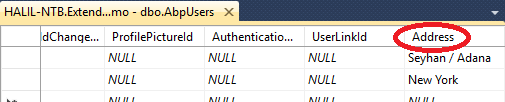
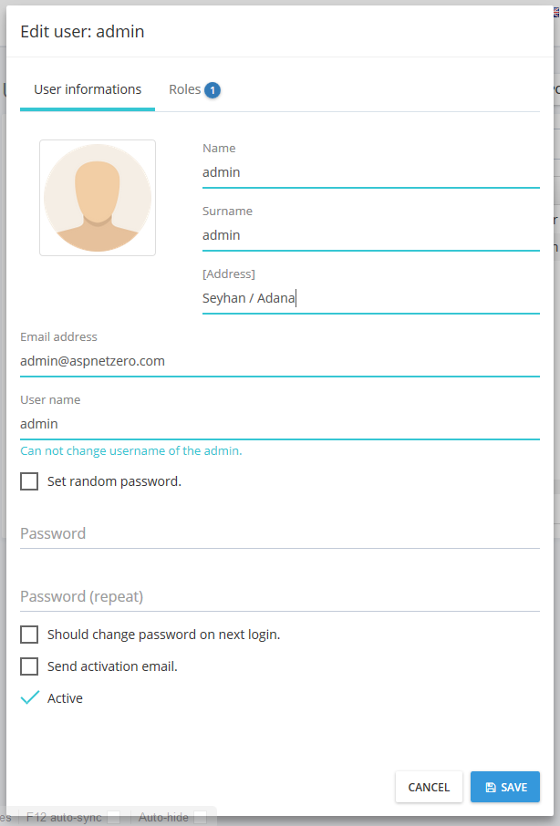

### Introduction

This tutorial is a step by step guide to learn **how to add new
properties to existing entities**, from database layer to UI layer.

In ASP.NET Zero, **Tenant**, **User** and **Role** entities are
**abstract** in the framework, others are not. There are some
differences between them. So, we separated it into two sections.

*Note: We assume that you created your project as described in the
[Getting Started](Getting-Started.md) document.*

### Extending Abstract Entities

As a sample, we will work on **User** entity. We want to add an
**Address** property to the User.

#### Add New Property To User

Open Authorization\\Users\\**User.cs** (in .Core project) and add the
new property:

    public class User : AbpUser<User>
    {
        //...existing code

        public virtual string Address { get; set; }
    }

Here, we hided existing code in the User class to show it simpler. You
can add Address property after existing properties.

#### Add Migration

Since we added new property, our database schema is changed. Whever we
change our entities, we should add a new database migration. Open
Console Package Manager and write new migration code:

    Add-Migration "Added_Address_To_User"

This will create a new Entity Framework migration class:

    public partial class Added_Address_To_User : DbMigration
    {
        public override void Up()
        {
            AddColumn("dbo.AbpUsers", "Address", c => c.String());
        }
            
        public override void Down()
        {
            DropColumn("dbo.AbpUsers", "Address");
        }
    }

Since it's automatically created, we don't have to know what it does for
most cases. Now, we can update our database with this command:

    Update-Database

When we check **AbpUsers** table in the database, we can see the new
**Address** field:

For test purposes, we entered some data for existing users by hand.

#### Show Address On The UI

Authorization\\Users\\**UserAppService.cs** (in .Application project) is
used to get list of users by clients. It returns a list of
**UserListDto** (we always use
[DTOs](https://aspnetboilerplate.com/Pages/Documents/Data-Transfer-Objects)
for client communication). So, we should add the Address property to
UserListDto too:

    [AutoMapFrom(typeof(User))]
    public class UserListDto : EntityDto<long>, IPassivable, IHasCreationTime
    {
        //...existing code

        public string Address { get; set; }
    }

Since UserListDto **auto maps** from User entity, no need to change
**UserAppService.GetUsers** method. Now, we can go to UI side to add
Address property to the **users table**. Open
.Web\\App\\common\\views\\users\\**index.js** and add Address column
right after Surname column:

    {
        name: app.localize('Surname'),
        field: 'surname',
        minWidth: 120
    },
    {
        name: app.localize('Address'),
        field: 'address',
        minWidth: 140
    },
    {
        name: app.localize('Roles'),
        field: 'getRoleNames()',
        enableSorting: false,
        minWidth: 160
    },

New added code is highlighted. That's all. Let's run the application and
open the **users page**:

This was for SPA (Single Page Application with AngularJS). It's similar
for MPA side. Just open .Web\\Areas\\Mpa\\Views\\Users\\index.js and add
Address field to the table as like Surname.

#### Add Address On User Create/Edit

We may want to set Address while **creating/editing** a User.

Clients use UserAppService.**GetUserForEdit** method to show user
information on edit form. It returns **GetUserForEditOutput** object
which contains a **UserEditDto** object that includes user properties.
So, we should add Address to UserEditDto to allow clients to change
Address property on create/update:

    public class UserEditDto : IPassivable
    {
        //...existing code

        public string Address { get; set; }
    }

Since **UserAppService** use **auto mapping**, no need to manually map
Address to the User entity. So, server side code is just that. We can go
to UI side to add an Address field to the form:

    

        <input type="text" name="Address" class="form-control" ng-class="{'edited':vm.user.address}" ng-model="vm.user.address">
        <label>@L("Address")</label>
    

This code is written to
.Web\\App\\common\\views\\users\\**createOrEditModal.cshtml** for SPA.
For MPA, it will be similar in
.Web\\Areas\\Mpa\\Views\\Users\\**createOrEditModal.cshtml** file. You
can take existing Surname property as example. After adding, new Address
field is shown on the create/edit form as shown below:

Note: Since we haven't localized "Address" text, it's shown like
\[Address\]. To fix it, you can open localization file under
.Core\\Localization\\ExtendEntitiesDemo and add Address text as like
others.

You can see this Github
[commit](https://github.com/aspnetzero/aspnet-zero-samples/commit/b7fd57eb3e20cf3b96e9358bc3c4d92f81404f5a)
for all changes applied.

### Extending Non-Abstract Entities

As a sample, we will work on **Edition** entity.

#### Derive From Edition Entity

Since Edition is **not abstract** in the framework, we can not direcly
add new properties to the Edition class. Instead, we should use OOP
patterns like **inheritance** or **composition**. Since inheritance will
be simpler, we can create a new class deriving from Edition entity, say
**MyEdition** (We add this class into Editions folder under the .Core
project):

    public class MyEdition : Edition
    {
        public virtual int Price { get; set; }
    }

Then we add a DbSet property for Edition entity to DbContext class defined in .EntityFrameworkCore project.

    public class ProjectNameDbContext : AbpZeroDbContext<Tenant, Role, User>
    {
        public virtual DbSet<MyEdition> MyEditions { get; set; }

        //...other entities

        public ProjectNameDbContext()
            : base("Default")
        {

        }

        //...other codes
    }

#### Add Migration

Since we added a new entity class, our database schema is changed.
Whever we change our entities, we should add a new database migration.
Open Console Package Manager and write new migration code:

    Add-Migration "Added_MyEdition_Entity"

This will create a new Entity Framework migration class as shown below:

    public partial class Added_MyEdition_Entity : DbMigration
    {
        public override void Up()
        {
            AlterTableAnnotations(
                "dbo.AbpEditions",
                c => new
                {
                    Id = c.Int(nullable: false, identity: true),
                    Name = c.String(nullable: false, maxLength: 32),
                    DisplayName = c.String(nullable: false, maxLength: 64),
                    IsDeleted = c.Boolean(nullable: false),
                    DeleterUserId = c.Long(),
                    DeletionTime = c.DateTime(),
                    LastModificationTime = c.DateTime(),
                    LastModifierUserId = c.Long(),
                    CreationTime = c.DateTime(nullable: false),
                    CreatorUserId = c.Long(),
                    Price = c.Int(),
                    Discriminator = c.String(nullable: false, maxLength: 128),
                },
                annotations: new Dictionary<string, AnnotationValues>
                {
                    {
                        "DynamicFilter_MyEdition_SoftDelete",
                        new AnnotationValues(oldValue: null, newValue: "EntityFramework.DynamicFilters.DynamicFilterDefinition")
                    },
                });

            AddColumn("dbo.AbpEditions", "Price", c => c.Int(nullable: false, defaultValue: 0));
            AddColumn("dbo.AbpEditions", "Discriminator", c => c.String(nullable: false, maxLength: 128, defaultValue: "MyEdition"));
        }

        public override void Down()
        {
            //...other code
        }
    }

Basically, this migration adds two new columns to **AbpEditions** table:

-   **Price**: The Price field we added to the MyEdition.
-   **Discriminator**: Entity Framework's own field to distinguish
    Edition and MyEdition entities (automatically created for
    inheritance).

Before applying changes to the database, we **changed** default
migration code from:

    AddColumn("dbo.AbpEditions", "Price", c => c.Int());
    AddColumn("dbo.AbpEditions", "Discriminator", c => c.String(nullable: false, maxLength: 128));

to:

    AddColumn("dbo.AbpEditions", "Price", c => c.Int(nullable: false, defaultValue: 0));
    AddColumn("dbo.AbpEditions", "Discriminator", c => c.String(nullable: false, maxLength: 128, defaultValue: "MyEdition"));

We did it since we want to replace existing **Edition** entities by
**MyEdition**. Now, we can update our database with this command:

    Update-Database

When we check **AbpEditions** table in the database, we can see the new
fields:

As you see, existing 'Standard Edition' entry changed to MyEdition with
Price = 0.

One last thing about migration is the database **Seed code**. Seed code
currently creates the 'Standard edition'. We should go to
.EntityFramework\\Migrations\\Seed\\**DefaultEditionCreator.cs** class
and change Edition creation code from:

    defaultEdition = new Edition { Name = EditionManager.DefaultEditionName, DisplayName = EditionManager.DefaultEditionName };

to:

    defaultEdition = new MyEdition { Name = EditionManager.DefaultEditionName, DisplayName = EditionManager.DefaultEditionName };

Thus, it creates MyEdition entity when we create database from scratch.

#### Show Price On The UI

Editions\\**EditionAppService.cs** (in .Application project) is used to
get list of editions by clients. It returns a list of **EditionListDto**
(we always use
[DTOs](https://aspnetboilerplate.com/Pages/Documents/Data-Transfer-Objects)
for client communication). So, we should add the Price property to
EditionListDto too:

    [AutoMapFrom(typeof(MyEdition))]
    public class EditionListDto : EntityDto, IHasCreationTime
    {
        //...existing code

        public int Price { get; set; }
    }

We added **auto mapping from MyEdition**. No need to change
**EditionAppService.GetEditions** method by the help of auto mapping.
Now, we can go to UI side to add Price property to the **editions
table**. Open .Web\\App\\host\\views\\editions\\**index.js** and add
Price column right after EditionName column:

    {
        name: app.localize('EditionName'),
        field: 'displayName'
    },
    {
        name: app.localize('Price'),
        field: 'price'
    },
    {
        name: app.localize('CreationTime'),
        field: 'creationTime',
        cellFilter: 'momentFormat: \'L\''
    }

New added code is highlighted. That's all. Let's run the application and
open the **editions page** (editions page is only available for host
users, not tenant users):

This was for SPA (Single Page Application with AngularJS). It's similar
for MPA side. Just open .Web\\Areas\\Mpa\\Views\\Editions\\**index.js**
and add Price field to the table.

#### Add Price On Edition Create/Update

We may want to add Price field to edition create/update form.
Create/Update logic is implemented in **EditionAppService** class.
**GetEditionForEdit** method is called by clients to fill the
create/edit form. This method returns a GetEditionForEditOutput which
contains **EditionEditDto** to transfer edition properties. So, we
should add Price property to EditionEditDto class:

    [AutoMap(typeof(Edition), typeof(MyEdition))]
    public class EditionEditDto
    {
        //...existing code

        public int Price { get; set; }
    }

We also added **auto mapping** for **MyEdition** entity. We could
directly replace Edition by MyEdition if we will never use the Edition
class. We left it like that to show different usages.

Since ASP.NET Zero **does not** use auto mapping for creating (in
CreateEditionAsync method) and updating (in UpdateEditionAsync method)
editions, we should change these code too:

    ///...

    [AbpAuthorize(AppPermissions.Pages_Editions_Create)]
    protected virtual async Task CreateEditionAsync(CreateOrUpdateEditionDto input)
    {
        var edition = new MyEdition { DisplayName = input.Edition.DisplayName, Price = input.Edition.Price };

        await _editionManager.CreateAsync(edition);
        await CurrentUnitOfWork.SaveChangesAsync(); //It's done to get Id of the edition.

        await SetFeatureValues(edition, input.FeatureValues);
    }

    [AbpAuthorize(AppPermissions.Pages_Editions_Edit)]
    protected virtual async Task UpdateEditionAsync(CreateOrUpdateEditionDto input)
    {
        Debug.Assert(input.Edition.Id != null, "input.Edition.Id should be set.");

        var edition = (MyEdition)await _editionManager.GetByIdAsync(input.Edition.Id.Value);
        edition.DisplayName = input.Edition.DisplayName;
        edition.Price = input.Edition.Price;

        await SetFeatureValues(edition, input.FeatureValues);
    }

    //...

Notice the highlighted areas. First, we should create **MyEdition**,
instead of **Edition** and set also **Price** property. In the update
part, we used [edition
manager](https://aspnetboilerplate.com/Pages/Documents/Zero/Edition-Management)
to get the edition. Edition manager normally works for the **Edition**
entity. So, we should **cast** it to **MyEdition** in order to reach to
the **Price** property.

Now, we can go the the UI part. Open
.Web\\App\\host\\views\\editions\\**createOrEditModal.cshtml** and add
the following form field after the EditionName field:

    

        <input class="form-control edited" type="number" name="EditionPrice" ng-model="vm.edition.price">
        <label>@L("Price")</label>
    

It's similar for MVC side. In this case, you need to edit
.Web\\Areas\\Mpa\\Views\\Editions\\**\_CreateOrEditModal.cshtml**. Now,
we can edit an edition with entering the price:

You can see this Github
[commit](https://github.com/aspnetzero/aspnet-zero-samples/commit/ecf25b60bda72166d41ad7605000d7dc7556e8bf)
for all changes applied.

### Source Code

You can get the full source code of this sample from the Github
repository:

[Extend Entities SPA
Demo](https://github.com/aspnetzero/aspnet-zero-samples/tree/master/ExtendEntitiesDemo)

[Extend Entities MPA
Demo](https://github.com/aspnetzero/aspnet-zero-samples/tree/master/ExtendEntitiesDemo-MPA)
