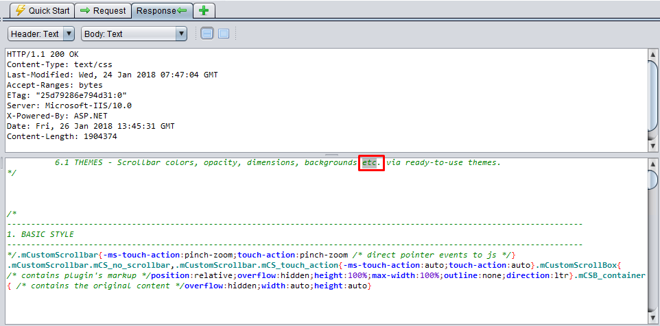
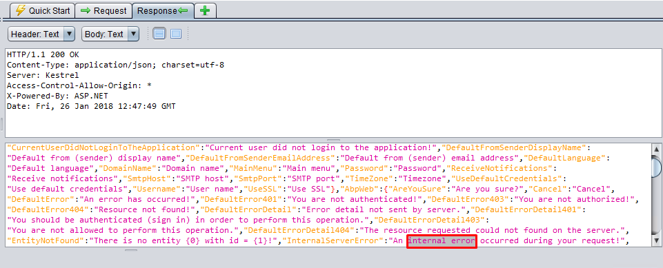
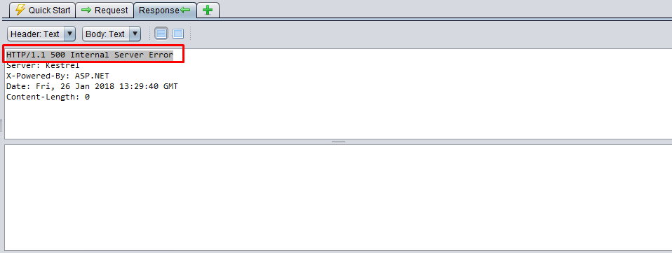
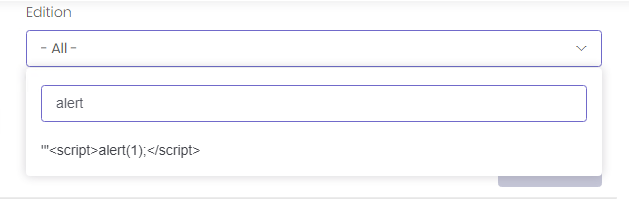
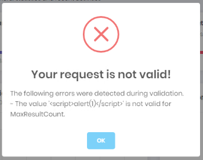

# ASP.NET ZERO Penetration Test Report

Asp.Net Zero Core (v5) has been scanned for vulnerabilities with the latest version of [OWASP ZAP (v2.7.0)](https://www.owasp.org/index.php/OWASP_Zed_Attack_Proxy_Project). The OWASP Zed Attack Proxy (ZAP) is one of the world's most popular security tools and is actively maintained by hundreds of international volunteers. 

The automated scanner has been reported several alerts.  Asp.Net Zero Team has fixed the positive alerts regarding the report. On the other hand most of the alerts can be stated as false-positive. The reasons for the false-positive alerts that are subject to these issues are clearly stated below.


## Summary of Alerts


### Path Traversal

##### High (Medium)

#### Description

The Path Traversal attack technique allows an attacker access to files, directories, and commands that potentially reside outside the web document root directory. 

#### Comment

The report has stated some CSS, JS links are open to path traversal attack. But these alerts are false-positive. You can see the reasons why they are evaluated as false-positive.

- URL: [http://localhost:8082/swagger/swagger-ui.min.js](http://localhost:8082/swagger/swagger-ui.min.js)
  - Method: `GET`
  - Parameter: `Host`
  - Attack: `c:/`
  - Evidence: `etc`

  When we inspect the below response, it returns **etc** in the code. And this is exactly not a path.
  
  


- URL: [http://localhost:8083/styles.1bb8c7ba47e327d9d46c.bundle.css?query=c%3A%2F](http://localhost:8083/styles.1bb8c7ba47e327d9d46c.bundle.css?query=c%3A%2F)

  - Method: `GET`
  - Parameter: `query`
  - Attack: `c:/`
  - Evidence: `etc`

  When we inspect the below response it returns **etc** in the comments. And this is not a path as well!
  
  


- URL: [http://localhost:8083/scripts.c971f5b7e715876e89e1.bundle.js?query=c%3A%2F](http://localhost:8083/scripts.c971f5b7e715876e89e1.bundle.js?query=c%3A%2F)

  - Method: `GET`
  - Parameter: `query`
  - Attack: `c:/`
  - Evidence: `etc`

  When we inspect the below response it returns **etc** in the code. And this is not a path as well!  
  
  


- URL: [http://localhost:8082/api/services/app/OrganizationUnit/CreateOrganizationUnit](http://localhost:8082/api/services/app/OrganizationUnit/CreateOrganizationUnit)

  - Method: `POST`
  - Parameter: `displayName`
  - Attack: `CreateOrganizationUnit`

  When we inspect the below request & response, **CreateOrganizationUnit** string is being sent in the request and it returns in response data. The tool thinks **CreateUnitOrganization** is a folder and is being traversed. But this is not a path as well!
  
  

  The same pattern is valid for the following alerts. Same as above, the action name is being sent as a parameter and either the response size is changing or the action name itself is being taken part in the response. All of the following attacks are false-positive.

  - URL: [http://localhost:8082/api/services/app/TenantRegistration/RegisterTenant](http://localhost:8082/api/services/app/TenantRegistration/RegisterTenant)
    - Method: `POST`
    - Parameter: `tenancyName`
    - Attack: `RegisterTenant`

  - URL: [http://localhost:8082/api/services/app/Tenant/UpdateTenant](http://localhost:8082/api/services/app/Tenant/UpdateTenant)
    - Method: `PUT`
    - URL: [http://localhost:8082/api/services/app/User/CreateOrUpdateUser](http://localhost:8082/api/services/app/User/CreateOrUpdateUser)
    - Method: `POST`

  - URL: [http://localhost:8082/api/services/app/Role/CreateOrUpdateRole](http://localhost:8082/api/services/app/Role/CreateOrUpdateRole)
    - Method: `POST` 
    - Parameter: `displayName` 
    - Attack: `CreateOrUpdateRole`


### Recommendation

If your application has to accept input file names, file paths, or URL paths, you need to validate that the path is in the correct format and that it points to a valid location within the context of your application. To prevent a malicious user manipulating your code's file operations, avoid writing code that accepts user-supplied file or path input. 

- If you must accept file names as input, use the full name of the file by using **System.IO.Path.GetFileName**. 
- If you must accept file paths as input, use the full file path by using **System.IO.Path.GetFullPath**.

If you use **MapPath** to map a supplied virtual path to a physical path on the server, use the overload of **Request.MapPath** that accepts a **bool** parameter so that you can prevent cross-application mapping. 


### Application Error Disclosure

##### Medium (Medium)

#### Description

If a page contains an error/warning message that may disclose sensitive information, this can be used to launch further attacks against the web application. 

- URL: [http://localhost:8082/api/TokenAuth/Authenticate](http://localhost:8082/api/TokenAuth/Authenticate)

  - Method: `POST`
  - Evidence: `HTTP/1.1 500 Internal Server Error`

  This is false-positive alert. As seen in the below screenshot, Asp.Net Zero returns a HTPP 500 Internal Server Error without any sensitive information. Actually it's not an exception result. While the error detail is not being sent to the client, it is logged on the server.
  
  


Asp.Net Zero never returns error details, if only developer sends it deliberatively.  When the project runs on development, exceptions are being sent to client. But publishing application in release mode prevents exception details to be sent. `Web.Host` project sends a JSON with including the message: "*An internal error occurred during your request!*"

The following alerts are same as the above alert. No sensitive data is being exposed. 

- URL: [http://localhost:8082/api/services/app/UserLink/LinkToUser](http://localhost:8082/api/services/app/UserLink/LinkToUser)
  - Method: `POST`
  - Evidence: `HTTP/1.1 500 Internal Server Error`
  
  


- URL: [http://localhost:8082/AbpUserConfiguration/GetAll](http://localhost:8082/AbpUserConfiguration/GetAll)
  - Method: `GET`
  - Evidence: `internal error`
  
  

  There is "**internal error**" statement in the JSON response. This is only a translation file and not an exception message.


- URL: [http://localhost:8082/File/DownloadTempFile?fileType=application/zip&fileToken=224448551ff749689b7a8e4ae0652de8&fileName=WebSiteLogs.zip](http://localhost:8082/File/DownloadTempFile?fileType=application/zip&fileToken=224448551ff749689b7a8e4ae0652de8&fileName=WebSiteLogs.zip)

  - Method: `GET`
  - Evidence: `HTTP/1.1 500 Internal Server Error`  
  
  

The response of "**File/DownloadTempFile**" resulted with Http-500, because there's no file to download. The action result returns empty data (Content-Length: 0) and does not disclose any information about the problem.

### Recommendation

If your website must return error then review the source code of the action and implement custom error pages or consider implementing a mechanism to provide a unique error reference/identifier to the client (browser) while logging the details on the server side and not exposing them to the user.


### X-Frame-Options Header Not Set

##### Medium (Medium)

#### Description

The `X-Frame-Options` HTPP header can be used to indicate whether or not a browser should be allowed to render a page in a `<frame>`, `<iframe>` or `<object>` . Sites can use this to avoid clickjacking attacks, by ensuring that their content is not embedded into other sites.

- URL: [http://localhost:8082](http://localhost:8082)
  - Method: `GET`
  - Parameter: `X-Frame-Options`

- URL: [http://localhost:8082/swagger/](http://localhost:8082/swagger/)
  - Method: `GET`
  - Parameter: `X-Frame-Options`


ASP.NET Zero uses [ASP.NET Boilerplate](https://aspnetboilerplate.com/) framework. After version **3.4.X**, the framework adds `X-Frame-Options` header to all responses with the value `SAMEORIGIN`. If you want to remove the header you can do it via `UseAbp()` options in `Configure ` method of `Startup` class.

```c#
public class Startup
{
	public void Configure(IApplicationBuilder app, IHostingEnvironment env, ILoggerFactory loggerFactory)
	{
		app.UseAbp(options =>
		{
			options.AddSecurityHeaders = false;
		});
	}
}
```

### Recommendation

Most modern Web browsers support the X-Frame-Options HTTP header. Ensure it's set on all web pages returned by your site (if you expect the page to be framed only by pages on your server (e.g. it's part of a FRAMESET) then you'll want to use SAMEORIGIN, otherwise if you never expect the page to be framed, you should use DENY. ALLOW-FROM allows specific websites to frame the web page in supported web browsers).

http://blogs.msdn.com/b/ieinternals/archive/2010/03/30/combating-clickjacking-with-x-frame-options.aspx


### X-Content-Type-Options Header Missing

##### Low (Medium)

#### Description

The `X-Content-Type-Options` HTTP header is a marker used by the server to indicate that the [MIME types](https://developer.mozilla.org/en-US/docs/Web/HTTP/Basics_of_HTTP/MIME_types) advertised in the [`Content-Type`](https://developer.mozilla.org/en-US/docs/Web/HTTP/Headers/Content-Type) headers should not be changed and be followed. This allows to opt-out of [MIME type sniffing](https://developer.mozilla.org/en-US/docs/Web/HTTP/Basics_of_HTTP/MIME_types#MIME_sniffing), or, in other words, it is a way to say that the webmasters knew what they were doing.   Some of the requests which are alerted to have the **X-Content-Type-Options** header; 

- URL: [http://localhost:8082/api/services/app/Role/GetRoleForEdit](http://localhost:8082/api/services/app/Role/GetRoleForEdit)

  - Method: `GET`
  - Parameter: `X-Content-Type-Options`

- URL: [http://localhost:8082/api/services/app/Language/GetLanguageTexts?MaxResultCount=10&SkipCount=0&SourceName=AbpZeroTemplate&BaseLanguageName=en&TargetLanguageName=de&TargetValueFilter=ALL&FilterText=](http://localhost:8082/api/services/app/Language/GetLanguageTexts?MaxResultCount=10&SkipCount=0&SourceName=AbpZeroTemplate&BaseLanguageName=en&TargetLanguageName=de&TargetValueFilter=ALL&FilterText=)
  - Method: `GET`
  - Parameter: `X-Content-Type-Options`

- URL: [http://localhost:8082/api/services/app/Tenant/CreateTenant](http://localhost:8082/api/services/app/Tenant/CreateTenant)
  - Method: `POST`
  - Parameter: `X-Content-Type-Options`

- URL: [http://localhost:8082/swagger/css/screen.css](http://localhost:8082/swagger/css/screen.css)
  - Method: `GET`
  - Parameter: `X-Content-Type-Options`

#### Comment

ASP.NET Boilerplate framework **v3.4.X** adds the `X-Content-Type-Options` header to all responses with the value `nosniff`. If you want to remove the header you can do it via `UseAbp()` options in `Configure ` method of `Startup` class.

### Recommendation

Ensure that the application/web server sets the Content-Type header appropriately, and that it sets the X-Content-Type-Options header to 'nosniff' for all web pages. If possible, ensure that the end user uses a standards-compliant and modern web browser that does not perform MIME-sniffing at all, or that can be directed by the web application/web server to not perform MIME-sniffing.


### Web Browser XSS Protection Not Enabled

##### Low (Medium)

#### Description

Web Browser XSS Protection is not enabled, or is disabled by the configuration of the 'X-XSS-Protection' HTTP response header on the web server.

- URL: [http://localhost:8082/swagger/](http://localhost:8082/swagger/)

  - Method: `GET`
  - Parameter: `X-XSS-Protection`

- URL: [http://localhost:8082](http://localhost:8082)

  - Method: `GET`
  - Parameter: `X-XSS-Protection`

#### Comment

Asp.Net Boilerplate framework **v3.4.X** adds the `X-XSS-Protection` header to all responses with the value `1; mode=block`.  If you want to remove the header you can do it via `UseAbp()` options in `Configure ` method of `Startup` class.

### Recommendation

Ensure that the web browser's XSS filter is enabled, by setting the X-XSS-Protection HTTP response header to '1'.


### Cross Site Scripting Weakness (Reflected in JSON Response)

##### Low (Low)


#### Description

A XSS attack was reflected in a JSON response, this might leave content consumers vulnerable to attack if they don't appropriately handle the data (response). 

#### Comment

There are about 180 instances of this alert. AspNet Zero doesn't return any HTML response in `Web.Host` project. Thus all of the instances are raised with LOW confidence as the Content-Type is not HTML. In reflected XSS the it's important where this result is being evaluated. The responses are being evaluated by Angular. Angular has built-in protections against common web-application vulnerabilities including XSS attacks. We have used the tree library JsTree which was open to XSS. It is fixed by [this commit](https://github.com/aspnetzero/aspnet-zero-core/commit/b63b790aecdff6e9180b927351d5d6ceec735d1a).   

- URL: [http://localhost:8082/api/services/app/Edition/GetEditionComboboxItems?selectedEditionId=0&addAllItem=%3Cscript%3Ealert%281%29%3B%3C%2Fscript%3E&onlyFreeItems=false](http://localhost:8082/api/services/app/Edition/GetEditionComboboxItems?selectedEditionId=0&addAllItem=%3Cscript%3Ealert%281%29%3B%3C%2Fscript%3E&onlyFreeItems=false)

  - Method: `GET`
  - Parameter: `addAllItem`
  - Attack: `<script>alert(1);</script>`

  **GetEditionComboboxItems** action returns data for edition combo box and these items are being rendered in drop down list. As seen in the below screenshot, scripts are not being evaluated.
  
  


- URL: [http://localhost:8082/api/services/app/Edition/GetEditionComboboxItems?selectedEditionId=0&addAllItem=true&onlyFreeItems=false](http://localhost:8082/api/services/app/Edition/GetEditionComboboxItems?selectedEditionId=0&addAllItem=true&onlyFreeItems=false)

  - Method: `GET`
  - Parameter: `Origin`
  - Attack: `<script>alert(1);</script>`

  The same component as above with different parameters. It is false-positive too.


- URL: [http://localhost:8082/api/services/app/UserLink/GetLinkedUsers?MaxResultCount=10&SkipCount=%3Cscript%3Ealert%281%29%3B%3C%2Fscript%3E](http://localhost:8082/api/services/app/UserLink/GetLinkedUsers?MaxResultCount=10&SkipCount=%3Cscript%3Ealert%281%29%3B%3C%2Fscript%3E)

  - Method: `GET`
  - Parameter: `SkipCount`
  - Attack: `<script>alert(1);</script>`

  This action is called after successful login. It retrieves the data for impersonating user. But even the request is poisoned with malicious script, it's not being evaluated as seen in the below screenshot. 
  
  

- URL: [http://localhost:8082/api/services/app/Tenant/GetTenants?Filter=&SubscriptionEndDateStart=2018-01-25T21%3A00%3A00.000Z&SubscriptionEndDateEnd=2018-02-25T20%3A59%3A59.999Z&CreationDateStart=2018-01-18T21%3A00%3A00.000Z&CreationDateEnd=2018-01-26T20%3A59%3A59.999Z&EditionId=1&EditionIdSpecified=true&MaxResultCount=10&SkipCount=%3Cscript%3Ealert%281%29%3B%3C%2Fscript%3E](http://localhost:8082/api/services/app/Tenant/GetTenants?Filter=&SubscriptionEndDateStart=2018-01-25T21%3A00%3A00.000Z&SubscriptionEndDateEnd=2018-02-25T20%3A59%3A59.999Z&CreationDateStart=2018-01-18T21%3A00%3A00.000Z&CreationDateEnd=2018-01-26T20%3A59%3A59.999Z&EditionId=1&EditionIdSpecified=true&MaxResultCount=10&SkipCount=%3Cscript%3Ealert%281%29%3B%3C%2Fscript%3E)

  - Method: `GET`
  - Parameter: `SkipCount`
  - Attack: `<script>alert(1);</script>`

  This action is called in tenants page. When we alter the request and add script tags into SkipCount parameter, it's not being evaluated as seen in the below screenshot. 
  
  


  The other requests are same instances of different actions and marked as false-positive. 


### Recommendation

To block XSS attacks, you must prevent malicious code from entering the DOM. When a value is inserted into the DOM from a template, via property, attribute, style, class binding, or interpolation, you need to sanitize and escape untrusted values.

- http://projects.webappsec.org/Cross-Site-Scripting

- http://cwe.mitre.org/data/definitions/79.html


### Reference

For all the other OWASP standardizations, download the OWASP sheet.

[Open Web Application Security Project (OWASP) - Application Security Verification Standard 3.0 PDF sheet ](https://www.owasp.orgimages/6/67/OWASPApplicationSecurityVerificationStandard3.0.pdf) 
