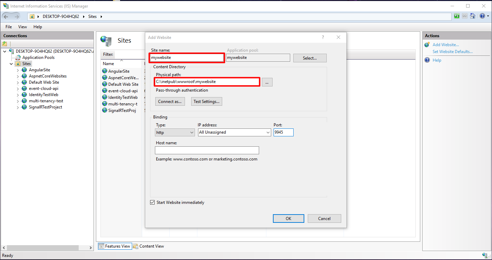
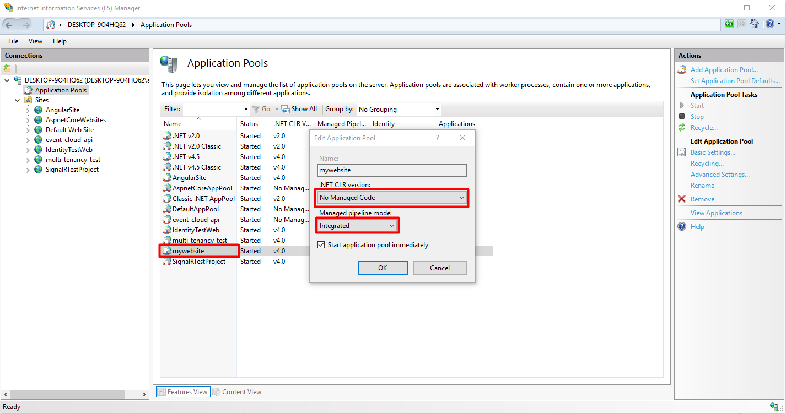

## Host Application Publishing

Publishing ASP.NET Zero Host project is no different to any other ASP.NET Core Application.

### Publishing Web Site

- Right click `\*.Web.Host` project and click **Publish**.
- Click **Start** and select **Folder** tab and choose the URL that you want to publish.

- Create a folder on the server where **IIS** is located. (for example: `C:\inetpub\wwwroot\mywebsite`).
- Copy extracted files to server. (from `\*.Web.Host/bin/Release/netcoreapp2.1/publish/` to `C:\inetpub\wwwroot\mywebsite`).
- Change `appsettings.production.json` configurations with your own settings.

### Create IIS Web Site

- Right click **Sites** and click **Add Website**.

- **mywebsite** application pool will be created automatically. Click **Application Pools**, double click **mywebsite** application pool and change its configuration.

Check [Host ASP.NET Core on Windows with IIS](https://docs.microsoft.com/en-us/aspnet/core/host-and-deploy/iis/index?view=aspnetcore-2.1) document for more detail.

## Angular Application Publishing

We are using angular-cli for development & deployment. Angular CLI has it's own build command that can be used to build your application:

- Run `ng build --prod`. This command uses dist folder as output. 
- Change `assets/appconfig.production.json` file with your own configuration.
- After ng build command, dist folder contains all necessary files to create a web site under IIS. (For example: copy files from `\*.dist` to `C:\inetpub\wwwroot\angularwebsite`).

**Note:** One important thing is that; Angular uses client side routing. If you refresh a page (F5) then IIS will handle the request and naturally can not find the requested path and returns a HTTP 404 error. We should configure IIS to redirect all requests to the index.html page (or, to the root path).

ASP.NET Zero Angular UI contains a web.config file. You can copy it to the web site's root folder to overcome the problem described above.
