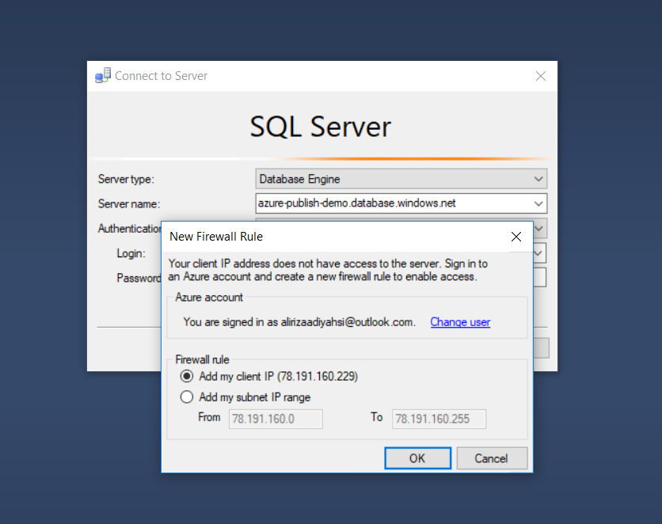
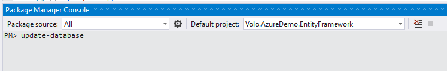
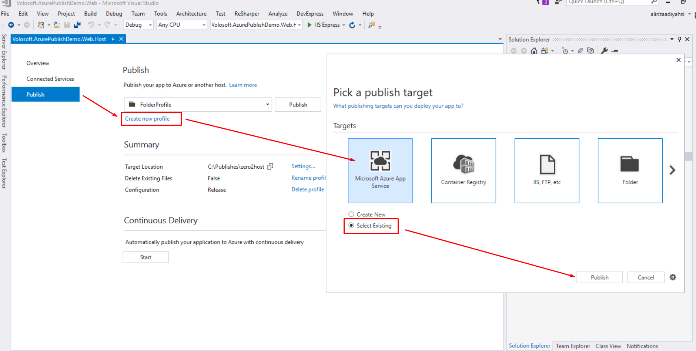

## Introduction

Before reading this document, it's suggested to read [Getting Started](https://aspnetzero.com/Documents/Getting-Started-Mvc-Angularjs) to run the application and explore the user interface. This will help you to have a better understanding of concepts defined here.

### Creating an Azure Website

Select the "**Web App + SQL**". 

And configure it according to your needs. A sample setting is shown below:

## Publish Application to The Azure

The details will be explained in the next lines. Here are the quick steps to publish the **Web Application** to the Azure.

- Run the migrations on the Azure
- Configure the **Web.config** file
- Publish the application to the Azure

### Run Migrations on The Azure

One of the best ways to run migrations on the Azure is running `update-database` command in the Visual Studio. 
But this command won't run. Your client IP address should have access to the Azure. 

#### Configuring the Firewall for Client Access 

**The easiest way:** Open Management Studio and write the Azure database settings, then click connect. 
If you are already logged in to the Azure, following info screen will be shown (if you aren't already logged in, a form will be displayed before the following screen to logging in):

Now our client IP address have access to the Azure. Of cource, this operation can also be done via the [Azure Portal](https://portal.azure.com). Check [here](https://docs.microsoft.com/en-us/azure/sql-database/sql-database-firewall-configure) to learn how to configure the firewall for client access via Azure Portal.

#### Apply Migrations

Open **Web.config** in **.Web** project and change connection string according to the Azure Database:

Open Package Manager Console in Visual Studio, set **.EntityFramework** as the Default Project and run the `update-database` command as shown below:

### Publish

Right click the **Web** project and select "**Publish**". Select "**Microsoft Azure App Service**" and check "**Select Existing**". Click "**Create Profile**" button.

Following screen will be shown:

Select "**azure-publish-demo-website**" and click "**OK**", then click "**Publish**" button. **Web** application is live now:

