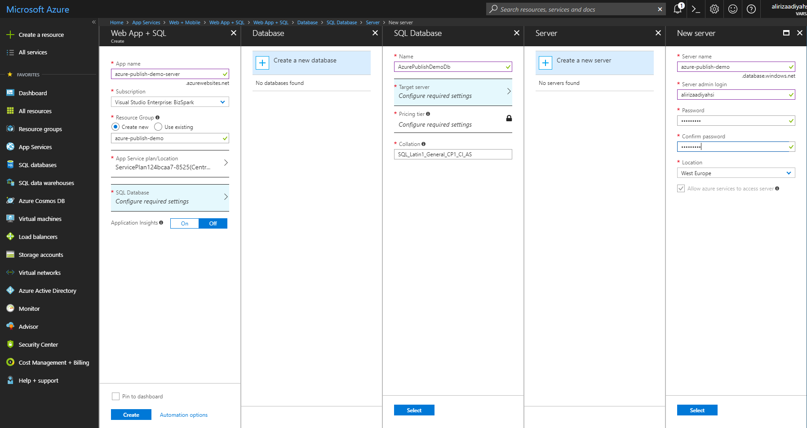
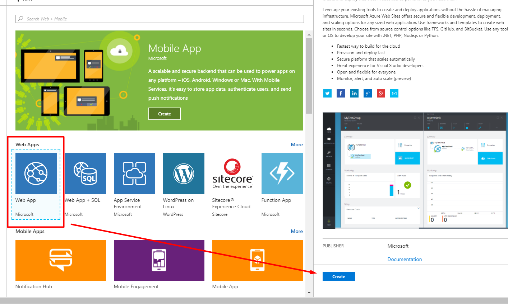
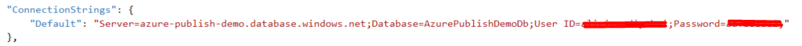
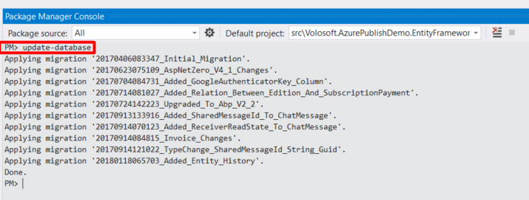
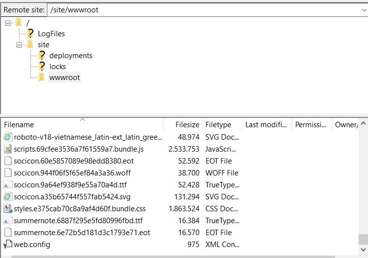

## Create The Azure Website

Create two website in Azure. 

### Creating Website for Host

Select "**Web App + SQL**" for **Host**. 

And configure it according to your needs. A sample setting is shown below:

### Creating Website for AngularUI

Select "**Web App**" for **AngularUI**.

And configure it according to your needs. A sample setting is shown below:

## Publish Host Application to The Azure

The details will be explained in the next lines. Here are the quick steps to publish the **Host Application** to the Azure.

- Run the migrations on the Azure
- Configure the **.Web.Host/appsettings.production.json**
- Publish the application to Azure

### Run Migrations on The Azure

One of the best ways to run migrations on the Azure is running `update-database` command in the Visual Studio. 
But this command won't run. Your client IP address should have access to the Azure. 

#### Configuring the Firewall for Client Access 

**The easiest way:** Open Management Studio and write the Azure database settings, then click connect. 
If you are already logged in to the Azure, following info screen will be shown (if you aren't already logged in, a form will be displayed before the following screen to logging in):

Now our client IP address have access to the Azure. Of cource, this operation can also be done via the [Azure Portal](https://portal.azure.com). Check [here](https://docs.microsoft.com/en-us/azure/sql-database/sql-database-firewall-configure) to learn how to configure the firewall for client access via Azure Portal.

#### Apply Migrations

Open **appsettings.json** in **.Web.Host** project and change connection settings according to the Azure Database:

Open Package Manager Console in Visual Studio, set **.EntityFrameworkCore** as the Default Project and run the `update-database` command as shown below:

### Configure the appsettings.production.json

Azure is using **appsettings.production.json**, so this file should be configured like following:

### Publish

Right click the **Web.Host** project and select "**Publish**". Click "**Create new profile**" under **Publish** tab. Select "**Microsoft Azure App Service**" and check "**Select Existing**" then click "**Publish**" button.

Following screen will be shown:

Select "**azure-publish-demo-server**" and click "**OK**". Host application is now live:

## Publish AngularUI to The Azure

The details will be explained in the next lines. Here are the quick steps to publish the **AngularUI** to the Azure

- Run the `yarn` command to restore packages
- Run the `ng build -prod`
- Copy the web.config file that is placed in **angular** folder root to dist folder
- Configure the **angular/dist/assets/appconfig.json**
- Send the required files to the Azure

### Prepare The Publish Folder

Run the `yarn` command to restore packages and run the `ng build -prod` to create publish folder that named **dist**.

### Copy the web.config

Copy the web.config file that is placed in **angular** folder to **angular/dist** folder.

### Copy the appconfig.json

Configure the **angular/dist/assets/appconfig.json** like following:

### Send The Publish Files to The Azure

Files should be sent to the Azure via FTP. Upload files from under the **dist** to the **www** folder in the Azure. The folder structure should look like:

