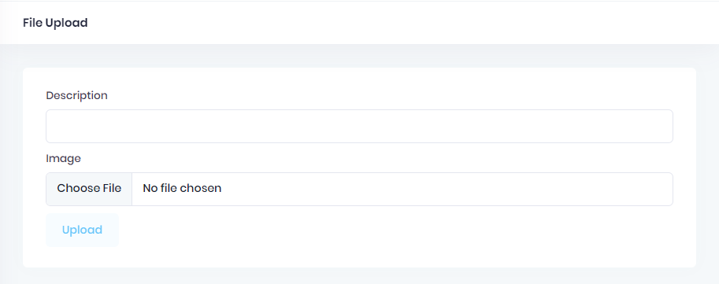

# File Upload Tutorial

Uploading a file in an ASP.NET Zero application is not different than a regular ASP.NET Core & Angular application. In this tutorial, we will implement a file upload functionality in ASP.NET Zero. We will also send an additional field to server while uploading a file.

This tutorial assumes that, you already have a valid ASP.NET Zero license and already created an empty project by following [Getting Started](Getting-Started-Angular.md) document.

First, create a class named **FileUploadViewModel** in **\*.Web.Host\Areas\AppAreaName\Models** folder. This class will be used to transfer additional parameters during the upload process.

```csharp
public class FileUploadImageViewModel
{
    public string Description { get; set; }
}
```

Then, create a controller named **FileUploadController** in **\*.Web.Host\Controllers** folder. This controller will handle the upload process.

```csharp
[AbpMvcAuthorize(AppPermissions.Pages_FileUpload)]
public class FileUploadController : AbpZeroTemplateControllerBase
{
    private readonly IHostEnvironment _env;
    public FileUploadController(IHostEnvironment env)
    {
        _env = env;
    }
    
    [HttpPost]
    public async Task<string> UploadFile(FileUploadViewModel model)
    {
       	var image = Request.Form.Files.First();
        var uniqueFileName = GetUniqueFileName(image.FileName);
        var dir = Path.Combine(_env.ContentRootPath, "Images");
        if (!Directory.Exists(dir))
        {
            Directory.CreateDirectory(dir);
        }
        var filePath = Path.Combine(dir, uniqueFileName);
        await image.CopyToAsync(new FileStream(filePath, FileMode.Create));
        SaveImagePathToDb(input.Description, filePath);
        return uniqueFileName;
    }
    
    private string GetUniqueFileName(string fileName)
    {
        fileName = Path.GetFileName(fileName);
        return Path.GetFileNameWithoutExtension(fileName)
               + "_"
               + Guid.NewGuid().ToString().Substring(0, 4)
               + Path.GetExtension(fileName);
    }
    
    private void SaveImagePathToDb(string description, string filepath)
    {
        //todo: description and file path to db
    }
}
```

The server side of the implementation is done. Let's move to Angular application.

* Go to angular folder in your project.

* Open a terminal and run `cd src\app\admin`.

* Run `ng g component file-upload`. That will create a component in admin folder.

* Go to **src\app\shared\layout\nav\app-navigation.service.ts** and add new menu item

  ```typescript
  new AppMenuItem('FileUpload', 'Pages.FileUpload', 'flaticon-file-1', '/app/admin/fileUpload'),
  ```

* Go to **src\app\admin\admin-routing.module.ts** and add new route for file upload page

  ```typescript
  { path: 'fileUpload', component: FileUploadTestComponent },
  ```

* Go to generated **file-upload.component.html** file and change the content as seen below

```html
<div [@routerTransition]>
    <div class="content d-flex flex-column flex-column-fluid">
        <sub-header [title]="'FileUpload' | localize">
        </sub-header>
        <div [class]="containerClass">
            <div class="card card-custom">
                <div class="card-body">
                    <form id="fileUploadForm" enctype="multipart/form-data" #fileUploadForm="ngForm"
                          (ngSubmit)="save()">
                        <div class="form-group">
                            <label for="Description">{{"Description" | localize}}</label>
                            <input class="form-control" type="text" id="Description" name="Description"
                                   [(ngModel)]="description" required>
                        </div>

                        <div class="form-group">
                            <label for="Image">{{"Image" | localize}}</label>
                            <input class="form-control" type="file" id="Image" name="Image" required
                                   (change)="fileChangeEvent($event)">
                        </div>
                        <button type="submit"
                                class="btn btn-light-primary font-weight-bold close-button"
                                [disabled]="!fileUploadForm.form.valid">{{"Upload" | localize}}
                        </button>
                    </form>
                </div>
            </div>
        </div>
    </div>
</div>
```

* Go to generated **file-upload.component.ts** file and change the content as seen below

  ```typescript
  import {Component, Injector, OnInit} from '@angular/core';
  import {FileUploader, FileUploaderOptions, FileItem} from 'ng2-file-upload';
  import {AppComponentBase} from "@shared/common/app-component-base";
  import {ProfileServiceProxy} from "@shared/service-proxies/service-proxies";
  import {IAjaxResponse, TokenService} from "@node_modules/abp-ng2-module";
  import {AppConsts} from "@shared/AppConsts";
  import {appModuleAnimation} from "@shared/animations/routerTransition";
  
  @Component({
      templateUrl: './file-upload-test.component.html',
      animations: [appModuleAnimation()]
  })
  export class FileUploadTestComponent extends AppComponentBase implements OnInit {
      public uploader: FileUploader;
      private _uploaderOptions: FileUploaderOptions = {};
      description: string;
  
      constructor(
          injector: Injector,
          private _profileService: ProfileServiceProxy,
          private _tokenService: TokenService
      ) {
          super(injector);
      }
  
      ngOnInit() {
          this.initFileUploader();
      }
  
      initFileUploader(): void {
          this.uploader = new FileUploader({url: AppConsts.remoteServiceBaseUrl + '/FileUpload/UploadFile'});
          this._uploaderOptions.autoUpload = false;
          this._uploaderOptions.authToken = 'Bearer ' + this._tokenService.getToken();
          this._uploaderOptions.removeAfterUpload = true;
          this.uploader.onAfterAddingFile = (file) => {
              file.withCredentials = false;
          };
  
          this.uploader.onBuildItemForm = (fileItem: FileItem, form: any) => {
              form.append('Description', this.description);
          };
  
          this.uploader.onSuccessItem = (item, response, status) => {
              const resp = <IAjaxResponse>JSON.parse(response);
              if (resp.success) {
                  this.message.success(this.l("FileSavedSuccessfully", response.result));
              } else {
                  this.message.error(resp.error.message);
              }
          };
  
          this.uploader.setOptions(this._uploaderOptions);
      }
  
      save(): void {
          this.uploader.uploadAll();
      }
  
      fileChangeEvent(event: any): void {
          this.uploader.clearQueue();
          this.uploader.addToQueue([event.target.files[0]]);
      }
  }
  ```

  

* Then you will have a file upload page as seen below.

  

