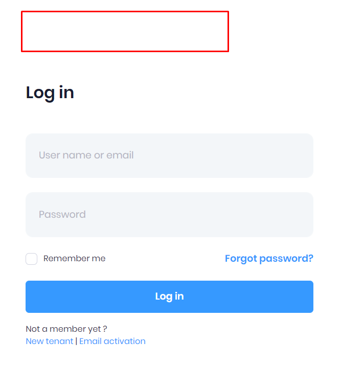

## Sign In Without Specifying Tenant

Normally, **ASP.NET Zero** uses tenant information in login transactions. This document shows you how to implement tenant information independent login. 

***Important Note:*** *Your user's email addresses have to be unique to implement this solution. Otherwise, this solution may not work correctly.*

#### Updating LogInManager

* First of all, open `LogInManager`. *(It is located in **aspnet-core\src\\[YOURAPPNAME].Application\Authorization** folder.)*

* Add lines shown below

  ``````csharp
  UserStore _userStore
  public LogInManager(
  	//....
      UserStore userStore
  ){
      _userStore = userStore;
  }
  
  [UnitOfWork]
  public async Task<AbpLoginResult<Tenant, User>> LoginAsync(UserLoginInfo login)
  {
      var result = await LoginAsyncInternal(login);
      await SaveLoginAttemptAsync(result, result.Tenant.Name, login.ProviderKey + "@" + login.LoginProvider);
      return result;
  }
  
  protected async Task<AbpLoginResult<Tenant, User>> LoginAsyncInternal(UserLoginInfo login)
  {
      if (login == null || login.LoginProvider.IsNullOrEmpty() || login.ProviderKey.IsNullOrEmpty())
      {
          throw new ArgumentException("login");
      }
      using (UnitOfWorkManager.Current.DisableFilter(AbpDataFilters.MayHaveTenant))
      {
          var user = await _userStore.FindAsync(login);
          if (user == null)
          {
              return new AbpLoginResult<Tenant, User>(AbpLoginResultType.UnknownExternalLogin);
          }
          //Get and check tenant
          Tenant tenant = null;
          if (!MultiTenancyConfig.IsEnabled)
          {
              tenant = await GetDefaultTenantAsync();
          }
          else if (user.TenantId.HasValue)
          {
              tenant = await TenantRepository.FirstOrDefaultAsync(t => t.Id == user.TenantId);
              if (tenant == null)
              {
                  return new AbpLoginResult<Tenant, User>(AbpLoginResultType.InvalidTenancyName);
              }
              if (!tenant.IsActive)
              {
                  return new AbpLoginResult<Tenant, User>(AbpLoginResultType.TenantIsNotActive, tenant);
              }
          }
          return await CreateLoginResultAsync(user, tenant);
      }
  }
  ``````

  Then, your `LogInManager` will be able to use given user's tenant for login process.
  
  
  
  #### Updating UserManager
  
* Go to `UserManager`. *(It is located in **aspnet-core\src\\[YOURAPPNAME].Core\Authorization\Users** folder.)*

* And add following lines;

  ```csharp
  public async Task<int?> TryGetTenantIdOfUser(string userEmail)
  {
      using (_unitOfWorkManager.Current.DisableFilter(AbpDataFilters.MayHaveTenant))
      {
          var user = await Users.SingleOrDefaultAsync(u => u.EmailAddress == userEmail.Trim());
          return user?.TenantId;
      }
  }
  ```
  
  
  
  #### Updating AccountController
  
* Then, go to `AccountController`. *(It is located in **aspnet-core\src\\[YOURAPPNAME].Mvc\Controllers** folder.)*
  
* Replace the function named `GetTenancyNameOrNull` with the following content
  
  ```csharp
  private async Task<string> GetTenancyNameOrNull(string email)
  {
      var tenantId = await _userManager.TryGetTenantIdOfUser(email);
      if (!tenantId.HasValue)
      {
          return null;
      }
      return _tenantCache.GetOrNull(tenantId.Value)?.TenancyName;
  }
  ```

* Replace the function named `Login(LoginViewModel loginModel, string returnUrl = "", string returnUrlHash = "", string ss = "") ` with the following content

  ```csharp
  [HttpPost]
  [UnitOfWork]
  public virtual async Task<JsonResult> Login(LoginViewModel loginModel, string returnUrl = "", string returnUrlHash = "", string ss = "")
  {
      returnUrl = NormalizeReturnUrl(returnUrl);
      if (!string.IsNullOrWhiteSpace(returnUrlHash))
      {
          returnUrl = returnUrl + returnUrlHash;
      }
      
      if (UseCaptchaOnLogin())
      {
          await _recaptchaValidator.ValidateAsync(HttpContext.Request.Form[RecaptchaValidator.RecaptchaResponseKey]);
      }
      
      var loginResult = await GetLoginResultAsync(loginModel.UsernameOrEmailAddress, loginModel.Password, await GetTenancyNameOrNull(loginModel.UsernameOrEmailAddress));//use new GetTenancyNameOrNull method that you add previously
      if (loginResult?.Tenant?.Id != AbpSession.TenantId)
      {
          SetTenantIdCookie(loginResult?.Tenant?.Id);
          CurrentUnitOfWork.SetTenantId(loginResult?.Tenant?.Id);
      }
      
      if (!string.IsNullOrEmpty(ss) && ss.Equals("true", StringComparison.OrdinalIgnoreCase) && loginResult.Result == AbpLoginResultType.Success)
      {
          loginResult.User.SetSignInToken();
          returnUrl = AddSingleSignInParametersToReturnUrl(returnUrl, loginResult.User.SignInToken, loginResult.User.Id, loginResult.User.TenantId);
      }
      
      if (_settingManager.GetSettingValue<bool>(AppSettings.UserManagement.AllowOneConcurrentLoginPerUser))
      {
          await _userManager.UpdateSecurityStampAsync(loginResult.User);
      }
      
      if (loginResult.User.ShouldChangePasswordOnNextLogin)
      {
          loginResult.User.SetNewPasswordResetCode();
          return Json(new AjaxResponse
          {
              TargetUrl = Url.Action(
                  "ResetPassword",
                  new ResetPasswordViewModel
                  {
                      TenantId = AbpSession.TenantId,
                      UserId = loginResult.User.Id,
                      ResetCode = loginResult.User.PasswordResetCode,
                      ReturnUrl = returnUrl,
                      SingleSignIn = ss
                  })
          });
      }
      
      var signInResult = await _signInManager.SignInOrTwoFactorAsync(loginResult, loginModel.RememberMe);
      if (signInResult.RequiresTwoFactor)
      {
          return Json(new AjaxResponse
          {
              TargetUrl = Url.Action(
                  "SendSecurityCode",
                  new
                  {
                      returnUrl = returnUrl,
                      rememberMe = loginModel.RememberMe
                  })
          });
      }
      
      Debug.Assert(signInResult.Succeeded);
      await UnitOfWorkManager.Current.SaveChangesAsync();
      
      return Json(new AjaxResponse { TargetUrl = returnUrl });
  }
  ```

* Replace the function named `ExternalLoginCallback(string returnUrl, string remoteError = null, string ss = "") ` with the following content

  ```csharp
  [UnitOfWork]
  public virtual async Task<ActionResult> ExternalLoginCallback(string returnUrl, string remoteError = null, string ss = "")
  {
      returnUrl = NormalizeReturnUrl(returnUrl);
      if (remoteError != null)
      {
          Logger.Error("Remote Error in ExternalLoginCallback: " + remoteError);
          throw new UserFriendlyException(L("CouldNotCompleteLoginOperation"));
      }
      var externalLoginInfo = await _signInManager.GetExternalLoginInfoAsync();
      if (externalLoginInfo == null)
      {
          Logger.Warn("Could not get information from external login.");
          return RedirectToAction(nameof(Login));
      }
      var loginResult = await _logInManager.LoginAsync(externalLoginInfo);//use new login method that you add previously
      switch (loginResult.Result)
      {
          case AbpLoginResultType.Success:
          {
              await _signInManager.SignInAsync(loginResult.Identity, false);
              if (!string.IsNullOrEmpty(ss) && ss.Equals("true", StringComparison.OrdinalIgnoreCase) && loginResult.Result == AbpLoginResultType.Success)
              {
                  loginResult.User.SetSignInToken();
                  returnUrl = AddSingleSignInParametersToReturnUrl(returnUrl, loginResult.User.SignInToken, loginResult.User.Id, loginResult.User.TenantId);
              }
              return Redirect(returnUrl);
          }
          case AbpLoginResultType.UnknownExternalLogin:
              return await RegisterForExternalLogin(externalLoginInfo);
          default:
              throw _abpLoginResultTypeHelper.CreateExceptionForFailedLoginAttempt(
                  loginResult.Result,
                  externalLoginInfo.Principal.FindFirstValue(ClaimTypes.Email) ?? externalLoginInfo.ProviderKey,
                  loginResult.Tenant?.Name
              );
      }
  }
  ```

Then your users will be able to login without specifying a tenant.

#### More

For a more stable UI, you can remove the tenant selection model used for login operations.

Go to **aspnet-core\src\}[YOURAPPNAME].Web.Mvc\Views\Account\Login.cshtml** and add following code part

```csharp
@{
    ViewBag.DisableTenantChange = true;
}
```



