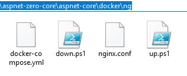

# Publishing to Docker Containers

ASP.NET Zero solution has a **build folder** which contains a PowerShell script to **build & publish** your solution to the **output** folder. 

It also contains **Docker** files to run your application inside Docker containers. You can customize the default run configuration according to your requirements. 

In your `aspnet-core\docker\ng\` folder, you will see;

* `up.ps1`  which starts the Docker container with the configuration defined in `docker-compose.yml`
* `down.ps1`  which shuts down the Docker container with the configuration defined in `docker-compose.yml`

