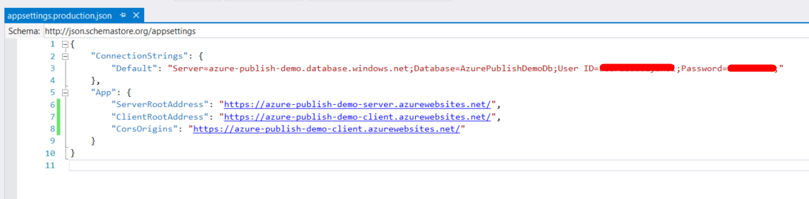

# Step By Step Publish To Azure

## Introduction

Before reading this document, it's suggested to read [Getting Started](https://aspnetzero.com/Documents/Getting-Started-Angular) to run the application and explore the user interface. This will help you to have a better understanding of concepts defined here.

## Create The Azure Website

It is possible to publish ASP.NET Zero's Angular client app and server side Web.Host API app together or separately. In this document, we will publish both apps separately.

So, go to your Azure Portal and create two websites, one for **Web.Host** project and other one for **Angular** application.

### Creating an Azure Website for Host

We will be using "**Web App + SQL**" for **Web.Host** project but if you already have an SQL Database, you can just create Web App and use the connection string of your Azure SQL Database.

So, select "**Web App + SQL**" and click create: 

And configure it according to your needs. A sample setting is shown below:

### Creating an Azure Website for Angular

Select "**Web App**" and click create. Since we already created the database for **Web.Host** application, we don't need it here.

And configure it according to your needs. A sample setting is shown below:

## Publish Host Application to The Azure

The details will be explained in the next lines. Here are the quick steps to publish the **Host Application** to the Azure.

- Run the migrations on the Azure
- Configure the **.Web.Host/appsettings.production.json**
- Publish the application to Azure

### Run Migrations on The Azure

One of the best ways to run migrations on the Azure is running `update-database` command in the Visual Studio. 
In order to do that, your public IP address should have access to the Azure. 

#### Configuring the Firewall for Client Access 

**The easiest way:** Open Management Studio and write the Azure database settings, then click connect. 
If you are already logged in to the Azure, following info screen will be shown (if you aren't already logged in, a form will be displayed before the following screen to logging in):

Now your client IP address have access to the Azure. Of course, this operation can also be done via the [Azure Portal](https://portal.azure.com). Check [here](https://docs.microsoft.com/en-us/azure/sql-database/sql-database-firewall-configure) to learn how to configure the firewall for client access via Azure Portal.

#### Apply Migrations

Open **appsettings.json** in **.Web.Host** project and change connection settings according to the Azure Database:

Open Package Manager Console in Visual Studio, set **.EntityFrameworkCore** as the Default Project and run the `update-database` command as shown below:

### Configure the appsettings.production.json

Azure is using **appsettings.production.json**, so this file should be configured like following:

### Publish

Right click the **Web.Host** project and select "**Publish**". Select "**Microsoft Azure App Service**" and check "**Select Existing**". Click "**Create Profile**" button.

Following screen will be shown:

Select "**azure-publish-demo-server**" and click "**OK**", then click "**Publish**" button. **Host** application is live now:

## Publish Angular to The Azure

The details will be explained in the next lines. Here are the quick steps to publish the **AngularUI** to the Azure

- Run the `yarn` command to restore packages
- Run the `ng build -prod`
- Copy the web.config file that is placed in **angular** folder to **dist** folder
- Configure the **angular/dist/assets/appconfig.json**
- Upload required files to the Azure

### Prepare The Publish Folder

Run the `yarn` command to restore packages and run the `ng build --prod` to create publish folder that named **dist**.

### Copy the web.config

Copy the web.config file that is placed in **angular** folder to **angular/dist** folder.

### Copy the appconfig.json

Configure the **angular/dist/assets/appconfig.production.json** like following:

### Upload Files to Azure

Files must be uploaded to the Azure via FTP. Transfer files from the **dist** to the **www** folder in the Azure. The folder structure should look like:

Angular application is live now. Browse the http://azure-publish-demo-client.azurewebsites.net and see it works.

