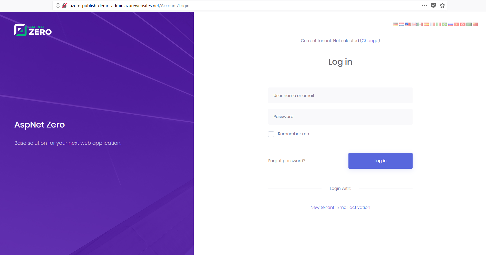
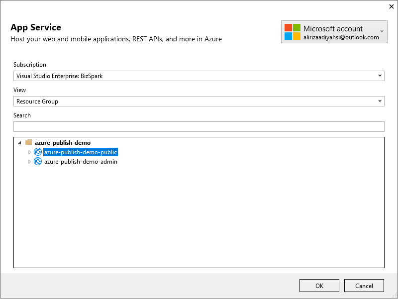

# Step By Step Publish To Azure

## Introduction

Before reading this document, it's suggested to read [Getting Started](Getting-Started-Core) to run the application and explore the user interface. This will help you to have a better understanding of concepts defined here.

In this document, we will be deploying ASP.NET Zero's Admin website and Public website to Azure. We will be using same database for both websites.

## Create The Azure Websites

Create two websites in Azure. One for **Web.Mvc** and other for **Web.Public**

### Creating an Azure Website for Web.Mvc

On Azure portal menu, go to App Services and click "Create App Service" button. Fill the App Service creation for correctly and create the app service for admin website.


### Creating an Azure Website for Public Website

Just like we did for MVC admin website, create a new app service for public website with a different name.

## Create the Database Service

On Azure portal, go to SQL databases menu and create a new empty database. If you haven't create a new Server on Azure, click "create new" link under the Server selection combobox and first create a Server.


## Publish Web.Mvc Application to The Azure

Here are the quick steps to publish the **Web.Mvc Application** to the Azure.

- Run the ```yarn``` command in the root directory of MVC project.  
- Run the `npm run build` to bundle and minify the js/css files
- Run the migrations on the Azure
- Configure the **.Web.Mvc/appsettings.production.json**
- Publish the application to Azure

### Run the `npm run build`

First run the ```yarn``` command in the root directory of MVC project to install client side dependencies. Then, run the `npm run build` to bundle and minify the script and style files.

### Run Migrations on The Azure

One of the best ways to run migrations on the Azure is running `update-database` command in the Visual Studio. 
But this command won't run. Your client IP address should have access to the Azure. 

#### Configuring the Firewall for Client Access 

**The easiest way:** Open Management Studio and write the Azure database settings, then click connect. 
If you are already logged in to the Azure, following info screen will be shown (if you aren't already logged in, a form will be displayed before the following screen to logging in):


Now our client IP address have access to the Azure. Of course, this operation can also be done via the [Azure Portal](https://portal.azure.com). Check [here](https://docs.microsoft.com/en-us/azure/sql-database/sql-database-firewall-configure) to learn how to configure the firewall for client access via Azure Portal.

#### Apply Migrations

Open **appsettings.json** in **.Web.Mvc** project and change connection settings according to the Azure Database:


Open Package Manager Console in Visual Studio, set **.EntityFrameworkCore** as the Default Project and run the `update-database` command as shown below:


As an alternative, you can change connection string on the Migrator project in your solution and execute it instead of running Update-Database command. It is suggested to use Migrator project for migration operations.

### Configure the appsettings.production.json

Since your application will run in Production environment, Azure will use **appsettings.production.json** that is placed in the **Web.Mvc**, so this file should be configured like following:


### Publish

Right click the **Web.Mvc** project and select "**Publish**". Select "**Microsoft Azure App Service**" and check "**Select Existing**". Click "**Create Profile**" button.


Following screen will be shown:


Select "**your-admin-app-service-name**" and click "**OK**", then click "**Publish**" button. **Web.Mvc** application is live now:



## Publish Public Website to The Azure

Here are the quick steps to publish the **Web.Public** to the Azure

- Install NPM packages and create bundles
- Configure the **.Web.Public/appsettings.production.json**
- Publish the application to Azure

Since we migrated the database when deploying Admin application, we will not do it again.

### NPM Packages

First run the ```yarn``` command in the root directory of MVC project to install client side dependencies. Then, run the `npm run build` to bundle and minify the script and style files.

### Configure the appsettings.production.json

Azure is using **appsettings.production.json** that is placed in the **Web.Public**, so this file should be configured like following:


### Publish

Right click the **Web.Public** project and select "**Publish**". Click "**Create new profile**" under **Publish** tab. Select "**Microsoft Azure App Service**" and check "**Select Existing**" then click "**Publish**" button.


Following screen will be shown:



Select "**your-public-app-service-name**" and click "**OK**". Public website is live now:


