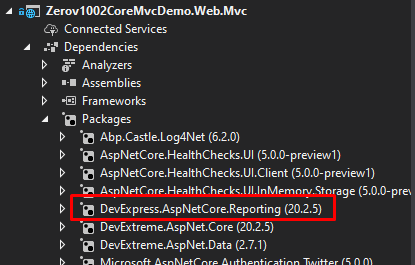
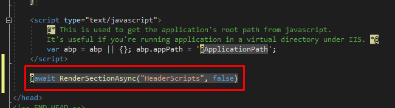

# DevExpress Reporting

In this document, we will implement [DevExpress Reporting](https://www.devexpress.com/subscriptions/reporting/) to ASP.NET Zero (ASP.NET Core version) step by step.

1. Download DevExpress Reporting.

2. Open your ASP.NET Zero project 

3. Import `DevExpress.AspNetCore.Reporting` package to `[YOURAPPNAME].Web.Mvc` project.

4. Then go to `Startup.cs` and add these code parts:

```csharp
public IServiceProvider ConfigureServices(IServiceCollection services)
{
    //...
    services.AddDevExpressControls(); //add that
}

public void Configure(IApplicationBuilder app, IWebHostEnvironment env, ILoggerFactory loggerFactory)
{
    //...
    app.UseDevExpressControls(); //add that
}
```

   

5. Now, We can create a sample report to test if it all works. Go to  `[YOURAPPNAME].Web.Mvc`  and create a folder named `Reports`.
6. Right click on the `Reports` folder then click `Add` -> `New Item`, then select `DevExpress Report` item. 
7. Select `Blank` report in the opening wizard, and create new empty report named SampleReport.


*(Design your report as you wish)*

8. Go to `package.json` and add following dependencies. (It is located in `[YOURAPPNAME].Web.Mvc` project)

   ```json
   dependencies: [
       "devextreme": "20.2.5",
       "@devexpress/analytics-core": "20.2.5",
       "devexpress-reporting": "20.2.5",
       "jquery-ui-dist": "1.12.1"
   ]
   ```

   *Note: Version of the nuget and npm packages should match*

   

9. Go to `bundles.json` in mvc project and add following bundles.

   ```json
   {
     "scripts": [
       {
         "output": "view-resources/Areas/App/Views/_Bundles/sample-report-min.js",
         "input": [
           "node_modules/jquery-ui-dist/jquery-ui.js",
           "node_modules/knockout/build/output/knockout-latest.js",
           "node_modules/devextreme/dist/js/dx.all.js",
           "node_modules/@devexpress/analytics-core/dist/js/dx-analytics-core.js",
           "node_modules/devexpress-reporting/dist/js/dx-webdocumentviewer.js"
         ]
       }
     ],
     "styles": [
         {
         "output": "/view-resources/Areas/App/Views/_Bundles/sample-report.min.css",
         "input": [
           "node_modules/jquery-ui-dist/jquery-ui.css",
           "node_modules/devextreme/dist/css/dx.common.css",
           "node_modules/devextreme/dist/css/dx.light.css",
           "node_modules/@devexpress/analytics-core/dist/css/dx-analytics.common.css",
           "node_modules/@devexpress/analytics-core/dist/css/dx-analytics.light.css",
           "node_modules/devexpress-reporting/dist/css/dx-webdocumentviewer.css"
         ]
       }
     ]
   }
   ```

10. Go to `_Layout.cshtml` located in  `[YOURAPPNAME].Web.Mvc\Areas\App\Views\Layout\_Layout.cshtml` and add new render section named `HeaderScripts` as nonrequired.

    

11. Create new controller named `SampleReportController` in mvc project's Areas/App folder.

    ```csharp
    [Area("App")]
    public class SampleReportController : Zerov1002CoreMvcDemoControllerBase
    {
        public IActionResult Index()
        {
            return View();
        }
    }
    ```

12. Create `Index.cshtml` and add following code into it.

    ```cshtml
    @using DevExpress.AspNetCore
    @using Zerov1002CoreMvcDemo.Web.Reports;
    
    @section Styles
    {
        <link rel="stylesheet" abp-href="/view-resources/Areas/App/Views/_Bundles/sample-report.css" asp-append-version="true" />
    }
    
    @section HeaderScripts
    {
        <script abp-src="/view-resources/Areas/App/Views/_Bundles/app-layout-libs.js" asp-append-version="true"></script>
    
        <script abp-src="/view-resources/Areas/App/Views/_Bundles/sample-report.js" asp-append-version="true"></script>
    }
    
    <div class="content d-flex flex-column flex-column-fluid">
        <abp-page-subheader title="@L("SampleReport")">
        </abp-page-subheader>
    
        <div class="@(await GetContainerClass())">
            <div class="card card-custom gutter-b">
                <div class="card-body">
                    @(Html.DevExpress().WebDocumentViewer("DocumentViewer")
                        .Height("1000px")
                        .Bind(new SampleReport())
                        )
                </div>
            </div>
        </div>
    </div>
    ```

Your reporting file is ready to use.

Note: If you get reference error about `WebDocumentViewerController`, `QueryBuilderController` or `ReportDesignerController`, you can follow that solution.

* Go to you `[YOURAPPNAME]WebMvcModule` .

* Add following code into `PreInitialize` function

  ```csharp
  public override void PreInitialize()
  {
      //...
      IocManager.Register(typeof(WebDocumentViewerController), DependencyLifeStyle.Transient);
      IocManager.Register(typeof(QueryBuilderController), DependencyLifeStyle.Transient);
      IocManager.Register(typeof(ReportDesignerController), DependencyLifeStyle.Transient);
  }
  ```

  