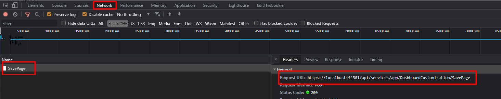
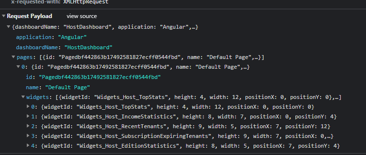

# Customizable Dashboard

You can create new widgets and widget filters for the customizable dashboards.

Let's create a new widget and widget filter step by step.

Pre-Note: Customizable dashboard configurations are stored in two places.

- Definitions which include permission, multitenancy side, etc. which should be controlled by the server are located in `*.Core -> DashboardCustomization -> Definitions -> DashboardConfiguration.cs` so that application layer can handle permission and other stuff.
- View side definitions like component are located in the angular project. 
- UI applications get data from the server about the dashboard and use their view information to show it.

## Creating a New Widget Filter

Our widget filter name will be `FilterHelloWorld` . It will have one input and button and it will trigger an event when that input changed.

#### Step 1. Create Filter View 

* Open angular project. 

* Go to **src\app\shared\common\customizable-dashboard\filters** and create a new component.

  ```bash
  > ng generate component filter-hello-world
  ```

* Change component items as seen below.

*filter-hello-world-component.html*

```html
<div class="form-group">
    <div class="input-group">
        <input type="text" class="form-control" #inputFilterHello placeholder="{{'SearchWithThreeDot' | localize}}">
        <div class="input-group-append">
            <button class="btn btn-primary" (click)="publishName(inputFilterHello.value)" type="button">Go!</button>
        </div>
    </div>
</div>
```

*filter-hello-world-component.ts*

```typescript
import { Component, Injector } from '@angular/core';
import { AppComponentBase } from '@shared/common/app-component-base';

@Component({
  selector: 'app-filter-hello-world',
  templateUrl: './filter-hello-world.component.html',
  styleUrls: ['./filter-hello-world.component.css']
})
export class FilterHelloWorldComponent extends AppComponentBase {

  constructor(injector: Injector) {
    super(injector)
  }

  publishName(name: string): void {
    abp.event.trigger('app.dashboardFilters.helloFilter.onNameChange', name);
  }
}
```


#### Step 2. Define Widget Filter

##### View Definitions

Widget's/widget filter's view consts are located in `src\app\shared\common\customizable-dashboard.DashboardCustomizationConsts.ts` Open `*DashboardCustomizationConsts.ts` create new id for hello world filter. (This id is also used in view page so be careful when selecting this value. It should not start with a number or special characters, etc.)

```typescript
export class DashboardCustomizationConst {
  ...
    static filters = {
        filterDateRangePicker: "Filters_DateRangePicker",
        filterHelloWorld: "Filters_HelloWorld"//add new id
    };
 ...
}
```


Go to `dashboard-view-configuration.service.ts`. Add your new widget filter's view definition.

```csharp
export class DashboardViewConfigurationService {
    ...
    let filterHelloWorld = new WidgetFilterViewDefinition(
      DashboardCustomizationConst.filters.filterHelloWorld,
      FilterHelloWorldComponent//the component of filter
    );
    
    this.widgetFilterDefinitions.push(filterHelloWorld);
    ...
}
```


##### Server Side Definition

Open server project.

Open `*.Core.Shared -> [YourAppName]DashboardCustomizationConsts.cs` and define the same id in here too.

```csharp
public class [YourAppName]DashboardCustomizationConsts
{
    ...
    public class Filters
    {
      ...
         public const string HelloWorldFilter = "Filters_HelloWorld";
      ...
```

Go to `*.Core -> DashboardCustomization -> Definitions -> DashboardConfiguration.cs` and add hello world filter definition.

```csharp
public class DashboardConfiguration
  {
    public DashboardConfiguration()
      {
        ...
var helloWorldFilter = new WidgetFilterDefinition(
            AbpZeroTemplateDashboardCustomizationConsts.Filters.HelloWorldFilter, "FilterHelloWorld");//localized string key
        
WidgetFilterDefinitions.Add(helloWorldFilter);
        ...
```

Now your filter is available for all widgets. You can use it in any widget definition and it will be loaded to page automatically.


## Creating a New Widget

Our widget name will be `WidgetHelloWorld`

#### Step 1. Create an API

* Create an API which your widgets needs. In this scenario, We will create one endpoint into `TenantDashboardAppService.cs` named `GetHelloWorldData`.

```csharp
public class GetHelloWorldInput
{
    public string Name { get; set; }
}

public class GetHelloWorldOutput
{
    public string OutPutName { get; set; }
}

public interface ITenantDashboardAppService : IApplicationService
{
  ...
  GetHelloWorldOutput GetHelloWorldData(GetHelloWorldInput input);
  ...
}
public class TenantDashboardAppService ...
{
    ...
    [AbpAuthorize(AppPermissions.HelloWorldPermission)]//check permission
    public GetHelloWorldOutput GetHelloWorldData(GetHelloWorldInput input)
    {
        return new GetHelloWorldOutput()
        {
             OutPutName = "Hello " + input.Name + " (" + Clock.Now.Millisecond + ")"
        };
    }
    ...
}
```

*Although ASP.NET Zero load widgets by filtering permission and other things. We still have to check permission here.*

* After you create an API, run `*Web.Host` project then go to nswag folder in angular project. Open any terminal and run resfresh.bat

#### Step 2. Create Widget View

* Open angular project. 

* Go to **src\app\shared\common\customizable-dashboard\widgets** and create a new component.

  ```bash
  > ng generate component widget-hello-world
  ```

* Change component items as seen below..

*widget-hello-world-component.html*

```html
<div class="kt-portlet kt-portlet--height-fluid">
    <div class="kt-portlet__head">
        <div class="kt-portlet__head-label">
            <h3 class="kt-portlet__head-title">
                Hello World
            </h3>
        </div>
    </div>
    <div class="kt-portlet__body">
        Hello World Works! <br/>
        Response: {{helloResponse}}
    </div>
</div>
```

*widget-hello-world-component.ts*

```typescript
import { Component, Injector } from '@angular/core';
import { AppComponentBase } from '@shared/common/app-component-base';
import { TenantDashboardServiceProxy } from '@shared/service-proxies/service-proxies';

@Component({
  selector: 'app-widget-hello-world',
  templateUrl: './widget-hello-world.component.html',
  styleUrls: ['./widget-hello-world.component.css']
})
export class WidgetHelloWorldComponent extends WidgetComponentBase implements OnInit, OnDestroy {
  helloResponse: string;
  constructor(injector: Injector,
    private _tenantDashboardService: TenantDashboardServiceProxy) {
    super(injector);    
  }

  ngOnInit(): void {
    this.subHelloWorldFilter();
    this.runDelayed(()=>{
        this.getHelloWorld("First Attempt");  
    });
  }
  
  getHelloWorld = (name: string) => {
    this._tenantDashboardService
      .getHelloWorldData(name)
      .subscribe((data) => {
        this.helloResponse = data.outPutName;
      });
  }
  
  onNameChange = (name) => {
   this.runDelayed(()=>{
        this.getHelloWorld(name);  
    });
  }
  
  subHelloWorldFilter() {
    abp.event.on('app.dashboardFilters.helloFilter.onNameChange', this.onNameChange);
  }

  unSubHelloWorldFilter() {
    abp.event.off('app.dashboardFilters.helloFilter.onNameChange', this.onNameChange);
  }

  ngOnDestroy(): void {
    this.unSubHelloWorldFilter();
  }
}
```


#### Step 3. Define Widget 

##### View Definitions

Widget's/widget filter's view consts are located in `src\app\shared\common\customizable-dashboard\DashboardCustomizationConsts.ts` Open `*DashboardCustomizationConsts.ts` create new id for hello world widget. (This id is also used in view pages so be careful when selecting this value. It should not start with a number or special characters, etc.)

```typescript
export class DashboardCustomizationConst {
    static widgets = {
        tenant: {
            ...
            helloWorld: "Widgets_Tenant_HelloWorld"
        },
       ...
}
```

Go to `src\app\shared\common\customizable-dashboard\dashboard-view-configuration.service.ts`. Add your hello world widget's view definition.

```typescript
export class DashboardViewConfigurationService {
    ...
    //add your tenant side widgets here
        
    let helloWorld = new WidgetViewDefinition(
      DashboardCustomizationConst.widgets.tenant.helloWorld,
      WidgetHelloWorldComponent,
    )
    this.WidgetViewDefinitions.push(helloWorld);  
    ...
}
```


##### Server Side Definition

Open server project.

Open ``*.Core.Shared -> [YourAppName]DashboardCustomizationConsts.cs` and define the same id in here too.

```csharp
public class [YourAppName]DashboardCustomizationConsts
{
    
    public class Widgets
    {
        public class Tenant
        {
            public const string HelloWorld = "Widgets_Tenant_HelloWorld";

      ...
```

Go to `*.Core -> DashboardCustomization -> Definitions -> DashboardConfiguration.cs` and add hello world widget's definition.

```csharp
public class DashboardConfiguration
  {
    public DashboardConfiguration()
      {
        ...
var helloWorld = new WidgetDefinition(
    id:AbpZeroTemplateDashboardCustomizationConsts.Widgets.Tenant.HelloWorld,
    name:"WidgetRecentTenants",//localized string key
    side: MultiTenancySides.Tenant,
    usedWidgetFilters: new List<string>() { helloWorldFilter.Id },// you can use any filter you need
    permissions: tenantWidgetsDefaultPermission);
        
helloWorld.Permissions.Add(AppPermissions.HelloWorldPermission);
        ...
        
        ...
var defaultTenantDashboard = new DashboardDefinition(
    AbpZeroTemplateDashboardCustomizationConsts.DashboardNames.DefaultTenantDashboard,
    new List<string>()
    {
        generalStats.Id, dailySales.Id, profitShare.Id, memberActivity.Id, regionalStats.Id, topStats.Id, salesSummary.Id, helloWorld.Id //add your widget to dashboard
    });
        ...
```


Since we create component with ng generate command our component will be automatically added to `app-common.module.ts`  declarations. Customizable dashboard loads component dynamically, that's why we also add our components to entryComponents.

Go to **app-common-module.ts** and add `FilterHelloWorldComponent` and `WidgetHelloWorldComponent` 

```typescript
@NgModule({
   ...     
    entryComponents: [
       ...
        FilterHelloWorldComponent,//add filter
        WidgetHelloWorldComponent//add widget
    ]
})
export class AppCommonModule {
    static forRoot(): ModuleWithProviders {
        return {
            ngModule: AppCommonModule,
            providers: [
                AppAuthService,
                AppRouteGuard
            ]
        };
    }
}
```


After that you will be able to use your new widget. 

## Usage

Since we create tenant side widget, open tenant dashboard. 

Select the page you want to use hello widget.

Add hello widget to the page as described in that article: [Customizable Dashboard Usage](Features-Angular-Customizable-Dashboard.md) 

After that, you will see that your widget is located on the page and works as expected.


Since hello world widget needs hello world filter *(we defined it in DashboardConfiguration)* hello world filter will be loaded to the page. To use it. Click the filter button next to the **Edit Mode** button. It will open the filter modal. 

As you can below, you will be able to see filters that your widgets need. Change input and click **Go**. Hello world widget will be changed by your filter.


## Changing Default Dashboard View

AspNet Zero uses [angular-gridster2](https://tiberiuzuld.github.io/angular-gridster2/) grid system in dashboard and stores needed view data in [app settings](https://aspnetboilerplate.com/Pages/Documents/Setting-Management). To change default view of dashboard you should change related part of the settings located in [AppSettingProvider](https://github.com/aspnetzero/aspnet-zero-core/blob/46aac958aa330771b37a3e4d5bc220d4e1221549/aspnet-core/src/MyCompanyName.AbpZeroTemplate.Core/Configuration/AppSettingProvider.cs#L522-L541). To change default dashboard view you should open dashboard and design the dashboard by following the [document](Features-Angular-Customizable-Dashboard) . Then open browser's developer console. Click to the save button in the page and follow the request named `SavePage`. 



Open the request payload and get the data from there



Then go to `AppSettingProvider`'s `GetDefaultAngularDashboardViews` method and change the information with using the data you get from request payload.

