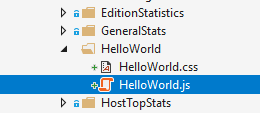
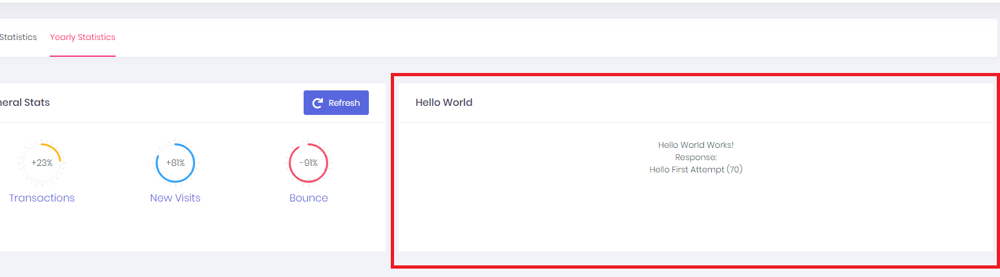
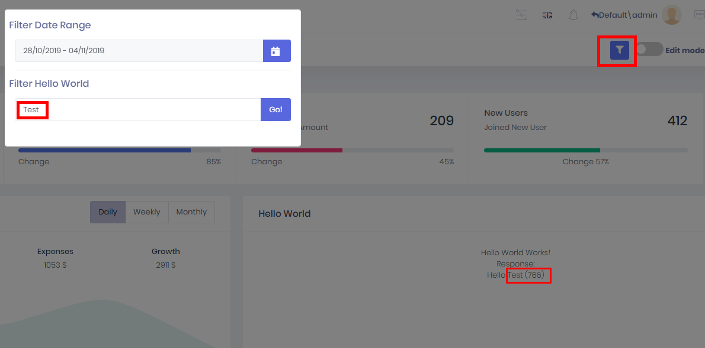
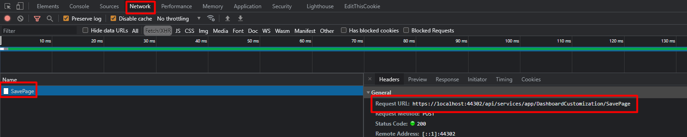

# Customizable Dashboard

You can create new widgets and widget filters for the customizable dashboards.

Let's create a new widget and widget filter step by step.

Pre-Note: Customizable dashboard configurations are stored in two places.

- Definitions which include permission, multitenancy side, etc. which should be controlled by the server are located in `*.Core -> DashboardCustomization -> Definitions -> DashboardConfiguration.cs` so that application layer can handle permission and other stuff.
- View side definition like CSS JS file located in the UI project. 
- UI applications get data from the server about the dashboard and use their view information to show it.

## Creating a New Widget Filter

Our widget filter name will be `FilterHelloWorld` . It will have one input and button and it will trigger an event when that input changed.

#### Step 1. Create Filter View 

* Go to `*.Web.Mvc  -> Areas -> [YouAppAreaName] -> Views -> Shared -> Components -> CustomizableDashboard -> Widgets` and create a partial view named `FilterHelloWorld` and change it as seen below.

*FilterHelloWorld.cshtml*

```html
<div class="form-group filter-hello-world-container">
    <div class="input-group">
        <input type="text" class="form-control" name="input-filter-hello" placeholder="@L("SearchWithThreeDot")">
        <div class="input-group-append">
            <button class="btn btn-primary" name="btn-filter-hello" type="button">Go!</button>
        </div>
    </div>
</div>
```

* Create folder named FilterHelloWorld into `*.Web.Mvc  -> wwwroot -> view-resources -> Areas -> [YourAppAreaName] -> Views -> CustomizableDashboard -> Widgets`  and create `FilterHelloWorld.css` and `FilterHelloWorld.js` file for into that folder.

* Open `FilterHelloWorld.js` and change it as seen below.

  ```javascript
  $(function () {
      var _$container = $(".filter-hello-world-container");
      var _$btn= _$container.find("button[name='btn-filter-hello']");
      var _$input= _$container.find("input[name='input-filter-hello']"); 
  
      _$btn.click(function () {
           abp.event.trigger('app.dashboardFilters.helloFilter.onNameChange', _$input.val());
      });
  });
  ```


#### Step 2. Define Widget Filter

##### View Definitions

Widget's/widget filter's view consts are located in `*.Core.Shared -> [YourAppName]DashboardCustomizationConsts.cs`. Open `[YourAppName]DashboardCustomizationConsts.cs` create new id for hello world filter. (This id is also used in view page so be careful when selecting this value. It should not start with a number or special characters, etc.)

```csharp
public class [YourAppName]DashboardCustomizationConsts
{
    ...
    public class Filters
    {
      ...
         public const string HelloWorldFilter = "Filters_HelloWorld";
```


Go to `*.Web.Mvc -> Areas -> [YourAppAreaName] -> Startup -> DashboardCustomization -> DashboardViewConfiguration.cs`. Add your new widget filter's view definition.

```csharp
public class DashboardViewConfiguration
{
    ...
    WidgetFilterViewDefinitions.Add(
        AbpZeroTemplateDashboardCustomizationConsts.Filters.HelloWorldFilter,
        new WidgetFilterViewDefinition(
            AbpZeroTemplateDashboardCustomizationConsts.Filters.HelloWorldFilter,
            viewFileRoot + "FilterHelloWorld.cshtml",
            jsAndCssFileRoot + "FilterHelloWorld/FilterHelloWorld.min.js",
            jsAndCssFileRoot + "FilterHelloWorld/FilterHelloWorld.min.css")
  	);
	...
}
```


##### Main Definition

Go to `*.Core -> DashboardCustomization -> Definitions -> DashboardConfiguration.cs` and add hello world filter definition.

```csharp
public class DashboardConfiguration
{
    public DashboardConfiguration()
    {
        ...
		var helloWorldFilter = new WidgetFilterDefinition(
            AbpZeroTemplateDashboardCustomizationConsts.Filters.HelloWorldFilter,
            "FilterHelloWorld"
        );
        
		WidgetFilterDefinitions.Add(helloWorldFilter);
        ...
```

Now your filter is available for all widgets. You can use it in any widget definition and it will be loaded to page automatically.


## Creating a New Widget

Our widget name will be `WidgetHelloWorld`

#### Step 1. Create an API

Create an API which your widgets needs. In this scenario, I will create one endpoint into `TenantDashboardAppService.cs` named `GetHelloWorldData`.

```csharp
public class GetHelloWorldInput
{
    public string Name { get; set; }
}

public class GetHelloWorldOutput
{
    public string OutPutName { get; set; }
}

public interface ITenantDashboardAppService : IApplicationService
{
  ...
  GetHelloWorldOutput GetHelloWorldData(GetHelloWorldInput input);
}

public class TenantDashboardAppService ...
{
    ...
    [AbpAuthorize(AppPermissions.HelloWorldPermission)]//check permission
    public GetHelloWorldOutput GetHelloWorldData(GetHelloWorldInput input)
    {
        return new GetHelloWorldOutput()
        {
             OutPutName = "Hello " + input.Name + " (" + Clock.Now.Millisecond + ")"
        };
    }
}
```

*Although ASP.NET Zero load widgets by filtering permission and other things. We still have to check permission here.*

#### Step 2. Create Widget View

* Go to `*.Web.Mvc  -> Areas -> [YouAppAreaName] -> Views -> Shared -> Components -> CustomizableDashboard -> Widgets` and create a partial view named `WidgetHelloWorld` and change it as seen below.

*WidgetHelloWorld.cshtml*

```html
<div class="card card-custom h-100">
    <div class="card-header align-items-center border-0 mt-4">
        <div class="card-title">
            <span class="card-icon">
                <i class="la la-pie-chart text-success"></i>
            </span>
            <h3 class="card-label">
                <span class="font-weight-bolder text-dark">@L("HelloWorld")</span>
                <small class="sub-title"></small>
            </h3>
        </div>
    </div>

    <div class="card-body">
        Hello World Works! <br/>
        Response: <span class="hello-response">NULL</span>
    </div>
</div>
```

* Create a folder named HelloWorld into `*.Web.Mvc  -> wwwroot -> view-resources -> Areas -> [YourAppAreaName] -> Views -> CustomizableDashboard -> Widgets`  and create `HelloWorld.css` and `HelloWorld.js` file for into that folder.



* Open `HelloWorld.js` and change it as seen below.

```javascript
(function () {
    //Widgets_Tenant_HelloWorld must match with the WidgetViewDefinition name defined in Step 3.
    app.widgets.Widgets_Tenant_HelloWorld = function () {
        var _tenantDashboardService = abp.services.app.tenantDashboard;
        var _widgetBase = app.widgetBase.create();
        var _widget;
        
		this.init = function (widgetManager) {
			_widget = widgetManager.getWidget();
			_widgetBase.runDelayed(function(){
				getHelloWorld("First Attempt");
			});

			//event which your filter send
			abp.event.on('app.dashboardFilters.helloFilter.onNameChange', function (name) {
				_widgetBase.runDelayed(function(){
					getHelloWorld(name);
				});
			});		
		};
		
		var getHelloWorld = function (name) {
			abp.ui.setBusy(_widget);
			_tenantDashboardService.getHelloWorldData({name:name})
				.done(function (result) {				
					_widget.find(".hello-response")//it is how you should select item in widget
					.text(result.outPutName);					 
				}).always(function () {
					abp.ui.clearBusy(_widget);
				});
		};
    }
})();
```


#### Step 3. Define Widget 

##### View Definitions

Widget's/widget filter's view consts are located in `*.Core.Shared -> [YourAppName]DashboardCustomizationConsts.cs ` . Open `*DashboardCustomizationConsts.cs` create new id for hello world widget. (This id is also used in view page so be careful when selecting this value. It should not start with a number or special characters, etc.)

```csharp
public class [YourAppName]DashboardCustomizationConsts
{    
    public class Widgets
    {
        public class Tenant
        {
            public const string HelloWorld = "Widgets_Tenant_HelloWorld";
      ...
```

Go to `*.Web.Mvc -> Areas -> [YourAppAreaName] -> Startup -> DashboardCustomization -> DashboardViewConfiguration.cs`. Add your hello world widget's view definition.

```csharp
public class DashboardViewConfiguration
{
    ...
	WidgetViewDefinitions.Add(AbpZeroTemplateDashboardCustomizationConsts.Widgets.Tenant.DailySales,
		new WidgetViewDefinition(
			AbpZeroTemplateDashboardCustomizationConsts.Widgets.Tenant.HelloWorld,
			"AppAreaName/Widgets/WidgetHelloWorld",//widget url
			"/Areas/AppAreaName/Views/CustomizableDashboard/Widgets/HelloWorld/HelloWorld.min.js", //widget's js file
			"/Areas/AppAreaName/Views/CustomizableDashboard/Widgets/HelloWorld/HelloWorld.min.css"
		)
	);
}
```

##### Main Definition

Go to `*.Core -> DashboardCustomization -> Definitions -> DashboardConfiguration.cs` and add hello world widget's definition.

```csharp
public class DashboardConfiguration
{
    public DashboardConfiguration()
    {
        ...
        var helloWorld = new WidgetDefinition(
            id: AbpZeroTemplateDashboardCustomizationConsts.Widgets.Tenant.HelloWorld,
            name: "WidgetHelloWorld",//localized string key
            side: MultiTenancySides.Tenant,
            usedWidgetFilters: new List<string>() { helloWorldFilter.Id },// you can use any filter you need
            permissions: tenantWidgetsDefaultPermission
        );
        
		helloWorld.Permissions.Add(AppPermissions.HelloWorldPermission);
        ...
        
        ...
        var defaultTenantDashboard = new DashboardDefinition(
            AbpZeroTemplateDashboardCustomizationConsts.DashboardNames.DefaultTenantDashboard,
            new List<string>()
            {
                generalStats.Id,
                dailySales.Id,
                profitShare.Id,
                memberActivity.Id,
                regionalStats.Id,
                topStats.Id,
                salesSummary.Id,
                helloWorld.Id //add your widgets to dashboard
            }
        );
        ...
    }
}
```


After all of these, open any terminal and run `npm run create-bundles` command in `*.Web.Mvc` project folder. This will create all minified CSS and JS files we defined.

After that you will be able to use your new widget. 

## Usage

Since we create tenant side widget, open tenant dashboard. 

Select the page you want to use hello widget.

Add hello widget to the page as described in that article: [Customizable Dashboard Usage](Features-Angular-Customizable-Dashboard.md) 

After that, you will see that your widget is located on the page and works as expected.




Since hello world widget needs hello world filter *(we defined it in DashboardConfiguration)* hello world filter will be loaded to the page. To use it. Click the filter button next to the **Edit Mode** button. It will open the filter modal. 

As you can below, you will be able to see filters that your widgets need. Change input and click **Go**. Hello world widget will be changed by your filter.




## Changing Default Dashboard View

AspNet Zero uses [gridstack](https://gridstackjs.com/) grid system in dashboard and stores needed view data in [app settings](https://aspnetboilerplate.com/Pages/Documents/Setting-Management). To change default view of dashboard you should change related part of the settings located in [AppSettingProvider](https://github.com/aspnetzero/aspnet-zero-core/blob/46aac958aa330771b37a3e4d5bc220d4e1221549/aspnet-core/src/MyCompanyName.AbpZeroTemplate.Core/Configuration/AppSettingProvider.cs#L522-L541). To change default dashboard view you should open dashboard and design the dashboard by following the [document](Features-Mvc-Core-Customizable-Dashboard) . Then open browser's developer console. Click to the save button in the page and follow the request named `SavePage`. 



Open the request payload and get the data from there


Then go to `AppSettingProvider`'s `GetDefaultAngularDashboardViews` method and change the information with using the data you get from request payload.

