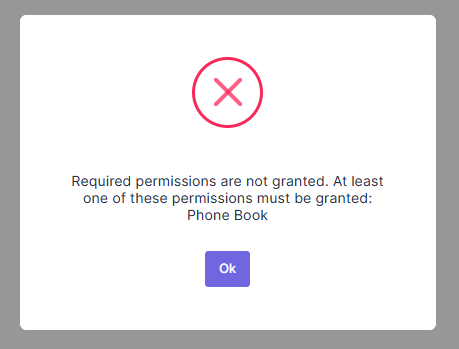

# Authorization For Phone Book

At this point, anyone can enter phone book page since no authorization
defined. We will define two permission:

- A permission to **enter phone book page**.
- A permission to **create new person** (which is a child permission
  of first one, as naturally).

## Permission for Entering Phone Book Page

### Define the permission

Go to **AppAuthorizationProvider** class in the server side and add a new permission as shown below (you can add just below the dashboard permission):

```csharp
pages.CreateChildPermission(AppPermissions.Pages_Tenant_PhoneBook, L("PhoneBook"), multiTenancySides: MultiTenancySides.Tenant);
```

A permission should have a unique name. We define permission names as constant strings in **AppPermissions** class. It's a simple constant string:

```csharp
public const string Pages_Tenant_PhoneBook = "Pages.Tenant.PhoneBook";
```

Unique name of this permission is "**Pages.Tenant.PhoneBook**". While you can set any string (as long as it's unique), it's suggested to use that convention. A permission can have a localizable display name: "**PhoneBook**" here. (See "Adding a New Page" section for more about localization, since it's very similar). Lastly, we set this as a **tenant** level permission.

### Add AbpAuthorize attribute

**AbpAuthorize** attribute can be used as **class level** or **method level** to protect an application service or service method from unauthorized users. Since all server side code is located in `PersonAppService` class, we can declare a class level attribute as shown below:

```csharp
[AbpAuthorize(AppPermissions.Pages_Tenant_PhoneBook)]
public class PersonAppService : PhoneBookAppServiceBase, IPersonAppService
{
    //...
}
```

Admin role has every static permission by default but those permissions can be reversible on user interface for this role. Go to Roles page, edit role named "admin", go to Permissions tab and revoke "Phone Book" permission and save.

Now, let's try to enter Phone Book page by clicking the menu item without required permission:



We get an error message. This exception is thrown when any method of `PersonAppService` is called without required permission.

### Guard Angular Route

We got an exception about permission. Server did not send the data but we can still enter the page. To prevent it, open **main-routing.module.ts** and change the route definition like that:

```json
{
	path: 'phonebook',
	loadChildren: () => import('./phonebook/phonebook.module').then(m => m.PhonebookModule),
	data: { permission: 'Pages.Tenant.PhoneBook' }
}
```

**AuthRouteGuard** class automatically checks route permission data and prevents entering to the view if specified permission is not granted. Try to click Phone Book menu!

### Hide Unauthorized Menu Item

While user can not enter to the page, the menu item still there! We should also **hide** the Phone book **menu item**. It's easy, open **app-navigation-service.ts** and add change PhoneBook menu definition as shown below:

```typescript
new AppMenuItem("PhoneBook", 'Pages.Tenant.PhoneBook', "flaticon-book", "/app/main/phonebook")
```

### Grant permission

So, how we can enter the page now? Simple, go to **Role Management** page and edit **admin** role:


We see that a **new permission** named "**Phone book**" added to **permissions** tab. So, we can check it and save the role. After saving, we need to **refresh** the whole page to refresh permissions for the current user. We could also grant this permission to a specific user. Now, we can enter the Phone book page again.

## Permission for Create New Person

While a permission for a page is useful and probably always needed, we may want to define additional permissions to perform some **specific actions** on a page, like creating a new person.

### Define the Permission

Defining a permission is similar (in the `AppAuthorizationProvider` class):

```csharp
var phoneBook = pages.CreateChildPermission(AppPermissions.Pages_Tenant_PhoneBook, L("PhoneBook"), multiTenancySides: MultiTenancySides.Tenant);
phoneBook.CreateChildPermission(AppPermissions.Pages_Tenant_PhoneBook_CreatePerson, L("CreateNewPerson"), multiTenancySides: MultiTenancySides.Tenant);
```

First permission was defined before. In the second line, we are creating a child permission of first one. Remember to create a constant in `AppPermissions` class:

```csharp
public const string Pages_Tenant_PhoneBook_CreatePerson = "Pages.Tenant.PhoneBook.CreatePerson";
```

### Add AbpAuthorize Attribute

This time, we're declaring **AbpAuthorize** attribute just for **CreatePerson** method:

```csharp
[AbpAuthorize(AppPermissions.Pages_Tenant_PhoneBook_CreatePerson)]
public async Task CreatePerson(CreatePersonInput input)
{
    //...
}
```

### Hide Unauthorized Button

If we run the application and try to create a person, we get an authorization error after clicking the save button. But, it's good to **completely hide Create New Person button** if we don't have the permission. It's very simple:

Open the **phonebook.component.html** view and add the permission **Pages.Tenant.PhoneBook.CreatePerson** condition as shown below:

```html
<button *ngIf="'Pages.Tenant.PhoneBook.CreatePerson' | permission" class="btn btn-primary" (click)="createPersonModal.show()"><i class="fa fa-plus"></i> {{"CreateNewPerson" | localize}}</button>
```

In this way, the "Create New Person" button is not rendered in server and user can not see this button.

### Grant permission

To see the button again, we can go to role or user manager and grant related permission as shown below:


As shown above, **Create new person** permission is a child permission of the **Phone book**. Remember to refresh page to get permissions updated.

## Next

- [Deleting a Person](Developing-Step-By-Step-Angular-Deleting-Person)
