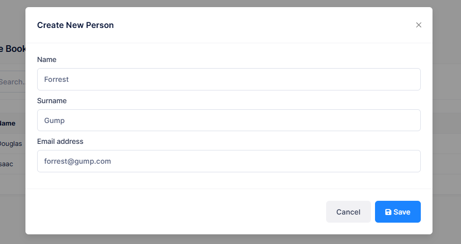

# Creating Modal for New Person

We will create a Bootstrap Modal to create a new person. ASP.NET Zero
uses [ngx-bootstrap](https://github.com/valor-software/ngx-bootstrap)
library to create modals (you can use another library, but we will use
it in this sample too). Final modal will be like below:



First of all, we should use **nswag/refresh.bat** to re-generate
service-proxies. This will generate the code that is needed to call
PersonAppService.**CreatePerson** method from client side. Notice that
you should rebuild & run the server side application before
re-generating the proxy scripts.

We are starting from creating a new component, named
**create-person-modal.component.ts** into client side phonebook folder:

```typescript
import { Component, ElementRef, inject, signal, viewChild, output } from '@angular/core';
import { ModalDirective, ModalModule } from 'ngx-bootstrap/modal';
import { PersonServiceProxy, CreatePersonInput } from '@shared/service-proxies/service-proxies';
import { AppComponentBase } from '@shared/common/app-component-base';
import { finalize } from 'rxjs/operators';
import { CommonModule } from '@angular/common';
import { FormsModule } from '@angular/forms';
import { LocalizePipe } from '@shared/common/pipes/localize.pipe';
import { ButtonBusyDirective } from '@shared/utils/button-busy.directive';

@Component({
    selector: 'createPersonModal',
    templateUrl: './create-person-modal.component.html',
    standalone: true,
    imports: [
        CommonModule,
        FormsModule,
        ModalModule,
        LocalizePipe,
        ButtonBusyDirective,
    ],
})
export class CreatePersonModalComponent extends AppComponentBase {
    private readonly _personService = inject(PersonServiceProxy);

    modalSave = output<any>();

    modal = viewChild.required<ModalDirective>('modal');
    nameInput = viewChild<ElementRef>('nameInput');

    person = signal(new CreatePersonInput());
    active = signal(false);
    saving = signal(false);

    constructor() {
        super();
    }

    show(): void {
        this.active.set(true);
        this.person.set(new CreatePersonInput());
        this.modal().show();
    }

    onShown(): void {
        this.nameInput()?.nativeElement.focus();
    }

    save(): void {
        this.saving.set(true);
        this._personService
            .createPerson(this.person())
            .pipe(finalize(() => this.saving.set(false)))
            .subscribe(() => {
                this.notify.info(this.l('SavedSuccessfully'));
                this.close();
                this.modalSave.emit(this.person());
            });
    }

    close(): void {
        this.modal().hide();
        this.active.set(false);
    }
}
```

Let me explain some parts of this class:

- It has a selector, **createPersonModal**, which will be used as like
  an HTML element in the person list page.
- It extends **AppComponentBase** to take advantage of it (defines
  this.l and this.notify in this sample).
- Defines an event, **modalSave**, which is triggered when we
  successfully save the modal. Thus, the main page will be informed
  and it can reload the person list.
- Declares two **ViewChild** members (**modal** and **nameInput**) to
  access some elements in the view.
- Injects **PersonServiceProxy** to call server side method while
  creating the person.
- It focuses to **name** input when modal is shown.

The code is simple and easy to understand except a small hack: an active
flag is used to reset validation for Angular view (explained in
angular's
[documentation](https://angular.io/docs/ts/latest/cookbook/form-validation.html)).

As declared in the component, we are creating the
**create-person-modal.component.html** file in the same folder as shown
below:

```html
<div
    bsModal
    #modal="bs-modal"
    (onShown)="onShown()"
    class="modal fade"
    tabindex="-1"
    role="dialog"
    aria-labelledby="modal"
    aria-hidden="true"
    [config]="{ backdrop: 'static' }">
    <div class="modal-dialog modal-lg">
        <div class="modal-content">
            @if(active()){
                <form #personForm="ngForm" novalidate (ngSubmit)="save()">
                    <div class="modal-header">
                        <h4 class="modal-title">
                            <span>{{ 'CreateNewPerson' | localize }}</span>
                        </h4>
                        <button type="button" class="btn-close" (click)="close()" aria-label="Close"></button>
                    </div>
                    <div class="modal-body">
                        <div class="mb-3">
                            <label for="name" class="form-label">{{ 'Name' | localize }}</label>
                            <input
                                #nameInput
                                id="name"
                                class="form-control"
                                type="text"
                                name="name"
                                [(ngModel)]="person().name"
                                required
                                maxlength="32" />
                        </div>

                        <div class="mb-3">
                            <label for="surname" class="form-label">{{ 'Surname' | localize }}</label>
                            <input
                                id="surname"
                                class="form-control"
                                type="text"
                                name="surname"
                                [(ngModel)]="person().surname"
                                required
                                maxlength="32" />
                        </div>

                        <div class="mb-3">
                            <label for="emailAddress" class="form-label">{{ 'EmailAddress' | localize }}</label>
                            <input
                                id="emailAddress"
                                class="form-control"
                                type="email"
                                name="emailAddress"
                                [(ngModel)]="person().emailAddress"
                                required
                                maxlength="255"
                                pattern="^\w+([\.-]?\w+)*@\w+([\.-]?\w+)*(\.\w{1,})+$" />
                        </div>
                    </div>
                    <div class="modal-footer">
                        <button [disabled]="saving()" type="button" class="btn btn-secondary" (click)="close()">
                            {{ 'Cancel' | localize }}
                        </button>
                        <button
                            type="submit"
                            class="btn btn-primary"
                            [disabled]="!personForm.form.valid || saving()"
                            [buttonBusy]="saving()"
                            [busyText]="l('SavingWithThreeDot')">
                            <i class="fa fa-save"></i>
                            <span>{{ 'Save' | localize }}</span>
                        </button>
                    </div>
                </form>
            }
        </div>
    </div>
</div>
```

Open PhoneBookDemo.xml (the **default**, **English** localization dictionary) and add the following line:

```xml
<text name="CreateNewPerson">Create New Person</text>
```

Most of this code is similar for all modals. The important part is how
we binded model to the view using the ngModel directive. As like all
components, Angular requires to relate it to a module. We should update it to
**imports** array of **phonebook.component.ts** as like shown below:

```typescript
import { Component, inject, OnInit, signal, viewChild } from '@angular/core';
import { AppComponentBase } from '@shared/common/app-component-base';
import { appModuleAnimation } from '@shared/animations/routerTransition';
import { LocalizePipe } from '@shared/common/pipes/localize.pipe';
import { SubHeaderComponent } from '@app/shared/common/sub-header/sub-header.component';
import { PersonListDto, PersonServiceProxy } from '@shared/service-proxies/service-proxies';
import { FormsModule } from '@angular/forms';
import { CreatePersonModalComponent } from './create-person-modal.component';

@Component({
    selector: 'app-phone-book',
    templateUrl: './phonebook.component.html',
    animations: [appModuleAnimation()],
    standalone: true,
    imports: [SubHeaderComponent, LocalizePipe, FormsModule, CreatePersonModalComponent],
})
export class PhoneBookComponent extends AppComponentBase implements OnInit {
    private readonly _personService = inject(PersonServiceProxy);

    createPersonModal = viewChild.required<CreatePersonModalComponent>('createPersonModal');

    people = signal<PersonListDto[]>([]);
    filter = signal('');

    constructor() {
        super();
    }

    ngOnInit(): void {
        this.getPeople();
    }

    getPeople(): void {
        this.primengTableHelper.showLoadingIndicator();
        this._personService.getPeople(this.filter()).subscribe((result) => {
            this.people.set(result.items);
            this.primengTableHelper.hideLoadingIndicator();
        });
    }

    createPerson(): void {
        this.createPersonModal().show();
    }
}
```

We need to put a "Create new person" button to the 'people list page' to
open the modal when clicked to the button. To do that, we made the
following changes in **phonebook.component.html**:

```html
<div [@routerTransition]>
    <sub-header [title]="'PhoneBook' | localize" [description]="'PhoneBooksHeaderInfo' | localize"></sub-header>
    <div [class]="containerClass">
        <div class="card card-custom">
            <div class="card-header">
                <div class="card-toolbar">
                    <button (click)="createPerson()" class="btn btn-primary">
                        <i class="fa fa-plus"></i> {{ 'CreateNewPerson' | localize }}
                    </button>
                </div>
            </div>
            <div class="card-body">
                <div class="table-responsive">
                    <table class="table table-responsive table-bordered">
                        <thead class="bg-light">
                            <tr>
                                <th>{{ 'Name' | localize }}</th>
                                <th>{{ 'Surname' | localize }}</th>
                                <th>{{ 'EmailAddress' | localize }}</th>
                            </tr>
                        </thead>
                        <tbody>
                            @for (person of people(); track person.id) {
                                <tr>
                                    <td>{{ person.name }}</td>
                                    <td>{{ person.surname }}</td>
                                    <td>{{ person.emailAddress }}</td>
                                </tr>
                            }
                        </tbody>
                    </table>
                </div>
            </div>
        </div>
    </div>
</div>

<createPersonModal #createPersonModal (modalSave)="getPeople()"></createPersonModal>
```

Made some minor changes in the view; Added a **button** to open the
modal and the **createPersonModal** component as like another HTML tag
(which matches to the selector in the
**create-person-modal.component.ts**).

## Next

- [Authorization For Phone Book](Developing-Step-By-Step-Angular-Authorization-PhoneBook)