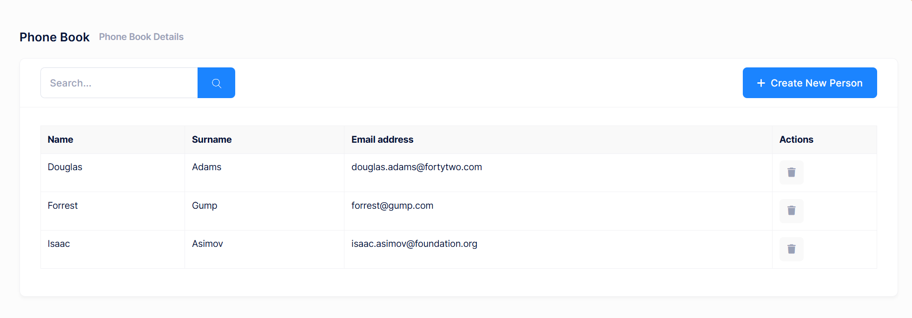

# Deleting a Person

Let's add a delete button in people list as shown below:



We're starting from UI in this case.

## View

We're changing **phonebook.component.html** view to add a delete button
(related part is shown here):

```html
//...
<thead class="bg-light">
    <tr>
        <th>{{ 'Name' | localize }}</th>
        <th>{{ 'Surname' | localize }}</th>
        <th>{{ 'EmailAddress' | localize }}</th>
        <th style="width: 150px">{{ 'Actions' | localize }}</th>
    </tr>
</thead>
<tbody>
  @for (person of people(); track person.id) {
    <tr>
        <td>{{ person.name }}</td>
        <td>{{ person.surname }}</td>
        <td>{{ person.emailAddress }}</td>
        <td>
            <button
                (click)="deletePerson(person)"
                title="{{ 'Delete' | localize }}"
                class="btn btn-sm btn-icon btn-bg-light btn-active-color-danger">
                <i class="fa fa-trash"></i>
            </button>
        </td>
    </tr>
  }
</tbody>
//...

```

We simply added a button which calls **deletePerson** method (will be
defined) when it's clicked. You can define a permission for 'deleting
person' as we did for 'creating person' above.

## Style

We're using **[LESS](http://lesscss.org/)** files for styling the components. We created a file named **phonebook.component.less** (in
phonebook folder) with an empty content.

```css
/* styles */
```

And adding the style to the **phonebook.component.ts** Component
declaration:

```typescript
@Component({
    templateUrl: './phonebook.component.html',
    styleUrls: ['./phonebook.component.less'],
    animations: [appModuleAnimation()]
})
```

Now, we can now see the buttons, but they don't work since we haven't
defined the deletePerson method yet.

## Application Service

Let's leave the client side and add a DeletePerson method to the server
side. We are adding it to the service interface,**IPersonAppService:**:

```csharp
Task DeletePerson(EntityDto input);
```

**EntityDto** is a shortcut of ABP if we only get an id value.
Implementation (in **PersonAppService**) is very simple:

```csharp
[AbpAuthorize(AppPermissions.Pages_Tenant_PhoneBook_DeletePerson)]
public async Task DeletePerson(EntityDto input)
{
    await _personRepository.DeleteAsync(input.Id);
}
```

### Define the Delete Permission


In this example, we are creating a child permission under an existing phoneBook permission. This allows for more granular control, such as managing delete operations separately.

A permission should have a unique name. We define permission names as constant strings in **AppPermissions** class. It's a simple constant string:

```csharp
public const string Pages_Tenant_PhoneBook_DeletePerson = "Pages.Tenant.PhoneBook.DeletePerson";
```

To define delete permission, use the `AppAuthorizationProvider` class as shown below:

```csharp
phoneBook.CreateChildPermission(AppPermissions.Pages_Tenant_PhoneBook_DeletePerson, L("DeletePerson"), multiTenancySides: MultiTenancySides.Tenant);
```

## Service Proxy Generation

Since we changed server side services, we should re-generate the client
side service proxies via NSwag. Make server side running and use
refresh.bat as we did before.

## Component Script

Now, we can add **deletePerson** method to **phonebook.component.ts**:

```typescript
deletePerson(person: PersonListDto): void {
    this.message.confirm(this.l('PersonDeleteWarningMessage', person.name), this.l('AreYouSure'), (isConfirmed) => {
        if (isConfirmed) {
            this._personService.deletePerson(person.id).subscribe(() => {
                this.notify.info(this.l('SuccessfullyDeleted'));
                this.people.update(people => people.filter(p => p.id !== person.id));
            });
        }
    });
}
```

Open PhoneBookDemo.xml (the **default**, **English** localization dictionary) and add the following line:

```xml
<text name="PersonDeleteWarningMessage">Are you sure you want to delete this person? This action cannot be undone.</text>
```

It first shows a confirmation message when we click the delete button:


If we click Yes, it simply calls **deletePerson** method of
**PersonAppService** and shows a
**[notification](https://aspnetboilerplate.com/Pages/Documents/Javascript-API/Notification)**
if operation succeed. Also, removes the person from the person array
using [lodash-es](https://lodash.com/) library. We also added an import
statement before the @Component declaration:

```typescript
import { remove as _remove } from 'lodash-es';
```

## Next

* [Filtering People](Developing-Step-By-Step-Angular-Filtering-People)