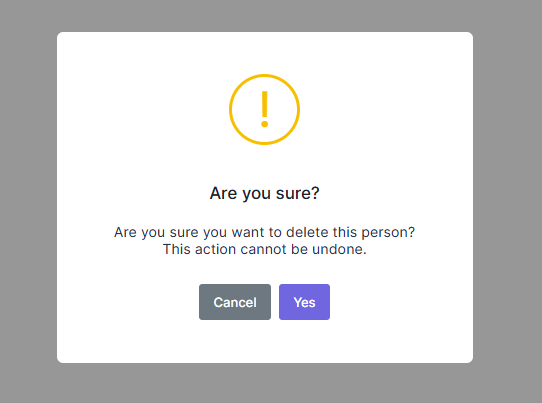

# Deleting a Person

Let's add a delete button in people list as shown below:


We're starting from UI in this case.

## View

We're changing **phonebook.component.html** view to add a delete button

```html
 <p-table>
	<ng-template pTemplate="header">
		<tr>
			<!--Add Actions-->
			<th
				style="width: 130px"
				[hidden]="
					!(
						[
							'Pages.Tenant.PhoneBook.DeletePerson',
						] | permissionAny
					)
				"
			>
				{{ 'Actions' | localize }}
			</th>
			<!--...-->
	</ng-template>
	<ng-template pTemplate="body" let-record="$implicit">
		<tr>
			<!--Add Actions-->
			<td
				style="width: 130px"
				[hidden]="
					!(
						[
						   'Pages.Tenant.PhoneBook.DeletePerson',
						] | permissionAny
					)
				"
			>
				<div class="btn-group" dropdown placement="bottom left" container="body">
					<button
						id="dropdownButton"
						type="button"
						class="btn btn-primary btn-sm dropdown-toggle"
						dropdownToggle
						aria-controls="dropdownMenu"
					>
						<i class="fa fa-cog"></i>
						<span class="caret"></span>
						{{ 'Actions' | localize }}
					</button>
					<ul
						id="dropdownMenu"
						class="dropdown-menu"
						role="menu"
						*dropdownMenu
						aria-labelledby="dropdownButton"
					>
						<li
							*ngIf="'Pages.Tenant.PhoneBook.DeletePerson' | permission"
							role="menuitem"
						>
							<a
								href="javascript:;"
								class="dropdown-item"
								(click)="deletePerson(record)"
							>
								{{ 'Delete' | localize }}
							</a>
						</li>
					</ul>
				</div>
			</td>
			<!--...-->
		</tr>
	</ng-template>
</p-table>
```

We simply added a dropdown button which has delete button(We will add more buttons later). Delete button calls **deletePerson** method (will be
defined) when it's clicked. You can define a permission for 'deleting
person' as we did for 'creating person' above.

## Application Service

Let's leave the client side and add a DeletePerson method to the server
side. We are adding it to the service interface,**IPersonAppService:**:

```csharp
Task DeletePerson(EntityDto input);
```

**EntityDto** is a shortcut of ABP if we only get an id value.
Implementation (in **PersonAppService**) is very simple:

```csharp
[AbpAuthorize(AppPermissions.Pages_Tenant_PhoneBook_DeletePerson)]
public async Task DeletePerson(EntityDto input)
{
    await _personRepository.DeleteAsync(input.Id);
}
```

Similar to what we did before, go to **AppPermissions** class and define the Delete permission name as shown below;

```csharp
public const string Pages_Tenant_PhoneBook_DeletePerson = "Pages.Tenant.PhoneBook.DeletePerson";
```

And then, go to **AppAuthorizationProvider** and define the delete permissions as shown below;

```csharp
phoneBook.CreateChildPermission(AppPermissions.Pages_Tenant_PhoneBook_DeletePerson, L("DeletePerson"), multiTenancySides: MultiTenancySides.Tenant);
```

## Service Proxy Generation

Since we changed server side services, we should re-generate the client
side service proxies via NSwag. Make server side running and use
refresh.bat as we did before.

## Component Script

Now, we can add **deletePerson** method to **phonebook.component.ts**:

```typescript
deletePerson(person: PersonListDto): void {
    this.message.confirm(
        this.l('AreYouSureToDeleteThePerson', person.name),
        isConfirmed => {
            if (isConfirmed) {
                this._personService.deletePerson(person.id).subscribe(() => {
                    this.notify.info(this.l('SuccessfullyDeleted'));
                    this.getPeople();
                });
            }
        }
    );
} 
```

It first shows a confirmation message when we click the delete button:



If we click Yes, it simply calls **deletePerson** method of
**PersonAppService** and shows a
**[notification](https://aspnetboilerplate.com/Pages/Documents/Javascript-API/Notification)**
if operation succeed. Then call **getPeople** function to get the updated list of people.


## Next

* [Filtering People](Developing-Step-By-Step-Angular-Filtering-People)