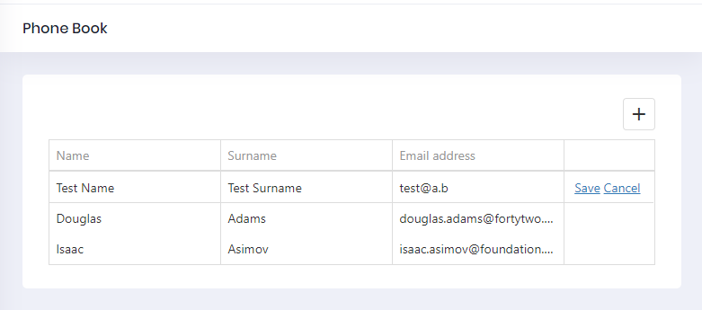

# Adding Create New Person To Index

First of all, we should use **nswag/refresh.bat** to re-generate service-proxies. This will generate the code that is needed to call PersonAppService.**CreatePerson** method from client side. Notice that you should rebuild & run the server side application before re-generating the proxy scripts.

Go to **phonebook.component.ts** and add insert option to `CustomStore`

```typescript
import {Component, Injector} from '@angular/core';
import {AppComponentBase} from '@shared/common/app-component-base';
import {appModuleAnimation} from '@shared/animations/routerTransition';
import {PersonServiceProxy} from "@shared/service-proxies/service-proxies";
import CustomStore from "@node_modules/devextreme/data/custom_store";

@Component({
    templateUrl: './phonebook.component.html',
    animations: [appModuleAnimation()]
})

export class PhoneBookComponent extends AppComponentBase {
    dataSource: any;
    refreshMode: string;

    constructor(
        injector: Injector,
        private _personService: PersonServiceProxy
    ) {
        super(injector);
        this.init();
    }

    init() {
        this.refreshMode = "full";

        this.dataSource = new CustomStore({
            key: "id",
            load: (loadOptions) => {
                return this._personService.getPeople("").toPromise();
            },
            insert: (values) => {
                return this._personService.createPerson(values).toPromise()
            }
        });
    }
}
```

Go to **phonebook.component.html** and add `dxo-editing` tag with `allowAdding` true option:

```html
<div [@routerTransition]>
    <div class="content d-flex flex-column flex-column-fluid">
        <sub-header [title]="'PhoneBook' | localize">
        </sub-header>

        <div [class]="containerClass">
            <div class="card card-custom">
                <div class="card-body">
                    <dx-data-grid
                        id="phonebookgrid"
                        [dataSource]="dataSource"
                        [repaintChangesOnly]="true"
                        [showBorders]="true">

                        <dxo-scrolling mode="virtual"></dxo-scrolling>
                        <dxo-editing
                            mode="row"
                            [refreshMode]="refreshMode"
                            [allowAdding]="true">
                        </dxo-editing>

                        <dxi-column dataField="name" caption="{{'Name' | localize}}"></dxi-column>
                        <dxi-column dataField="surname" caption="{{'Surname' | localize}}"></dxi-column>
                        <dxi-column dataField="emailAddress" caption="{{'EmailAddress' | localize}}"></dxi-column>
                    </dx-data-grid>
                </div>
            </div>
        </div>
    </div>
</div>

```

The result:




## Next

- [Deleting a Person](Developing-Step-By-Step-Angular-DevExtreme-Deleting-Person.md)

