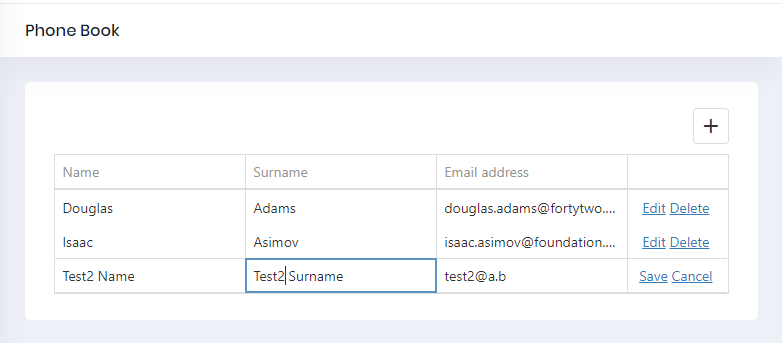

# Editing a Person


## Application Service

Let's add a DeletePerson method to the server
side. We are adding it to the service interface, **IPersonAppService:**:

```csharp
Task EditPerson(EditPersonInput input);
```

And add the necessary DTO to transfer person's id, name, surname, and email.

```csharp
public class EditPersonInput: EntityDto
{
    public string Name {get;set;}
    public string Surname {get;set;}
    public string EmailAddress {get;set;}
}
```

**EntityDto** is a shortcut of ABP if we only get an id value. Implementation (in **PersonAppService**) is very simple:

```csharp
public async Task EditPerson(EditPersonInput input)
{
    var person = await _personRepository.GetAsync(input.Id);
    if (input.Name != null)
    {
        person.Name = input.Name;
    }

    if (input.Surname != null)
    {
        person.Surname = input.Surname;
    }

    if (input.EmailAddress != null)
    {
        person.EmailAddress = input.EmailAddress;
    }

    await _personRepository.UpdateAsync(person);
}
```

## Service Proxy Generation

Since we changed server side services, we should re-generate the client-side service proxies via NSwag. Make server side running and userefresh.bat as we did before.

## Component Script

Go to **phonebook.component.ts** and add update option to `CustomStore`:

```typescript
import {Component, Injector} from '@angular/core';
import {AppComponentBase} from '@shared/common/app-component-base';
import {appModuleAnimation} from '@shared/animations/routerTransition';
import {EditPersonInput, PersonServiceProxy} from "@shared/service-proxies/service-proxies";
import CustomStore from "@node_modules/devextreme/data/custom_store";

@Component({
    templateUrl: './phonebook.component.html',
    animations: [appModuleAnimation()]
})

export class PhoneBookComponent extends AppComponentBase {

    dataSource: any;
    refreshMode: string;

    constructor(
        injector: Injector,
        private _personService: PersonServiceProxy
    ) {
        super(injector);
        this.getData();
    }

    getData() {
        this.refreshMode = "full";

        this.dataSource = new CustomStore({
            key: "id",
            load: (loadOptions) => {
                return this._personService.getPeople("").toPromise();
            },
            insert: (values) => {
                return this._personService.createPerson(values).toPromise()
            },
            update: (key, values) => {
                return this._personService.editPerson(new EditPersonInput({
                    id: key,
                    name: values.name,
                    emailAddress: values.emailAddress,
                    surname: values.surname
                })).toPromise();
            },
            remove: (key) => {
                return this._personService.deletePerson(key).toPromise();
            }
        });
    }
}

```

Go to **phonebook.component.html** and add `dxo-editing` tag with `allowUpdating` true option:

```html
<div [@routerTransition]>
    <div class="content d-flex flex-column flex-column-fluid">
        <sub-header [title]="'PhoneBook' | localize">
        </sub-header>

        <div [class]="containerClass">
            <div class="card card-custom">
                <div class="card-body">
                    <dx-data-grid
                        id="phonebookgrid"
                        [dataSource]="dataSource"
                        [repaintChangesOnly]="true"
                        [showBorders]="true">

                        <dxo-scrolling mode="virtual"></dxo-scrolling>
                        <dxo-editing
                            mode="row"
                            [refreshMode]="refreshMode"
                            [allowAdding]="true"
                            [allowUpdating]="true"
                            [allowDeleting]="true">
                        </dxo-editing>

                        <dxi-column dataField="name" caption="{{'Name' | localize}}"></dxi-column>
                        <dxi-column dataField="surname" caption="{{'Surname' | localize}}"></dxi-column>
                        <dxi-column dataField="emailAddress" caption="{{'EmailAddress' | localize}}"></dxi-column>
                    </dx-data-grid>
                </div>
            </div>
        </div>
    </div>
</div>

```

It first shows a confirmation message when we click the delete button:





## Next

* [Multi-Tenancy](Developing-Step-By-Step-Angular-DevExtreme-Multi-Tenancy.md)
