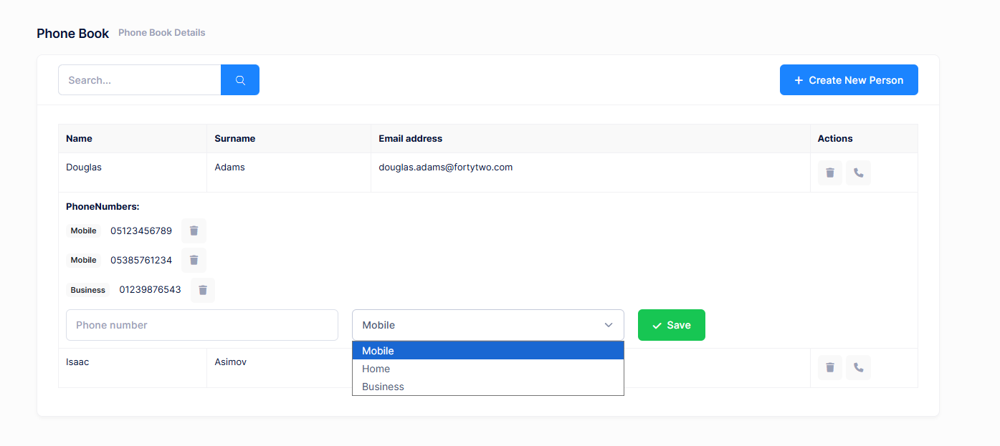

# Edit Mode For Phone Numbers

Final UI is shown below:



When we click the **edit icon** for a person, its row is expanded and
all phone numbers are shown. Then we can delete any phone by clicking
the icon at left. We can add a new phone from the inputs at last line.

## View

Changes in view are shown below:

```html
<div [@routerTransition]>
    <sub-header [title]="'PhoneBook' | localize" [description]="'PhoneBooksHeaderInfo' | localize"></sub-header>
    <div [class]="containerClass">
        <div class="card card-custom">
            <div class="card-header">
                <div class="card-title">
                    <form (ngSubmit)="applyFilter()">
                        <div class="input-group">
                            <input
                                [ngModel]="filter()"
                                (ngModelChange)="filter.set($event)"
                                name="filter"
                                class="form-control"
                                [placeholder]="'SearchWithThreeDot' | localize"
                                type="text" />
                            <button type="submit" class="btn btn-primary">
                                <i class="flaticon-search-1"></i>
                            </button>
                        </div>
                    </form>
                </div>
                <div class="card-toolbar">
                    @if ('Pages.Tenant.PhoneBook.CreatePerson' | permission) {
                        <button class="btn btn-primary" (click)="createPerson()">
                            <i class="fa fa-plus"></i>
                            {{ 'CreateNewPerson' | localize }}
                        </button>
                    }
                </div>
            </div>
            <div class="card-body">
                <div class="table-responsive">
                    <table class="table table-responsive table-bordered">
                        <thead class="bg-light">
                            <tr>
                                <th>{{ 'Name' | localize }}</th>
                                <th>{{ 'Surname' | localize }}</th>
                                <th>{{ 'EmailAddress' | localize }}</th>
                                <th style="width: 150px">{{ 'Actions' | localize }}</th>
                            </tr>
                        </thead>
                        <tbody>
                            @for (person of people(); track person.id) {
                                <tr>
                                    <td>{{ person.name }}</td>
                                    <td>{{ person.surname }}</td>
                                    <td>{{ person.emailAddress }}</td>
                                    <td>
                                        <button
                                            (click)="deletePerson(person)"
                                            title="{{ 'Delete' | localize }}"
                                            class="btn btn-sm btn-icon btn-bg-light btn-active-color-danger">
                                            <i class="fa fa-trash"></i>
                                        </button>

                                        <button
                                            (click)="toggleExpand(person.id)"
                                            title="{{ 'AddPhone' | localize }}"
                                            class="btn btn-sm btn-icon btn-bg-light btn-active-color-primary">
                                            <i class="fa fa-phone"></i>
                                        </button>
                                    </td>
                                </tr>

                                @if (expandedPersonId() === person.id) {
                                    <tr>
                                        <td colspan="4">
                                            <div class="mb-3">
                                                <strong>{{ 'PhoneNumbers' | localize }}:</strong>
                                                <ul class="list-unstyled mt-2 mb-3">
                                                    @if (person.phones?.length > 0) {
                                                        @for (phone of person.phones; track phone.number) {
                                                            <li class="d-flex align-items-center gap-4 mt-2">
                                                                <span class="badge bg-light text-dark">
                                                                    {{ l(PhoneType[phone.type]) }}
                                                                </span>
                                                                <span>{{ phone.number }}</span>
                                                                <button
                                                                    class="btn btn-sm btn-icon btn-bg-light btn-active-color-danger"
                                                                    title="{{ 'Delete' | localize }}"
                                                                    (click)="deletePhone(phone.id, person.id)">
                                                                    <i class="fa fa-trash"></i>
                                                                </button>
                                                            </li>
                                                        }
                                                    } @else {
                                                        <li>{{ 'NoPhoneNumbersFound' | localize }}</li>
                                                    }
                                                </ul>
                                            </div>

                                            <div class="row">
                                                <div class="col-md-4">
                                                    <input
                                                        [ngModel]="newPhoneNumber()"
                                                        (ngModelChange)="newPhoneNumber.set($event)"
                                                        placeholder="{{ 'PhoneNumber' | localize }}"
                                                        class="form-control" />
                                                </div>
                                                <div class="col-md-4">
                                                    <select [ngModel]="newPhoneType()" (ngModelChange)="newPhoneType.set(+$event)" class="form-select">
                                                        @for (type of phoneTypes; track type.value) {
                                                            <option [value]="type.value">{{ type.label }}</option>
                                                        }
                                                    </select>
                                                </div>
                                                <div class="col-md-4">
                                                    <button class="btn btn-success" (click)="addPhone(person.id)">
                                                        <i class="fa fa-check"></i>
                                                        {{ 'Save' | localize }}
                                                    </button>
                                                </div>
                                            </div>
                                        </td>
                                    </tr>
                                }
                            }
                        </tbody>
                    </table>
                </div>
            </div>
        </div>
    </div>
</div>

<createPersonModal #createPersonModal (modalSave)="getPeople()"></createPersonModal>
```

We added an edit button for each person. Then added a table for each
person that shows phones of the related person and allows adding a new
phone. Phones table is only shown if we click the edit button.

## PhoneBook Component Class

Before changing PhoneBookComponent, we should re-generate
service-proxies using nswag as did above. And finally we can change
PhoneBookComponent as shown below:

```typescript
import { Component, inject, OnInit, signal, viewChild } from '@angular/core';
import { AppComponentBase } from '@shared/common/app-component-base';
import { appModuleAnimation } from '@shared/animations/routerTransition';
import { LocalizePipe } from '@shared/common/pipes/localize.pipe';
import { SubHeaderComponent } from '@app/shared/common/sub-header/sub-header.component';
import { AddPhoneInput, PersonListDto, PersonServiceProxy, PhoneType } from '@shared/service-proxies/service-proxies';
import { FormsModule } from '@angular/forms';
import { CreatePersonModalComponent } from './create-person-modal.component';
import { PermissionPipe } from '@shared/common/pipes/permission.pipe';
import { EditPersonModalComponent } from './edit-person-modal.component';
import { CommonModule } from '@angular/common';

@Component({
    selector: 'app-phone-book',
    templateUrl: './phonebook.component.html',
    animations: [appModuleAnimation()],
    standalone: true,
    imports: [
        CommonModule,
        FormsModule,
        SubHeaderComponent,
        LocalizePipe,
        PermissionPipe,
        CreatePersonModalComponent,
        EditPersonModalComponent,
    ],
})
export class PhoneBookComponent extends AppComponentBase implements OnInit {
    private readonly _personService = inject(PersonServiceProxy);

    createPersonModal = viewChild.required<CreatePersonModalComponent>('createPersonModal');
    editPersonModal = viewChild.required<EditPersonModalComponent>('editPersonModal');

    public PhoneType = PhoneType;

    people = signal<PersonListDto[]>([]);
    filter = signal('');
    expandedPersonId = signal<number | null>(null);

    newPhoneNumber = signal('');
    newPhoneType = signal(0);

    phoneTypes: { value: number; label: string }[] = [];

    constructor() {
        super();
        this.phoneTypes = this.getPhoneTypeOptions();
    }

    ngOnInit(): void {
        this.getPeople();
    }

    getPeople(): void {
        this.primengTableHelper.showLoadingIndicator();
        this._personService.getPeople(this.filter()).subscribe((result) => {
            this.people.set(result.items);
            this.primengTableHelper.hideLoadingIndicator();
        });
    }

    applyFilter(): void {
        this.getPeople();
    }

    createPerson(): void {
        this.createPersonModal().show();
    }

    deletePerson(person: PersonListDto): void {
        this.message.confirm(this.l('PersonDeleteWarningMessage', person.name), this.l('AreYouSure'), (isConfirmed) => {
            if (isConfirmed) {
                this._personService.deletePerson(person.id).subscribe(() => {
                    this.notify.info(this.l('SuccessfullyDeleted'));
                    this.people.update(people => people.filter(p => p.id !== person.id));
                });
            }
        });
    }

    toggleExpand(personId: number): void {
        this.expandedPersonId.update(currentId => (currentId === personId ? null : personId));
        this.newPhoneNumber.set('');
        this.newPhoneType.set(0);
    }

    addPhone(personId: number): void {
        if (!this.newPhoneNumber()) {
            this.notify.warn(this.l('PhoneNumberRequired'));
            return;
        }

        const addPhoneInput = new AddPhoneInput();
        addPhoneInput.personId = personId;
        addPhoneInput.number = this.newPhoneNumber();
        addPhoneInput.type = this.newPhoneType();

        this._personService.addPhone(addPhoneInput).subscribe(() => {
            this.notify.success(this.l('PhoneSuccessfullyAdded'));
            this.expandedPersonId.set(null);
            this.getPeople();
        });
    }

    getPhoneTypeOptions(): { value: number; label: string }[] {
        return Object.keys(PhoneType)
            .filter((k) => !isNaN(Number(PhoneType[k as any])))
            .map((k) => ({
                value: Number(PhoneType[k as any]),
                label: this.l(k),
            }));
    }

    deletePhone(phoneId: number, personId: number): void {
        this.message.confirm(this.l('PhoneDeleteWarningMessage'), this.l('AreYouSure'), (isConfirmed) => {
            if (isConfirmed) {
                this._personService.deletePhone(phoneId).subscribe(() => {
                    this.notify.success(this.l('SuccessfullyDeleted'));
                    this.people.update(currentPeople =>
                        currentPeople.map(p => {
                            if (p.id === personId) {
                                p.phones = p.phones.filter(phone => phone.id !== phoneId);
                            }
                            return p;
                        })
                    );
                });
            }
        });
    }
}
```

Open PhoneBookDemo.xml (the **default**, **English** localization dictionary) and add the following line:

```xml
<text name="AddPhone">Add Phone</text>
<text name="PhoneNumbers">Phone Numbers</text>
<text name="PhoneNumber">Phone Number</text>
<text name="NoPhoneNumbersFound">This person has no phone numbers.</text>
<text name="PhoneDeleteWarningMessage">Are you sure you want to delete this phone number?</text>
<text name="PhoneSuccessfullyDeleted">Phone number successfully deleted</text>
```

## Next

- [Edit Mode For People](Developing-Step-By-Step-Angular-Edit-Mode-People)
