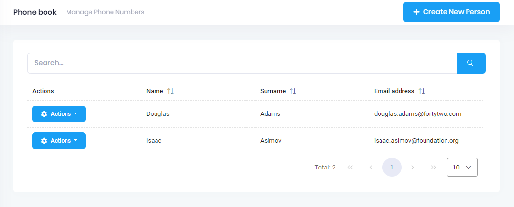

# Filtering people

Now, we will implement **search** functionality of **GetPeople** method.
UI is shown below:



We added a search input to **phonebook.component.html** view (showing
the related part of the code):

```html
<div class="card-body">
    <div class="col-xl-12">
        <div class="mb-5 align-items-center">
            <div class="input-group">
                <input type="text" [(ngModel)]="filter"  name="Filter" class="form-control" [placeholder]="l('SearchWithThreeDot')">
                <button class="btn btn-primary" type="button" (click)="getPeople()">
                    <i class="flaticon-search-1" aria-label="Search"></i>
                </button>
            </div>
        </div>
    </div>
                
    <div class="row align-items-center">
            <!--<Primeng-TurboTable-Start>-->
            <div class="primeng-datatable-container" [busyIf]="primengTableHelper.isLoading">
                            <!--...-->

```

We also added currently filtered people count (people.length) in the
header. Since we have already defined and used the filter property in
**phonebook.component.ts** and implemented in the server side, this new
code immediately works.

## Next

- [Adding Phone Numbers](Developing-Step-By-Step-Angular-Adding-Phone-Numbers)