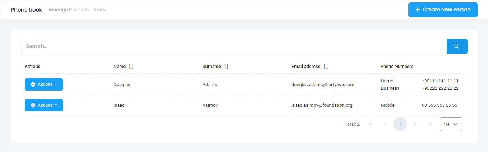

# Edit Mode For Phone Numbers

Final UI is shown below:




## View

Add phone numbers to the table.

```html
 <p-table...>
	<ng-template pTemplate="header">
		<tr>
			<th>
				{{ 'PhoneNumbers' | localize }}
			</th>
		</tr>
	</ng-template>
	<ng-template pTemplate="body" let-record="$implicit">
		<tr>
			<td>
				<span class="p-column-title">{{ 'PhoneNumbers' | localize }}</span>
				<table>
					<tbody>
                        <tr *ngFor="let phone of record.phones">
                            <td>{{getPhoneTypeString(phone.type)}}</td>
                            <td>{{phone.number}}</td>
                        </tr>
					</tbody>
				</table>
			</td>
		</tr>
	</ng-template>
</p-table>
```

## PhoneBook Component Class

Add **getPhoneTypeString** method.

```typescript
getPhoneTypeString(phoneType: PhoneType): string {
    switch (phoneType) {
        case 1:
            return this.l('Home');
        case 2:
            return this.l('Business');
        default:
            return this.l('Mobile');
    }
}
```

## Next

- [Edit Mode For Phone Numbers](Developing-Step-By-Step-Angular-Edit-Mode-Phone-Numbers)
