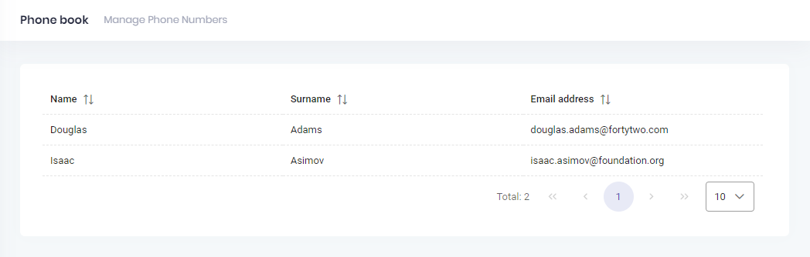

# Using GetPeople Method From Angular Component

Now, we can switch to the client side and use GetPeople method to show a
list of people on the UI.

## Service Proxy Generation

First, run (prefer Ctrl+F5 to be faster) the server side application
(.Web.Host project). Then run **nswag/refresh.bat** file on the client
side to re-generate service proxy classes (they are used to call server
side service methods).

Since we added a new service, we should add it to
**src/shared/service-proxies/service-proxy.module.ts**. Just open it and
add **ApiServiceProxies.PersonServiceProxy** to the providers array.
This step is only required when we add a new service. If we change an
existing service, it's not needed.

## Angular-Cli Watcher

Sometimes angular-cli can not understand the file changes. In that case,
stop it and re-run **npm start** command.

## PhoneBookComponent Typescript Class

We will use [prime-ng](https://www.primefaces.org/primeng/) turbotable to show data in ui. First of all go to the **phonebook.component.ts** and change it as like below:

```typescript
import {Component, Injector, ViewChild} from '@angular/core';
import {AppComponentBase} from '@shared/common/app-component-base';
import {appModuleAnimation} from '@shared/animations/routerTransition';
import {PersonServiceProxy} from "@shared/service-proxies/service-proxies";
import {LazyLoadEvent} from "@node_modules/primeng/api";
import {finalize} from "@node_modules/rxjs/operators";
import {Table} from "@node_modules/primeng/table";
import {Paginator} from "@node_modules/primeng/paginator";

@Component({
    templateUrl: './phonebook.component.html',
    animations: [appModuleAnimation()]
})
export class PhoneBookComponent extends AppComponentBase{
    @ViewChild('dataTable', {static: true}) dataTable: Table;
    @ViewChild('paginator', {static: true}) paginator: Paginator;

    filter: string = '';

    constructor(
        injector: Injector,
        private _personService: PersonServiceProxy
    ) {
        super(injector);
    }

    getPeople(event?: LazyLoadEvent) {
        if (this.primengTableHelper.shouldResetPaging(event)) {
            this.paginator.changePage(0);

            if (this.primengTableHelper.records && this.primengTableHelper.records.length > 0) {
                return;
            }
        }

        this.primengTableHelper.showLoadingIndicator();

        this._personService.getPeople(this.filter)
            .pipe(finalize(() => this.primengTableHelper.hideLoadingIndicator()))
            .subscribe((result) => {
                this.primengTableHelper.totalRecordsCount = result?.items?.length;
                this.primengTableHelper.records = result.items;
                this.primengTableHelper.hideLoadingIndicator();
            });
    }
}

```

We inject **PersonServiceProxy**, call its **getPeople** method and
**subscribe** to get the result. Primeng's turbotable will call it and load data.

## Rendering People In Angular View

Now, define table for view,
**phonebook.component.html**:

```html
<div [@routerTransition]>
    <div class="content d-flex flex-column flex-column-fluid">
        <sub-header [title]="'PhoneBook' | localize" [description]="'PhoneBookInfo' | localize">
        </sub-header>
        <div [class]="containerClass">
            <div class="card card-custom gutter-b">
                <div class="card-body">
                    <div class="row align-items-center">
                        <!--<Primeng-TurboTable-Start>-->
                        <div class="primeng-datatable-container" [busyIf]="primengTableHelper.isLoading">
                            <p-table
                                #dataTable
                                sortMode="multiple"
                                (onLazyLoad)="getPeople($event)"
                                [value]="primengTableHelper.records"
                                rows="{{ primengTableHelper.defaultRecordsCountPerPage }}"
                                [paginator]="false"
                                [lazy]="true"
                                [scrollable]="true"
                                ScrollWidth="100%"
                                scrollDirection="horizontal"
                                [responsive]="primengTableHelper.isResponsive"
                                [resizableColumns]="primengTableHelper.resizableColumns"
                            >
                                <ng-template pTemplate="header">
                                    <tr>
                                        <th pSortableColumn="name">
                                            {{ 'Name' | localize }}
                                            <p-sortIcon field="name"></p-sortIcon>
                                        </th>
                                        <th pSortableColumn="surname">
                                            {{ 'Surname' | localize }}
                                            <p-sortIcon field="surname"></p-sortIcon>
                                        </th>
                                        <th pSortableColumn="emailAddress">
                                            {{ 'EmailAddress' | localize }}
                                            <p-sortIcon field="emailAddress"></p-sortIcon>
                                        </th>
                                    </tr>
                                </ng-template>
                                <ng-template pTemplate="body" let-record="$implicit">
                                    <tr>
                                        <td style="width: 150px">
                                            <span class="p-column-title">{{ 'FirstName' | localize }}</span>
                                            {{ record.name }}
                                        </td>
                                        <td style="width: 150px">
                                            <span class="p-column-title">{{ 'Surname' | localize }}</span>
                                            {{ record.surname }}
                                        </td>
                                        <td style="width: 250px">
                                            <span class="p-column-title">{{ 'EmailAddress' | localize }}</span>
                                            {{ record.emailAddress }}
                                        </td>
                                    </tr>
                                </ng-template>
                            </p-table>
                            <div class="primeng-no-data" *ngIf="primengTableHelper.totalRecordsCount == 0">
                                {{ 'NoData' | localize }}
                            </div>
                            <div class="primeng-paging-container">
                                <p-paginator
                                    [rows]="primengTableHelper.defaultRecordsCountPerPage"
                                    #paginator
                                    (onPageChange)="getPeople($event)"
                                    [totalRecords]="primengTableHelper.totalRecordsCount"
                                    [rowsPerPageOptions]="primengTableHelper.predefinedRecordsCountPerPage"
                                    [showCurrentPageReport]="true"
                                    [currentPageReportTemplate]="
                                        'TotalRecordsCount' | localize: primengTableHelper.totalRecordsCount
                                    "
                                ></p-paginator>
                            </div>
                        </div>
                        <!--<Primeng-TurboTable-End>-->
                    </div>
                </div>
            </div>
        </div>
    </div>
</div>

```
See the result:



We successfully retrieved list of people from database to the page.

## Next

- [Creating a New Person](Developing-Step-By-Step-Angular-Creating-New-Person)