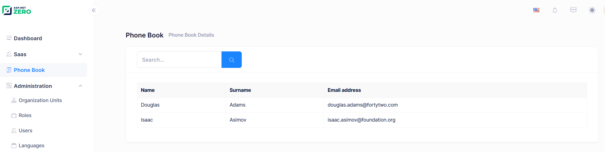

# Using GetPeople Method From Angular Component

Now, we can switch to the client side and use GetPeople method to show a
list of people on the UI.

## Service Proxy Generation

First, run (prefer Ctrl+F5 to be faster) the server side application
(.Web.Host project). Then run **nswag/refresh.bat** file on the client
side to re-generate service proxy classes (they are used to call server
side service methods).

Since we added a new service, we should add it to
**src/shared/service-proxies/service-proxy.module.ts**. Just open it and
add **ApiServiceProxies.PersonServiceProxy** to the providers array.
This step is only required when we add a new service. If we change an
existing service, it's not needed.

## Angular-Cli Watcher

Sometimes angular-cli can not understand the file changes. In that case,
stop it and re-run **npm start** command.

## PhoneBookComponent Typescript Class

Change **phonebook.component.ts** as like below:

```typescript
import { LocalizePipe } from '@shared/common/pipes/localize.pipe';
import { SubHeaderComponent } from '@app/shared/common/sub-header/sub-header.component';
import { PersonListDto, PersonServiceProxy } from '@shared/service-proxies/service-proxies';
import { FormsModule } from '@angular/forms';
import { appModuleAnimation } from '@shared/animations/routerTransition';
import { Component, inject, OnInit } from '@angular/core';
import { AppComponentBase } from '@shared/common/app-component-base';

@Component({
    selector: 'app-phone-book',
    templateUrl: './phonebook.component.html',
    animations: [appModuleAnimation()],
    imports: [SubHeaderComponent, LocalizePipe, FormsModule],
})
export class PhoneBookComponent extends AppComponentBase implements OnInit {
    private _personService = inject(PersonServiceProxy);

    people = signal<PersonListDto[]>([]);
    filter = signal('');

    constructor() {
        super();
    }

    ngOnInit(): void {
        this.getPeople();
    }

    getPeople(): void {
        this.primengTableHelper.showLoadingIndicator();
        this._personService.getPeople(this.filter()).subscribe((result) => {
            this.people.set(result.items);
            this.primengTableHelper.hideLoadingIndicator();
        });
    }

    applyFilter(): void {
        this.getPeople();
    }
}
```

We inject **PersonServiceProxy**, call its **getPeople** method and
**subscribe** to get the result. We do this in **ngOnInit** function
(defined in Angular's **OnInit** interface). Assigned returned items to
the **people** class member.

## Rendering People In Angular View

Now, we can use this people member from the view,
**phonebook.component.html**:

```html
<div [@routerTransition]>
    <sub-header [title]="'PhoneBook' | localize" [description]="'PhoneBooksHeaderInfo' | localize"></sub-header>
    <div [class]="containerClass">
        <div class="card card-custom">
            <div class="card-body">
                <div class="table-responsive">
                    <table class="table table-responsive table-bordered">
                        <thead class="bg-light">
                            <tr>
                                <th>{{ 'Name' | localize }}</th>
                                <th>{{ 'Surname' | localize }}</th>
                                <th>{{ 'EmailAddress' | localize }}</th>
                            </tr>
                        </thead>
                        <tbody>
                            @for (person of people(); track person.id) {
                                <tr>
                                    <td>{{ person.name }}</td>
                                    <td>{{ person.surname }}</td>
                                    <td>{{ person.emailAddress }}</td>
                                </tr>
                            }
                        </tbody>
                    </table>
                </div>
            </div>
        </div>
    </div>
</div>
```

We simply used **ngFor** directive to loop and render people data. See
the result:



We successfully retrieved list of people from database to the page.

## About Showing Tabular Data

We normally use a javascript based rich table/grid library to show
tabular data, instead of manually rendering data like that. For example,
we used [TurboTable](https://www.primefaces.org/primeng/#/table) library to show users on the Users
page of ASP.NET Zero. Always use such components since they make things
much more easier and provides a much better user experience.

We did not use a table component here, because we want to show basics of
Angular instead of going details of a 3rd party library.

## Next

- [Creating a New Person](Developing-Step-By-Step-Angular-Creating-New-Person)