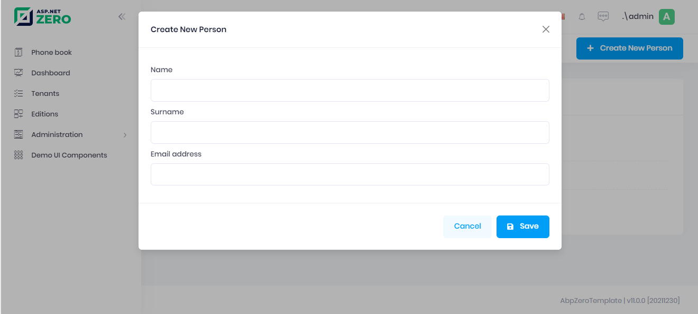

# Opening the Person Modal

We need to put a "Create new person" button to the 'people list page'
and write some javascript code to open the modal when clicked to the
button.

So, changing the **Index.cshtml** view header as shown below:

```html

@{
    ViewBag.CurrentPageName = AppPageNames.Tenant.PhoneBook;
}
@section Scripts
{
    <script src="~/view-resources/Areas/App/Views/PhoneBook/Index.js" asp-append-version="true"></script>
}

<div class="content d-flex flex-column flex-column-fluid" id="kt_content">
    <abp-page-subheader title="@L("PhoneBook")" description="@L("PhoneBookInfo")">
        <button id="CreateNewPersonButton" class="btn btn-primary">
            <i class="fa fa-plus"></i> @L("CreateNewPerson")
        </button>        
    </abp-page-subheader>
    <div class="@(await GetContainerClass())">
        <div class="card">
            <div class="card-body">
                <table class="table align-middle table-row-dashed fs-6 gy-5 dataTable no-footer" id="PhoneBookTable">
                    <thead>
                    <tr>
                        <th></th>
                        <th>@L("Name")</th>
                        <th>@L("Surname")</th>
                        <th>@L("EmailAddress")</th>
                    </tr>
                    </thead>
                </table>
            </div>
        </div>
    </div>
</div>
```

We included modal's javascript (\_CreatePersonModal.js). Now add following to **Index.js** file which is defined before:

```javascript
(function () {
    $(function () {
        //...
        var _createPersonModal = new app.ModalManager({
            viewUrl: abp.appPath + 'App/PhoneBook/CreatePersonModal',
            scriptUrl: abp.appPath + 'view-resources/Areas/App/Views/PhoneBook/_CreatePersonModal.js',
            modalClass: 'CreatePersonModal'
        });

        $('#CreateNewPersonButton').click(function (e) {
            e.preventDefault();
            _createPersonModal.open();
        });
//...
```

**ModalManager** is a predefined modal helper javascript class of AspNet
Zero. It accepts a **viewUrl** (which is actually an MVC action to load
the view), a **scriptUrl** (javascript file of the modal) and a
**modalClass** (which is set when we define the modal above).

ModalManager's **open** method loads view and javascript (if needed) and
opens the modal.

Lastly, we should create the MVC action defined as
App/PhoneBook/CreatePersonModal. So, open the **PhoneBookController**
again and add the following action:

```csharp
public PartialViewResult CreatePersonModal()
{
    return PartialView("_CreatePersonModal");
}
```

Now, we can run the application and open the modal by clicking the
'Create New Person' button:



## Next

- [Saving the Person](Developing-Step-By-Step-Core-Saving-Person.md)