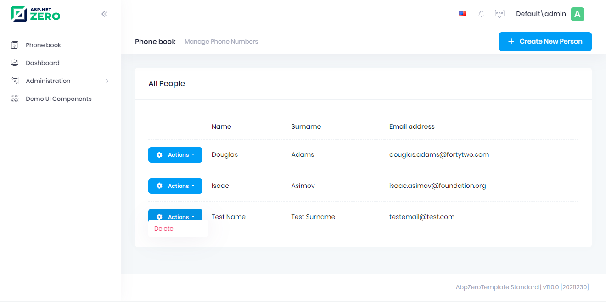
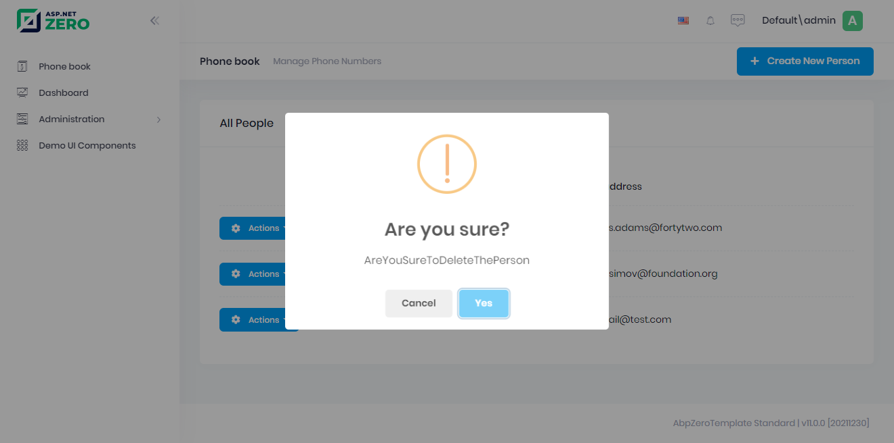

## Deleting a Person

Let's add a delete button in people list as shown below:



We're starting from UI in this case.

### View

We're changing **index.cshtml** view to add a button (related part is
shown here):

```html
<table class="table align-middle table-row-dashed fs-6 gy-5 dataTable no-footer" id="AllPeopleList">
    <thead>
    <tr>
        <th></th>
        <th>@L("Actions")</th><!--Add actions here-->
        <th>@L("Name")</th>
        <th>@L("Surname")</th>
        <th>@L("EmailAddress")</th>
    </tr>
    </thead>   
</table>
```

Surely, we defined 'delete person' permission as like before.

### Javascript

Now, adding code to delete person (to Index.js):

```javascript
//add permission check
var _permissions = {
    delete: abp.auth.hasPermission('Pages.Tenant.PhoneBook.DeletePerson')
};
//update datatable to add action buttons

var dataTable = _$phonebookTable.DataTable({   
    listAction: {
    ajaxFunction: _personService.getPeople,
    },
    columnDefs: [
        {//to make your view responsive
            className: 'control responsive',
            orderable: false,
            render: function () {
            return '';
            },
            targets: 0,
        },
        {//add  buttons to first coloumn
            targets: 1,
            data: null,
            orderable: false,
            autoWidth: false,
            defaultContent: '',
            rowAction: {
                text:
                '<i class="fa fa-cog"></i> <span class="d-none d-md-inline-block d-lg-inline-block d-xl-inline-block">' +
                app.localize('Actions') +
                '</span> <span class="caret"></span>',
                items: [//buttons to add in action dropdown
                    {
                        text: app.localize('Edit'),
                        visible: function () {
                            return true;
                        },
                        action: function (data) {
                            //will be filled
                        },
                    },
                    {
                        text: app.localize('Delete'),
                        visible: function (data) {//will be visible only if user has required permission
                            return _permissions.delete;
                        },
                        action: function (data) {//on button click
                            deletePerson(data.record.id);
                        },
                    }
                ],
            }
        },    
        {
            targets: 2,
            data: 'name',
        },
        {
            targets: 3,
            data: 'surname',
        },
        {
            targets: 4,
            data: 'emailAddress',
        },
    ],
});

function deletePerson(personId) {
    abp.message.confirm(
        app.localize('AreYouSureToDeleteThePerson'),
        app.localize('AreYouSure'),
        function (isConfirmed) {
            if (isConfirmed) {
                _personService.deletePerson({
                    id: personId
                }).done(function () {
                    abp.notify.info(app.localize('SuccessfullyDeleted'));
                    getPeople();
                });
            }
        }
    );
}
```

It first shows a confirmation message when we click the delete button:



If we click Yes, it simply calls **deletePerson** method of
**PersonAppService** and shows a
**[notification](https://aspnetboilerplate.com/Pages/Documents/Javascript-API/Notification)**
if operation succeed. Also, removes the person from the page using
jQuery's **remove** function.

### Application Service

First, adding a new method definition to **IPersonAppService** interface
as always:

```csharp
Task DeletePerson(EntityDto input);
```

**EntityDto** is a shortcut of ABP if we only get an id value.
Implementation (in **PersonAppService**) is very simple:

```csharp
[AbpAuthorize(AppPermissions.Pages_Tenant_PhoneBook_DeletePerson)]
public async Task DeletePerson(EntityDto input)
{
    await _personRepository.DeleteAsync(input.Id);
}
```

We also **authorized** deleting a person as did before for creating a
person.

We also need to define **Pages\_Tenant\_PhoneBook\_DeletePerson**
constant in AppPermissions and define related permission in
**AppAuthorizationProvider**.

## Next

- [Filtering People](Developing-Step-By-Step-Core-Filtering-People.md)

  