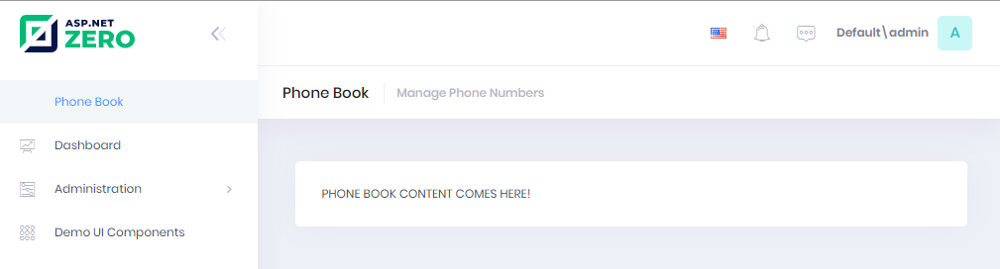

# Creating the Page

After creating the menu item, we can create an empty page.

## Controller

Creating the **PhoneBookController** under **Areas/App/Controllers**
folder in the Web project:

```csharp
[Area("App")]
public class PhoneBookController : PhoneBookDemoControllerBase
{
    public ActionResult Index()
    {
        return View();
    }
}
```

We inherited from **PhoneBookDemoControllerBase** (will be
*YourProjectName*ControllerBase for your projects) instead of MVC's
standard Controller class. While it will work if we derive from the
standard Controller, PhoneBookDemoControllerBase provides very useful
base properties and methods. So, always inherit from this class unless
it has a disadvantage for your case.

## View

Creating an empty view, **Index.cshtml** under
**Areas/App/Views/PhoneBook** folder:

```html
@using Acme.PhoneBookDemo.Web.Areas.App.Startup
@{
    ViewBag.CurrentPageName = AppPageNames.Tenant.PhoneBook;
}

<div class="content d-flex flex-column flex-column-fluid">
    <abp-page-subheader title="@L("PhoneBook")" description="@L("PhoneBookInfo")"></abp-page-subheader>
    
    <div class="@(await GetContainerClass()">          
        <div class="col-12">
            <div class="card card-custom gutter-b">
                <div class="card-body">
                    <p>PHONE BOOK CONTENT COMES HERE!</p>
                </div>
            </div>
        </div>          
    </div>
</div>
```

We set ViewBag.CurrentPageName to the current page's name to
automatically highlight the related menu item when this page is active.
Now, it's time to run application and see the new phone book page:



Menu item display name and page title are localized. Try to change UI
language to see difference.

## Next

- [Creating Person Entity](Developing-Step-By-Step-Core-DevExtreme-Creating-Person-Entity.md)
