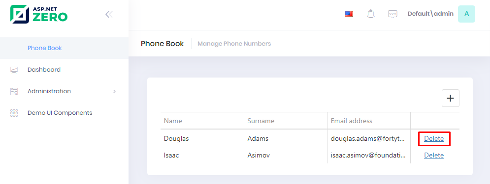

## Deleting a Person

### Application Service

First, adding a new method definition to **IPersonAppService** interface
as always:

```csharp
Task DeletePerson(EntityDto input);
```

**EntityDto** is a shortcut of ABP if we only get an id value.
Implementation (in **PersonAppService**) is very simple:

```csharp
[AbpAuthorize(AppPermissions.Pages_Tenant_PhoneBook_DeletePerson)]
public async Task DeletePerson(EntityDto input)
{
    await _personRepository.DeleteAsync(input.Id);
}
```

We also **authorized** deleting a person as did before for creating a person.

We also need to define **Pages\_Tenant\_PhoneBook\_DeletePerson** constant in AppPermissions and define related permission in **AppAuthorizationProvider**.

### Controller

```csharp
[Area("App")]
public class PhoneBookController : PhoneBookDemoControllerBase
{
    private readonly IPersonAppService _personAppService;

    public PhoneBookController(IPersonAppService personAppService)
    {
        _personAppService = personAppService;
    }
    
    //...
    [HttpDelete]
    public async Task DeletePerson(int key)
    {
        await _personAppService.DeletePerson(new EntityDto(key));
    }
}
```

### View

We're changing **index.cshtml** view to add a button;

```html
@using Acme.PhoneBookDemo.Web.Areas.App.Startup
@using DevExtreme.AspNet.Mvc
@{
    ViewBag.CurrentPageName = AppPageNames.Tenant.PhoneBook;
}
<div class="content d-flex flex-column flex-column-fluid" id="kt_content">
    <abp-page-subheader title="@L("PhoneBook")" description="@L("PhoneBookInfo")"></abp-page-subheader>

    <div class="@(await GetContainerClass())">
        <div class="col-12">
            <div class="card card-custom gutter-b">
                <div class="card-body">
                    @(Html.DevExtreme()
                        .DataGrid()              
                        .Editing(editing => {
                            editing.Mode(GridEditMode.Row);
                            editing.AllowAdding(true);
                    		editing.AllowDeleting(true);
                        })
                        .DataSource(d => d.Mvc()
                            .Controller("PhoneBook")
                            .LoadAction("LoadPeople")
                            .InsertAction("CreatePerson")
                    		.DeleteAction("DeletePerson")
                            .Key("id")
                        )
                        .Columns(columns =>
                        {
                            columns.Add()
                                .DataField("name")
                                .Caption(L("Name"));
                            
                            columns.Add()
                                .DataField("surname")
                                .Caption(L("Surname"));
                            
                            columns.Add()
                                .DataField("emailAddress")
                                .Caption(L("EmailAddress"));                       
                        })
                    )
                </div>
            </div>
        </div>
    </div>
</div>
```

It first shows a confirmation message when we click the delete button:




If we click Yes, it simply calls **DeletePerson** method of **PhoneBookController**.

## Next

- [Editing a Person](Developing-Step-By-Step-Core-DevExtreme-Editing-Person.md)