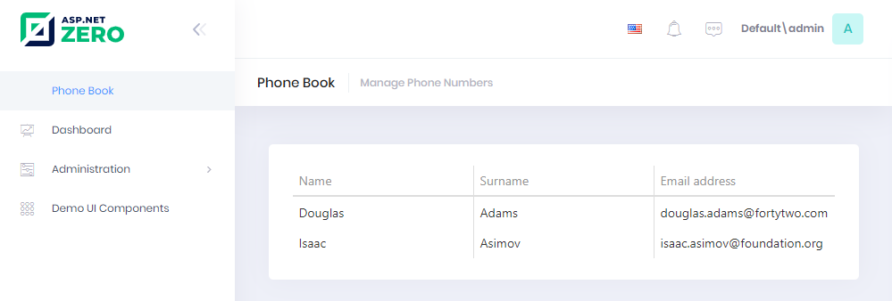

# Using GetPeople Method From MVC Controller

It's time to open **PhoneBookController** and get people to show on the
view:

```csharp
using Abp.Web.Models;
using DevExtreme.AspNet.Data;
using DevExtreme.AspNet.Mvc;

[Area("App")]
public class PhoneBookController : PhoneBookDemoControllerBase
{
    private readonly IPersonAppService _personAppService;

    public PhoneBookController(IPersonAppService personAppService)
    {
        _personAppService = personAppService;
    }

    public ActionResult Index()
    {    
        return View();
    }
    
    [WrapResult(false,false)]
    public object LoadPeople(GetPeopleInput input, DataSourceLoadOptions loadOptions)
    {            
        var output = _personAppService.GetPeople(input);
        return DataSourceLoader.Load(output.Items, loadOptions);
    }
}
```

We inject **IPersonAppService** and call its **GetPeople** method
(which is created and tested before) to get list of people. Then we
used DataSourceLoader Load to return data that DevExtreme's DataGrid wants.


## Application Services and ViewModels

We created an **Application Service** (PersonAppService) and used it
from the **Controller**. Instead, we could access **Repository**
directly from Controller and completely discard the application service.
ASP.NET Zero does not enforce any architecture here. In ASP.NET Zero, we
use the application layer (application services and DTOs). Therefore, we
implemented it **independent** from ASP.NET MVC. This makes application
layer re-usable from different presentation layers. But if you will only
develop ASP.NET MVC, you can implement application logic inside
controllers and access to the repositories from controllers. This may
simplify your architecture and development model.

If you decide to develop application services and use them in
controllers then you can use application service's **output** as your
view model. We did not prefer it and wrapped output by a dedicated
**ViewModel** (IndexViewModel here) since we think that we may add some
**additional properties/methods** for our view model. Again, it's your
choice of implementation.

# Rendering People In MVC View

We show people on the page is most basic form. See the changed view
below:

```html
@using Acme.PhoneBookDemo.Web.Areas.App.Startup
@using DevExtreme.AspNet.Mvc
@{
    ViewBag.CurrentPageName = AppPageNames.Tenant.PhoneBook;
}
<div class="content d-flex flex-column flex-column-fluid" id="kt_content">
    <abp-page-subheader title="@L("PhoneBook")" description="@L("PhoneBookInfo")"></abp-page-subheader>

    <div class="@(await GetContainerClass())">
        <div class="col-12">
            <div class="card card-custom gutter-b">
                <div class="card-body">
                    @(Html.DevExtreme()
                        .DataGrid()              
                        .DataSource(d => d.Mvc()
                            .Controller("PhoneBook")
                            .LoadAction("LoadPeople")
                            .Key("id")
                        )
                        .Columns(columns =>
                        {
                            columns.Add()
                                .DataField("name")
                                .Caption(L("Name"));
                            
                            columns.Add()
                                .DataField("surname")
                                .Caption(L("Surname"));
                            
                            columns.Add()
                                .DataField("emailAddress")
                                .Caption(L("EmailAddress"));                       
                        })
                    )
                </div>
            </div>
        </div>
    </div>
</div>
```

See the result:



We successfully retrieved list of people from database to the page.

## Next

- [Creating a New Person](Developing-Step-By-Step-Core-DevExtreme-Creating-New-Person.md)
