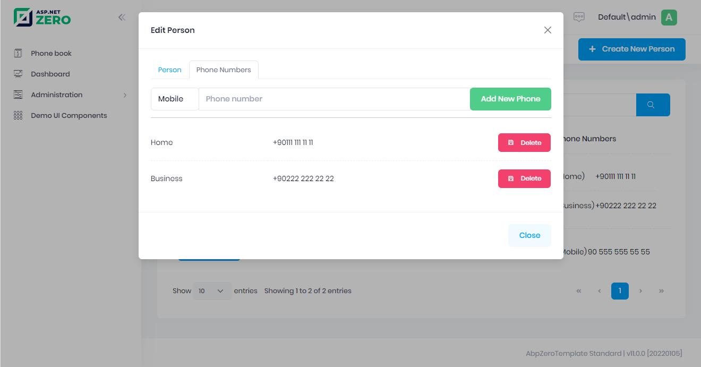

# Edit Mode For Phone Numbers

Up to here , final UI is shown below:



We will create modal that has two tabs. First for editing person, second editing phones of person.

## Controller

Go to `PhonebookController` and `EditPersonModal` `PartialViewResult`.

```csharp
[Area("App")]
public class PhoneBookController : AbpZeroTemplateControllerBase
{
    private readonly IPersonAppService _personAppService;

    public PhoneBookController(IPersonAppService personAppService)
    {
        _personAppService = personAppService;
    }
    //...
    public async Task<PartialViewResult> EditPersonModal(EntityDto input)
    {
        var model = await _personAppService.GetPerson(input);
        return PartialView("_EditPersonModal", model);
    }
}
```

## Dto

Go to `PhoneInPersonListDto` and add `GetPhoneTypeAsString`.

```csharp
public class PhoneInPersonListDto : CreationAuditedEntityDto<long>
{
    public PhoneType Type { get; set; }

    public string Number { get; set; }
    
    public string GetPhoneTypeAsString()
    {
        return LocalizationHelper.GetString(PhoneBookDemoConsts.LocalizationSourceName, "PhoneType_" + Type);
    }
}
```

## View

Create new view named **_EditPersonModal.cshtml** and fill edit phones tab.

`_EditPersonModal.cshtml`
```html
@using Acme.PhoneBookDemo.Web.Areas.App.Models.Common.Modals
@using Microsoft.AspNetCore.Mvc.TagHelpers
@model PersonListDto
@await Html.PartialAsync("~/Areas/App/Views/Common/Modals/_ModalHeader.cshtml", new ModalHeaderViewModel(L("EditPerson")))

<div class="modal-body">
    <ul class="nav nav-tabs" role="tablist">
        <li class="nav-item">
            <a href="#Person" class="nav-link active" data-bs-toggle="tab" role="tab">
                @L("Person")
            </a>
        </li>
        <li class="nav-item">
            <a href="#PhoneNumbers" data-bs-toggle="tab" role="tab" class="nav-link">
                @L("PhoneNumbers")
            </a>
        </li>
    </ul>
    <div class="tab-content">
        <div class="tab-pane pt-5 active" id="Person" role="tabpanel">
            <!--We will add person edit here-->
        </div>
        <div class="tab-pane pt-5" id="PhoneNumbers" role="tabpanel">
            <form id="addPhoneForm">
                <input type="hidden" name="PersonId" value="@Model.Id">
                <div class="input-group mb-3">
                    <div class="input-group-prepend">
                        <select name="Type" class="form-control">
                            <option value="1">@L("PhoneType_Mobile")</option>
                            <option value="2">@L("PhoneType_Home")</option>
                            <option value="3">@L("PhoneType_Business")</option>
                        </select>
                    </div>
                    <input class="form-control" type="text" name="Number" placeholder="@L("PhoneNumber")" required>
                    <div class="input-group-append">
                        <button class="btn btn-success" id="BtnAddPhone" type="button">@L("AddPhone")</button>
                    </div>
                </div>
            </form>
            <hr/>
            <table class="table align-middle table-row-dashed fs-6 gy-5 dataTable no-footer" id="tablePhoneNumbers">
                <tbody>
                @foreach (var phone in Model.Phones)
                {
                    <tr id="phoneNumberRow-@phone.Id">
                        <td>@phone.GetPhoneTypeAsString()</td>
                        <td>@phone.Number</td>
                         <td style="width:100px;">
                            <button class="btn btn-danger btn-delete-phone btn-sm" data-phone-id="@phone.Id">
                                <i class="la la-floppy-o"></i>
                                @L("Delete")
                            </button>
                        </td>
                    </tr>
                }
                </tbody>
            </table>
        </div>
    </div>

</div>

@await Html.PartialAsync("~/Areas/App/Views/Common/Modals/_ModalFooterWithClose.cshtml")
```

Then, create **_EditPersonModal.js**.

```javascript
(function ($) {
    app.modals.EditPersonModal = function () {
        var _modalManager;
        var _personService = abp.services.app.person;
        var _$addPhoneForm = null;
        var _$phoneNumbersTable = null;

        var hasChanges = false;

        function getPhoneTypeString(phoneType) {
            switch (phoneType) {
                case "1":
                    return app.localize('Mobile');
                case "2":
                    return app.localize('Home');
                default:
                    return app.localize('Business');
            }
        }

        function addPhoneToPhoneNumbersTable(phone) {
            var row = `<tr id="phoneNumberRow-${phone.PersonId}">
                        <td>${getPhoneTypeString(phone.Type)}</td>
                        <td>${phone.Number}</td>
                         <td style="width:100px;">
                            <button class="btn btn-danger btn-delete-phone btn-sm" data-phone-id="${phone.id}">
                                <i class="la la-floppy-o"></i>
                                ${app.localize('Delete')}
                            </button>
                        </td>
                    </tr>`;
            _$phoneNumbersTable.find('tbody').append(row);
        }

        function addPhone() {
            if (!_$addPhoneForm.valid()) {
                return;
            }

            var phone = _$addPhoneForm.serializeFormToObject();


            _modalManager.setBusy(true);
            _personService.addPhone(phone).done(function () {
                addPhoneToPhoneNumbersTable(phone);
                abp.notify.info(app.localize('SavedSuccessfully'));
                hasChanges = true;
            }).always(function () {
                _modalManager.setBusy(false);
            });
        }

        function deletePhone(phoneId) {
            if (!phoneId) {
                return;
            }
            
            abp.message.confirm(
                app.localize('DeletePhoneWarningMessage'),
                app.localize('AreYouSure'),
                function (isConfirmed) {
                    if (isConfirmed) {
                        _modalManager.setBusy(true);
                        _personService.deletePhone({id: phoneId}).done(function () {
                            $('#phoneNumberRow-' + phoneId).remove();
                            abp.notify.info(app.localize('SavedSuccessfully'));
                            hasChanges = true;
                        }).always(function () {
                            _modalManager.setBusy(false);
                        });
                    }
                }
            );            
        }

        this.init = function (modalManager) {
            _modalManager = modalManager;

            _$addPhoneForm = _modalManager.getModal().find('#addPhoneForm');
            _$addPhoneForm.validate();

            _$phoneNumbersTable = _modalManager.getModal().find('#tablePhoneNumbers');

            _$addPhoneForm.find('#BtnAddPhone').click(function (e) {
                addPhone();
            });

            _modalManager.getModal().find('.btn-delete-phone').click(function (e) {
                deletePhone($(this).data('phone-id'));
            });

            _modalManager.getModal().find('.close-button').click(function () {
                if (hasChanges) {
                    abp.event.trigger('app.personEditClosed');
                }
            })
        };

        this.save = function () {

        };
    };
})(jQuery);
```

## Scripts

The final of the **Index.js** is:

```javascript
(function () {
    $(function () {
        var _permissions = {
            delete: abp.auth.hasPermission('Pages.Tenant.PhoneBook.DeletePerson'),
            edit: abp.auth.hasPermission('Pages.Tenant.PhoneBook.EditPerson')
        };

        var _$phonebookTable = $('#AllPeopleList');
        var _personService = abp.services.app.person;

        var _editPersonModal = new app.ModalManager({
            viewUrl: abp.appPath + 'App/PhoneBook/EditPersonModal',
            scriptUrl: abp.appPath + 'view-resources/Areas/App/Views/PhoneBook/_EditPersonModal.js',
            modalClass: 'EditPersonModal'
        });
        
        var dataTable = _$phonebookTable.DataTable({
            listAction: {
                ajaxFunction: _personService.getPeople,
                inputFilter: function () {
                    return {
                        filter: $("#UsersTableFilter").val(),
                    };
                },
            },
            columnDefs: [
                {//to make your view responsive
                    className: 'control responsive',
                    orderable: false,
                    render: function () {
                        return '';
                    },
                    targets: 0,
                },
                {
                    targets: 1,
                    data: null,
                    orderable: false,
                    autoWidth: false,
                    defaultContent: '',
                    rowAction: {
                        text:
                            '<i class="fa fa-cog"></i> <span class="d-none d-md-inline-block d-lg-inline-block d-xl-inline-block">' +
                            app.localize('Actions') +
                            '</span> <span class="caret"></span>',
                        items: [
                            {
                                text: app.localize('Edit'),
                                visible: function () {
                                    return _permissions.edit;
                                },
                                action: function (data) {
                                    _editPersonModal.open({id:data.record.id});
                                },
                            },
                            {
                                text: app.localize('Delete'),
                                visible: function (data) {
                                    return _permissions.delete;
                                },
                                action: function (data) {
                                    deletePerson(data.record.id);
                                },
                            }
                        ],
                    },
                },
                {
                    targets: 2,
                    data: 'name',
                },
                {
                    targets: 3,
                    data: 'surname',
                },
                {
                    targets: 4,
                    data: 'emailAddress',
                },
                {
                    targets: 5,
                    data: 'phones',
                    render: function (phones, type, row, meta) {
                        var $table = $('<table/>');
                        var $body = $('<tbody/>');

                        for (var i = 0; i < phones.length; i++) {
                            var $row = $('<tr/>');
                            $row.append('<td>(' + getPhoneTypeString(phones[i].type) + ')</td>');
                            $row.append('<td>' + phones[i].number + '</td>');
                            $body.append($row);
                        }
                        $table.append($body);
                        return $table[0].outerHTML;
                    },
                },
            ],
        });

        var _createPersonModal = new app.ModalManager({
            viewUrl: abp.appPath + 'App/PhoneBook/CreatePersonModal',
            scriptUrl: abp.appPath + 'view-resources/Areas/App/Views/PhoneBook/_CreatePersonModal.js',
            modalClass: 'CreatePersonModal'
        });

        $('#CreateNewPersonButton').click(function (e) {
            e.preventDefault();
            _createPersonModal.open();
        });

        function getPeople() {
            dataTable.ajax.reload();
        }

        abp.event.on('app.createPersonModalSaved', getPeople);
        abp.event.on('app.personEditClosed', getPeople);

        function deletePerson(personId) {
            abp.message.confirm(
                app.localize('AreYouSureToDeleteThePerson'),
                app.localize('AreYouSure'),
                function (isConfirmed) {
                    if (isConfirmed) {
                        _personService.deletePerson({
                            id: personId
                        }).done(function () {
                            abp.notify.info(app.localize('SuccessfullyDeleted'));
                            getPeople();
                        });
                    }
                }
            );
        }

        $('#FilterUsersButton').click(function (e) {
            getPeople();
        });

        $('#UsersTableFilter').keypress(function (e) {
            if (e.which == 13) {
                getPeople();
                return false;
            }
        });

        function getPhoneTypeString(phoneType) {
            switch (phoneType) {
                case 1:
                    return app.localize('Home');
                case 2:
                    return app.localize('Business');
                default:
                    return app.localize('Mobile');
            }
        }
    });
})();

```

When click to '**edit person**' button, we simplely open person edit modal. Then click to the phones tabs. 

In the **Add New Phone** button's click, we make an **AJAX** request to the PersonAppService's **AddPhone** action and add the related phone row (tr) to DOM.

Lastly, we deleting the phone when clicking to the '**Delete**'
button and remove the related phone row (tr) from DOM. 

## Next

- [Edit Mode For People](Developing-Step-By-Step-Core-Edit-Mode-For-People.md)