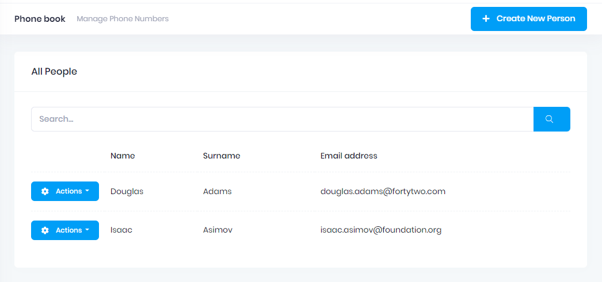

# Filtering People

Now, we will implement **search** functionality of **GetPeople** method. UI is shown below:



We added a search input to filter people (showing the related part of
the code. Insert code to inner **.card-body**):

```html
<div class="col-xl-12">
	<div class="mb-5 align-items-center">			
		<div class="input-group">
			<input type="text" id="UsersTableFilter" name="Filter" class="form-control" placeholder="@L("SearchWithThreeDot")">
			<button id="FilterUsersButton" class="btn btn-primary" type="submit">
				<i class="flaticon-search-1" aria-label="Search"></i>
			</button>
		</div>
	</div>
</div>
<!-- people table starts --->
```
Then go to the **Index.js** and add following code part.
```javascript
//...
//update datatable definition
var dataTable = _$phonebookTable.DataTable({   
	listAction: {
		ajaxFunction: _personService.getPeople,
		inputFilter: function () {//use filtered data in ajax request 
			return {//data will be added to ajax request
			filter: $("#UsersTableFilter").val(),
			};
		},
	},
//...

//reload data
$('#FilterUsersButton').click(function (e) {    
	getPeople();
});

$('#UsersTableFilter').keypress(function (e) {
	if (e.which == 13) {
		getPeople();
		return false;
	}
});
		
```

That's all, It works! (Notice that; PersonAppService.GetPeople method
was already using the input.Filter as we implemented it before).

## Next

- [Adding Phone Numbers](Developing-Step-By-Step-Core-Adding-Phone-Numbers.md)