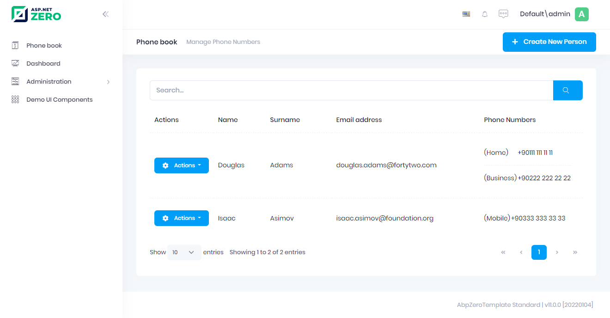

# Showing Phone Numbers In View

Go to **Index.cshtml** and add new column.

```html
<table class="table align-middle table-row-dashed fs-6 gy-5 dataTable no-footer" id="PhoneBookTable">
    <thead>
        <tr>
            <th></th>
            <th style="width:50px">@L("Actions")</th>
            <th>@L("Name")</th>
            <th>@L("Surname")</th>
            <th>@L("EmailAddress")</th>
            <th>@L("PhoneNumbers")</th><!--Add new column-->
        </tr>
    </thead>
</table>
```

Then update **Index.js**

```javascript
var dataTable = _$phonebookTable.DataTable({
    //...
    columnDefs: [//...
        {
            targets: 5,
            data: 'phones',
            render: function (phones, type, row, meta) {
                var $table = $('<table/>');
                var $body = $('<tbody/>');

                for (var i = 0; i < phones.length; i++) {
                    var $row = $('<tr/>');
                    $row.append('<td>(' + getPhoneTypeString(phones[i].type) + ')</td>');
                    $row.append('<td>' + phones[i].number + '</td>');
                    $body.append($row);
                }

                $table.append($body);
                return $table[0].outerHTML;
            },
        },
    ],
});

function getPhoneTypeString(phoneType) {
    switch (phoneType) {
        case 1:
            return app.localize('Home');
        case 2:
            return app.localize('Business');
        default:
            return app.localize('Mobile');
    }
}
```

When you add the sample data from the database, the view will be as follows.




## Next

* [Edit Mode For Phone Numbers](Developing-Step-By-Step-Core-Edit-Mode-For-Phone-Numbers)
