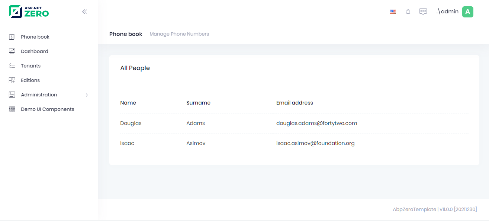

# Using GetPeople Method From MVC Controller

It's time to open **PhoneBookController** and get people to show on the
view:

```csharp
[Area("App")]
public class PhoneBookController : PhoneBookDemoControllerBase
{
    private readonly IPersonAppService _personAppService;

    public PhoneBookController(IPersonAppService personAppService)
    {
        _personAppService = personAppService;
    }

    public ActionResult Index()
    {       
        return View();
    }
}
```


Here, we're extending the output of the PersonAppService.**GetPeople** method.
We get the output from the constructor and map it to this object.

## Application Services and ViewModels

We created an **Application Service** (PersonAppService) and used it. Instead, we could access **Repository**
directly from Controller and completely discard the application service.
ASP.NET Zero does not enforce any architecture here. In ASP.NET Zero, we
use the application layer (application services and DTOs). Therefore, we
implemented it **independent** from ASP.NET MVC. This makes application
layer re-usable from different presentation layers. But if you will only
develop ASP.NET MVC, you can implement application logic inside
controllers and access to the repositories from controllers. This may
simplify your architecture and development model.

If you decide to develop application services and use them in
controllers then you can use application service's **output** as your
view model. We did not prefer it and wrapped output by a dedicated
**ViewModel** (IndexViewModel here) since we think that we may add some
**additional properties/methods** for our view model. Again, it's your
choice of implementation.

# Rendering People In MVC View

We show people on the page is most basic form. See the changed view
below:

```html
@{
    ViewBag.CurrentPageName = "Phonebook";
}

@section Scripts
{
    <script src="~/view-resources/Areas/App/Views/PhoneBook/Index.js" asp-append-version="true"></script>
}

<div class="content d-flex flex-column flex-column-fluid" id="kt_content">
    <abp-page-subheader title="@L("PhoneBook")" description="@L("PhoneBookInfo")">
    </abp-page-subheader>
    <div class="@(await GetContainerClass())">
        <div class="card">
            <div class="card-body">
                <table class="table align-middle table-row-dashed fs-6 gy-5 dataTable no-footer" id="AllPeopleList">
                    <thead>
                    <tr>
                        <th></th>
                        <th>@L("Name")</th>
                        <th>@L("Surname")</th>
                        <th>@L("EmailAddress")</th>
                    </tr>
                    </thead>
                </table>
            </div>
        </div>
    </div>
</div>
```

We declared the table, now we can load data using javascript.

Create **Index.js** file in **view-resources/Areas/App/Views/PhoneBook** as seen below.

```javascript
(function () {
    $(function () {
        var _$phonebookTable = $('#AllPeopleList');
        var _personService = abp.services.app.person;//Aspnet zero generates client side of your app service
        
        var dataTable = _$phonebookTable.DataTable({   
          listAction: {
            ajaxFunction: _personService.getPeople,
          },
          columnDefs: [
            {//to make your view responsive
              className: 'control responsive',
              orderable: false,
              render: function () {
                return '';
              },
              targets: 0,
            },     
            {
              targets: 1,
              data: 'name',
            },
            {
              targets: 2,
              data: 'surname',
            },
            {
              targets: 3,
              data: 'emailAddress',
            },
          ],
        });
    });
})();

```

See the result:



We successfully retrieved list of people from database to the page.

Pages of ASP.NET Zero. Always use such components since they make
things much more easier and provides a much better user experience.

## Next

- [Creating a New Person](Developing-Step-By-Step-Core-Creating-New-Person.md)
